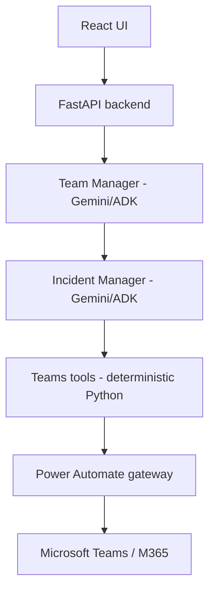
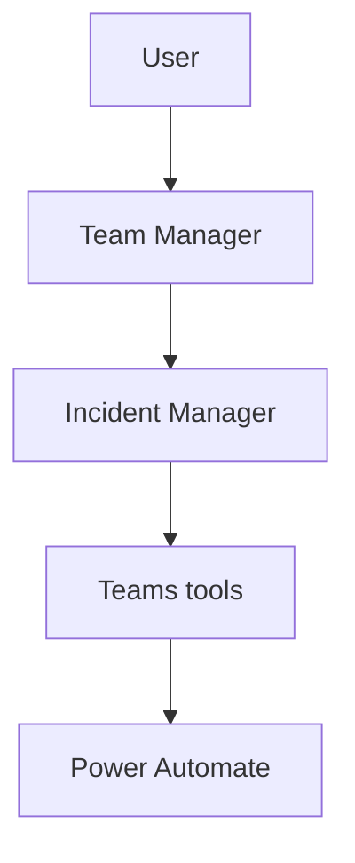
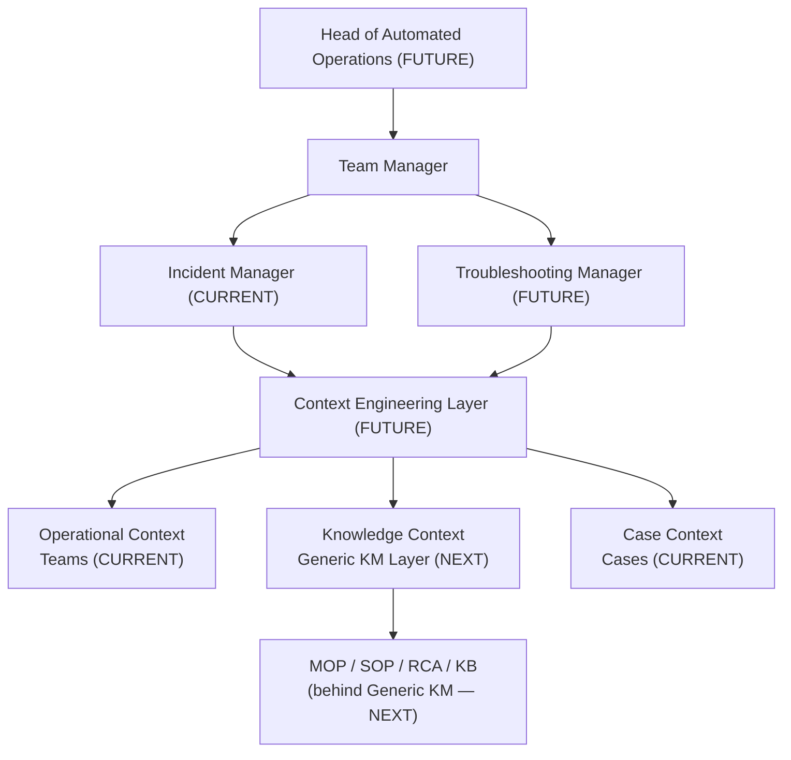
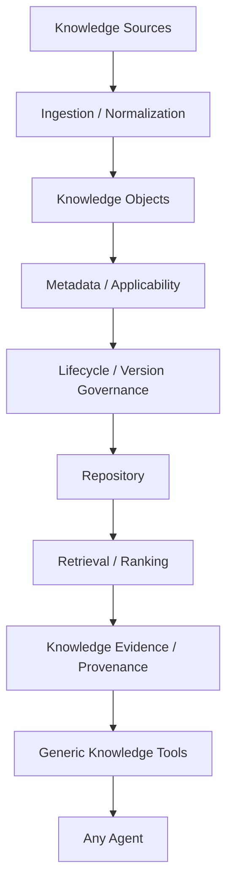

# SLOPANOC

SLOPANOC is an enterprise AI assistant for Microsoft Teams-based incident and
operational collaboration. A React chat UI talks to a FastAPI backend that
orchestrates Gemini (via Google ADK) to discover, read, and summarize Teams
conversations, and to propose — never silently execute — Teams write actions
such as creating a chat or sending a message.

This repository contains a working backend and frontend, not a UI-only
mockup. See [Current limitations / production readiness](#current-limitations--production-readiness)
for what is intentionally not yet built.

## What SLOPANOC is

- A conversational assistant that reads and summarizes Microsoft Teams chats
  on request, grounded strictly in messages it actually retrieved.
- An assistant that can propose creating a Teams chat or sending a Teams
  message, but can never cause either to happen without an explicit,
  separately-recorded approval step.
- A single-orchestrator, specialist-agent architecture (Team Manager +
  Incident Manager) built on Google ADK, with deterministic Python code — not
  model reasoning — enforcing every security- and provenance-sensitive
  decision.
- Currently a Teams-only assistant. Generic knowledge management, ITSM,
  alarm/fault, topology, and other integrations are roadmap items (see
  [Roadmap](#roadmap)), not present today.

## Current capabilities

**Core runtime**
- FastAPI backend, React + TypeScript frontend (Vite, Tailwind).
- Gemini via Google ADK 1.33.0, using Vertex AI-style configuration
  (`gemini-2.5-flash` by default, overridable — see [Configuration](#configuration)).
- A process-lifetime-shared model client per configured model name, and an
  optional startup model warm-up.
- Persistent chat sessions (ADK `DatabaseSessionService`, SQLite by default
  locally) — conversations survive a backend restart.
- Streaming responses over Server-Sent Events, with real mid-run
  cancellation.
- Editing an earlier message rewinds the session so later, now-stale turns
  are excluded from model context going forward.
- Per-model-call performance/timing instrumentation for diagnosing latency.

**Agent architecture**
- Team Manager: the only agent that ever produces user-facing text.
- Incident Manager: the Teams specialist, invoked by Team Manager through an
  ADK `AgentTool` call (an in-process call/return, not a hand-off).
- Deterministic resolution of what "this chat" refers to — the current
  SLOPANOC conversation, a previously-selected Teams chat, or a Teams chat
  named explicitly in the current message.

**Microsoft Teams — read**
- List/discover chats, deterministic name resolution, ambiguity handling via
  an interactive SelectionCard, and continuation of the original request once
  a chat is picked.
- Message retrieval with backend-driven pagination, time-range scoping, and
  system-event filtering; Teams' HTML message content is normalized to plain
  text without discarding the original.
- Semantic extraction of decisions, actions, proposals, open questions, and
  risks from retrieved messages.
- An optimized "direct unique match" path: when a request names a chat that
  resolves to exactly one chat on the first try, the read still converges
  through the same trusted-result/presentation pipeline as a post-selection
  continuation, in the same turn.

**Microsoft Teams — write**
- Proposing a new chat or a message as an `ActionProposal`, presented via an
  ApprovalCard.
- Approve/reject handled by a trusted API endpoint — never by the model.
- Execution is gated by deterministic backend policy code that re-validates
  the approval and the exact payload before any Power Automate call is made.

**Provenance**
- Every piece of evidence the model cites is validated against the message
  IDs actually retrieved for that turn; anything else is stripped.
- A structured, backend-built `SourceReference` (contributors, message
  count, reviewed period, a small evidence sample) is attached to the
  response as its own UI element, not as prose in the model's answer.
- Source is owned by the message it belongs to and disappears correctly if
  that branch of the conversation is discarded (edit/rewind).

**Persistence / case context**
- Local development persistence uses SQLite through ADK's
  `DatabaseSessionService`.
- A separate, optional Case/fault context store (`backend/cases/`) can be
  linked to a session to give the assistant durable, cross-session context —
  distinct from ordinary chat/session state.

**Trusted specialist result**
- A same-run, backend-constructed "trusted result" envelope carries a
  validated Incident Manager result to a presentation-only Team Manager
  variant (`tools=[]`, structurally unable to delegate further).
- If trust validation fails, the turn fails closed with a safe, generic
  message — it never silently falls back to a normal, tool-enabled Team
  Manager turn.

**UI**
- Markdown rendering for assistant responses (`react-markdown` +
  `remark-gfm`), with lightweight, restrained typography — not a
  documentation-style theme.
- SelectionCard (ambiguous chat choice) and ApprovalCard (write-action
  approval) as first-class conversation elements.
- A Source chip/drawer showing what a grounded answer was based on.
- A run-trace / "current activity" indicator while a turn is in progress.

The application shell, sidebar, Projects, Settings (Usage/Connectors/Skills),
and other areas inherited from the original UI/UX prototype phase still run
on local, mock state — they are not yet wired to the backend. The real,
backend-driven experience today is the chat conversation itself.

## Architecture



Principles that hold throughout the backend:

- Team Manager is the only user-facing agent; Incident Manager never
  produces text the user sees directly.
- Team Manager invokes Incident Manager through an ADK `AgentTool`, not
  native agent-to-agent transfer — this keeps Team Manager structurally in
  control of the turn.
- Power Automate remains the sole Microsoft 365 execution gateway. There is
  no direct Microsoft Graph integration anywhere in this stack.
- Gemini/ADK performs reasoning and orchestration only. Deterministic Python
  enforces every sensitive boundary — destination binding, evidence
  provenance, and write approval are never left to model reasoning alone.

## Agent topology



This is the current topology. No other agent exists today. A future
specialist (e.g. a Knowledge agent, see [Roadmap](#roadmap)) would attach to
Team Manager the same way Incident Manager does.

## Architecture Evolution

The sections above describe what is implemented today. This section shows
where the architecture is headed, so Phase 5.1A and later phases are built
toward a consistent target — none of the FUTURE/NEXT items below exist in
the codebase yet.

- **CURRENT (implemented):** Team Manager, Incident Manager, Teams
  integration, Case context.
- **NEXT (Phase 5.1, planned):** a Generic Knowledge Management Layer,
  providing *Knowledge Context* — MOPs/SOPs/RCAs/KB articles live behind
  this layer, never as raw sources a specialist reads directly.
- **FUTURE (target architecture, not yet designed in detail):** a Context
  Engineering Layer that assembles bounded context from Operational,
  Knowledge, and Case context for a specialist; a second specialist
  (Troubleshooting Manager); a supervisory Head of Automated Operations
  agent; and expanded Operational Context sources (ITSM, alarms, topology,
  KPIs, change, handover — see [Roadmap](#roadmap)).



Read this diagram as target architecture, not as a running system. The
current, actually-running path remains exactly the [Architecture](#architecture)
and [Agent topology](#agent-topology) sections above: the user talks to
Team Manager, which delegates to Incident Manager, which uses Teams tools
through Power Automate. Nothing about today's runtime changes until each
labeled phase is actually built.

## Troubleshooting Product Strategy

SLOPANOC's long-term core troubleshooting experience is a non-negotiable
product principle, defined in full in
[`docs/TROUBLESHOOTING_STRATEGY.md`](docs/TROUBLESHOOTING_STRATEGY.md): an
iterative, evidence-driven, conversational diagnostic loop — one useful
step at a time — rather than a chatbot that answers an operational problem
with a long, generic checklist. The central question the assistant is
working toward is:

> **What should I check next, and why?**

Conceptually: the user identifies the bridge/incident → SLOPANOC retrieves
current context → the user describes the problem → SLOPANOC determines the
next-best diagnostic check → the user provides the resulting
command/output/evidence → SLOPANOC interprets it, updates its hypotheses,
and retrieves additional context if needed → the next check is selected →
the loop repeats until the fault is resolved, sufficiently narrowed, or
clearly escalated.

- **CURRENT:** Team Manager, Incident Manager, Teams integration, Case
  context.
- **NEXT (Phase 5.1):** the Generic KM Layer, providing Knowledge Context.
- **FUTURE:** a Troubleshooting Manager, the Context Engineering Layer, a
  persistent troubleshooting state, a next-best-diagnostic-action loop, and
  expanded operational integrations (see [Roadmap](#roadmap)).

None of the iterative troubleshooting loop described above is implemented
today — see `docs/TROUBLESHOOTING_STRATEGY.md` for the full strategy every
future architecture decision in this area must be evaluated against.

## Microsoft Teams integration

Read operations (`teams.listChats`, `teams.getMessages`, `teams.getMembers`)
require no confirmation. Write operations (`teams.createChat`,
`teams.sendMessage`) always require an explicit approval, enforced outside
the model. Power Automate executes as its own configured connection
identity — this is not a per-user delegated Microsoft identity model today.
See [`docs/TEAMS_TOOL_CONTRACT.md`](docs/TEAMS_TOOL_CONTRACT.md) for the full
contract.

## Trust / approval model

```text
model → proposal → pending ActionProposal → trusted API approve/reject
      → deterministic re-authorization → exact execution
```

The model can describe and propose an action, but it cannot approve itself,
cannot create trusted approval state, and cannot cause a different payload
than the one approved to execute — a deterministic policy gate re-derives
and re-checks the payload immediately before every Power Automate write
call. See [`docs/AGENT_CONTRACT.md`](docs/AGENT_CONTRACT.md) for the full
sequence.

**Selection is not approval.** Picking a chat from an interactive
disambiguation list resolves *which Teams chat* a request refers to; it
never authorizes a write. These are separate mechanisms with separate state.

## Provenance

Retrieved Teams message IDs establish the authoritative evidence set for a
turn; anything the model cites outside that set is removed before the
response reaches the user. The model never authors the displayed evidence
text — original retrieved content is used. `SourceReference` is built
deterministically by the backend, is owned by the message it supports, and
is never fabricated for a turn that had no real evidence.

## Local development

### Prerequisites

- Node.js 20+ and npm
- Python 3.11+
- A Google Cloud project with Vertex AI enabled, and
  [`gcloud`](https://cloud.google.com/sdk) installed for local
  Application Default Credentials
- A Power Automate flow URL for Teams read/write operations (see
  [Configuration](#configuration)) — without one, chat still runs, but any
  Teams-domain request returns a configuration error

### Clone and install frontend dependencies

```bash
git clone <this-repo>
cd enterprise-ai-ui
npm install
```

### Python environment

```bash
python -m venv .venv
# Windows: .venv\Scripts\activate   |   macOS/Linux: source .venv/bin/activate
pip install -r requirements.txt -r requirements-dev.txt
```

`requirements.txt` is the audited set of packages the backend actually
imports (see its own header comment for what's excluded and why —
notably no `cloud-sql-python-connector`; local Cloud SQL development uses
the Auth Proxy, see below). `requirements-dev.txt` adds `pytest`/
`pytest-asyncio` on top for running the test suite.

### Google authentication

```bash
gcloud auth application-default login
```

Set the standard Google SDK environment variables for Vertex AI mode (read
directly by the underlying `google-genai` client, not by SLOPANOC's own
code):

```bash
export GOOGLE_GENAI_USE_VERTEXAI=true
export GOOGLE_CLOUD_PROJECT=<your-gcp-project-id>
export GOOGLE_CLOUD_LOCATION=<your-vertex-location>   # e.g. us-central1
```

### Local Cloud SQL PostgreSQL development

The default local backend, and the default for `python -m pytest`, is
still zero-setup SQLite — nothing below is required unless you explicitly
want to run against Cloud SQL PostgreSQL locally.

A Cloud SQL PostgreSQL 18 instance exists for this purpose
(`sloc-anoc-sandbox01`, project `pr-msn-dev-gl-slopai-01`, region
`europe-west4` — instance connection name
`pr-msn-dev-gl-slopai-01:europe-west4:sloc-anoc-sandbox01`; this is not a
credential and is safe to reference). Local access uses the
[Cloud SQL Auth Proxy v2](https://cloud.google.com/sql/docs/postgres/sql-proxy)
with IAM database authentication — never a password in a connection URL:

```bash
cloud-sql-proxy --address=127.0.0.1 --port=5432 --auto-iam-authn \
  pr-msn-dev-gl-slopai-01:europe-west4:sloc-anoc-sandbox01
```

With the proxy running and `gcloud auth application-default login`
already done, point the backend at it by setting `SLOPANOC_DATABASE_URL`
and/or `SLOPANOC_KNOWLEDGE_DATABASE_URL` (see
[Configuration](#configuration)) to a `postgresql+asyncpg://` URL with
your IAM database username's `@` URL-encoded as `%40`, e.g.:

```bash
export SLOPANOC_DATABASE_URL="postgresql+asyncpg://your.iam.user%40example.com@127.0.0.1:5432/slopanoc"
```

Never commit a real, username-specific connection URL anywhere in this
repository — it is a per-developer local override only.

### Environment variables

Copy `.env.example` to `.env` for frontend-only overrides (see
[Configuration](#configuration) for the full backend variable list, which
is process-environment, not `.env`-file, based):

```bash
cp .env.example .env
```

## Configuration

Backend configuration is read from process environment variables
(`backend/config/settings.py`). None of these have a checked-in value.

| Variable | Purpose | Default |
|---|---|---|
| `SLOPANOC_POWER_AUTOMATE_GATEWAY_URL` | Power Automate flow URL (local dev) | none — required unless the secret-resource variant below is set |
| `SLOPANOC_POWER_AUTOMATE_SECRET_RESOURCE` | GCP Secret Manager resource holding the gateway URL (deployment) | none |
| `SLOPANOC_MODEL` | Gemini model name | `gemini-2.5-flash` |
| `SLOPANOC_POWER_AUTOMATE_TIMEOUT_SECONDS` | Gateway HTTP timeout | `10` |
| `SLOPANOC_ACTION_PROPOSAL_EXPIRY_SECONDS` | How long a write proposal stays approvable | `600` |
| `SLOPANOC_SESSION_BACKEND` | `memory` or `database` | `database` |
| `SLOPANOC_DATABASE_URL` | SQLAlchemy async URL for session + Case/Fault persistence | `sqlite+aiosqlite:///./slopanoc_sessions.db` |
| `SLOPANOC_DATABASE_SECRET_RESOURCE` | Secret Manager resource for the database URL (deployment) | none |
| `SLOPANOC_KNOWLEDGE_DATABASE_URL` | SQLAlchemy async URL for Governed Knowledge persistence (separate setting — see [Local Cloud SQL PostgreSQL development](#local-cloud-sql-postgresql-development)) | `sqlite+aiosqlite:///./slopanoc_knowledge.db` |
| `SLOPANOC_KNOWLEDGE_DATABASE_SECRET_RESOURCE` | Secret Manager resource for the Knowledge database URL (deployment) | none |
| `SLOPANOC_CASE_CONTEXT_MAX_ITEMS` | Max Case context items shown to the model | `12` |
| `SLOPANOC_CASE_CONTEXT_MAX_CHARACTERS` | Max Case context characters shown to the model | `4000` |
| `SLOPANOC_MODEL_WARMUP_ENABLED` | Warm up the model client on startup | `true` |
| `SLOPANOC_MODEL_WARMUP_TIMEOUT_SECONDS` | Warm-up timeout | `30` |
| `VITE_SLOPANOC_API_BASE_URL` | Frontend override for the backend base URL (see `.env.example`) | same-origin, proxied by Vite |

## Running

Start the backend (from the repository root, with the environment above
configured):

```bash
python -m uvicorn backend.api.app:app --host 127.0.0.1 --port 8000 --reload
```

In a second terminal, start the frontend dev server, which proxies
`/api/...` to `http://127.0.0.1:8000`:

```bash
npm run dev
```

Open the printed local URL. Sending the first prompt creates a real backend
session immediately — there is no separate "New Chat" step required.

## Testing

Backend:

```bash
python -m pytest backend/tests -q
```

Frontend:

```bash
npm test
```

Build (type-checks and bundles the frontend):

```bash
npm run build
```

The backend suite is extensive and covers, among other areas: Teams
read/write behavior, the approval lifecycle, chat selection/disambiguation,
session persistence, streaming and cancellation, evidence and provenance
validation, security contracts (no secret leakage, no unauthorized tool
paths), agent orchestration and prompt contracts, and performance
instrumentation. The frontend suite covers component behavior including
Markdown rendering, cards (Selection/Approval), and streaming message
updates. Exact test counts are intentionally not listed here — they change
frequently; run the commands above for current numbers.

## Repository structure

```text
enterprise-ai-ui/
├── alembic/                  # Migrations for SLOPANOC-owned schemas (Case/Fault, Knowledge) — never ADK's own session tables
├── alembic.ini
├── requirements.txt, requirements-dev.txt   # Pinned backend dependency manifest
├── backend/
│   ├── agents/            # team_manager/, incident_manager/ — ADK agents & prompts
│   ├── api/                # FastAPI app, chat/session/approval/execution services
│   ├── approval/           # Deterministic write-approval policy gate
│   ├── cases/               # Case/fault context persistence, separate from chat state
│   ├── config/              # Settings, model warm-up
│   ├── gateway/             # Power Automate HTTP client, safe-error shaping
│   ├── selection/           # Ambiguous-chat selection lifecycle
│   ├── tools/teams/         # Deterministic Teams tool implementations
│   └── tests/                # Backend regression suite
├── src/
│   ├── api/                  # Backend client, SSE parsing, DTO types
│   ├── components/           # conversation/, composer/, shell/, landing/, ui/
│   ├── state/                 # AppState (chat, sessions, streaming)
│   └── data/                  # Mock data for the non-backend-wired UI areas
├── docs/
│   ├── AGENT_CONTRACT.md       # Team Manager / Incident Manager architecture contract
│   ├── TEAMS_TOOL_CONTRACT.md   # Teams tool / Power Automate integration contract
│   ├── PRODUCT.md, UX_SPEC.md    # Original UI/UX product vision documents
│   └── implementation-handoff/    # Pre-implementation architecture planning (historical)
└── CLAUDE.md                        # Current implementation guide for Claude Code work in this repo
```

## Current limitations / production readiness

SLOPANOC is not production-ready. Known gaps include at least:

- **Security hardening (Phase 4H)** — trust-boundary/threat modeling,
  prompt-injection isolation for untrusted external content, tool
  authorization/output validation, secret-handling hardening, security
  audit events, and an adversarial regression suite are planned, not yet
  built.
- **Enterprise authentication** — there is no enterprise identity provider
  integration; API identity resolution is not a production auth model.
- **Per-user Microsoft identity** — Power Automate currently runs as its own
  configured connection identity, not a delegated per-user Microsoft Graph
  identity. If per-user Teams permissions are required, this needs design
  work.
- **Production deployment identity/configuration** — Cloud SQL PostgreSQL
  support is implemented and validated end-to-end (see
  [Local Cloud SQL PostgreSQL development](#local-cloud-sql-postgresql-development)):
  SLOPANOC-owned schemas (Case/Fault + Governed Knowledge) are
  Alembic-managed and applied to Cloud SQL; ADK's own session schema is
  self-managed by ADK and intentionally excluded from Alembic; the real
  FastAPI runtime has been proven against Cloud SQL, including session/
  Case/Knowledge persistence surviving a backend restart. SQLite remains
  the local zero-setup default when `SLOPANOC_DATABASE_URL`/
  `SLOPANOC_KNOWLEDGE_DATABASE_URL` are not set. What's still missing:
  local Cloud SQL validation so far used the developer's own IAM identity
  (a member of both the `slopanoc_migrator` and `slopanoc_runtime`
  database roles); a real deployment needs a dedicated runtime service
  account scoped only to `slopanoc_runtime`, and Secret Manager-based DB
  URL configuration for Cloud SQL has not yet been exercised.
- **Distributed runtime coordination** — the backend assumes a single
  process; multi-instance coordination (session affinity, distributed
  cancellation, etc.) is not addressed.
- **Production observability/alerting** — structured performance timing
  exists for diagnosis, but there is no production metrics/alerting
  integration.
- **Load/concurrency validation** — not yet performed.
- **Broader operational integrations** — ITSM, alarm/fault, topology, KPI,
  and change-management integrations do not exist yet (see
  [Roadmap](#roadmap)).

## Roadmap

**Current:** Teams integration, core platform, and Markdown rendering are
complete.

**Next — Phase 5.1: Generic Knowledge Management Layer.** A generic
knowledge platform capability, not an Incident-Manager-specific feature.
Initial knowledge object types are expected to include MOPs, SOPs, RCAs, KB
articles, troubleshooting guides, operational procedures, and technical
instructions. The KM layer itself must not depend on Incident Manager —
Incident Manager becomes only its first reference consumer, in the final
sub-phase.

- 5.1A Knowledge architecture + contracts
- 5.1B Metadata + applicability
- 5.1C Generic ingestion boundary
- 5.1D Content processing / structured segmentation
- 5.1E Versioning + lifecycle governance
- 5.1F Knowledge repository abstraction
- 5.1G Retrieval + ranking
- 5.1H Knowledge provenance
- 5.1I Generic agent-facing Knowledge tools
- 5.1J First reference consumer integration (Incident Manager)

5.1A (domain foundation), 5.1B (metadata hardening + deterministic
applicability evaluation), 5.1C (the generic, source-agnostic ingestion
boundary contract), 5.1D (deterministic structural content
processing/segmentation), 5.1E (versioning + lifecycle governance),
5.1F (the generic knowledge repository contract, with a local SQLite
implementation), 5.1G (deterministic, generic retrieval + ranking — a
context-reduction boundary, with one lexical token-overlap reference
scorer), 5.1H (knowledge provenance — a deterministic validation
boundary that revalidates retrieval results against the exact repository
state before they become trusted evidence), 5.1I (one generic
agent-facing `knowledge_search` tool composing 5.1G + 5.1H behind a
closed, model-controlled request contract, with trusted `as_of`/
applicability context supplied only by the backend), and 5.1J (Incident
Manager, the first reference consumer — concrete `knowledge_search`/
`knowledge_select_evidence` ADK tools in `backend/tools/knowledge/`,
outside Generic KM itself, with server-owned, run-id-keyed trusted
evidence state; Team Manager remains untouched and receives neither
tool) are implemented, with the full contract documented in
[`docs/KNOWLEDGE_CONTRACT.md`](docs/KNOWLEDGE_CONTRACT.md). Phase 5.1 is
now complete.

**Then — POST-5.1 A: Cloud SQL PostgreSQL.** ✅ COMPLETE (A1–A4). Cloud
SQL PostgreSQL foundation, IAM connectivity, database roles/schema
bootstrap, and real runtime cutover + persistence validation — see
[Local Cloud SQL PostgreSQL development](#local-cloud-sql-postgresql-development)
and [Current limitations](#current-limitations--production-readiness).

**Next — POST-5.1 B: multimodal attachments** (not yet started — planning/
documentation only at this point). Scope: paste a temporary screenshot
into SLOPANOC, image upload, composer preview/remove, React → FastAPI
image transport, Gemini multimodal input, text + image in the same turn,
and Teams + KM + image reasoning where relevant.

Locked persistence rule for Attachments and beyond:
- a temporary user screenshot → no Cloud Storage required
- a governed knowledge image → Cloud Storage required
- persistent incident evidence → Cloud Storage required

**Then — A5: real TELCO/RAN MOP ingestion** (moved to AFTER Attachments —
the 3 real TELCO/RAN MOPs are ingested only once Attachments is
complete). A5 ingests them through the existing, unchanged Generic KM
pipeline (MOP → source adapter/import boundary → `IngestedKnowledgeDocument`
→ processing → governance → `KnowledgeRepository` → Cloud SQL PostgreSQL)
— a separate milestone from Attachments, not part of it. If a MOP contains
images, its text/metadata/governed content still goes to Cloud SQL
PostgreSQL and any governed knowledge image goes to Cloud Storage per the
rule above, but the actual image extraction/storage mechanics belong to
A5's own future implementation pass.

**Then** — Phase 4H security hardening proceeds per the locked roadmap.



*Planned — no part of this diagram is implemented today.*

**Then:** local Git checkpoint.

**Then — Phase 4H: Security Hardening.**

- 4H.1 Trust boundaries + threat model
- 4H.2 Prompt-injection / untrusted external content isolation
- 4H.3 Tool authorization + output validation
- 4H.4 Sensitive-data / secret handling
- 4H.5 Model Armor integration
- 4H.6 Security audit events + safe failure
- 4H.7 Adversarial regression suite

**Then:** full regression + live validation, then a GitHub checkpoint.

**Then:**

- 5.2 ITSM
- 5.3 Alarm / fault
- 5.4 Topology / inventory
- 5.5 KPI / observability
- 5.6 Change Management
- 5.7 Handover / operational context

**Then:**

- Phase 6 — Agent expansion
- Phase 7 — JOC / advanced troubleshooting
- Phase 8 — Controlled autonomy

None of the roadmap items above are implemented. They are listed here so
the current architecture can be evaluated against where it is headed, not
as a description of current functionality.
