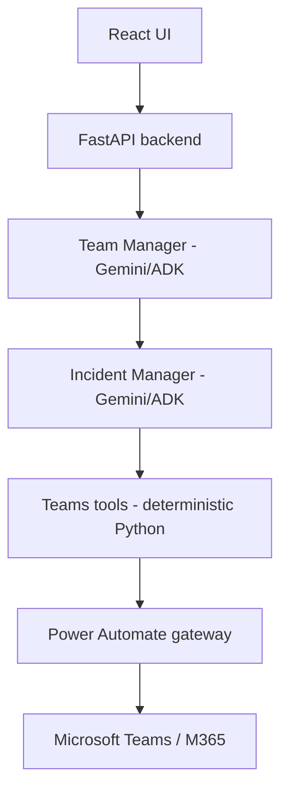
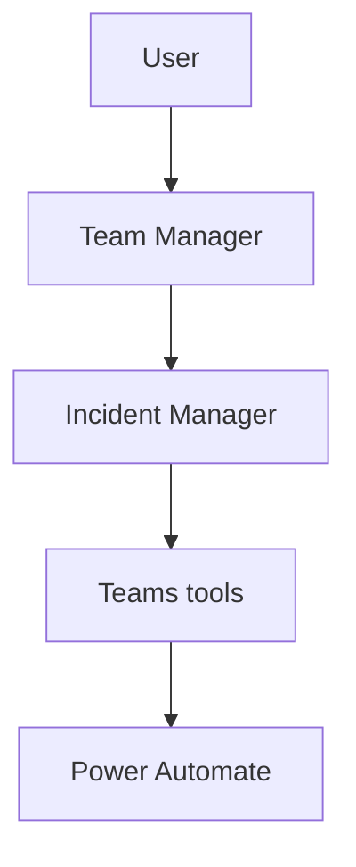
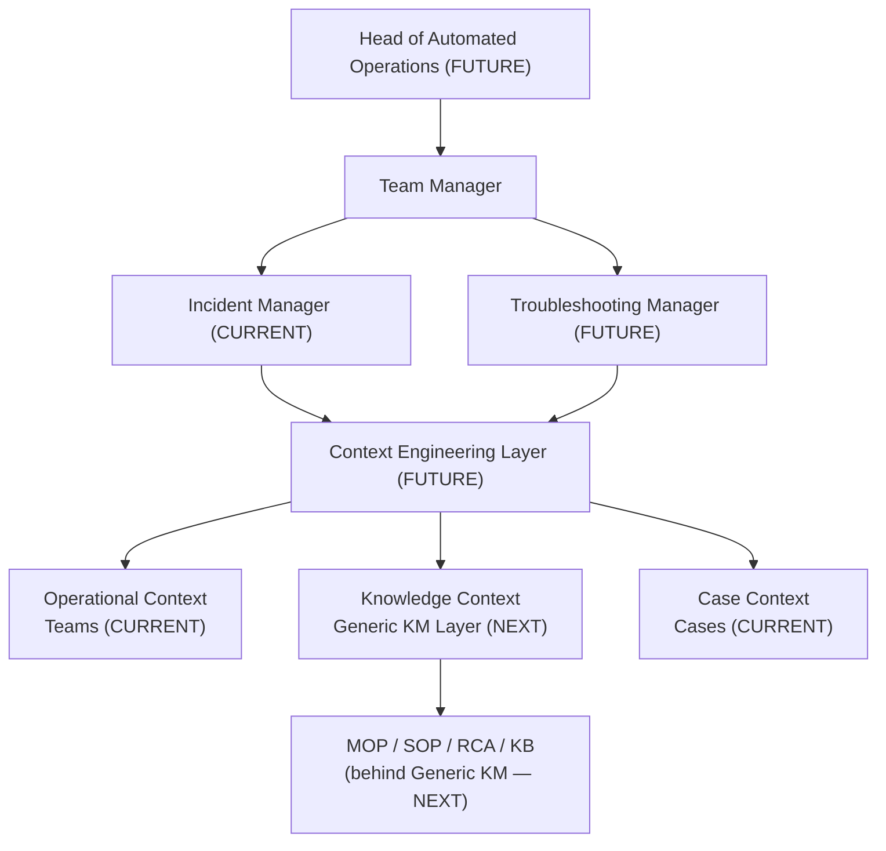
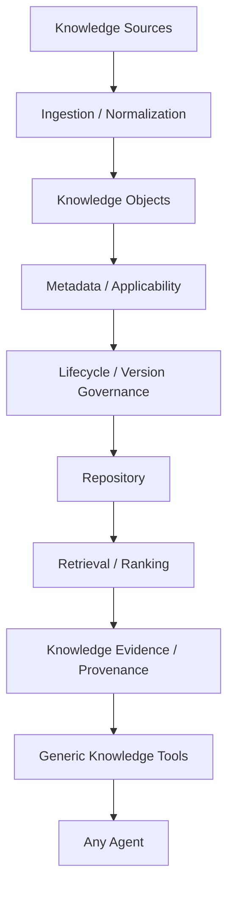

# SLOPANOC

SLOPANOC is an enterprise AI assistant for Microsoft Teams-based incident and
operational collaboration. A React chat UI talks to a FastAPI backend that
orchestrates Gemini (via Google ADK) to discover, read, and summarize Teams
conversations, and to propose — never silently execute — Teams write actions
such as creating a chat or sending a message.

This repository contains a working backend and frontend, not a UI-only
mockup. See [Current limitations / production readiness](#current-limitations--production-readiness)
for what is intentionally not yet built.

## What SLOPANOC is

- A conversational assistant that reads and summarizes Microsoft Teams chats
  on request, grounded strictly in messages it actually retrieved.
- An assistant that can propose creating a Teams chat or sending a Teams
  message, but can never cause either to happen without an explicit,
  separately-recorded approval step.
- A single-orchestrator, specialist-agent architecture (Team Manager +
  Incident Manager) built on Google ADK, with deterministic Python code — not
  model reasoning — enforcing every security- and provenance-sensitive
  decision.
- Currently a Teams-only assistant. Generic knowledge management, ITSM,
  alarm/fault, topology, and other integrations are roadmap items (see
  [Roadmap](#roadmap)), not present today.

## Current capabilities

**Core runtime**
- FastAPI backend, React + TypeScript frontend (Vite, Tailwind).
- Gemini via Google ADK 1.33.0, using Vertex AI-style configuration
  (`gemini-2.5-flash` by default, overridable — see [Configuration](#configuration)).
- A process-lifetime-shared model client per configured model name, and an
  optional startup model warm-up.
- Persistent chat sessions (ADK `DatabaseSessionService`, SQLite by default
  locally) — conversations survive a backend restart.
- Streaming responses over Server-Sent Events, with real mid-run
  cancellation.
- Editing an earlier message rewinds the session so later, now-stale turns
  are excluded from model context going forward.
- Per-model-call performance/timing instrumentation for diagnosing latency.

**Agent architecture**
- Team Manager: the only agent that ever produces user-facing text.
- Incident Manager: the Teams specialist, invoked by Team Manager through an
  ADK `AgentTool` call (an in-process call/return, not a hand-off).
- Deterministic resolution of what "this chat" refers to — the current
  SLOPANOC conversation, a previously-selected Teams chat, or a Teams chat
  named explicitly in the current message.

**Microsoft Teams — read**
- List/discover chats, deterministic name resolution, ambiguity handling via
  an interactive SelectionCard, and continuation of the original request once
  a chat is picked.
- Message retrieval with backend-driven pagination, time-range scoping, and
  system-event filtering; Teams' HTML message content is normalized to plain
  text without discarding the original.
- Semantic extraction of decisions, actions, proposals, open questions, and
  risks from retrieved messages.
- An optimized "direct unique match" path: when a request names a chat that
  resolves to exactly one chat on the first try, the read still converges
  through the same trusted-result/presentation pipeline as a post-selection
  continuation, in the same turn.

**Microsoft Teams — write**
- Proposing a new chat or a message as an `ActionProposal`, presented via an
  ApprovalCard.
- Approve/reject handled by a trusted API endpoint — never by the model.
- Execution is gated by deterministic backend policy code that re-validates
  the approval and the exact payload before any Power Automate call is made.

**Provenance**
- Every piece of evidence the model cites is validated against the message
  IDs actually retrieved for that turn; anything else is stripped.
- A structured, backend-built `SourceReference` (contributors, message
  count, reviewed period, a small evidence sample) is attached to the
  response as its own UI element, not as prose in the model's answer.
- Source is owned by the message it belongs to and disappears correctly if
  that branch of the conversation is discarded (edit/rewind).

**Persistence / case context**
- Local development persistence uses SQLite through ADK's
  `DatabaseSessionService`.
- A separate, optional Case/fault context store (`backend/cases/`) can be
  linked to a session to give the assistant durable, cross-session context —
  distinct from ordinary chat/session state.

**Trusted specialist result**
- A same-run, backend-constructed "trusted result" envelope carries a
  validated Incident Manager result to a presentation-only Team Manager
  variant (`tools=[]`, structurally unable to delegate further).
- If trust validation fails, the turn fails closed with a safe, generic
  message — it never silently falls back to a normal, tool-enabled Team
  Manager turn.

**UI**
- Markdown rendering for assistant responses (`react-markdown` +
  `remark-gfm`), with lightweight, restrained typography — not a
  documentation-style theme.
- SelectionCard (ambiguous chat choice) and ApprovalCard (write-action
  approval) as first-class conversation elements.
- A Source chip/drawer showing what a grounded answer was based on.
- A run-trace / "current activity" indicator while a turn is in progress.

The application shell, sidebar, Projects, Settings (Usage/Connectors/Skills),
and other areas inherited from the original UI/UX prototype phase still run
on local, mock state — they are not yet wired to the backend. The real,
backend-driven experience today is the chat conversation itself.

## Architecture



Principles that hold throughout the backend:

- Team Manager is the only user-facing agent; Incident Manager never
  produces text the user sees directly.
- Team Manager invokes Incident Manager through an ADK `AgentTool`, not
  native agent-to-agent transfer — this keeps Team Manager structurally in
  control of the turn.
- Power Automate remains the sole Microsoft 365 execution gateway. There is
  no direct Microsoft Graph integration anywhere in this stack.
- Gemini/ADK performs reasoning and orchestration only. Deterministic Python
  enforces every sensitive boundary — destination binding, evidence
  provenance, and write approval are never left to model reasoning alone.

## Agent topology



This is the current topology. No other agent exists today. A future
specialist (e.g. a Knowledge agent, see [Roadmap](#roadmap)) would attach to
Team Manager the same way Incident Manager does.

## Architecture Evolution

The sections above describe what is implemented today. This section shows
where the architecture is headed, so Phase 5.1A and later phases are built
toward a consistent target — none of the FUTURE/NEXT items below exist in
the codebase yet.

- **CURRENT (implemented):** Team Manager, Incident Manager, Teams
  integration, Case context.
- **NEXT (Phase 5.1, planned):** a Generic Knowledge Management Layer,
  providing *Knowledge Context* — MOPs/SOPs/RCAs/KB articles live behind
  this layer, never as raw sources a specialist reads directly.
- **FUTURE (target architecture, not yet designed in detail):** a Context
  Engineering Layer that assembles bounded context from Operational,
  Knowledge, and Case context for a specialist; a second specialist
  (Troubleshooting Manager); a supervisory Head of Automated Operations
  agent; and expanded Operational Context sources (ITSM, alarms, topology,
  KPIs, change, handover — see [Roadmap](#roadmap)).



Read this diagram as target architecture, not as a running system. The
current, actually-running path remains exactly the [Architecture](#architecture)
and [Agent topology](#agent-topology) sections above: the user talks to
Team Manager, which delegates to Incident Manager, which uses Teams tools
through Power Automate. Nothing about today's runtime changes until each
labeled phase is actually built.

## Troubleshooting Product Strategy

SLOPANOC's long-term core troubleshooting experience is a non-negotiable
product principle, defined in full in
[`docs/TROUBLESHOOTING_STRATEGY.md`](docs/TROUBLESHOOTING_STRATEGY.md): an
iterative, evidence-driven, conversational diagnostic loop — one useful
step at a time — rather than a chatbot that answers an operational problem
with a long, generic checklist. The central question the assistant is
working toward is:

> **What should I check next, and why?**

Conceptually: the user identifies the bridge/incident → SLOPANOC retrieves
current context → the user describes the problem → SLOPANOC determines the
next-best diagnostic check → the user provides the resulting
command/output/evidence → SLOPANOC interprets it, updates its hypotheses,
and retrieves additional context if needed → the next check is selected →
the loop repeats until the fault is resolved, sufficiently narrowed, or
clearly escalated.

- **CURRENT:** Team Manager, Incident Manager, Teams integration, Case
  context.
- **NEXT (Phase 5.1):** the Generic KM Layer, providing Knowledge Context.
- **FUTURE:** a Troubleshooting Manager, the Context Engineering Layer, a
  persistent troubleshooting state, a next-best-diagnostic-action loop, and
  expanded operational integrations (see [Roadmap](#roadmap)).

None of the iterative troubleshooting loop described above is implemented
today — see `docs/TROUBLESHOOTING_STRATEGY.md` for the full strategy every
future architecture decision in this area must be evaluated against.

## Microsoft Teams integration

Read operations (`teams.listChats`, `teams.getMessages`, `teams.getMembers`)
require no confirmation. Write operations (`teams.createChat`,
`teams.sendMessage`) always require an explicit approval, enforced outside
the model. Power Automate executes as its own configured connection
identity — this is not a per-user delegated Microsoft identity model today.
See [`docs/TEAMS_TOOL_CONTRACT.md`](docs/TEAMS_TOOL_CONTRACT.md) for the full
contract.

## Trust / approval model

```text
model → proposal → pending ActionProposal → trusted API approve/reject
      → deterministic re-authorization → exact execution
```

The model can describe and propose an action, but it cannot approve itself,
cannot create trusted approval state, and cannot cause a different payload
than the one approved to execute — a deterministic policy gate re-derives
and re-checks the payload immediately before every Power Automate write
call. See [`docs/AGENT_CONTRACT.md`](docs/AGENT_CONTRACT.md) for the full
sequence.

**Selection is not approval.** Picking a chat from an interactive
disambiguation list resolves *which Teams chat* a request refers to; it
never authorizes a write. These are separate mechanisms with separate state.

## Provenance

Retrieved Teams message IDs establish the authoritative evidence set for a
turn; anything the model cites outside that set is removed before the
response reaches the user. The model never authors the displayed evidence
text — original retrieved content is used. `SourceReference` is built
deterministically by the backend, is owned by the message it supports, and
is never fabricated for a turn that had no real evidence.

## Local development

### Prerequisites

- Node.js 20+ and npm
- Python 3.11+
- A Google Cloud project with Vertex AI enabled, and
  [`gcloud`](https://cloud.google.com/sdk) installed for local
  Application Default Credentials
- A Power Automate flow URL for Teams read/write operations (see
  [Configuration](#configuration)) — without one, chat still runs, but any
  Teams-domain request returns a configuration error

### Clone and install frontend dependencies

```bash
git clone <this-repo>
cd enterprise-ai-ui
npm install
```

### Python environment

```bash
python -m venv .venv
# Windows: .venv\Scripts\activate   |   macOS/Linux: source .venv/bin/activate
pip install -r requirements.txt -r requirements-dev.txt
```

`requirements.txt` is the audited set of packages the backend actually
imports (see its own header comment for what's excluded and why —
notably no `cloud-sql-python-connector`; local Cloud SQL development uses
the Auth Proxy, see below). `requirements-dev.txt` adds `pytest`/
`pytest-asyncio` on top for running the test suite.

### Google authentication

```bash
gcloud auth application-default login
```

Set the standard Google SDK environment variables for Vertex AI mode (read
directly by the underlying `google-genai` client, not by SLOPANOC's own
code):

```bash
export GOOGLE_GENAI_USE_VERTEXAI=true
export GOOGLE_CLOUD_PROJECT=<your-gcp-project-id>
export GOOGLE_CLOUD_LOCATION=<your-vertex-location>   # e.g. us-central1
```

### Local Cloud SQL PostgreSQL development

The default local backend, and the default for `python -m pytest`, is
still zero-setup SQLite — nothing below is required unless you explicitly
want to run against Cloud SQL PostgreSQL locally.

A Cloud SQL PostgreSQL 18 instance exists for this purpose
(`sloc-anoc-sandbox01`, project `pr-msn-dev-gl-slopai-01`, region
`europe-west4` — instance connection name
`pr-msn-dev-gl-slopai-01:europe-west4:sloc-anoc-sandbox01`; this is not a
credential and is safe to reference). Local access uses the
[Cloud SQL Auth Proxy v2](https://cloud.google.com/sql/docs/postgres/sql-proxy)
with IAM database authentication — never a password in a connection URL:

```bash
cloud-sql-proxy --address=127.0.0.1 --port=5432 --auto-iam-authn \
  pr-msn-dev-gl-slopai-01:europe-west4:sloc-anoc-sandbox01
```

With the proxy running and `gcloud auth application-default login`
already done, point the backend at it by setting `SLOPANOC_DATABASE_URL`
and/or `SLOPANOC_KNOWLEDGE_DATABASE_URL` (see
[Configuration](#configuration)) to a `postgresql+asyncpg://` URL with
your IAM database username's `@` URL-encoded as `%40`, e.g.:

```bash
export SLOPANOC_DATABASE_URL="postgresql+asyncpg://your.iam.user%40example.com@127.0.0.1:5432/slopanoc"
```

Never commit a real, username-specific connection URL anywhere in this
repository — it is a per-developer local override only.

### Environment variables

Copy `.env.example` to `.env` for frontend-only overrides (see
[Configuration](#configuration) for the full backend variable list, which
is process-environment, not `.env`-file, based):

```bash
cp .env.example .env
```

## Configuration

Backend configuration is read from process environment variables
(`backend/config/settings.py`). None of these have a checked-in value.

| Variable | Purpose | Default |
|---|---|---|
| `SLOPANOC_POWER_AUTOMATE_GATEWAY_URL` | Power Automate flow URL (local dev) | none — required unless the secret-resource variant below is set |
| `SLOPANOC_POWER_AUTOMATE_SECRET_RESOURCE` | GCP Secret Manager resource holding the gateway URL (deployment) | none |
| `SLOPANOC_MODEL` | Gemini model name | `gemini-2.5-flash` |
| `SLOPANOC_POWER_AUTOMATE_TIMEOUT_SECONDS` | Gateway HTTP timeout | `10` |
| `SLOPANOC_ACTION_PROPOSAL_EXPIRY_SECONDS` | How long a write proposal stays approvable | `600` |
| `SLOPANOC_SESSION_BACKEND` | `memory` or `database` | `database` |
| `SLOPANOC_DATABASE_URL` | SQLAlchemy async URL for session + Case/Fault persistence | `sqlite+aiosqlite:///./slopanoc_sessions.db` |
| `SLOPANOC_DATABASE_SECRET_RESOURCE` | Secret Manager resource for the database URL (deployment) | none |
| `SLOPANOC_KNOWLEDGE_DATABASE_URL` | SQLAlchemy async URL for Governed Knowledge persistence (separate setting — see [Local Cloud SQL PostgreSQL development](#local-cloud-sql-postgresql-development)) | `sqlite+aiosqlite:///./slopanoc_knowledge.db` |
| `SLOPANOC_KNOWLEDGE_DATABASE_SECRET_RESOURCE` | Secret Manager resource for the Knowledge database URL (deployment) | none |
| `SLOPANOC_CHAT_ATTACHMENTS_BUCKET` | Private GCS bucket name for durable chat attachment binaries (POST-5.1 B1+) | none — attachment storage unavailable when unset; ordinary text chat is unaffected |
| `SLOPANOC_CHAT_ATTACHMENT_MAX_BYTES` | Max single image upload size, enforced (POST-5.1 B2) | `8388608` (8 MiB) |
| `SLOPANOC_CHAT_ATTACHMENT_MAX_IMAGES_PER_TURN` | Max images per message turn — defined, not yet enforced (future B5) | `4` |
| `SLOPANOC_CHAT_ATTACHMENT_MAX_TOTAL_BYTES_PER_TURN` | Max combined image bytes per turn — defined, not yet enforced (future B5) | `16777216` (16 MiB) |
| `SLOPANOC_SAVED_CHAT_LIST_LIMIT` | Recent-N cap for `GET /api/sessions` and its legacy-marker backfill scan (POST-5.1 B4B) — not real pagination, ADK's `list_sessions` has none | `50` |
| `SLOPANOC_CASE_CONTEXT_MAX_ITEMS` | Max Case context items shown to the model | `12` |
| `SLOPANOC_CASE_CONTEXT_MAX_CHARACTERS` | Max Case context characters shown to the model | `4000` |
| `SLOPANOC_MODEL_WARMUP_ENABLED` | Warm up the model client on startup | `true` |
| `SLOPANOC_MODEL_WARMUP_TIMEOUT_SECONDS` | Warm-up timeout | `30` |
| `VITE_SLOPANOC_API_BASE_URL` | Frontend override for the backend base URL (see `.env.example`) | same-origin, proxied by Vite |

## Running

Start the backend (from the repository root, with the environment above
configured):

```bash
python -m uvicorn backend.api.app:app --host 127.0.0.1 --port 8000 --reload
```

In a second terminal, start the frontend dev server, which proxies
`/api/...` to `http://127.0.0.1:8000`:

```bash
npm run dev
```

Open the printed local URL. Sending the first prompt creates a real backend
session immediately — there is no separate "New Chat" step required.

## Testing

Backend:

```bash
python -m pytest backend/tests -q
```

Frontend:

```bash
npm test
```

Build (type-checks and bundles the frontend):

```bash
npm run build
```

The backend suite is extensive and covers, among other areas: Teams
read/write behavior, the approval lifecycle, chat selection/disambiguation,
session persistence, streaming and cancellation, evidence and provenance
validation, security contracts (no secret leakage, no unauthorized tool
paths), agent orchestration and prompt contracts, and performance
instrumentation. The frontend suite covers component behavior including
Markdown rendering, cards (Selection/Approval), and streaming message
updates. Exact test counts are intentionally not listed here — they change
frequently; run the commands above for current numbers.

## Repository structure

```text
enterprise-ai-ui/
├── alembic/                  # Migrations for SLOPANOC-owned schemas (Case/Fault, Knowledge) — never ADK's own session tables
├── alembic.ini
├── requirements.txt, requirements-dev.txt   # Pinned backend dependency manifest
├── backend/
│   ├── agents/            # team_manager/, incident_manager/ — ADK agents & prompts
│   ├── api/                # FastAPI app, chat/session/approval/execution services
│   ├── approval/           # Deterministic write-approval policy gate
│   ├── cases/               # Case/fault context persistence, separate from chat state
│   ├── config/              # Settings, model warm-up
│   ├── gateway/             # Power Automate HTTP client, safe-error shaping
│   ├── selection/           # Ambiguous-chat selection lifecycle
│   ├── tools/teams/         # Deterministic Teams tool implementations
│   └── tests/                # Backend regression suite
├── src/
│   ├── api/                  # Backend client, SSE parsing, DTO types
│   ├── components/           # conversation/, composer/, shell/, landing/, ui/
│   ├── state/                 # AppState (chat, sessions, streaming)
│   └── data/                  # Mock data for the non-backend-wired UI areas
├── docs/
│   ├── AGENT_CONTRACT.md       # Team Manager / Incident Manager architecture contract
│   ├── TEAMS_TOOL_CONTRACT.md   # Teams tool / Power Automate integration contract
│   ├── PRODUCT.md, UX_SPEC.md    # Original UI/UX product vision documents
│   └── implementation-handoff/    # Pre-implementation architecture planning (historical)
└── CLAUDE.md                        # Current implementation guide for Claude Code work in this repo
```

## Current limitations / production readiness

SLOPANOC is not production-ready. Known gaps include at least:

- **Security hardening (Phase 4H)** — trust-boundary/threat modeling,
  prompt-injection isolation for untrusted external content, tool
  authorization/output validation, secret-handling hardening, security
  audit events, and an adversarial regression suite are planned, not yet
  built.
- **Enterprise authentication** — there is no enterprise identity provider
  integration; API identity resolution is not a production auth model.
- **Per-user Microsoft identity** — Power Automate currently runs as its own
  configured connection identity, not a delegated per-user Microsoft Graph
  identity. If per-user Teams permissions are required, this needs design
  work.
- **Production deployment identity/configuration** — Cloud SQL PostgreSQL
  support is implemented and validated end-to-end (see
  [Local Cloud SQL PostgreSQL development](#local-cloud-sql-postgresql-development)):
  SLOPANOC-owned schemas (Case/Fault + Governed Knowledge) are
  Alembic-managed and applied to Cloud SQL; ADK's own session schema is
  self-managed by ADK and intentionally excluded from Alembic; the real
  FastAPI runtime has been proven against Cloud SQL, including session/
  Case/Knowledge persistence surviving a backend restart. SQLite remains
  the local zero-setup default when `SLOPANOC_DATABASE_URL`/
  `SLOPANOC_KNOWLEDGE_DATABASE_URL` are not set. What's still missing:
  local Cloud SQL validation so far used the developer's own IAM identity
  (a member of both the `slopanoc_migrator` and `slopanoc_runtime`
  database roles); a real deployment needs a dedicated runtime service
  account scoped only to `slopanoc_runtime`, and Secret Manager-based DB
  URL configuration for Cloud SQL has not yet been exercised.
- **Distributed runtime coordination** — the backend assumes a single
  process; multi-instance coordination (session affinity, distributed
  cancellation, etc.) is not addressed.
- **Production observability/alerting** — structured performance timing
  exists for diagnosis, but there is no production metrics/alerting
  integration.
- **Load/concurrency validation** — not yet performed.
- **Broader operational integrations** — ITSM, alarm/fault, topology, KPI,
  and change-management integrations do not exist yet (see
  [Roadmap](#roadmap)).

## Roadmap

**Current:** Teams integration, core platform, and Markdown rendering are
complete.

**Next — Phase 5.1: Generic Knowledge Management Layer.** A generic
knowledge platform capability, not an Incident-Manager-specific feature.
Initial knowledge object types are expected to include MOPs, SOPs, RCAs, KB
articles, troubleshooting guides, operational procedures, and technical
instructions. The KM layer itself must not depend on Incident Manager —
Incident Manager becomes only its first reference consumer, in the final
sub-phase.

- 5.1A Knowledge architecture + contracts
- 5.1B Metadata + applicability
- 5.1C Generic ingestion boundary
- 5.1D Content processing / structured segmentation
- 5.1E Versioning + lifecycle governance
- 5.1F Knowledge repository abstraction
- 5.1G Retrieval + ranking
- 5.1H Knowledge provenance
- 5.1I Generic agent-facing Knowledge tools
- 5.1J First reference consumer integration (Incident Manager)

5.1A (domain foundation), 5.1B (metadata hardening + deterministic
applicability evaluation), 5.1C (the generic, source-agnostic ingestion
boundary contract), 5.1D (deterministic structural content
processing/segmentation), 5.1E (versioning + lifecycle governance),
5.1F (the generic knowledge repository contract, with a local SQLite
implementation), 5.1G (deterministic, generic retrieval + ranking — a
context-reduction boundary, with one lexical token-overlap reference
scorer), 5.1H (knowledge provenance — a deterministic validation
boundary that revalidates retrieval results against the exact repository
state before they become trusted evidence), 5.1I (one generic
agent-facing `knowledge_search` tool composing 5.1G + 5.1H behind a
closed, model-controlled request contract, with trusted `as_of`/
applicability context supplied only by the backend), and 5.1J (Incident
Manager, the first reference consumer — concrete `knowledge_search`/
`knowledge_select_evidence` ADK tools in `backend/tools/knowledge/`,
outside Generic KM itself, with server-owned, run-id-keyed trusted
evidence state; Team Manager remains untouched and receives neither
tool) are implemented, with the full contract documented in
[`docs/KNOWLEDGE_CONTRACT.md`](docs/KNOWLEDGE_CONTRACT.md). Phase 5.1 is
now complete.

**Then — POST-5.1 A: Cloud SQL PostgreSQL.** ✅ COMPLETE (A1–A4). Cloud
SQL PostgreSQL foundation, IAM connectivity, database roles/schema
bootstrap, and real runtime cutover + persistence validation — see
[Local Cloud SQL PostgreSQL development](#local-cloud-sql-postgresql-development)
and [Current limitations](#current-limitations--production-readiness).

**Next — POST-5.1 B: multimodal attachments.** IN PROGRESS (B0–B4D done,
B5 next).
Locked execution sequence (do not reorder): B0 [done] architecture + ADK
persistence audit → B1 [done] Persistent Attachment Foundation → B2
[done] Attachment Upload/Retrieve API → B3 [done] Complete Existing
Frontend Attachment UX → **B4 Saved Conversation/Attachment Rehydration**
(B4A [done] architecture + ADK event audit, B4B [DONE] backend safe
session-list/history API — including a runtime defect found and fixed via
live smoke, see below, and closed by a full, real end-to-end validation
pass: real Vertex Gemini 2.5 Flash, real Cloud SQL PostgreSQL, real
FastAPI/ADK runtime, real backend restart; B4C [DONE] frontend saved-chat
list + lazy transcript hydration — closed by a full real browser
validation pass (cold reload restoring real Cloud SQL-backed
conversations, lazy history load, real UI rename persisting through a
hard refresh, and post-rename history still loading correctly), see
below — B4D [DONE] attachment-reference hydration + secure persisted
image rendering + restart/rewind/live validation — closed by a real
GCS + Cloud SQL LINKED attachment through the real history/content
endpoints and real browser rendering, plus a final live check confirming
image-bearing user turns are non-editable while text-only turns remain
editable, see below) → B5 Gemini/ADK
Multimodal Runtime → B6
Image + Teams + KM Operational Reasoning → B7 Lifecycle + Real UI + Full
Regression.

B4B added two new backend modules and three new routes, backend-only (no
frontend change): `GET /api/sessions` (the caller's own saved-chat list --
safe `{session_id, title, updated_at}` summaries), `GET /api/sessions/{id}/history`
(the safe, active-branch-only transcript for one session — reuses
`chat_service.py`'s already-tested rewind-filtering/final-text-extraction
logic verbatim, never a second implementation; excludes function
calls/responses/thought parts/state-only events; attaches LINKED image
references via exactly one ownership-scoped query per request), and
`PATCH /api/sessions/{id}` (a durable manual rename — the existing
frontend rename was local-only and would have been silently overwritten
by a derived title on next refresh). A session is only listed once it has
a genuine user-visible message — `has_visible_message` is a tri-state ADK
session-state marker (`True`/`False`/absent) set to `False` on every new
session. The real user-content event for a turn is proven durably
persisted at the first event the Runner yields, but SLOPANOC defers its
own saved-chat state mutation (`has_visible_message`/`chat_title`/
`chat_activity_at`) until the active Runner invocation has fully
terminated, preserving ADK's single-writer/session-revision lifecycle — a
live production incident proved that an external `get_session()`/
`append_event()` call made *while* `Runner.run_async` was still yielding
further events for the same invocation raced ADK's own session-revision
tracking and broke the Runner's own next internal append (e.g. a tool's
function-response), surfacing as a generic failure with no model
continuation. The marker is still flipped to `True` for a failed or
cancelled turn — the deferred write happens from this method's own
`finally` block, so it still runs after a failure, just never while the
Runner is still active — and a crash before that deferred write can run
is covered by the existing legacy-marker backfill. A session created
before B4B (marker absent) is bounded, one-time backfilled on its next
list rather than hidden forever.

**`updated_at`/sidebar ordering — correction pass.** `SessionSummaryDTO
.updated_at` is `chat_activity_at`, a dedicated session-state timestamp
this codebase now maintains itself — **never** ADK's own generic `Session
.last_update_time`. The generic ADK timestamp also moves on unrelated
state-only writes this codebase already performs elsewhere (an approval
transition, a Teams-selection sync, a Case link, a manual rename, or this
very feature's own legacy-marker repair), which would otherwise
incorrectly bump an untouched old conversation to the top of the sidebar.
`chat_activity_at` is set/advanced ONLY by a genuine user chat turn, to
that turn's own real, already-persisted `Event.timestamp` — a manual
rename changes `chat_title` and nothing else; a legacy conversation is
backfilled using its LATEST still-active turn (never its first, and never
a turn a rewind has since discarded). The saved-chat list algorithm
classifies every session from its cheap, already-loaded state BEFORE any
limit is applied — `SLOPANOC_SAVED_CHAT_LIST_LIMIT` (default 50) bounds
only the returned page size and the per-request legacy-repair budget
(event reads), never the visibility classification itself, so no number
of empty or not-yet-classified sessions can hide an older real saved
conversation; unrepaired candidates are simply retried on a later
request.

Two distinct, deliberately non-interchangeable identities: `turn_id` (an
ADK `invocation_id`) and `message_id` (`f"{turn_id}:user"`/
`f"{turn_id}:assistant"` — never ADK's own internal `Event.id`, which this
backend can't observe for a user event without an extra round trip). No
schema migration — everything reuses ADK's own session-state mechanism
and the already-existing `slopanoc_chat_attachments` read methods.
Validated against real Cloud SQL PostgreSQL, including the correction
pass: session creation, empty-session exclusion, a real turn becoming
visible with a derived title and activity timestamp, a rename and an
unrelated state-only write both leaving activity/ordering untouched, safe
history projection, durable rename, survival across a simulated backend
restart, and a real ADK rewind correctly narrowing both history and
activity to the active branch.

**Runtime defect found and fixed via live smoke.** The first live
Gemini/Vertex smoke (a function-call tool turn) failed twice with a
generic "could not complete this request" and no model continuation.
Root-caused (without changing code first) by direct inspection of
installed `google-adk==1.33.0`'s `Runner.run_async` event loop and
`DatabaseSessionService.append_event`'s session-revision staleness check,
confirmed by a disposable local reproduction against a real
`DatabaseSessionService`, and corroborated by read-only inspection of the
real failed Cloud SQL session (exactly the durable user event plus a
bookkeeping event per attempt, and no function-call/model event ever
persisted — consistent with the Runner's own next append failing). Fixed
by deferring the saved-chat bookkeeping write to post-run finalization
(see above), using the same re-fetch-then-write pattern already proven
elsewhere in this codebase for the same class of bug
(`_reload_and_persist_cleanup_delta`). Covered by
`backend/tests/test_chat_service_function_call_continuation.py` (function-
call continuation, no-final-answer, and multi-turn regressions, plus two
tests proving the underlying ADK mechanism directly), the full backend
suite (2557 passed, 1 skipped), and a real Cloud SQL fixture proving the
post-run write persists and survives a simulated restart.

**Final live closure.** The retry succeeded end-to-end against the real
stack: real Vertex Gemini 2.5 Flash returned the requested reply
("B4B smoke confirmed.") with normal model-call → assistant-text →
generation-complete → source-requirements remediation → run-complete
behavior and no recurrence of the earlier generic failure; `GET
/api/sessions` listed the session with the correct derived title and a
`chat_activity_at`-based `updated_at` sorted correctly against older
sessions; `GET /api/sessions/{id}/history` returned exactly the two
visible messages (`{turn_id}:user`/`{turn_id}:assistant`, correct real
timestamps, no tool/function/internal event leakage); `PATCH
/api/sessions/{id}` renamed the title while leaving `updated_at` exactly
unchanged; and a full backend process restart preserved session
visibility, the manual title, and `chat_activity_at` identically,
including on a second history read. **B4B is DONE.**

**POST-5.1 B4C — frontend saved-chat list + lazy transcript hydration.**
**DONE.** Server remains
authoritative — no localStorage/sessionStorage/IndexedDB persistence was
added. At app boot, `AppStateProvider` fetches `GET /api/sessions` once
and merges each summary into the sidebar as a general-workspace chat
(`Chat.id = Chat.backendSessionId = session_id`), deduped by
`backendSessionId` (never `Chat.id` equality alone) so a StrictMode
double-invocation or a chat that already owns this session can never
produce a duplicate; `activeChatId` is never touched by hydration, so the
user still lands on a normal empty composer. Backend order (already
newest-activity-first) is preserved by appending the hydrated ids to
`chatOrder`, reusing the existing `sortChatsForDisplay` pin logic
unchanged. Transcript history is fetched lazily — only when a hydrated
chat is actually opened (`GET /api/sessions/{id}/history`), tracked via a
new tri-plus-one-state `Chat.historyHydrationStatus` (`"unloaded" |
"loading" | "loaded" | "error"`, deliberately not inferred from
`messageIds.length` — a real failed turn can legitimately look "empty"
otherwise) — never at boot, never twice for an already-loaded chat, and a
late response can neither resurrect a since-deleted chat nor overwrite a
real local turn the user already started while the fetch was still in
flight. A failed fetch is retryable (`retryHistoryLoad`) and never
fabricates a placeholder assistant reply or "No messages" — a genuine
user-only failed turn (e.g. the still-intact `6dd9fad5-...` evidence
session) renders as user-only, exactly like production. `turn_id` is
intentionally NOT stored on the frontend `Message` model — edit/rewind
already worked (and still works, regression-tested) by counting
preceding `role === "user"` entries positionally, so there is no consumer
for it. History-response `attachments` are typed (part of the real wire
shape) but deliberately not mapped onto any `Message` — persisted
attachment rendering is B4D. Resuming a hydrated chat needs no special
code at all: `sendMessage`'s existing `chat.backendSessionId` reuse means
a normal send in a hydrated chat never calls `createSession()` again.
Real-chat rename now calls `PATCH /api/sessions/{id}` whenever
`Chat.backendSessionId` is set (hydrated OR a chat that got a session
from its own first send) — success applies the server-echoed title
locally, a failure keeps the prior title and surfaces the real, already-
safe `ApiError` message (never raw transport text, same fallback pattern
`editMessage`'s own rewind-failure path already used), and a per-chat
request token discards a stale response so a rapid double-rename can
never let an older reply overwrite a newer one. Mock/project/demo chats
(no `backendSessionId`) keep the original synchronous local-only rename
unchanged. B4B's own DELETE/pin/unread non-guarantees are unchanged by
B4C: there is still no backend DELETE/pin/unread persistence — deleting a
hydrated chat only removes it locally for this session; a real backend
DELETE route remains future (B7/lifecycle) work, not added here.
**Correction pass — global saved-chat-list loading/error/empty are now
distinct.** The first pass silently swallowed a `GET /api/sessions` boot
failure (a DEV-only console.debug), leaving the sidebar's Chats section
indistinguishable from a genuinely empty account during a real network
failure. Fixed with a new GLOBAL (not per-chat) `AppState
.savedChatsHydrationStatus: "loading" | "loaded" | "error"` (plus
`savedChatsHydrationError`) — separate from any one chat's own
`historyHydrationStatus` — starting `"loading"`, settled to `"loaded"` by
a successful `GET /api/sessions` (including a genuine zero-session
response — never confused with `"loading"`/`"error"`), or to `"error"`
with a safe message on failure, which never touches `chats`/`chatOrder`
(a failed or retried fetch can never erase an already-existing local
chat). The sidebar's Chats section now shows "Loading chats…" only while
nothing is known yet AND the list looks empty, a small "Couldn't load
saved chats" + "Retry" row on failure (no modal, no `alert()`, no raw
`ApiError` details), and the original "No chats yet" only once genuinely
`"loaded"` with zero chats. `retrySavedChats()` (new context action)
resets status to `"loading"` and reuses the exact same fetch/merge
function boot itself calls — repeated retries can never duplicate a chat,
since the reducer's `backendSessionId` dedupe is unconditional. The boot
single-flight ref remains scoped to boot only; it never blocks an
explicit retry, including one issued right after a React 18 StrictMode
double-invocation already settled boot (regression-tested).
Covered by `src/api/sessions.test.ts` (the three new API functions),
`src/state/AppState.savedChats.reducer.test.ts` (pure reducer coverage:
hydration merge/dedupe/ordering, history mapping, failure/retry, and this
correction pass's loading/loaded/loaded-empty/error/retry-dedupe cases),
and `src/state/AppState.savedChats.integration.test.tsx` (boot hydration
including a StrictMode double-invocation check, lazy fetch, resume-saved-
chat, rename success/failure/race, an edit/rewind regression against a
real hydrated two-turn fixture, and this correction pass's boot-loading/
boot-failure-preserves-local-chats/retry-recovery/failed-retry/StrictMode-
then-retry cases) — full frontend suite and `npm run build`
(`tsc -b && vite build`) both clean, zero regressions.

**Final live closure.** A real browser validation pass against the full
real stack (React frontend → FastAPI → ADK `DatabaseSessionService` →
real Cloud SQL PostgreSQL, after a genuine VS Code/backend/frontend
restart) confirmed all of it end to end: a hard refresh (cold reload,
browser memory cleared) restored the real saved-chat list from Cloud SQL,
including "B4B Live Persistence Test," the earlier B4B failed-session
chat, and "Hello"; opening "B4B Live Persistence Test" lazily fetched and
rendered exactly its real two-message transcript ("B4B live persistence
retry. Reply with: B4B smoke confirmed." / "B4B smoke confirmed."), with
no fabricated assistant reply and no raw tool/function/internal event
leakage; renaming it from the real React UI to "B4C UI Rename Test"
followed by a hard refresh (Ctrl+Shift+R) showed the renamed title
surviving durably via `PATCH /api/sessions/{backendSessionId}` into Cloud
SQL — proving real-chat rename is no longer local-only; and reopening the
renamed chat afterward reloaded the exact same two-message transcript
again, proving the rename never detached or corrupted the underlying
session/conversation identity. **B4C is DONE.**

**POST-5.1 B4D — attachment-reference hydration + secure persisted image
rendering + restart/rewind/live validation.** **DONE.** B4D does NOT
send images to Gemini and does NOT touch model input in any way — that
is B5, deliberately
untouched here; the B3 image Send gate remains fully closed. History DTO
`attachments` (typed since B4C but deliberately unmapped) now map onto a
NEW, dedicated `Message.persistedAttachments` field — metadata only
(`attachmentId`/`filename`/`mimeType`/`sizeBytes`), never a `File`/
`Blob`/`objectUrl`, and never the existing mock `attachments` field
(untouched). Binary rendering reuses the existing, unmodified B2
`GET /api/attachments/{id}/content` route (authenticated + ownership-
checked, anti-enumeration — unknown and foreign-owner attachments return
the identical generic SafeError) through one new shared `client.ts`
helper (`getBlob`) and one new `api/attachments.ts` function
(`getAttachmentContent`) — no new backend route, no GCS/bucket/signed-URL
knowledge anywhere in the frontend. A new, self-contained
`PersistedImageAttachment` component (no AppState dependency, no global
binary cache) does the actual fetch-on-mount → `Blob` →
`URL.createObjectURL` → `` → revoke-on-replace/unmount lifecycle,
rendered additively inside `Message.tsx`'s existing user-message branch.
An unsupported MIME type (anything outside the existing
`ACCEPTED_IMAGE_MIME_TYPES`) never fetches at all — a safe "Unsupported
format" state. A content-fetch failure never fails the transcript, the
chat's `historyHydrationStatus`, or any sibling image — just that one
image's own safe "Image unavailable" + Retry state (regression-tested
directly: a real image failure alongside real history success leaves
`historyHydrationStatus: "loaded"` untouched). No content binary is ever
fetched merely because a chat is summarized at boot or because history
loads — only once an actual ``-bearing message is actually
rendered. Edit/rewind remains fully compatible with no code changes at
all: discarding a later turn already deletes its message (and therefore
its `persistedAttachments`) wholesale via the existing reducer logic, and
the corresponding `PersistedImageAttachment` instance simply unmounts,
triggering its own abort/revoke cleanup automatically (regression-tested
against a real two-turn hydrated fixture where the discarded turn owns an
image). Covered by `src/api/attachments.test.ts` (`getAttachmentContent`),
`src/state/AppState.savedChats.reducer.test.ts` (DTO → `persistedAttachments`
mapping: zero/one/four attachments, assistant-always-empty, metadata-only
shape), `src/components/conversation/PersistedImageAttachment.test.tsx`
(loading/success/cleanup/StrictMode/failure+retry/unsupported-MIME/
multiple-instance isolation), and
`src/components/conversation/Message.persistedAttachments.test.tsx` (a
real `AppStateProvider`-backed integration: history-success/image-failure
boundary, the lazy content-fetch network boundary, a successful render,
and the edit/rewind ghost-attachment regression) — full frontend suite
and `npm run build` both clean, zero regressions.

**Live image hydration validated.** A real disposable session
(`78a5b7c8-a675-4bb1-9372-b3fa0d641cdc`, real turn
`e-4faba7ae-82f1-4d82-9cf2-b30a12824f2c`) exercised the full real stack:
a real PNG (`00001.PNG`, `image/png`, 180337 bytes) was uploaded through
the unmodified real `POST /api/sessions/{id}/attachments` route (real
GCS write + Cloud SQL `READY` row), then linked via the existing
`AttachmentService.link_to_message` in a one-off, disposable, never-
committed local invocation (`READY → LINKED`, `message_id` = the real
ADK turn_id) — no production route added, no fixture code committed, no
backend behavior changed. `GET /history` then returned exactly
`{attachment_id, filename, mime_type, size_bytes}` on the owning USER
message only (assistant attachments empty), with no `gs://`/bucket/
storage/owner metadata exposed. After a hard refresh, the real browser
rendered `00001.PNG` inside the owning user message end to end: Cloud SQL
reference → `GET /history` → `PersistedAttachmentReference` →
authenticated `GET /api/attachments/{id}/content` → private GCS binary →
`Blob` → transient object URL → real `` — no direct GCS access, no
signed URL, no public bucket, no base64, no durable browser storage.

**Correction pass — image-bearing user turns are intentionally
non-editable.** A user turn that owns a durable, server-linked image
reference owns evidence tied to its original ADK turn/invocation;
allowing a text-only edit/rewind of that prompt while silently
retaining, dropping, or re-associating the image would create ambiguous
attachment semantics this product has not designed yet. Multimodal
edit/rewrite semantics are not defined. The single authoritative signal
(`src/lib/persistedAttachments.ts`'s `hasPersistedImageAttachment`, used
identically everywhere) is `message.persistedAttachments`'s presence —
never inferred from message text, filename, regex, or DOM state.
Enforced twice: `Message.tsx`'s `UserMessageActions` hides the Edit
action entirely for such a message (no disabled-button/tooltip needed),
and — the real boundary — `AppState.tsx`'s `editMessage` hard-guards on
the same signal before any side effect (no `rewindSession`, no
`createSession`, no text mutation, no dispatch), so the prohibition holds
for any future caller, not only the UI. Text-only user messages are
completely unaffected — existing edit/rewind behavior is unchanged and
regression-tested. **Future B5 invariant**: once a live-sent turn can
carry a real image, the frontend `Message` representing it must expose
this same `persistedAttachments` (or an equivalent structured
image-ownership) signal immediately, in the same turn — not only after a
later reload — so this prohibition holds both before and after refresh;
B5 has not implemented that yet. **Final live proof**: after the
correction pass, a real hard refresh reopening "B4D attachment hydration
fixture" confirmed the persisted image still renders, the original user
text still renders, the image-bearing user prompt has no usable Edit
action, and text-only user messages elsewhere retain normal Edit
behavior — with no `rewindSession` call for the blocked direct-edit
attempt. **B4D is DONE.**

Product model: normal SENT chat attachments are real saved conversation
resources, not a current-turn-only demo. Unsent draft = browser
File/Blob only. Sent normal chat attachment = private GCS binary + Cloud
SQL metadata/reference, linked to the owning chat/user message. A future
temporary/incognito chat (not built) would be ephemeral-only; future
incident-evidence promotion and future governed-KM images (neither
built) get their own separate ownership/lifecycle.

Locked Gemini/ADK multimodal construction rule (B0, proven against the
installed `google-adk==1.33.0`/`google-genai==1.75.0` stack, both by
direct source inspection and a disposable local experiment):
`Part.from_uri(file_uri="gs://...", ...)` is the ONLY sanctioned
construction for a durable chat image — ADK's `DatabaseSessionService`
persists only the small URI/MIME-type reference for it.
`Part.from_bytes(...)` is **forbidden** for this path — proven to
serialize the full image as base64 directly into the ADK `events` table.
Not wired into any live message-send path yet (that's B5) — B1 only
establishes the Cloud SQL/GCS foundation that preserves this rule (no
binary/base64/data-URL column exists anywhere in the new
`slopanoc_chat_attachments` table).

B1 added: `backend/attachments/{models,repository,service,storage}.py`,
one Alembic migration for `slopanoc_chat_attachments` (Alembic-managed,
like Case/Fault + Governed Knowledge — never ADK's own session tables),
and a private GCS bucket (`slopanoc-chat-attachments-sandbox01`,
`europe-west4`, uniform bucket-level access, public access prevention
enforced, no object versioning). No HTTP upload/retrieve endpoints, no
frontend changes, and no Gemini/ADK wiring yet — those are B2+.

B2 added real endpoints, still with no frontend/Gemini/ADK wiring:

- `POST /api/sessions/{session_id}/attachments` — multipart image
  upload. Validates the *actual* decoded image (Pillow — PNG/JPEG/WebP
  only; a declared `Content-Type` that doesn't match the real decoded
  format is rejected, never silently reinterpreted), enforces a bounded
  read against `SLOPANOC_CHAT_ATTACHMENT_MAX_BYTES` (default 8 MiB) so a
  client can never bypass the limit by lying about size, writes to
  private GCS, then records a `READY` Cloud SQL row — a GCS object is
  never referenced by a database row until it definitely exists, and a
  best-effort GCS delete runs immediately if the database write then
  fails.
- `GET /api/attachments/{attachment_id}` / `.../content` — frontend-safe
  metadata and the actual image bytes (streamed through this backend,
  never a public or signed URL), both authorized by attachment ownership
  — a wrong-user or unknown id gets the same safe 404 either way.

`backend/config/settings.py` gained `SLOPANOC_CHAT_ATTACHMENT_MAX_BYTES`
(enforced) plus `SLOPANOC_CHAT_ATTACHMENT_MAX_IMAGES_PER_TURN`/
`SLOPANOC_CHAT_ATTACHMENT_MAX_TOTAL_BYTES_PER_TURN` (defined now, not yet
enforced anywhere — ready for B5's message-send validation).
`python-multipart` and `Pillow` are now direct pinned dependencies.

B3 turned the existing mock-only attachment UI scaffolding into a real
frontend lifecycle backed by B2's API — no backend file changed. A picked
or pasted image becomes a `DraftImageAttachment` (real `File`, a local
`URL.createObjectURL` preview, never base64/data URLs); the picker
(`ComposerPlusMenu`) and clipboard paste (`PromptComposer`) both feed one
central ingestion function, `queueImageFiles` (`src/state/AppState.tsx`),
which enforces a 4-image / 8 MiB frontend preflight, creates the chat's
backend session on demand — single-flight per chat, so several
images/pastes queued before the first `POST /api/sessions` resolves still
cause exactly one call — and uploads through B2's real endpoint. Selecting
or pasting more than the remaining capacity accepts only what fits and
shows a brief, auto-dismissing notice ("Up to 4 images can be attached.")
rather than silently dropping the rest — never an `alert()`/modal, and the
rejected files never reach the upload API. Draft state moves through
PENDING → UPLOADING → READY/FAILED (frontend-only, never persisted with
those names); removing an attachment aborts its in-flight upload via a
per-attachment `AbortController`, and a late completion after removal can
never resurrect it. A FAILED upload can be retried, reusing the same
`File`. Object URLs are created once per image and revoked centrally
whenever that attachment leaves the draft. Validated end-to-end against
the real backend — a live picker upload and a live clipboard (Ctrl+V)
paste, both against real Cloud SQL PostgreSQL metadata and the real
private GCS bucket, not just component/unit tests.

Real image **Send stays intentionally blocked** — B5 (the Gemini/ADK
multimodal runtime) doesn't exist yet, so both `PromptComposer`'s
`canSend` and `AppState`'s `sendMessage` hard-block whenever any
image-kind attachment is present in the draft, in any state; there is no
fallback to a text-only send and no fabricated response. Removing an
already-**uploaded** attachment from the draft does **not** delete its
GCS object or Cloud SQL row — B3 adds no delete endpoint or synchronous
cleanup, so it is left as a `READY`, unlinked (`message_id IS NULL`) row,
an orphan candidate for a future retention pass. `NoAnswerNotice.tsx`'s
older, separate metadata-only file-attach affordance (found during the B0
audit) was removed rather than wired to the real pipeline, so there is
exactly one attachment entry point in the app. No `attachment_ids` are
sent with a chat message, no Gemini/ADK/`Part.from_uri` wiring exists in
the live send path, and no saved-conversation rehydration exists — all
still B4/B5.

**Then — A5: real TELCO/RAN MOP ingestion** (after Attachments completes
in full, not just B1). A5 ingests the 3 real TELCO/RAN MOPs through the
existing, unchanged Generic KM pipeline (MOP → source adapter/import
boundary → `IngestedKnowledgeDocument` → processing → governance →
`KnowledgeRepository` → Cloud SQL PostgreSQL) — a separate milestone from
Attachments, not part of it. If a MOP contains images, its text/metadata/
governed content still goes to Cloud SQL PostgreSQL and any governed
knowledge image goes to Cloud Storage, but the actual image extraction/
storage mechanics belong to A5's own future implementation pass.

**Then** — Phase 4H security hardening proceeds per the locked roadmap.



*Planned — no part of this diagram is implemented today.*

**Then:** local Git checkpoint.

**Then — Phase 4H: Security Hardening.**

- 4H.1 Trust boundaries + threat model
- 4H.2 Prompt-injection / untrusted external content isolation
- 4H.3 Tool authorization + output validation
- 4H.4 Sensitive-data / secret handling
- 4H.5 Model Armor integration
- 4H.6 Security audit events + safe failure
- 4H.7 Adversarial regression suite

**Then:** full regression + live validation, then a GitHub checkpoint.

**Then:**

- 5.2 ITSM
- 5.3 Alarm / fault
- 5.4 Topology / inventory
- 5.5 KPI / observability
- 5.6 Change Management
- 5.7 Handover / operational context

**Then:**

- Phase 6 — Agent expansion
- Phase 7 — JOC / advanced troubleshooting
- Phase 8 — Controlled autonomy

None of the roadmap items above are implemented. They are listed here so
the current architecture can be evaluated against where it is headed, not
as a description of current functionality.
