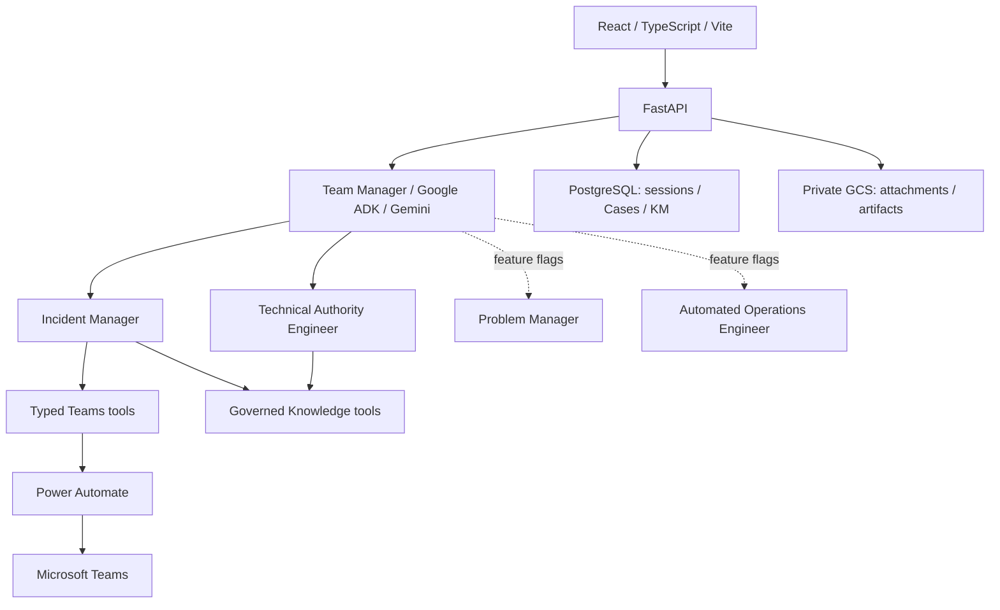

# SLOPANOC

**Evidence-grounded, human-governed AI assistance for telecom network operations.**

**Repository:** [drak0niii/SLOPANOC — `DEMO-NEW`](https://github.com/drak0niii/SLOPANOC/tree/DEMO-NEW)
**Status:** Working development system; **not production-ready**.

SLOPANOC combines Microsoft Teams conversations, governed operational knowledge, case context, and visual evidence to support incident collaboration and step-by-step troubleshooting. It uses a React frontend, a FastAPI backend, and Gemini through Google ADK on Vertex AI. Agents reason and recommend; trusted backend services enforce operational boundaries.

## What works in `DEMO-NEW`

| Area | Implemented scope |
|---|---|
| Conversation | Persistent chats, history/rewind, SSE streaming and cancellation, image attachments. |
| Incident collaboration | Teams chat discovery, message/media retrieval, summaries, disambiguation, evidence provenance, and approval-gated Teams writes via Power Automate. |
| Knowledge | Generic governed KM/RAG with retrieval, applicability, version/lifecycle checks, evidence selection, and compound-document ingestion. |
| Troubleshooting | Technical Authority Engineer (TAE): advisory diagnosis, governed evidence, one next diagnostic check, and structured troubleshooting/check state. |
| Context and storage | Session and Case context in PostgreSQL; private GCS storage for attachments/knowledge artifacts where configured. |

**Agent availability is configuration-dependent:**

| Agent | Role | Default |
|---|---|---|
| Team Manager | Sole user-facing orchestrator | Active |
| Incident Manager | Teams collaboration and governed-knowledge specialist | Active |
| Technical Authority Engineer | Advisory fault evaluation; historical name: Troubleshooting Manager | Enabled |
| Problem Manager | RCA and post-incident *drafts*; no Outlook/SharePoint tools wired in its agent definition | Disabled |
| Automated Operations Engineer | Level-1 briefing/digest *generation*; no scheduler/tool integrations wired in its agent definition | Disabled |

Specialists are invoked through in-process ADK agent tools; they do not own the user conversation. Defaults come from `backend/config/settings.py`; actual tool registration is in `backend/agents/team_manager/agent.py`. **An agent being defined is not proof that its capability is enabled, integrated, or validated end to end.**

## Runtime architecture


```mermaid
flowchart TD
    UI[React / TypeScript / Vite] --> API[FastAPI]
    API --> TM[Team Manager / Google ADK / Gemini]
    TM --> IM[Incident Manager]
    TM --> TAE[Technical Authority Engineer]
    TM -. feature flags .-> PM[Problem Manager]
    TM -. feature flags .-> AOE[Automated Operations Engineer]
    IM --> T[Typed Teams tools]
    T --> PA[Power Automate] --> MS[Microsoft Teams]
    IM --> KM[Governed Knowledge tools]
    TAE --> KM
    API --> DB[PostgreSQL: sessions / Cases / KM]
    API --> GCS[Private GCS: attachments / artifacts]
```

Microsoft Teams currently uses **Power Automate, not direct Microsoft Graph**. The knowledge repository is a reusable service, not a separate agent. MOPs, SOPs, RCAs, and KB articles are governed documents—not skills or instructions that automatically authorize execution.

**Safety contract:** distinguish observed facts from hypotheses; verify procedure applicability, node identity, command parameters, and prerequisites; recommend at most one justified diagnostic check per turn. Never infer a reset from an alarm alone. Teams writes require a separately recorded approval and deterministic re-authorization of the exact destination/payload. Model output cannot approve actions, establish provenance, or elevate candidate knowledge to approved. A troubleshooting recommendation is **not** an executed action.

## Run locally

### Prerequisites

- Git, Node.js 20+, npm, Python 3.11+, Google Cloud CLI (`gcloud`), and **Cloud SQL Auth Proxy v2**.
- Authorized access to the GCP project, Vertex AI, Cloud SQL database and, for media, the configured private GCS buckets.
- A Power Automate gateway URL (or configured Secret Manager reference) **only for Teams operations**.

### 1. Clone and install

Run from the directory where you want the project:

```bash
git clone --branch DEMO-NEW --single-branch https://github.com/drak0niii/SLOPANOC.git
cd SLOPANOC
npm ci
python -m venv .venv
```

Activate the Python environment and install the backend packages:

```powershell
# Windows PowerShell
.\.venv\Scripts\Activate.ps1
python -m pip install -r requirements-dev.txt
Invoke-WebRequest -Uri "https://storage.googleapis.com/cloud-sql-connectors/cloud-sql-proxy/v2.21.0/cloud-sql-proxy.x64.exe" -OutFile ".\cloud-sql-proxy.exe"
```

```bash
# macOS / Linux (run instead of the PowerShell block)
source .venv/bin/activate
python -m pip install -r requirements-dev.txt
```

`requirements-dev.txt` includes the pinned runtime requirements and test dependencies.

### 2. Authenticate (once per local identity)

```bash
gcloud auth login
gcloud auth application-default login
```

The CLI login and Application Default Credentials serve different consumers. Ensure the account used as your PostgreSQL IAM username is authorized for this database.

### 3. Start Cloud SQL Auth Proxy — terminal A

**Windows PowerShell** (from the directory containing `cloud-sql-proxy.exe`):

```powershell
.\cloud-sql-proxy.exe --address 127.0.0.1 --port 5433 --auto-iam-authn pr-msn-dev-gl-slopai-01:europe-west4:sloc-anoc-sandbox01
```

**macOS / Linux** (assuming `cloud-sql-proxy` is on your `PATH`):

```bash
cloud-sql-proxy --address 127.0.0.1 --port 5433 --auto-iam-authn pr-msn-dev-gl-slopai-01:europe-west4:sloc-anoc-sandbox01
```

Keep this terminal running. Port `5433` is the local proxy port used in the examples; it is not the Cloud SQL instance port.

### 4. Configure and start FastAPI — terminal B

From the repository root, with the virtual environment activated, set **both database URLs explicitly**. These examples use the configured `gcloud` account as the local human IAM database username; substitute the correct IAM database username if yours differs.

**Windows PowerShell:**

```powershell
$iamUser = (gcloud config get-value account 2>$null).Trim()
$iamEncoded = $iamUser -replace '@', '%40'
$env:GOOGLE_GENAI_USE_VERTEXAI = 'true'
$env:GOOGLE_CLOUD_PROJECT = 'pr-msn-dev-gl-slopai-01'
$env:GOOGLE_CLOUD_LOCATION = 'europe-west1'
$env:SLOPANOC_MODEL = 'gemini-2.5-flash'
$env:SLOPANOC_SESSION_BACKEND = 'database'
$env:SLOPANOC_DATABASE_URL = "postgresql+asyncpg://$iamEncoded@127.0.0.1:5433/slopanoc"
$env:SLOPANOC_KNOWLEDGE_DATABASE_URL = $env:SLOPANOC_DATABASE_URL
python -m uvicorn backend.api.app:app --host 127.0.0.1 --port 8000 --reload
```

**macOS / Linux:**

```bash
iam_user="$(gcloud config get-value account)"
iam_encoded="$(printf '%s' "$iam_user" | sed 's/@/%40/g')"
export GOOGLE_GENAI_USE_VERTEXAI=true
export GOOGLE_CLOUD_PROJECT=pr-msn-dev-gl-slopai-01
export GOOGLE_CLOUD_LOCATION=europe-west1
export SLOPANOC_MODEL=gemini-2.5-flash
export SLOPANOC_SESSION_BACKEND=database
export SLOPANOC_DATABASE_URL="postgresql+asyncpg://${iam_encoded}@127.0.0.1:5433/slopanoc"
export SLOPANOC_KNOWLEDGE_DATABASE_URL="$SLOPANOC_DATABASE_URL"
python -m uvicorn backend.api.app:app --host 127.0.0.1 --port 8000 --reload
```

**Important:** normal FastAPI startup requires `SLOPANOC_SESSION_BACKEND=database` and PostgreSQL-dialect URLs for **both** session/Case and KM persistence (or their respective Secret Manager configuration). It rejects SQLite/in-memory at application startup. Isolated automated tests may substitute disposable storage through test fixtures. The startup validator checks the URL dialect; successful connectivity and permissions still need to be established separately.

Optional capabilities require additional backend environment configuration: `SLOPANOC_POWER_AUTOMATE_GATEWAY_URL` or `SLOPANOC_POWER_AUTOMATE_SECRET_RESOURCE` for Teams; `SLOPANOC_CHAT_ATTACHMENTS_BUCKET` for durable user images; and `SLOPANOC_KNOWLEDGE_ARTIFACTS_BUCKET` for knowledge artifacts. See `backend/config/settings.py` for all supported options and feature flags. **Never commit or log secrets, signed flow URLs, or database credentials.** `.env.example` is for frontend Vite overrides only; every `VITE_*` value is exposed to browsers.

### 5. Start the frontend — terminal C

```bash
npm run dev
```

Open the local URL printed by Vite. The development server proxies `/api` to `http://127.0.0.1:8000`. The real chat is backend-driven; some original shell, Projects, Settings, and other UI surfaces still use local/mock state.

## Verify changes

From the repository root:

```bash
python -m pytest backend/tests -q
npm test
npm run build
```

Run focused tests for the affected code first; use the full suite and build before claiming regression coverage. Automated tests do **not** establish live Vertex AI, Cloud SQL, Teams, or GCS validation. The above commands are validation instructions, not claims that they have been executed for this README rewrite.

## Limitations and documentation

This branch is a development system, **not an approved production deployment**. Do not assume complete enterprise authentication/authorization, per-user delegated Microsoft Graph access, autonomous network remediation, fully integrated ITSM/alarms/topology/KPI/change systems, multi-instance coordination, production observability, or completed security hardening. Confirm each capability in implementation, feature flags, and runtime tests before advertising it.

| Document | Use it for |
|---|---|
| [`CLAUDE.md`](CLAUDE.md) | Concise engineering instructions for Claude Code. |
| [`docs/AGENT_CONTRACT.md`](docs/AGENT_CONTRACT.md) | Agent behavior and delegation contracts; cross-check older topology/status prose against code. |
| [`docs/KNOWLEDGE_CONTRACT.md`](docs/KNOWLEDGE_CONTRACT.md) | Knowledge lifecycle, retrieval, applicability, and provenance. |
| [`docs/TEAMS_TOOL_CONTRACT.md`](docs/TEAMS_TOOL_CONTRACT.md) | Power Automate/Teams tool semantics and approval. |
| [`docs/TROUBLESHOOTING_STRATEGY.md`](docs/TROUBLESHOOTING_STRATEGY.md) | Iterative diagnostic product principles. |
| [`docs/MASTER_ROADMAP.md`](docs/MASTER_ROADMAP.md) and [`docs/DEFECT_REGISTER.md`](docs/DEFECT_REGISTER.md) | Milestone history and defects; verify current status against `DEMO-NEW` code. |

**Documentation rule:** current source, configuration, and tests establish what exists. A planned capability, historical milestone, or green mock test does not establish production readiness or live operational correctness.
