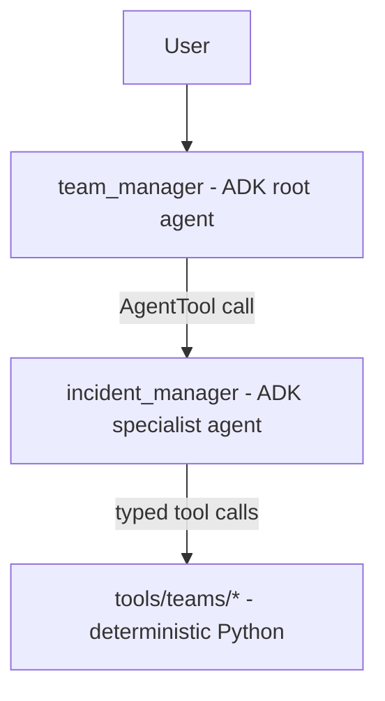
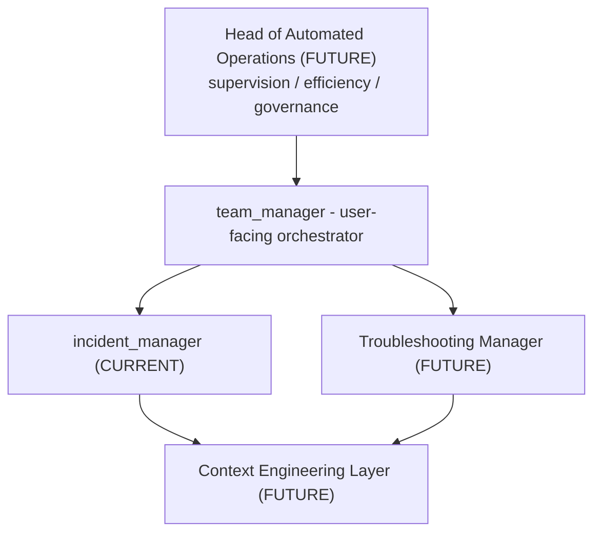

# Agent Contract — Team Manager & Incident Manager

Status: **Implemented.** This document describes the current, running
architecture of SLOPANOC's two agents — `team_manager` (orchestrator,
Python module `backend/agents/team_manager/`) and `incident_manager` (Teams
specialist, `backend/agents/incident_manager/`) — as they actually exist in
this repository today. It supersedes the earlier design-only version of this
document; where the two disagree, the implementation described here is
authoritative. Historical design rationale that shaped the implementation
(e.g. why `AgentTool` was chosen over native `sub_agents` transfer) is kept
where it remains accurate.

Tool contracts referenced below (`teams_list_chats`, etc.) are defined in
[`docs/TEAMS_TOOL_CONTRACT.md`](TEAMS_TOOL_CONTRACT.md).

This document intentionally does not narrate the implementation history
(internal milestone names, specific past bugs, latency experiments) — that
detail lives in git history and the test suite. It describes the
architecture those passes produced.

---

## 1. Agent roster

| Agent | Role | Talks to user? | Talks to tools? | Owns approval? |
|---|---|---|---|---|
| `team_manager` | Orchestrator, sole user-facing author | Yes | No — never calls a Teams tool directly | No — presents proposals and outcomes; a deterministic policy gate owns actual authorization |
| `incident_manager` | Teams specialist | No — never produces text the user sees directly | Yes — sole caller of the Teams tools (`docs/TEAMS_TOOL_CONTRACT.md`) | No — prepares/executes writes only when told to, and execution is independently re-authorized by the tool implementation itself |

No other agent exists today. A future specialist (e.g. a Knowledge agent —
see the README's roadmap) would attach to `team_manager` the same way
`incident_manager` does.

---

## 2. Topology (as implemented)



- `team_manager` is the ADK root agent and the sole user-facing author
  (`backend/agents/team_manager/agent.py`).
- `incident_manager` is invoked via **`AgentTool`**
  (`incident_manager_tool = AgentTool(agent=_fast_path_incident_manager)`,
  wired into `team_manager.tools`) — not native `sub_agents` transfer.
- Both run in the same ADK application/runtime, in-process. Invoking
  `incident_manager` is a same-turn call/return, not a network call and not
  a conversational hand-off.
- There is no separate service, process, or network hop for
  `incident_manager` — `AgentTool` runs it through a nested, in-process ADK
  `Runner`/session inside the same backend process.

### Why `AgentTool`, not native `sub_agents` delegation

Native ADK `sub_agents` transfer (`transfer_to_agent`) would hand the active,
end-user-facing turn to the sub-agent — its own reply becomes the visible
response. That cannot guarantee the invariant that `incident_manager` never
talks to the user directly, or that `team_manager` alone authors the
user-facing text. `AgentTool` — "allows an agent to be called as a tool ...
the agent's output is returned as the tool's result" — keeps `team_manager`
in control of the turn instead, which is why it is used.

### Future agent topology (target architecture — not implemented)



This is target architecture only — nothing in this section exists in the
codebase today. It is documented here so Phase 5.1A and later phases are
designed toward a consistent destination, not so it can be mistaken for a
current capability.

- **`team_manager` remains the only user-facing agent today**, and remains
  so until a "Head of Automated Operations" agent is actually designed and
  built — not merely documented. Nothing about this future diagram changes
  today's runtime path (§2): the user still talks to `team_manager`
  directly.
- **Troubleshooting Manager** is a planned second specialist, alongside
  `incident_manager`, for future contextual-troubleshooting/next-step
  reasoning work (see the README's roadmap, Phase 7). It would attach to
  `team_manager` via `AgentTool`, the same way `incident_manager` does
  (§12) — never built as part of Phase 5.1A.
- **Head of Automated Operations** is a planned future supervisory agent
  (oversight/efficiency/governance across specialists), not a mandatory hop
  in any current or near-term turn. It is not designed in detail here and
  is out of scope for Phase 5.1A.
- **Context Engineering Layer** is a future conceptual abstraction — the
  layer that would assemble the bounded, validated context (operational,
  knowledge, case) a specialist needs — not a concrete implemented runtime
  service today. See §12 for how Phase 5.1's Generic Knowledge Management
  Layer relates to it.

**Normative reference:** any future Troubleshooting Manager implementation
must comply with `docs/TROUBLESHOOTING_STRATEGY.md` (a NON-NEGOTIABLE
product principle, not optional guidance), in particular its iterative
diagnostic loop, troubleshooting state, continuous context re-evaluation,
next-best-diagnostic-action behavior, grounded-operational-commands
principle, one-step-at-a-time UX, evidence interpreted before proceeding,
deterministic approval for state-changing actions, and provenance
preservation. Concretely, the future Troubleshooting Manager is not a plain
`question → retrieve documents → generate answer` agent — its eventual
conceptual behavior is:

```text
Current troubleshooting state
        ↓
new evidence
        ↓
interpretation
        ↓
hypothesis update
        ↓
context re-evaluation
        ↓
next-best diagnostic action
        ↓
request specific evidence
        ↓
repeat
```

None of this loop is designed or implemented here — this is a forward
reference for whoever eventually builds the Troubleshooting Manager, not a
runtime this pass introduces.

---

## 3. Agent vs. tool

```text
Agent = reasoning boundary
Tool  = deterministic capability
```

An agent exists only where genuine reasoning or natural-language
understanding is required. Everything else — `teams_list_chats`,
`teams_get_messages`, `teams_get_members`, proposing/executing a write,
evidence validation, approval enforcement, destination binding — is
deterministic Python, not a separate agent. No future addition to this
architecture should create a new named agent for a capability that can be
expressed as a tool call or as reasoning already inside an existing agent's
responsibility.

---

## 4. team_manager

### Responsible for

- Owning the user-facing conversation and its `Message` text — the only
  agent that ever produces the assistant-visible reply.
- Resolving the **conversation target** for any request that could plausibly
  be about "a conversation": `current_thread` (this SLOPANOC conversation
  itself), `selected_external_conversation` (the currently-selected Teams
  chat), or `explicit_external_conversation` (a Teams chat named in the
  current message). See `backend/agents/team_manager/conversation_target.py`
  and the prompt's own "CONVERSATION TARGET" section
  (`backend/agents/team_manager/prompts.py`). This resolution is entirely
  the model's own semantic judgment over the actual conversation — there is
  no keyword/regex router anywhere in this path. A `record_conversation_target`
  tool call deterministically validates the closed set of three values and,
  for an external target, confirms a chat is actually selected; it never
  inspects the user's wording itself.
- Deciding whether a request needs `incident_manager` at all, or can be
  answered directly from already-known conversation state (e.g. re-citing
  `last_teams_evidence` for "what messages support that?").
- Delegating all Teams-domain work to `incident_manager` — `team_manager`
  never calls a `teams_*` tool itself.
- Presenting `incident_manager`'s structured result to the user, and
  collecting the user's approve/reject decision on a write proposal
  (conversational ownership only — see §7 for the actual enforcement).

### Must NOT do

- Must not call any `teams_*` tool directly, under any circumstance.
- Must not fabricate or "fill in" Teams content that `incident_manager` did
  not actually return.
- Must not treat its own conversational approval flow as sufficient
  authorization for a write to execute — the deterministic backend re-check
  (§7) is what actually gates execution.
- Must not expose `incident_manager`'s internal reasoning, raw tool
  arguments, tool names, message/chat ids, or any Power Automate
  implementation detail to the user.

---

## 5. incident_manager

### Responsible for

- Teams-domain reasoning: turning a `team_manager` delegation into
  `teams_list_chats`/`teams_get_messages`/`teams_get_members` calls, and
  turning results back into a structured response (§6).
- Discovering/resolving which chat a request refers to when given a name
  rather than an id (`chat_resolution.py`), including presenting an
  interactive selection when more than one plausible chat exists.
- Retrieving messages and extracting decisions, actions, proposals, open
  questions, and risks — grounded only in messages actually retrieved this
  turn, never recalled from an earlier, unrelated call.
- Preparing a Teams write action as a pending proposal, and — once
  `team_manager` signals the user approved it — invoking the write tool.
  `incident_manager` never decides approval itself; it only relays the
  intent, and the tool implementation independently re-authorizes before
  anything reaches Power Automate (§7).

### Must NOT do

- Must not communicate with the user directly. Every output is a structured
  `IncidentManagerResponse` (§6) to `team_manager`, never a `Message` the
  user sees.
- Must not invent Teams content. An empty retrieval is reported as a valid
  "no relevant messages" result, never filled in from general knowledge.
- Must not call Microsoft Graph or any Microsoft 365 API directly — every
  Teams operation goes through the tool contract
  (`docs/TEAMS_TOOL_CONTRACT.md`), which goes through Power Automate.
- Must not retain state across turns beyond what a single delegation
  carries — `incident_manager` is stateless request-in/response-out;
  conversational state belongs to `team_manager`.

---

## 6. Delegation contract (as implemented)

`team_manager` → `incident_manager` is an `AgentTool` call using ADK's
`input_schema`/`output_schema` mechanism (`backend/agents/incident_manager/schemas.py`)
— not free-form text.

### Request: `IncidentManagerRequest`

```text
chat_topic: str                     # the chat name/title as the user stated it
question: Optional[str]              # a complete, self-contained question;
                                       # team_manager resolves pronouns/ellipsis
                                       # itself before setting this — incident_manager
                                       # is stateless and never sees prior turns
requested_time_range: Optional[str]  # natural-language time scope, verbatim,
                                       # if the user gave one
```

### Response: `IncidentManagerResponse`

```text
outcome: "ok" | "no_result" | "ambiguous" | "not_found" | "error"
       | "proposed" | "executed" | "selection_needed"

chat_id / chat_title: Optional[str]
summary: Optional[str]
evidence: TeamsEvidence[]            # message_id/author/sent_at only — never
                                       # message bodies
decisions / actions / proposals / open_questions / risks: typed item lists
write_action: Optional[TeamsWriteActionResult]   # for "proposed"/"executed"
candidate_titles: list[str]           # for "ambiguous"
detail: Optional[str]                 # safe, user-appropriate explanation
```

`selection_needed` is an interaction-capability extension beyond
`ambiguous`: candidates are presented to the user as an interactive
SelectionCard (§8) rather than as a list `team_manager` must recite — see
`docs/TEAMS_TOOL_CONTRACT.md` §3 and `backend/selection/`.

**Invariant:** every fact `incident_manager` returns traces to a tool call it
actually made this turn (`evidence`/`decisions`/etc. are never populated from
assumed content). Evidence beyond what was actually retrieved is stripped
before the response is finalized — see §9.

---

## 7. Write-action approval (enforced outside the model)

Approval is a **deterministic backend control**, not a prompt instruction.
Sequence (`backend/approval/`, `backend/tools/teams/execute_write.py`):

```text
1. team_manager delegates a "propose" intent to incident_manager with the
   drafted action fields.
2. incident_manager validates the draft and calls the Teams propose tool,
   which normalizes the payload and creates a pending ActionProposal
   (backend/approval/service.py) — nothing is sent to Teams yet.
3. team_manager presents the proposal to the user via an ApprovalCard,
   using the exact fields the proposal carries — never paraphrased.
4. The user approves or rejects via a trusted API endpoint
   (POST /api/sessions/{id}/approve|reject) — this NEVER routes through
   team_manager, incident_manager, or any model call.
5. If the user later asks to proceed, team_manager delegates an "execute"
   intent, restating the same action.
6. incident_manager calls teams_create_chat / teams_send_message.
7. The TOOL IMPLEMENTATION ITSELF — not incident_manager's reasoning, not
   team_manager's prompt — calls backend/approval/policy_gate.py before
   the Power Automate client:
     - looks up the ActionProposal for the current payload
     - confirms its status is "approved" (not pending, rejected, expired,
       or already consumed)
     - re-derives the payload hash of the exact call about to be made and
       confirms it matches the approved hash
     - only on a full pass does the call reach
       gateway/power_automate_client.py; any failure returns a safe denial
       and Power Automate is never called
     - on a successful Power Automate call, the proposal is marked
       consumed (replay/idempotency protection) — never before, and never
       merely because the policy check passed.
8. incident_manager returns the execution result (or the denial);
   team_manager presents it to the user.
```

**Hard rule:** no agent can cause a write to execute by "believing" it was
approved. The only way `teams_create_chat`/`teams_send_message` reaches
Power Automate is through the policy gate in step 7. If any detail of the
action changes after it was proposed, that is treated as a new action
requiring a new proposal and a new approval — never a silent substitution.

Read operations require no confirmation and are called freely by
`incident_manager`, subject to the same authorization/availability checks
as any tool call.

---

## 8. Selection vs. approval

These are separate mechanisms with separate state
(`backend/selection/` vs. `backend/approval/`):

| | Selection | Approval |
|---|---|---|
| Resolves | Which Teams chat a request refers to | Whether a specific write action may execute |
| Triggered by | An ambiguous chat name match | A prepared write proposal |
| UI | SelectionCard | ApprovalCard |
| Security-sensitive? | No — picking a chat authorizes nothing | Yes — the sole gate before a real Teams write |

Resolving a selection never authorizes a write, and approving a write never
resolves a chat reference. A previously-selected chat, if any, remains
available across an unrelated selection or approval flow.

---

## 9. Provenance / grounding

- The set of Teams message IDs actually retrieved for a turn is the
  authoritative evidence set for that turn.
- `incident_manager`'s own `after_agent_callback`
  (`backend/agents/incident_manager/evidence.py`) re-validates every
  `evidence[].message_id` in its final structured response against that
  set and strips anything that does not match — a defense against a
  fabricated or stale message id reaching the user, independent of what
  the model claims.
- The model never authors the displayed "Supporting Evidence" text —
  original retrieved message content is used for what the UI shows.
- `SourceReference` (`backend/api/source_reference.py`) is built
  deterministically by the backend from the same validated evidence, not
  by the model, and is attached to the response as a distinct,
  message-owned UI element (never inlined into the model's own answer
  text as a citation footer).
- A `SourceReference` is scoped to the run/turn that produced it and is
  discarded correctly if that branch of the conversation is later edited
  away (rewind).

---

## 10. Trusted specialist result (read continuation / direct-unique paths)

Two optimized read paths converge on the same trust/presentation
architecture once a destination is authoritative:

**Post-selection continuation** (`backend/agents/team_manager/read_continuation_execution.py`):

```text
user picks from SelectionCard
  → authoritative resolved chat (deterministic, not re-asked of the model)
  → deterministic teams_get_messages
  → synthesis-only Incident Manager call
  → TrustedSpecialistResult envelope (validated, run-scoped)
  → presentation_team_manager (tools=[])
  → SourceReference
```

**Direct-unique fast path** (`backend/agents/team_manager/direct_read_fast_path.py`):

```text
team_manager delegates to Incident Manager for discovery
  → teams_list_chats resolves to exactly one chat
  → deterministic teams_get_messages
  → synthesis-only Incident Manager call
  → TrustedSpecialistResult envelope (validated, run-scoped)
  → presentation_team_manager (tools=[])
  → SourceReference
```

Once a destination is authoritative (either path), the model cannot
substitute a different chat id — retrieval is driven by the deterministically
resolved chat, not by whatever the model's next turn might claim.

`presentation_team_manager` is `team_manager` with `tools=[]` and no
tool-related callbacks (`backend/agents/team_manager/agent.py`) — the same
agent identity/instruction-selection mechanism, structurally unable to
delegate further, used only to phrase an already-validated result. If the
trusted-result envelope fails validation, the turn fails closed with a
generic, safe response — it never falls back to a normal, tool-enabled
`team_manager` turn.

---

## 11. Secrets and execution boundary

- Power Automate is the only path to Microsoft 365 used by this system.
  Neither agent calls Microsoft Graph or any other Microsoft 365 API
  directly.
- Model calls (either agent) never receive a Power Automate URL, key, or
  any other connector credential as part of their prompt, instruction, or
  tool description. The gateway URL is resolved from environment/Secret
  Manager by deterministic backend code
  (`backend/gateway/power_automate_client.py`,
  `backend/config/settings.py`) at call time.
- Power Automate URLs/secrets are never exposed to the frontend, a tool
  result, an agent-to-agent message, or any log line reachable outside the
  backend.

---

## 12. Future agent expansion principles

- A new specialist attaches to `team_manager` via `AgentTool`, the same way
  `incident_manager` does — never via native `sub_agents` transfer, for the
  same reason given in §2.
- A new specialist must not talk to the user directly, must not retain
  cross-turn state beyond what it's handed, and must not invent domain
  content it didn't actually retrieve — the same invariants §4/§5 already
  establish for `incident_manager`.
- A new specialist's write operations (if any) must go through an
  equivalent deterministic approval/policy-gate boundary — approval
  enforcement is never something a new agent's prompt is trusted for on
  its own.
- See the README's roadmap for the currently planned next specialist
  (Phase 5.1's Generic Knowledge Management Layer) — not yet designed in
  this document; 5.1A will cover that separately.
- The Generic Knowledge Management Layer (Phase 5.1) is not itself a new
  agent — it is a **Knowledge Context provider** within the future Context
  Engineering architecture (see §2's "Future agent topology"), consumed by
  specialists through generic contracts. It must remain independent of
  `incident_manager` and of any future specialist (e.g. the future
  Troubleshooting Manager) — it must not become one-off MOP/SOP reading
  logic owned by a single agent.
- Troubleshooting Manager and Head of Automated Operations (§2's future
  topology) are not part of Phase 5.1A and must not be introduced while
  building it — 5.1A is scoped to Knowledge Context's foundation
  (architecture + contracts) only.
