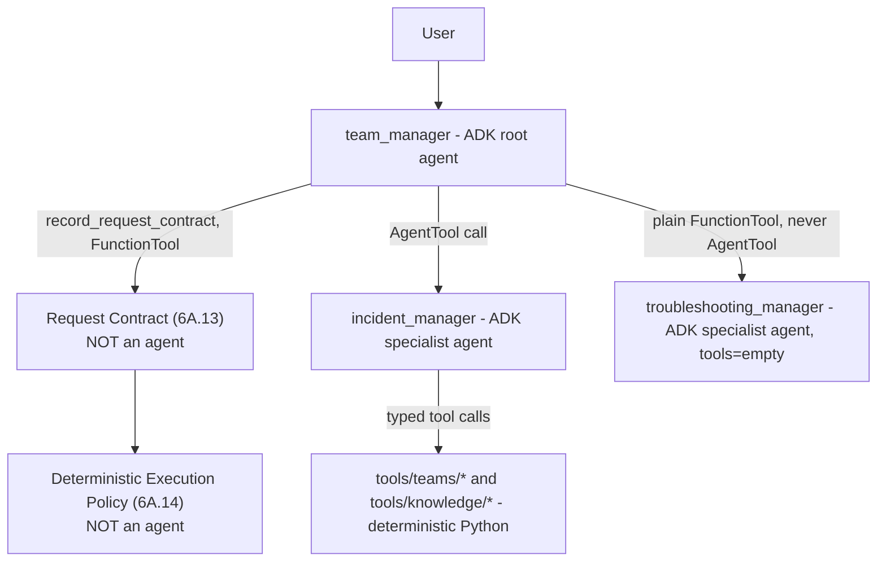
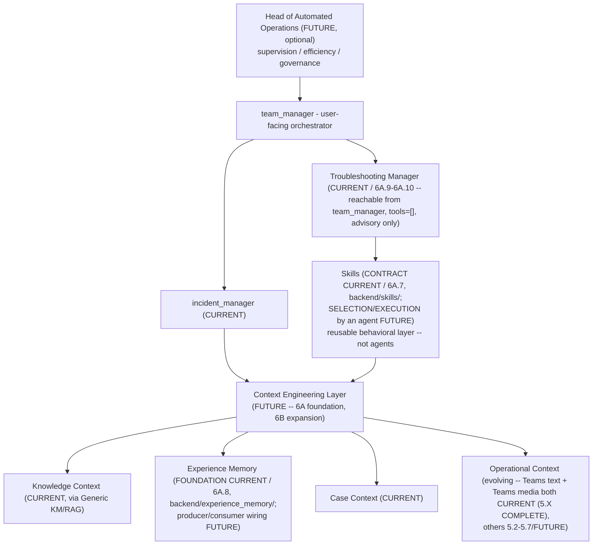

# Agent Contract — Team Manager, Incident Manager & Troubleshooting Manager

Status: **Implemented.** This document describes the current, running
architecture of SLOPANOC's three agents — `team_manager` (orchestrator,
Python module `backend/agents/team_manager/`), `incident_manager` (Teams
and governed-Knowledge specialist, `backend/agents/incident_manager/`),
and `troubleshooting_manager` (the Phase 6A / 6A.9–6A.10 troubleshooting
specialist, `backend/agents/troubleshooting_manager/`, reachable from a
live turn but not yet the target of automatic specialist-intent routing
— see §1/§6a) — as they actually exist in this repository today. It
supersedes the earlier design-only version of this document; where the
two disagree, the implementation described here is authoritative.
Historical design rationale that shaped the implementation (e.g. why
`AgentTool` was chosen over native `sub_agents` transfer for `incident_
manager`, and why a plain `FunctionTool` — never `AgentTool` — was chosen
for `troubleshooting_manager`) is kept where it remains accurate.

Tool contracts referenced below (`teams_list_chats`, etc.) are defined in
[`docs/TEAMS_TOOL_CONTRACT.md`](TEAMS_TOOL_CONTRACT.md).

This document intentionally does not narrate the implementation history
(internal milestone names, specific past bugs, latency experiments) — that
detail lives in git history and the test suite. It describes the
architecture those passes produced.

---

## 1. Agent roster

| Agent | Role | Talks to user? | Talks to tools? | Owns approval? |
|---|---|---|---|---|
| `team_manager` | Orchestrator, sole user-facing author | Yes | No — never calls a Teams tool directly | No — presents proposals and outcomes; a deterministic policy gate owns actual authorization |
| `incident_manager` | Teams specialist | No — never produces text the user sees directly | Yes — sole caller of the Teams tools (`docs/TEAMS_TOOL_CONTRACT.md`) | No — prepares/executes writes only when told to, and execution is independently re-authorized by the tool implementation itself |
| `troubleshooting_manager` | Troubleshooting specialist (6A.9/6A.10) | No — never produces text the user sees directly | No — `tools=[]`, structurally incapable of any Tool call | No — advisory-only; no write path exists at all |

A real second specialist, **Troubleshooting Manager** (`backend/agents/
troubleshooting_manager/`, Phase 6A / P11-M09 / 6A.9 — COMPLETE, see
`docs/INTELLIGENCE_ARCHITECTURE.md` §19), is now REACHABLE from a live
user turn (Phase 6A / P11-M10 / 6A.10 — COMPLETE, see `docs/
INTELLIGENCE_ARCHITECTURE.md` §21): `team_manager.tools` now includes a
`troubleshooting_manager` capability, wired as a plain ADK `FunctionTool`
(`backend/agents/team_manager/troubleshooting_tool.py`) that calls the
canonical 6A.9 `run_troubleshooting_assessment` — deliberately NEVER
`AgentTool(agent=troubleshooting_manager)` (see §12's own "Why FunctionTool,
not AgentTool" rationale). `team_manager` decides, via its own ordinary
model reasoning (no keyword/regex router), whether a request needs
`incident_manager`, `troubleshooting_manager`, both, or neither; neither
specialist ever calls the other. There is no Knowledge
Agent, planned or built — Generic Governed Knowledge is a Knowledge
Context provider/tool surface (§3a, §12), never a specialist of its
own.

---

## 2. Topology (as implemented)


```mermaid
flowchart TD
    User --> TM[team_manager - ADK root agent]
    TM -->|record_request_contract, FunctionTool| RC["Request Contract (6A.13)<br/>NOT an agent"]
    RC --> EP["Deterministic Execution Policy (6A.14)<br/>NOT an agent"]
    TM -->|AgentTool call| IM[incident_manager - ADK specialist agent]
    TM -->|plain FunctionTool, never AgentTool| TSM[troubleshooting_manager - ADK specialist agent, tools=empty]
    IM -->|typed tool calls| TOOLS[tools/teams/* and tools/knowledge/* - deterministic Python]
```

- `team_manager` is the ADK root agent and the sole user-facing author
  (`backend/agents/team_manager/agent.py`).
- `incident_manager` is invoked via **`AgentTool`**
  (`incident_manager_tool = AgentTool(agent=_fast_path_incident_manager)`,
  wired into `team_manager.tools`) — not native `sub_agents` transfer.
- `troubleshooting_manager` is invoked via a **plain `FunctionTool`**
  (`backend/agents/team_manager/troubleshooting_tool.py`), deliberately
  NEVER `AgentTool` — see §12's own "Why FunctionTool, not AgentTool"
  rationale. `team_manager`'s own model reasoning decides, per turn,
  whether to call `incident_manager`, `troubleshooting_manager`, both, or
  neither — this is NOT yet automatic intent-based routing (see §6a and
  the planned, not-yet-started 6A.17 "Specialist Routing Alignment").
- Both `incident_manager` and `troubleshooting_manager` run in the same
  ADK application/runtime, in-process. Invoking either is a same-turn
  call/return, not a network call and not a conversational hand-off.
- There is no separate service, process, or network hop for either
  specialist — both run through a nested, in-process ADK `Runner`/session
  inside the same backend process.

### Why `AgentTool`, not native `sub_agents` delegation

Native ADK `sub_agents` transfer (`transfer_to_agent`) would hand the active,
end-user-facing turn to the sub-agent — its own reply becomes the visible
response. That cannot guarantee the invariant that `incident_manager` never
talks to the user directly, or that `team_manager` alone authors the
user-facing text. `AgentTool` — "allows an agent to be called as a tool ...
the agent's output is returned as the tool's result" — keeps `team_manager`
in control of the turn instead, which is why it is used.

### Target agent topology (mixed CURRENT/FUTURE — see inline labels; NOT all "not implemented" despite this section's historical heading)


```mermaid
flowchart TD
    HOO["Head of Automated Operations (FUTURE, optional)<br/>supervision / efficiency / governance"] --> TM[team_manager - user-facing orchestrator]
    TM --> IM["incident_manager (CURRENT)"]
    TM --> TSM["Troubleshooting Manager (CURRENT / 6A.9-6A.10 -- reachable from team_manager, tools=[], advisory only)"]
    TSM --> SK["Skills (CONTRACT CURRENT / 6A.7, backend/skills/;<br/>SELECTION/EXECUTION by an agent FUTURE)<br/>reusable behavioral layer -- not agents"]
    IM --> CEL["Context Engineering Layer<br/>(FUTURE -- 6A foundation, 6B expansion)"]
    SK --> CEL
    CEL --> KC["Knowledge Context (CURRENT, via Generic KM/RAG)"]
    CEL --> EM["Experience Memory (FOUNDATION CURRENT / 6A.8, backend/experience_memory/;<br/>producer/consumer wiring FUTURE)"]
    CEL --> CC["Case Context (CURRENT)"]
    CEL --> OC["Operational Context (evolving -- Teams text + Teams media both CURRENT (5.X COMPLETE),<br/>others 5.2-5.7/FUTURE)"]
```

A `Skill` (§3a) is not a node in the AGENT topology above in the sense
`incident_manager`/`Troubleshooting Manager` are — it is a reusable unit
of behavior `Troubleshooting Manager` deterministically resolves (never
selects via its own model reasoning — see §12), never a separate
reasoning boundary/agent of its own. It is drawn here only to show where
it would sit conceptually relative to Context Engineering, not to imply
it is itself invoked like an `AgentTool`.

Most of this diagram remains target architecture only — the assembled
Context Engineering Layer's live wiring (real TELCO Context/hybrid-
retrieval Evidence feeding a live turn), Experience Memory producer
wiring, and Head of Automated Operations do not exist in the codebase
today. **`team_manager` reaching `Troubleshooting Manager` is now
CURRENT** (6A.10, `docs/INTELLIGENCE_ARCHITECTURE.md` §21) — via a plain
FunctionTool wrapper (`troubleshooting_tool.py`) calling the canonical
6A.9 `run_troubleshooting_assessment`, itself consuming an honestly
MINIMAL live `ContextPackage` (Case Context reused from the existing
Team Manager prompt provider; TELCO Context and hybrid-retrieval
Evidence both intentionally empty, since neither has a live producer
wired yet) and a deterministically (never agent-)resolved 6A.7 Skill.
Three of this diagram's other prerequisites are COMPLETE as standalone
contracts: Context Engineering's own `ContextPackage`/`EvidencePackage`
assembly (6A.6, `backend/context_engineering/`), the Skill CONTRACT
itself (6A.7, `backend/skills/` — typed `SkillDefinition`, registry,
`ContextPackage`-aware readiness, typed-only applicability), and the
Experience Memory foundation (6A.8, `backend/experience_memory/`) — no
agent SELECTS among multiple Skills (today's registry has exactly one
production Skill, resolved deterministically), and Experience Memory
still has zero production WRITERS. It is documented here so
Phase 6A and later phases are designed toward a consistent destination,
not so it can be mistaken for a current capability. Execution order
(locked, see `docs/BUILD_SEQUENCE.md` §2a): A5 (COMPLETE) → 5.X
(COMPLETE / FROZEN, canonical P10) → Phase 6A (COMPLETE / FROZEN —
6A.0 through 6A.11 all COMPLETE; bounded POST-6A corrective/
foundational work, 6A.12–6A.14, follows without reopening the freeze
— see CLAUDE.md's own 6A.11 closure section) — 6A.0
architecture/contract freeze COMPLETE, see
`docs/INTELLIGENCE_ARCHITECTURE.md`; 6A.1 GCP physical-architecture
decision record COMPLETE, see `docs/GCP_INTELLIGENCE_RUNTIME.md`; 6A.2
TELCO Context & Applicability Model COMPLETE, see `backend/context/`;
6A.3 Multimodal Knowledge Ingestion & Provenance COMPLETE, see
`docs/KNOWLEDGE_CONTRACT.md` §24; 6A.4 Deterministic TELCO Applicability
& Knowledge Narrowing COMPLETE, see `docs/KNOWLEDGE_CONTRACT.md` §26;
6A.5 Hybrid Knowledge Retrieval & Evidence Selection COMPLETE — see
`docs/KNOWLEDGE_CONTRACT.md` §27, real pgvector similarity search
validated live after the earlier-confirmed Cloud SQL privilege denial
was resolved externally, never worked around; 6A.6 Context Engineering
& Evidence Package COMPLETE — see `docs/KNOWLEDGE_CONTRACT.md` §28, a
deterministic, in-process `backend/context_engineering/` capability,
never an agent, never an LLM call, never wired into Team Manager or
Incident Manager; 6A.7 Skills Framework COMPLETE — see `docs/KNOWLEDGE_
CONTRACT.md` §29, a typed, declarative `backend/skills/` contract, never
an agent, never an LLM call, never selected/executed by anything; 6A.8
Experience Memory Foundation COMPLETE — see `docs/KNOWLEDGE_CONTRACT.md`
§30, a typed, persisted `backend/experience_memory/` contract (Cloud SQL,
deterministic admission, owner/customer-scoped structured retrieval),
never an agent, never an LLM call, zero production writers wired; 6A.9
Troubleshooting Manager & Intelligence Assembly COMPLETE — see `docs/
INTELLIGENCE_ARCHITECTURE.md` §19, a real, second ADK specialist
(`backend/agents/troubleshooting_manager/`, `tools=[]`) plus a
deterministic `backend/troubleshooting_intelligence/` assembly layer;
6A.10 Dual-Specialist Orchestration COMPLETE — see `docs/INTELLIGENCE_
ARCHITECTURE.md` §21, `team_manager.tools` now includes `troubleshooting_
manager` (a plain FunctionTool, `backend/agents/team_manager/
troubleshooting_tool.py`, never an `AgentTool`); 6A.11 Integrated TELCO
Validation & Phase 6A Freeze COMPLETE — Phase 6A / P11 is now formally
FROZEN → **POST-6A CANONICAL CLOSURE PLAN, 6A.12 through 6A.28**
(bounded/sequential, does NOT reopen the Phase 6A freeze — the full
milestone table, done-when criteria, and current per-milestone status
are authoritative in `docs/MASTER_ROADMAP.md` §7a; the TARGET end-state
architecture this closure plan builds toward — including where
`troubleshooting_manager` above fits once 6A.17 Specialist Routing
Alignment and 6A.16 Hybrid Evidence Production are both done — is in
`docs/INTELLIGENCE_ARCHITECTURE.md` §20a; only 6A.13 is currently
COMPLETE, do not read 6A.15 through 6A.28 as implemented) → Phase 4H →
5.2–5.7 → Phase 6B → Phase 7.

- **`team_manager` remains the only user-facing agent today**, and remains
  so until a "Head of Automated Operations" agent is actually designed and
  built — not merely documented. Nothing about this future diagram changes
  today's runtime path (§2): the user still talks to `team_manager`
  directly.
- **Troubleshooting Manager** (P11-M09 / 6A.9 — **COMPLETE**,
  `docs/INTELLIGENCE_ARCHITECTURE.md` §19) is a real, second
  specialist, alongside `incident_manager`, for contextual-
  troubleshooting/next-step reasoning — `backend/agents/troubleshooting_
  manager/agent.py`, a real ADK `Agent` with `tools=[]` (structurally
  incapable of any capability execution). **It is now REACHABLE from
  `team_manager` (P11-M10 / 6A.10 — COMPLETE, `docs/INTELLIGENCE_
  ARCHITECTURE.md` §21)**, via a plain `FunctionTool` wrapper
  (`troubleshooting_tool.py`) that calls the canonical 6A.9 `run_
  troubleshooting_assessment` — deliberately NEVER `AgentTool(agent=
  troubleshooting_manager)` (audited: an `AgentTool` would build the
  nested agent's `Content` directly from raw tool arguments, bypassing
  the 6A.9 deterministic preparation pipeline entirely — see §21's own
  as-built record). Maturing into Phase 7's full
  iterative loop remains future work. Phase 6A's own internal
  architecture (this topology's detailed contract — the TELCO Context
  model, the Context Engineering
  platform-layer boundary, the Skill/Experience Memory boundaries as
  they apply inside Phase 6A) is now frozen in
  `docs/INTELLIGENCE_ARCHITECTURE.md` (P11-M00 / 6A.0 — COMPLETE,
  architecture/contract freeze only, zero runtime capability); this
  document's own agent-topology/delegation-contract rules remain
  authoritative and are unchanged by it.
- **Skills** (§3a) belong to Phase 6A — a reusable behavioral
  CONTRACT/registry Troubleshooting Manager selects from, avoiding one
  new agent per fault type. The contract itself is COMPLETE (P11-M07 /
  6A.7, `backend/skills/`); Troubleshooting Manager (P11-M09 / 6A.9,
  COMPLETE) is now the first real Skill CONSUMER — `backend/agents/
  troubleshooting_manager/skill_resolution.py` deterministically
  resolves at most one Skill from `backend/skills/definitions/` (one
  production Skill exists, `telco.troubleshooting_assessment` v1.0.0)
  against an already-assembled `ContextPackage`, never via a model call
  to choose it. No Skill SELECTION mechanism beyond this deterministic
  resolution exists — multi-Skill model-driven selection remains an
  explicitly documented future deferral (`docs/INTELLIGENCE_
  ARCHITECTURE.md` §19).
- **Experience Memory** belongs to Phase 6A as a foundation/boundary
  (`docs/KNOWLEDGE_CONTRACT.md` §22.3–22.4/§30) — never Approved
  Knowledge, never silently promoted to it. The FOUNDATION itself is
  COMPLETE (P11-M08 / 6A.8, `backend/experience_memory/` — typed
  `ExperienceRecord`, Cloud SQL persistence, deterministic `ACCEPT`/
  `REJECT`/`INDETERMINATE` admission, owner/customer-isolated structured
  retrieval); Troubleshooting Manager (P11-M09 / 6A.9, COMPLETE) is now
  the first production CONSUMER (`backend/agents/troubleshooting_
  manager/experience_support.py`, bounded/owner-scoped/Skill-filtered
  `.query` only, never `.record_experience`) — production Experience
  remains genuinely empty (zero writers still exist), so this consumer
  has been proven correct against a real, honest empty result, and
  against real Vertex AI validation using synthetic, non-persisted
  Experience records.
- **Head of Automated Operations** is a planned future supervisory agent
  (oversight/efficiency/governance across specialists), not a mandatory hop
  in any current or near-term turn. It is not designed in detail here, is
  optional future architecture, and is **not automatically part of Phase
  6A's scope** merely because 6A exists — nothing in the current
  documentation requires it to be built alongside 6A.
- **Context Engineering Layer** is a future conceptual abstraction — the
  layer that would assemble the bounded, validated context (operational,
  knowledge, case, experience) a specialist needs. Its FOUNDATION (bounded
  to context sources that exist after A5 and 5.X) is Phase 6A scope; its
  EXPANSION against the full Operational Context surface (5.2–5.7) is
  Phase 6B scope. Not a concrete implemented runtime service today. See
  §12 for how Phase 5.1's Generic Knowledge Management Layer relates to
  it.

**Normative reference:** any future Troubleshooting Manager implementation
must comply with `docs/TROUBLESHOOTING_STRATEGY.md` (a NON-NEGOTIABLE
product principle, not optional guidance), in particular its iterative
diagnostic loop, troubleshooting state, continuous context re-evaluation,
next-best-diagnostic-action behavior, grounded-operational-commands
principle, one-step-at-a-time UX, evidence interpreted before proceeding,
deterministic approval for state-changing actions, and provenance
preservation. Concretely, the future Troubleshooting Manager is not a plain
`question → retrieve documents → generate answer` agent — its eventual
conceptual behavior is:

```text
Current troubleshooting state
        ↓
new evidence
        ↓
interpretation
        ↓
hypothesis update
        ↓
context re-evaluation
        ↓
next-best diagnostic action
        ↓
request specific evidence
        ↓
repeat
```

None of this loop is designed or implemented here — this is a forward
reference for whoever eventually builds the Troubleshooting Manager, not a
runtime this pass introduces.

---

## 3. Agent vs. tool

```text
Agent = reasoning boundary
Tool  = deterministic capability
```

An agent exists only where genuine reasoning or natural-language
understanding is required. Everything else — `teams_list_chats`,
`teams_get_messages`, `teams_get_members`, proposing/executing a write,
evidence validation, approval enforcement, destination binding — is
deterministic Python, not a separate agent. No future addition to this
architecture should create a new named agent for a capability that can be
expressed as a tool call or as reasoning already inside an existing agent's
responsibility.

---

## 3a. Agent vs. Skill vs. Tool/Connector vs. MCP (target model)

Four distinct concepts, not implemented as a hierarchy of agents. `Agent`
and `Tool` have existed in the codebase from the start; `Skill` is now
also CURRENT as a typed, declarative CONTRACT (P11-M07 / 6A.7,
`backend/skills/`) — but SELECTION and EXECUTION of a Skill by an agent
remain entirely unimplemented (no agent/tool file anywhere imports
`backend.skills`, confirmed by a real, empty, scoped `git diff`); `MCP`
remains FUTURE. Documented here so later phases build toward one
consistent model rather than inventing competing vocabulary.

```text
Agent      = reasoning boundary
             "Given my objective, available Skills, trusted context and
             capabilities, what should I do next?"

Skill      = CURRENT (6A.7) reusable behavior CONTRACT, backend/skills/
             "How should this kind of work be performed?"
             Not an agent, not a document, not a tool, not memory.
             Selection/execution by an agent remains FUTURE.

Tool /     = deterministic capability
Connector    "What can SLOPANOC observe or do?"
             (Teams tools today; ITSM/alarms/KPIs/topology/etc. FUTURE)

MCP        = FUTURE, OPTIONAL capability-discovery/invocation mechanism
             a tool/connector MAY be exposed through — not a
             replacement requirement for every existing typed tool.
```

- **Agent ≠ Skill.** A specialist agent (`incident_manager`, or a future
  `Troubleshooting Manager`) decides *what* to do; a Skill encodes *how*
  a recurring kind of work is conducted — a reusable behavioral
  procedure a future agent would select and execute, not a nested
  reasoning boundary. Do not create a new named agent (a "VSWR Agent," a
  "Cell Down Agent") for work that can instead be represented as a Skill
  executed by an existing specialist. The Skills framework/registry
  foundation (`backend/skills/`: typed `SkillDefinition`, deterministic
  versioning/fingerprint/registry, `ContextPackage`-aware readiness,
  typed-only applicability) is now COMPLETE — see `docs/KNOWLEDGE_
  CONTRACT.md` §29 and `docs/INTELLIGENCE_ARCHITECTURE.md` §11 for the
  full, as-built contract. `Troubleshooting Manager` (6A.9, COMPLETE) is
  the first agent that consumes a Skill — deterministically (0 or 1,
  never a model choice); no Skill SELECTION-among-many mechanism exists
  (no ranking/recommendation/intent detection/keyword-semantic-LLM
  router — a documented future deferral, `docs/INTELLIGENCE_
  ARCHITECTURE.md` §19); no Skill EXECUTION engine exists.
- **Tool/Connector ≠ Agent.** Unchanged from §3 above — a tool is
  deterministic Python, never a reasoning boundary, regardless of
  whether it is a direct typed client (today's Teams tools) or, later, a
  connector exposed through MCP.
- **MCP ≠ mandatory integration architecture.** MCP is one POSSIBLE
  future transport for exposing a tool/connector to an agent runtime —
  useful where standardized discovery across many external systems is
  valuable. It does not replace today's typed Python Teams tools /
  Power Automate client (§6, §12), is not itself an agent, is not RAG,
  and is not memory. A future integration may use MCP, a typed
  connector, or both, decided per-integration — not by a blanket
  "everything becomes MCP" migration. **Do not relabel the current Teams
  integration as MCP** — it remains
  `incident_manager → typed Python Teams tools → Power Automate client →
  Power Automate → Microsoft Teams`, unchanged by this section.
- **No Knowledge Agent.** Generic Governed Knowledge (§12) is a Knowledge
  Context provider consumed through tool contracts
  (`knowledge_search`/`knowledge_select_evidence`, `backend/tools/
  knowledge/`) — never its own agent, today or planned.

---

## 4. team_manager

### Responsible for

- Owning the user-facing conversation and its `Message` text — the only
  agent that ever produces the assistant-visible reply.
- Resolving the **conversation target** for any request that could plausibly
  be about "a conversation": `current_thread` (this SLOPANOC conversation
  itself), `selected_external_conversation` (the currently-selected Teams
  chat), or `explicit_external_conversation` (a Teams chat named in the
  current message). See `backend/agents/team_manager/conversation_target.py`
  and the prompt's own "CONVERSATION TARGET" section
  (`backend/agents/team_manager/prompts.py`). This resolution is entirely
  the model's own semantic judgment over the actual conversation — there is
  no keyword/regex router anywhere in this path. A `record_conversation_target`
  tool call deterministically validates the closed set of three values and,
  for an external target, confirms a chat is actually selected; it never
  inspects the user's wording itself.
- Deciding whether a request needs `incident_manager` at all, or can be
  answered directly from already-known conversation state (e.g. re-citing
  `last_teams_evidence` for "what messages support that?").
- Delegating all Teams-domain work to `incident_manager` — `team_manager`
  never calls a `teams_*` tool itself.
- Presenting `incident_manager`'s structured result to the user, and
  collecting the user's approve/reject decision on a write proposal
  (conversational ownership only — see §7 for the actual enforcement).

### Must NOT do

- Must not call any `teams_*` tool directly, under any circumstance.
- Must not fabricate or "fill in" Teams content that `incident_manager` did
  not actually return.
- Must not treat its own conversational approval flow as sufficient
  authorization for a write to execute — the deterministic backend re-check
  (§7) is what actually gates execution.
- Must not expose `incident_manager`'s internal reasoning, raw tool
  arguments, tool names, message/chat ids, or any Power Automate
  implementation detail to the user.

---

## 5. incident_manager

### Responsible for

- Teams-domain reasoning: turning a `team_manager` delegation into
  `teams_list_chats`/`teams_get_messages`/`teams_get_members` calls, and
  turning results back into a structured response (§6).
- Discovering/resolving which chat a request refers to when given a name
  rather than an id (`chat_resolution.py`), including presenting an
  interactive selection when more than one plausible chat exists.
- Retrieving messages and extracting decisions, actions, proposals, open
  questions, and risks — grounded only in messages actually retrieved this
  turn, never recalled from an earlier, unrelated call.
- Preparing a Teams write action as a pending proposal, and — once
  `team_manager` signals the user approved it — invoking the write tool.
  `incident_manager` never decides approval itself; it only relays the
  intent, and the tool implementation independently re-authorizes before
  anything reaches Power Automate (§7).

### Must NOT do

- Must not communicate with the user directly. Every output is a structured
  `IncidentManagerResponse` (§6) to `team_manager`, never a `Message` the
  user sees.
- Must not invent Teams content. An empty retrieval is reported as a valid
  "no relevant messages" result, never filled in from general knowledge.
- Must not call Microsoft Graph or any Microsoft 365 API directly — every
  Teams operation goes through the tool contract
  (`docs/TEAMS_TOOL_CONTRACT.md`), which goes through Power Automate.
- Must not retain state across turns beyond what a single delegation
  carries — `incident_manager` is stateless request-in/response-out;
  conversational state belongs to `team_manager`.

---

## 6. Delegation contract (as implemented)

`team_manager` → `incident_manager` is an `AgentTool` call using ADK's
`input_schema`/`output_schema` mechanism (`backend/agents/incident_manager/schemas.py`)
— not free-form text.

### Request: `IncidentManagerRequest`

```text
chat_topic: str                     # the chat name/title as the user stated it
question: Optional[str]              # a complete, self-contained question;
                                       # team_manager resolves pronouns/ellipsis
                                       # itself before setting this — incident_manager
                                       # is stateless and never sees prior turns
requested_time_range: Optional[str]  # natural-language time scope, verbatim,
                                       # if the user gave one
```

### Response: `IncidentManagerResponse`

```text
outcome: "ok" | "no_result" | "ambiguous" | "not_found" | "error"
       | "proposed" | "executed" | "selection_needed"

chat_id / chat_title: Optional[str]
summary: Optional[str]
evidence: TeamsEvidence[]            # message_id/author/sent_at only — never
                                       # message bodies
decisions / actions / proposals / open_questions / risks: typed item lists
write_action: Optional[TeamsWriteActionResult]   # for "proposed"/"executed"
candidate_titles: list[str]           # for "ambiguous"
detail: Optional[str]                 # safe, user-appropriate explanation
```

`selection_needed` is an interaction-capability extension beyond
`ambiguous`: candidates are presented to the user as an interactive
SelectionCard (§8) rather than as a list `team_manager` must recite — see
`docs/TEAMS_TOOL_CONTRACT.md` §3 and `backend/selection/`.

**Invariant:** every fact `incident_manager` returns traces to a tool call it
actually made this turn (`evidence`/`decisions`/etc. are never populated from
assumed content). Evidence beyond what was actually retrieved is stripped
before the response is finalized — see §9.

---

## 6a. Request Contract and Deterministic Execution Policy (Phase 6A.13 + 6A.14)

Two layers, introduced between `team_manager`'s own natural-language
understanding and every downstream specialist/action path — each with a
genuinely separate concern:

```text
USER
  ↓
TEAM MANAGER (LLM understands meaning)
  ↓
REQUEST CONTRACT (records that meaning, as a typed, closed-schema object — 6A.13)
  ↓
DETERMINISTIC EXECUTION POLICY (decides what the runtime is ALLOWED to output/do — 6A.14)
  ↓
CURRENT specialist / action path (routing itself is UNCHANGED — see below)
```

- **Request Contract** describes what the user means.
- **Execution Policy** determines what the system is allowed to output/do.
- **Grounded Knowledge** (DEF-0024/0026/0027, `evidence.py`, unchanged)
  determines what authoritative content supports the response.

These are three separate concerns, never conflated: a command can be
perfectly *grounded* (the right procedure, verbatim text) while the
Execution Policy still withholds it (the live target parameter was never
actually confirmed by the user) — both layers must agree before a
command reaches the user.

**Why:** the DEF-0027 corrective passes proved that Knowledge retrieval,
command grounding, and governed-evidence continuity each independently
reconstruct their own, narrow guess at "what does the user mean right
now" — and a real live defect fell through exactly the seam between
those guesses: a genuinely governed command was surfaced immediately
after the user said "it's an RRU," even though the user never supplied
the specific unit identifier the command required. The command was
*grounded* (verbatim, Approved, real) but not *correctly parameterized*
— GROUNDED != CORRECTLY PARAMETERIZED.

**What exists now (`backend/agents/team_manager/request_contract.py`):**
`RequestContract` — `intent` (INFORMATION / PROCEDURE / COMMAND /
TROUBLESHOOTING / KNOWLEDGE_INVENTORY / ACTION), `subject`,
`requested_output` (FACT / PROCEDURE_STEPS / EXACT_COMMAND /
TROUBLESHOOTING_NEXT_STEP / KNOWLEDGE_LIST / ACTION),
`requires_governed_knowledge`, `requires_operational_context`,
`continuation`, `provided_context` (a list of `RequestParameter{name,
value, provenance}`), `missing_context`, `action_requested`,
`approval_required`, `ambiguity`. Produced once per turn by
`record_request_contract` (a plain FunctionTool on `team_manager`,
mirroring `record_conversation_target`/`record_source_requirements`'s
own already-proven "model decides, tool validates shape" pattern — never
a second agent, never a second LLM call). Deterministically re-verified
by `validate_and_persist_request_contract` (an `after_tool_callback`):
every `provided_context` entry claiming user provenance must be a
literal, verifiable substring of the current turn's own real user text,
or of a durably confirmed value from an earlier, same-subject turn in
the SAME session — anything neither path can establish is silently
dropped, never trusted merely because the model's JSON parsed. ACTION
always forces `approval_required=true` deterministically, never trusting
the model's own claim (the real approval gate remains §7, completely
unchanged).

**Phase 6A.14 — Deterministic Request Execution (COMPLETE):**
`backend/agents/team_manager/request_execution_policy.py`'s
`derive_execution_decision` reads the validated, CURRENT-TURN
`RequestContract` (freshness enforced via a new, additive `RequestContract
.run_id` field, stamped only by `validate_and_persist_request_contract`
from the same trusted `current_run_id()` correlation used throughout this
codebase — never settable by the model) and produces a
`RequestExecutionDecision` — `status` (ALLOW / NEEDS_INFORMATION /
AMBIGUOUS / REQUIRES_APPROVAL / UNSUPPORTED_CAPABILITY /
INVALID_CONTRACT), `may_emit_command`, `may_execute_action`,
`may_emit_operational_steps`, plus the contract's own `missing_context`/
`ambiguity`/`approval_required`. Pure Python, no LLM reasoning. A
missing/stale contract is treated at least as restrictively as
`INVALID_CONTRACT` — it can never grant MORE capability than an explicit
gate would.

Enforced at `chat_service.py`'s own turn-completion boundary — the ONE
point with simultaneous access to team_manager's own real session state
(where the contract lives) and the turn's final `TroubleshootingGuidance`
(`incident_manager` cannot enforce this itself: `AgentTool` gives it a
brand-new, throwaway nested session every call, with no access to team_
manager's own state at all). A `KNOWLEDGE_INVENTORY`-intent turn's
`final_text` is unconditionally overridden with a fixed "not yet
supported" message, regardless of what ordinary semantic search
otherwise produced — routing itself (which specialist gets called) is
explicitly UNCHANGED in 6A.14; this layer only constrains OUTPUT.

**DEF-0028 FINAL corrective pass (widened intent scope + free-form
output bypass close):** a live-acceptance audit found `_TARGET_SPECIFIC_
INTENTS` originally covered only `COMMAND`/`TROUBLESHOOTING`, letting a
`PROCEDURE`/`INFORMATION`-classified request bypass the missing-context
gate regardless of `missing_context` — now widened to include both.
Separately, `enforce_execution_decision_on_guidance` originally stripped
only `command`/`step.command` — a command could still reach the user
embedded in `interpretation`/`next_action`/`TroubleshootingStep.action`
narrative text while the structured `command` field was correctly left
unset; it now suppresses the ENTIRE `TroubleshootingGuidance` object
whenever `may_emit_command` is `False`, substituting a deterministic
clarification. A third, independent gap — `incident_manager` answering
via free-form `summary` prose with `TroubleshootingGuidance` never
populated at all, which neither this policy nor DEF-0024/0026/0027's own
grounding can see — is closed by `requires_unstructured_response_
backstop`: when the CURRENT, validated `RequestExecutionDecision.status`
is `NEEDS_INFORMATION`/`AMBIGUOUS` (a signal that POSITIVELY proves
unresolved target/condition context, deliberately distinct from and
stronger than the mere absence of a contract) and no structured guidance
exists to enforce against, `chat_service.py` unconditionally replaces
`final_text` with the same deterministic clarification — never by
scanning response text for command-shaped substrings. All three fixes
are an ADDITIONAL layer on top of DEF-0024/0026/0027's own `evidence.py`
grounding, never a replacement for it. See `docs/DEFECT_REGISTER.md`
DEF-0028 for the full record.

**DEF-0029 — Active Procedure Continuity Correction:** a real live
follow-up sequence proved `LAST_SELECTED_GOVERNED_EVIDENCE_STATE_KEY`
(DEF-0026) persists every distinct selected identity a turn produces —
active AND merely supporting — as equally authoritative candidates; a
follow-up that had, in effect, already resolved which one was meant (via
its own text, or an already-validated `RequestContract.subject`) was
still incorrectly asked to disambiguate again. `backend/api/governed_
evidence_continuity.py` gained a SEPARATE, single-identity
`ACTIVE_GOVERNED_PROCEDURE_STATE_KEY` (written from THIS turn's own
fresh selection via `compute_fresh_active_procedure_anchor`, reusing
DEF-0024/0027's own turn-local `resolve_active_section_id`, never
overwriting a valid anchor with an ambiguous/absent result) and a
three-step precedence chain, consulted ONLY when the pre-existing
ambiguity check already found more than one candidate: (1) does the
CURRENT turn's own raw text verbatim name exactly one candidate
(`resolve_explicit_current_candidate` — deliberately separate from
`detect_explicit_sibling_topic_override`, whose own job remains finding a
heading OUTSIDE the candidate set); (2) does the CURRENT, already
provenance-verified `RequestContract.subject` match exactly one; (3) does
the existing, re-validated active-procedure anchor match one of the
candidates. `chat_service.py`'s own `current_turn_request_contract` read
was moved earlier (pure re-ordering, no duplicate generation) so it is
available before this disambiguation runs. See `docs/DEFECT_REGISTER.md`
DEF-0029 for the full record.

**DEF-0030 — Request Parameter Consistency & Identifier Normalization:**
a real live sequence proved `missing_context` was the model's OWN
unmediated self-report — `validate_and_persist_request_contract`
deterministically verified `provided_context` but passed `missing_
context` straight through, and `derive_execution_decision`'s own
target-specific gate trusted it with no independent cross-check, so a
model that (correctly or not) declared `missing_context=[]` let a
governed Knowledge EXAMPLE identifier (`RRU-9`) reach the user as a live
command before any real unit was ever confirmed. Separately, a genuinely
user-supplied identifier ("RRU 5") was silently dropped by `_verify_
and_filter_provided_context`'s own literal-substring-only check, purely
because a model-canonicalized "RRU-5" is not a literal substring of the
user's own natural phrasing. `request_contract.py` gained: `TARGET_
SPECIFIC_INTENTS` (consolidated, one public definition, moved from
`request_execution_policy.py`'s own former private copy), `required_
target_parameter_gaps` (a small, closed, documented rule — a target TYPE
that is itself identifier-bearing, RRU/AAS, but has no `unit_id`
deterministically requires it; a real governed `"SupportUnit"` branch,
which has nothing to identify, never triggers this), `reconcile_missing_
context` (merges the model's own still-unsatisfied claims with the
deterministic additions, wired into the validator so the DURABLY
PERSISTED `missing_context` is always reconciled, never the raw claim),
and `extract_canonical_identifiers` (deterministic, token/boundary-safe
identifier extraction — no `re`, no fuzzy matching, no bare-numeric-alone
inference — wired as a third `_verify_and_filter_provided_context` path
so "RRU 5" verifies a claimed "RRU-5" and vice versa, while "AAS 3"
never verifies RRU-3 and "RRU 15" never verifies RRU-5). `derive_
execution_decision` gained a defense-in-depth backstop independently
re-deriving the same gap from `contract.provided_context`, so a
malformed/stale contract cannot fail open. A dedicated, real, read-only
Cloud SQL query of the governed "HW Partial Fault" section (performed
during this pass) found NO placeholder/substitution language for either
`RRU-9` or `AAS-1` — both are literal, asset-specific identifiers as
written, unlike the SAME document's own sibling sections ("HW Fault,"
"No Connection") which explicitly use a dynamic-lookup + "identified
unit" pattern for genuinely variable targets. **PARAMETERIZATION_
AUTHORITY: NOT_AUTHORIZED** — command-template substitution remains
deliberately unimplemented; DEF-0024/0027's own exact-verbatim grounding
is completely unchanged and still correctly withholds a synthesized
RRU-5/AAS-X command. See `docs/DEFECT_REGISTER.md` DEF-0030 for the
full record.

**Specialist routing alignment (e.g. TROUBLESHOOTING intent routing to
`troubleshooting_manager`) remains a later milestone**, blocked on
closing the Troubleshooting Manager's own Evidence-index population gap
first — do not read either 6A.13 or 6A.14 as having changed which
specialist a request reaches; only what that specialist's output is
permitted to contain.

---

## 7. Write-action approval (enforced outside the model)

Approval is a **deterministic backend control**, not a prompt instruction.
Sequence (`backend/approval/`, `backend/tools/teams/execute_write.py`):

```text
1. team_manager delegates a "propose" intent to incident_manager with the
   drafted action fields.
2. incident_manager validates the draft and calls the Teams propose tool,
   which normalizes the payload and creates a pending ActionProposal
   (backend/approval/service.py) — nothing is sent to Teams yet.
3. team_manager presents the proposal to the user via an ApprovalCard,
   using the exact fields the proposal carries — never paraphrased.
4. The user approves or rejects via a trusted API endpoint
   (POST /api/sessions/{id}/approve|reject) — this NEVER routes through
   team_manager, incident_manager, or any model call.
5. If the user later asks to proceed, team_manager delegates an "execute"
   intent, restating the same action.
6. incident_manager calls teams_create_chat / teams_send_message.
7. The TOOL IMPLEMENTATION ITSELF — not incident_manager's reasoning, not
   team_manager's prompt — calls backend/approval/policy_gate.py before
   the Power Automate client:
     - looks up the ActionProposal for the current payload
     - confirms its status is "approved" (not pending, rejected, expired,
       or already consumed)
     - re-derives the payload hash of the exact call about to be made and
       confirms it matches the approved hash
     - only on a full pass does the call reach
       gateway/power_automate_client.py; any failure returns a safe denial
       and Power Automate is never called
     - on a successful Power Automate call, the proposal is marked
       consumed (replay/idempotency protection) — never before, and never
       merely because the policy check passed.
8. incident_manager returns the execution result (or the denial);
   team_manager presents it to the user.
```

**Hard rule:** no agent can cause a write to execute by "believing" it was
approved. The only way `teams_create_chat`/`teams_send_message` reaches
Power Automate is through the policy gate in step 7. If any detail of the
action changes after it was proposed, that is treated as a new action
requiring a new proposal and a new approval — never a silent substitution.

Read operations require no confirmation and are called freely by
`incident_manager`, subject to the same authorization/availability checks
as any tool call.

---

## 8. Selection vs. approval

These are separate mechanisms with separate state
(`backend/selection/` vs. `backend/approval/`):

| | Selection | Approval |
|---|---|---|
| Resolves | Which Teams chat a request refers to | Whether a specific write action may execute |
| Triggered by | An ambiguous chat name match | A prepared write proposal |
| UI | SelectionCard | ApprovalCard |
| Security-sensitive? | No — picking a chat authorizes nothing | Yes — the sole gate before a real Teams write |

Resolving a selection never authorizes a write, and approving a write never
resolves a chat reference. A previously-selected chat, if any, remains
available across an unrelated selection or approval flow.

---

## 9. Provenance / grounding

- The set of Teams message IDs actually retrieved for a turn is the
  authoritative evidence set for that turn.
- `incident_manager`'s own `after_agent_callback`
  (`backend/agents/incident_manager/evidence.py`) re-validates every
  `evidence[].message_id` in its final structured response against that
  set and strips anything that does not match — a defense against a
  fabricated or stale message id reaching the user, independent of what
  the model claims.
- The model never authors the displayed "Supporting Evidence" text —
  original retrieved message content is used for what the UI shows.
- `SourceReference` (`backend/api/source_reference.py`) is built
  deterministically by the backend from the same validated evidence, not
  by the model, and is attached to the response as a distinct,
  message-owned UI element (never inlined into the model's own answer
  text as a citation footer).
- A `SourceReference` is scoped to the run/turn that produced it and is
  discarded correctly if that branch of the conversation is later edited
  away (rewind).

---

## 10. Trusted specialist result (read continuation / direct-unique paths)

Two optimized read paths converge on the same trust/presentation
architecture once a destination is authoritative:

**Post-selection continuation** (`backend/agents/team_manager/read_continuation_execution.py`):

```text
user picks from SelectionCard
  → authoritative resolved chat (deterministic, not re-asked of the model)
  → deterministic teams_get_messages
  → synthesis-only Incident Manager call
  → TrustedSpecialistResult envelope (validated, run-scoped)
  → presentation_team_manager (tools=[])
  → SourceReference
```

**Direct-unique fast path** (`backend/agents/team_manager/direct_read_fast_path.py`):

```text
team_manager delegates to Incident Manager for discovery
  → teams_list_chats resolves to exactly one chat
  → deterministic teams_get_messages
  → synthesis-only Incident Manager call
  → TrustedSpecialistResult envelope (validated, run-scoped)
  → presentation_team_manager (tools=[])
  → SourceReference
```

Once a destination is authoritative (either path), the model cannot
substitute a different chat id — retrieval is driven by the deterministically
resolved chat, not by whatever the model's next turn might claim.

`presentation_team_manager` is `team_manager` with `tools=[]` and no
tool-related callbacks (`backend/agents/team_manager/agent.py`) — the same
agent identity/instruction-selection mechanism, structurally unable to
delegate further, used only to phrase an already-validated result. If the
trusted-result envelope fails validation, the turn fails closed with a
generic, safe response — it never falls back to a normal, tool-enabled
`team_manager` turn.

---

## 11. Secrets and execution boundary

- Power Automate is the only path to Microsoft 365 used by this system.
  Neither agent calls Microsoft Graph or any other Microsoft 365 API
  directly.
- Model calls (either agent) never receive a Power Automate URL, key, or
  any other connector credential as part of their prompt, instruction, or
  tool description. The gateway URL is resolved from environment/Secret
  Manager by deterministic backend code
  (`backend/gateway/power_automate_client.py`,
  `backend/config/settings.py`) at call time.
- Power Automate URLs/secrets are never exposed to the frontend, a tool
  result, an agent-to-agent message, or any log line reachable outside the
  backend.

---

## 12. Future agent expansion principles

- A new specialist attaches to `team_manager` via `AgentTool`, the same way
  `incident_manager` does — never via native `sub_agents` transfer, for the
  same reason given in §2.
- A new specialist must not talk to the user directly, must not retain
  cross-turn state beyond what it's handed, and must not invent domain
  content it didn't actually retrieve — the same invariants §4/§5 already
  establish for `incident_manager`.
- A new specialist's write operations (if any) must go through an
  equivalent deterministic approval/policy-gate boundary — approval
  enforcement is never something a new agent's prompt is trusted for on
  its own.
- The Generic Knowledge Management Layer (Phase 5.1, COMPLETE) is not
  itself a new agent — it is a **Knowledge Context provider** within the
  future Context Engineering architecture (see §2's "Future agent
  topology"), consumed by specialists through generic contracts. It must
  remain independent of `incident_manager` and of any future specialist
  (e.g. the future Troubleshooting Manager) — it must not become one-off
  MOP/SOP reading logic owned by a single agent.
- **Troubleshooting Manager** was introduced as part of **Phase 6A —
  Intelligence Architecture Foundation** (`docs/BUILD_SEQUENCE.md` §2a)
  and is now a real, second specialist, REACHABLE from `team_manager`
  (6A.9/6A.10, both COMPLETE) — its prerequisite, **5.X (Teams Rich
  Content / Media Retrieval, canonical P10)**, was COMPLETE and FROZEN
  first. Head of Automated Operations (§2's future topology) remains
  entirely FUTURE and optional — nothing in 6A.9/6A.10 introduced it.
  See
  `docs/INTELLIGENCE_ARCHITECTURE.md` for Phase 6A's canonical
  `P11-M00`–`P11-M11` sub-milestone sequence — `P11-M00` (6A.0),
  `P11-M01` (6A.1, a GCP physical-architecture decision record, see
  `docs/GCP_INTELLIGENCE_RUNTIME.md`), `P11-M02` (6A.2, the TELCO
  Context & Applicability Model, see `backend/context/`),
  `P11-M03` (6A.3, Multimodal Knowledge Ingestion & Provenance, see
  `docs/KNOWLEDGE_CONTRACT.md` §24), and `P11-M04` (6A.4, Deterministic
  TELCO Applicability & Knowledge Narrowing, see `docs/KNOWLEDGE_
  CONTRACT.md` §26), `P11-M05` (6A.5, Hybrid Knowledge
  Retrieval & Evidence Selection, see `docs/KNOWLEDGE_CONTRACT.md` §27),
  `P11-M06` (6A.6, Context Engineering & Evidence Package, see
  `docs/KNOWLEDGE_CONTRACT.md` §28), and `P11-M07` (6A.7, Skills
  Framework, see `docs/KNOWLEDGE_CONTRACT.md` §29) are all **COMPLETE**
  — real exact/lexical/semantic retrieval and real embedding generation
  are validated end to end against the real DEV database, including a
  real pgvector `<=>` similarity search. The earlier-confirmed Cloud SQL
  `CREATE EXTENSION` privilege denial was resolved externally mid-
  milestone, never worked around. `backend/context_engineering/` is a
  deterministic, in-process `ContextPackage`/`EvidencePackage` assembly;
  `backend/skills/` is a deterministic, typed, declarative Skill
  contract (`SkillDefinition`, registry, readiness, applicability) —
  neither is an agent, neither makes an LLM call. `Troubleshooting
  Manager` (6A.9, COMPLETE) is the first real consumer of both — via its
  own deterministic Skill resolution and Experience query, never a live
  Context Engineering/TELCO-Context/hybrid-retrieval wiring (still
  future) — and is now reachable from `team_manager`'s own live turn
  (6A.10, COMPLETE, `docs/INTELLIGENCE_ARCHITECTURE.md` §21).
