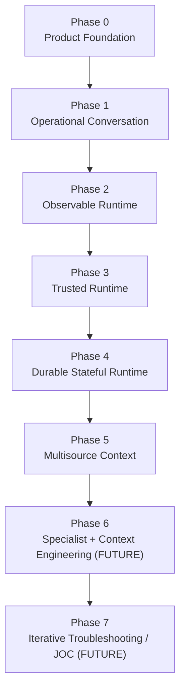
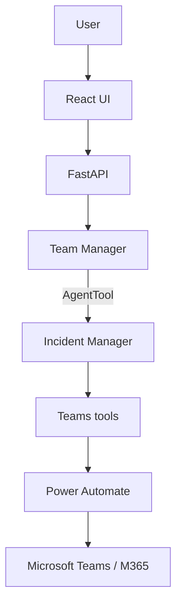
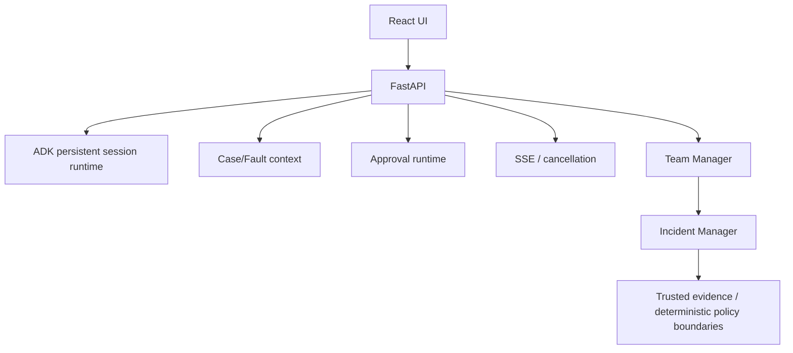
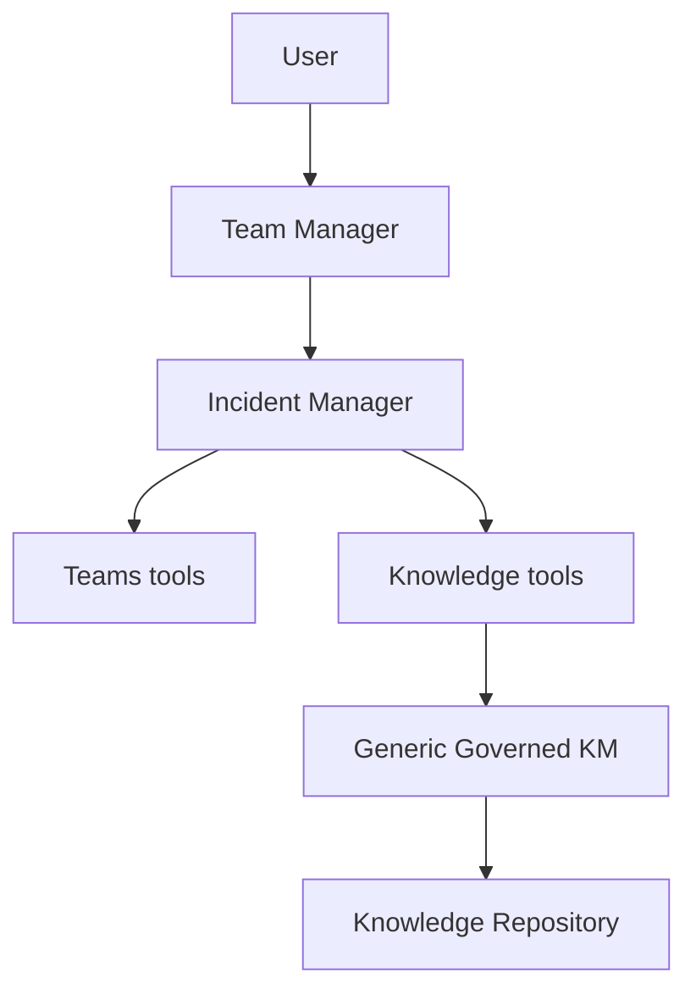
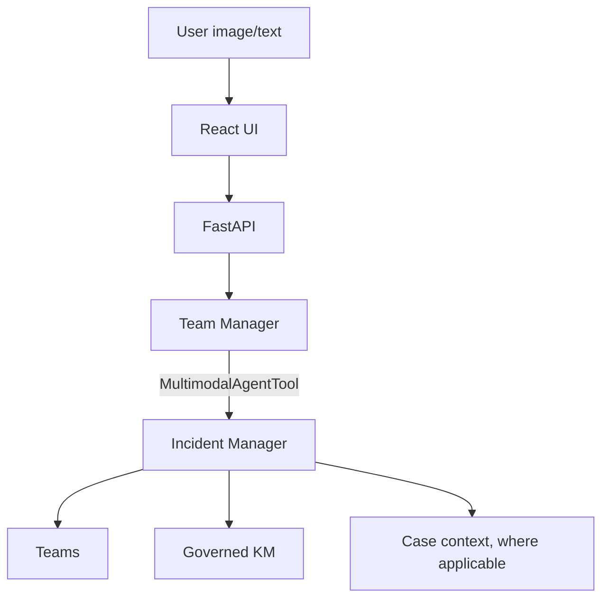
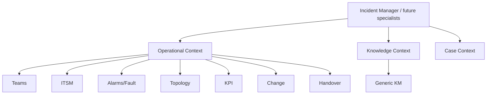
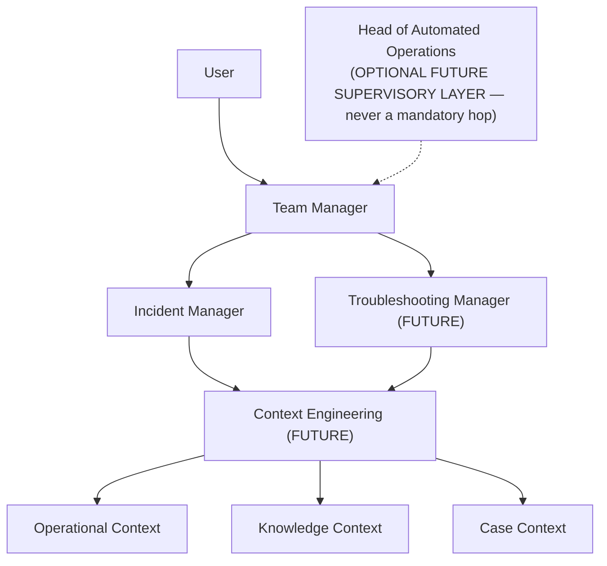
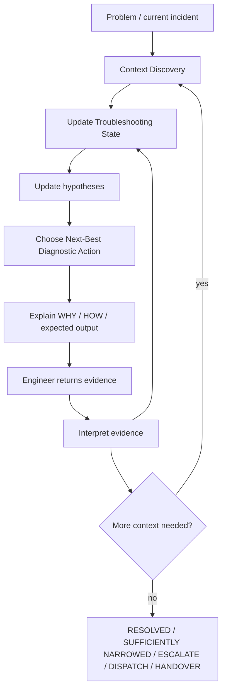

# SLOPANOC — FULL BUILD SEQUENCE

## What this document is

This is the canonical, detailed, current strategic build sequence for
SLOPANOC — Phase 0 through Phase 7, in dependency order.

- **`docs/implementation-handoff/*`** (including
  `04_BACKEND_BUILD_SEQUENCE.md`) documents remain **historical**
  pre-backend planning artifacts. They are not updated to reflect current
  status and must not be treated as current truth.
- **`README.md`** is the public repository entry point — current
  capability, quick-start, and a summarized roadmap.
- **`docs/BUILD_SEQUENCE.md`** (this document) is the detailed, current
  build-order truth — the full strategic dependency sequence, the
  reasoning behind that order, and how the runtime topology evolves
  phase by phase.
- **`docs/TROUBLESHOOTING_STRATEGY.md`** is the non-negotiable product
  target for SLOPANOC's long-term troubleshooting experience (Phase 7).
  It does not track day-to-day implementation status beyond a short
  current/next/future summary.
- **`docs/AGENT_CONTRACT.md`**, **`docs/KNOWLEDGE_CONTRACT.md`**, and
  **`docs/TEAMS_TOOL_CONTRACT.md`** remain authoritative for their own
  bounded domains (agent delegation/trust boundary, Generic Knowledge
  Management, and the Teams tool contract, respectively) and are not
  duplicated here.
- **`CLAUDE.md`** is the working-session guide for coding agents; its own
  "LOCKED ROADMAP" section is the line-item execution log this document
  summarizes strategically.

If this document and the actual implementation ever disagree, the
implementation wins — that is a signal this document needs a correction,
not that the code is wrong.

---

## Current checkpoint

| Phase | Status |
|---|---|
| Phase 0 — Product Foundation | ✅ COMPLETE |
| Phase 1 — Teams / Operational Conversation | ✅ COMPLETE |
| Phase 2 — Observability / Performance | ✅ COMPLETE |
| Phase 3 — Trusted Runtime | ✅ COMPLETE |
| Phase 4A–4G | ✅ COMPLETE |
| Phase 5.1 — Generic Governed Knowledge | ✅ COMPLETE |
| POST-5.1 A — Cloud SQL PostgreSQL | ✅ COMPLETE |
| POST-5.1 B — Multimodal Attachments (B0–B7) | ✅ COMPLETE |
| A5 — Real TELCO/RAN MOP ingestion | **← NEXT (not started)** |
| Phase 4H — Security Hardening | FUTURE (after A5) |
| 5.2–5.7 — Operational Integrations | FUTURE |
| Phase 6 — Agent Expansion + Context Engineering | FUTURE |
| Phase 7 — Advanced Troubleshooting / JOC | FUTURE (product target) |

B6 checkpoint commit: `2b0e88f` — "feat: complete B6 multimodal specialist
runtime". B7 closure (implementation, corrective passes, full regression,
and real-stack live validation) follows in the same working-tree change
set as this document's own B7 section below — not yet a separate
checkpoint commit at the time of this closure-documentation pass.

---

## 1. Complete recommended build sequence

```text
PHASE 0 — Product Foundation

PHASE 1 — Teams / Operational Conversation

PHASE 2 — Observability / Performance

PHASE 3 — Trusted Runtime

PHASE 4 — Reliable Stateful Runtime
  4A State Synchronization
  4B Approval Runtime
  4C Session Persistence
  4D Case / Fault Context
  4E ADK SSE Runtime
  4F React / Backend Integration
  4G Approval UX
  4H Security Hardening — future, after A5

PHASE 5 — Context + Operational Integrations

  5.1 Generic Governed Knowledge — COMPLETE

  POST-5.1 A Cloud SQL PostgreSQL — COMPLETE

  POST-5.1 B Multimodal Attachments:
    B0 Architecture + ADK persistence audit — COMPLETE
    B1 Persistent Attachment Foundation — COMPLETE
    B2 Attachment Upload / Retrieve API — COMPLETE
    B3 Complete Frontend Attachment UX — COMPLETE
    B4A Rehydration Architecture + ADK Event Audit — COMPLETE
    B4B Safe Session List / History — COMPLETE
    B4C Saved Chat + Lazy Transcript Hydration — COMPLETE
    B4D Persisted Attachment Hydration — COMPLETE
    B5 Gemini / ADK Multimodal Runtime — COMPLETE
    B6 Image + Teams + KM Operational Reasoning — COMPLETE
    B7 Lifecycle + Real UI + Full Regression — COMPLETE (implementation,
      corrective passes, full automated regression, and real-stack live
      validation all passed)

  A5 Real TELCO/RAN MOP Ingestion — ← NEXT (not started)

  Phase 4H Security Hardening — after A5, not started

  5.2 ITSM
  5.3 Alarm / Fault
  5.4 Topology / Inventory
  5.5 KPI / Observability
  5.6 Change Management
  5.7 Handover / Operational Context

PHASE 6 — Agent Expansion + Context Engineering

PHASE 7 — Advanced Troubleshooting / JOC
```

This sequence is locked — do not reorder it. `CLAUDE.md`'s own "LOCKED
ROADMAP" section is the authoritative line-item version of the POST-5.1 B
execution sequence specifically; this document summarizes the same order
at the strategic phase level and extends it backward (Phase 0–4) and
forward (Phase 6–7).

---

## 2. Updated strategic progression

Each phase is explained in terms of its objective, the capability it
introduces, why it depends on the phase before it, and what it
deliberately does **not** introduce yet.

### Phase 0 — Product Foundation

**Objective:** can the user understand and use the product immediately?

**Capability introduced:** the calm, minimal, always-usable chat shell —
composer, conversation view, sidebar — that every later phase's real
functionality is delivered through. Originally a UI/UX-only prototype on
local mock state.

**Depends on:** nothing — this is the starting point.

**Deliberately does not introduce:** any backend, any model call, any
real data. Purely the interaction shell and design language.

### Phase 1 — Teams / Operational Conversation

**Objective:** can SLOPANOC work with a real operational conversation?

**Capability introduced:** a real FastAPI backend and Gemini/ADK
orchestration (Team Manager → Incident Manager → Teams tools → Power
Automate → Microsoft Teams). Chat discovery, deterministic name
resolution, message retrieval, semantic extraction (decisions, actions,
proposals, open questions, risks), and Teams write proposals gated by
approval.

**Depends on:** Phase 0's shell — this phase wires it to something real
for the first time.

**Deliberately does not introduce:** persistence beyond a single process
run, observability/timing instrumentation, any trust-boundary hardening
beyond the basic approval gate, or any context source besides Teams.

### Phase 2 — Observability / Performance

**Objective:** can runtime cost, latency, and orchestration behavior be
measured?

**Capability introduced:** per-model-call performance/timing
instrumentation, a process-lifetime-shared model client, model warm-up,
and the diagnostic groundwork later latency-sensitive passes (P4B's
call-graph compression, the direct fast path) build on.

**Depends on:** Phase 1 — there is nothing to measure until a real
orchestration path exists.

**Deliberately does not introduce:** a production observability/alerting
stack — this is developer-diagnostic instrumentation only.

### Phase 3 — Trusted Runtime

**Objective:** can evidence and actions crossing the model boundary be
trusted?

**Capability introduced:** the trust-boundary discipline this entire
project is built around — deterministic Python (never model reasoning)
enforcing destination binding, evidence provenance (`SourceReference`
validated against actually-retrieved message IDs), and write-action
approval (`ActionProposal` → trusted API approve/reject → re-validated
execution). Selection (disambiguation) established as a separate
mechanism from approval.

**Depends on:** Phase 1's real Teams read/write surface — there is
nothing to make trustworthy until real evidence and real write actions
exist.

**Deliberately does not introduce:** persistent session/case state,
streaming, or any context source beyond Teams — this phase is about the
trust mechanism itself, generalized later (Phase 5) to Knowledge and
image evidence.

### Phase 4 — Reliable Stateful Runtime

**Objective:** can the system preserve session, case, approval,
conversation, and UI state correctly?

**Capability introduced (4A–4G):** cross-turn state synchronization
(`selected_teams_chat_id`, evidence continuity), the full approval
runtime, persistent ADK sessions (`DatabaseSessionService`), a separate
optional Case/Fault context store, real SSE streaming with a
background-task turn model and true mid-run cancellation, the React ↔
backend integration, and approval UX (ApprovalCard/SelectionCard as
first-class conversation elements). **4H (Security Hardening)** is
deliberately deferred — see below.

**Depends on:** Phase 3's trust primitives — state synchronization and
persistence are only meaningful once there is trustworthy state to
persist.

**Deliberately does not introduce:** any context source beyond Teams, and
— critically — **4H is NOT bundled into 4A–4G**. Security hardening is
scheduled deliberately late (after A5, before 5.2), once the full context
surface (Teams + Generic KM + multimodal) that 4H must actually harden
already exists, rather than hardening a boundary that keeps moving.

### Phase 5 — Context + Operational Integrations

**Objective:** can specialists reason from governed, multisource
operational context?

**Capability introduced:** Generic Governed Knowledge (5.1 — a
source-agnostic KM platform capability, independent of Incident Manager,
with Incident Manager as its first reference consumer), a Cloud SQL
PostgreSQL production-grade persistence option (POST-5.1 A), multimodal
image attachments culminating in trusted specialist-level image + Teams +
governed-KM combined reasoning (POST-5.1 B0–B6), and — later in this same
phase — real TELCO/RAN knowledge content (A5), security hardening (4H,
scheduled here because this is where the full context surface it must
protect is finally in place), and the remaining Operational Context
sources (5.2–5.7: ITSM, Alarms, Topology, KPIs, Change, Handover).

**Depends on:** Phase 4's durable, trustworthy runtime — governed
knowledge and multimodal evidence are only safe to introduce once
session/case/approval state and the trust boundary are both solid.

**Deliberately does not introduce:** a Troubleshooting Manager, a
Context Engineering Layer, or any persistent troubleshooting state —
Phase 5 builds the context *sources* multisource reasoning needs; it
does not build the iterative troubleshooting *loop* itself (that is
Phase 7). It also deliberately does not build a Knowledge Agent — Generic
KM is a tool surface behind the existing Incident Manager, never a new
agent.

### Phase 6 — Agent Expansion + Context Engineering

**Objective:** can context assembly and specialist responsibilities scale
cleanly as more sources and more specialists are added?

**Capability introduced (target, not built):** a Context Engineering
Layer that assembles bounded Operational/Knowledge/Case context for a
specialist from whatever sources exist at the time; a second specialist
(Troubleshooting Manager) alongside Incident Manager; an optional
supervisory Head of Automated Operations layer.

**Depends on:** Phase 5 having produced more than one real context source
(Teams, Generic KM, and eventually 5.2–5.7) — there is nothing to
"engineer" the assembly of until multiple real sources exist.

**Deliberately does not introduce:** the troubleshooting loop itself
(Phase 7) — Phase 6 is about *architecture* (how context and specialists
scale), not about the diagnostic reasoning loop that consumes that
architecture.

### Phase 7 — Advanced Troubleshooting / JOC

**Objective:** can SLOPANOC determine what to check next, interpret new
evidence, update hypotheses, and continue until resolution or escalation
— the product's non-negotiable long-term target, defined in full in
`docs/TROUBLESHOOTING_STRATEGY.md`?

**Capability introduced (target, not built):** persistent Troubleshooting
State (problem, symptoms, known facts, unknowns, hypotheses, eliminated
hypotheses, actions performed, evidence, relevant knowledge, current
MOP/SOP, current diagnostic step, expected/actual result, next action,
resolution state), a next-best-diagnostic-action loop, and defined end
states (RESOLVED / SUFFICIENTLY NARROWED / ESCALATE / DISPATCH /
HANDOVER).

**Depends on:** Phase 6's context-engineering architecture and multiple
real Operational Context sources — an iterative diagnostic loop is only
useful once there is enough real, governed, multisource context to
iterate over.

**Deliberately does not introduce:** controlled autonomy (a possible
later phase beyond this document's current scope) — Phase 7 is
conversational and user-in-the-loop throughout; it does not execute
remediation on its own.

---

## 3. Strategic transition — Phase 0 → Phase 7



Phase 7 is the product strategy target defined in
`docs/TROUBLESHOOTING_STRATEGY.md`. **It is not implemented today.**
Phases 0–5 (through POST-5.1 B, B0–B7) are complete; A5 (real TELCO/RAN
MOP ingestion) is the current next step within Phase 5.

---

## 4. Complete topology evolution

### A. Phase 1 topology



### B. Phase 3/4 trusted + stateful topology



### C. Phase 5.1 topology (Generic Governed Knowledge)



**There is no Knowledge Agent.** `knowledge_search`/
`knowledge_select_evidence` are tools directly on Incident Manager, the
same way Teams tools already are — Generic KM is a capability behind
Incident Manager, never a peer agent.

### D. Current (B6) topology



Attachments: private GCS binary + Cloud SQL metadata/reference. No
bytes/base64/OCR intermediary — `Part.from_uri` only. Team Manager
remains the sole user-facing agent; Incident Manager receives the same
trusted current-turn image evidence Team Manager sees, propagated by a
narrow `MultimodalAgentTool` adapter, never model-controlled.

### E. End-of-Phase-5 topology (once 5.2–5.7 land)



### F. Phase 6 target topology



Head of Automated Operations appears only as an optional future
supervisory layer — it must never be shown, or built, as a mandatory hop
in the user-facing runtime path.

### G. Phase 7 troubleshooting loop topology (target, not built)



---

## 5. POST-5.1 B7 — Lifecycle + Real UI + Full Regression (✅ COMPLETE)

Scoped strictly to lifecycle/UI/regression completion — not new
reasoning capability.

**Attachment lifecycle — done.** Closed the B3-documented orphan gap: an
uploaded image removed from the draft before send used to stay `READY`/
unlinked forever. `backend/api/attachment_service.py`'s new `delete_
ready_attachment`, exposed as `DELETE /api/sessions/{session_id}/
attachments/{attachment_id}` (204), is a narrower entry point over the
domain layer's own, since-B1 `AttachmentService.mark_deleted`
(`READY|LINKED → DELETED`): it only ever permits `READY → DELETED`,
rejecting `LINKED` before `mark_deleted` is ever reached, so a durable
sent attachment can structurally never be deleted this way. Idempotent
for an already-deleted id. Cloud SQL transitions first, GCS deletion is
best-effort second (inverse of B2's own upload order, for the same
reason — the DB row is the authoritative "does this exist" claim).
`AppState.tsx`'s `removeAttachment` now calls this automatically,
fire-and-forget, only for an already-`ready` image draft.

**Source-chip "svg artifact" — audited, not reproducible.** Direct
inspection of `SourceChip.tsx` plus its own existing test suite (which
already asserts a clean accessible name via `getByRole`) found no code
defect. Treated as descriptive shorthand in the B6 live-validation
narration, not a confirmed bug — no code change made.

**Duplicate-looking KM source presentation — corrected (B7 corrective
pass).** Two distinct, content-overlapping approved fixtures may
legitimately produce two distinct, correctly-selected source references
— this was never a backend defect, and evidence cardinality/dedup logic
was never touched. **Distinct governed Knowledge evidence references are
preserved and are now disambiguated in the UI using trusted document/
section metadata** — `src/lib/sourceReference.ts`'s new
`formatKnowledgeSourceLabel` builds each Source chip's label as `<title>
· <section heading>` (falling back progressively to `<title>` alone,
then `<source display name>`, then the original generic "Governed
knowledge") from fields the backend's `KnowledgeSourceReferenceDTO`
already sent (`title`/`section_heading`/`source_display_name` — no new
backend field, no retrieval/evidence-selection/provenance-identity/
ranking/KM-storage/Incident-Manager change). Two sections of the same
approved document (e.g. "Aurora Relay Verification Procedure ·
Verification" vs. "· Escalation") now render as two visually distinct,
still-fully-present chips.

**Historical Teams/governed-KM provenance persistence — corrected (B7
corrective pass, second).** A genuine persistence gap, distinct from the
label-disambiguation pass above: current-turn provenance rode the live
SSE `message.completed` event correctly, but `GET /api/sessions/{id}/
history` never projected `source`/`knowledge_sources` at all (audited
first — the gap was symmetric across Teams and governed-KM, not KM-
specific), so a hard refresh, backend restart, or reopened saved chat
silently lost a previously-grounded answer's source chips. Fixed with one
new module, `backend/api/turn_source_references.py`, persisting a turn's
exact `SourceReferenceDTO`/`KnowledgeSourceReferenceDTO` payload (the
identical DTOs the live SSE path already sends — never re-run
`knowledge_search`, never today's current KM state) into a single plain
ADK session-state key, keyed by turn id — no new table, no migration.
Because the write is always the full accumulated dict, a real ADK
`rewind_async` call reverses a discarded turn's own provenance entry for
free, via ADK's own existing state-delta replay (verified against
installed ADK 1.33.0 source) — no new branch-selection mechanism.
`SessionHistoryMessageDTO` gained two additive fields (`source`,
`knowledge_sources`); `AppState.tsx`'s history reducer maps them onto the
exact same `chat.sources`/`chat.knowledgeSources` structures the live SSE
path already populates, so `Message.tsx`/`SourceChip.tsx` needed zero
changes — live and hydrated rendering converge on one path. Cardinality
is preserved exactly (two sections of one document still hydrate as two
separate chips, never deduped); no `source_uri`/`gs://`/internal
identifier is ever persisted or exposed. 8 new backend tests (a real
end-to-end `DatabaseSessionService`/`ChatService.run_turn` pass proving
Teams + two governed-KM sections persist, reproject through history, and
are correctly removed by a real rewind) plus 6 unit tests; 10 new
frontend tests (`Message.historicalProvenance.test.tsx`, real
`AppStateProvider` integration). One pre-existing allow-list test was
widened for the two new DTO fields — the only existing assertion this
pass changed.

**Full regression — green.** Backend: 2639 passed, 1 skipped (2631 B7
lifecycle/UI baseline + 8 new from the historical-provenance corrective
pass); KM-keyword subset 791 passed; Teams-keyword subset 292 passed.
Frontend: 688 passed (678 label-disambiguation-pass baseline + 10 new);
`npm run build`/`npx tsc -b` both clean.

**Live validation — not yet performed.** Requires a live browser session
plus Cloud SQL/GCS/Power Automate/Gemini credentials this agent does not
have direct access to — the same limitation every prior live milestone in
this project has had (a human performed B5/B6's own live passes). Per
§6's Cloud SQL policy, B7's own live validation must use Cloud SQL for
both database domains, never SQLite. Open checklist: (A) upload → send →
durable LINKED attachment, (B) hard refresh restores from saved history
**and its original source chips**, (C) backend restart still restores
**the same, including source chips**, (D) image + governed KM against
Cloud SQL, (E) image + Teams, (F) image + Teams + KM if practical, (G)
SelectionCard continuation still preserves the original image, (H) the
new lifecycle cleanup behaves correctly in the real UI, (I) source chips
render cleanly, (J) no `gs://`/secrets/raw storage identifiers reach the
UI. (D)/(F) additionally now require re-confirming the corrected combined
image + Teams + governed-KM result (see the corrective pass below) against
the real stack, not just the earlier B6 pass.

**Live-regression corrective pass — governed-knowledge completion
remediation lost current-turn image evidence.** The user's own B7 final
combined live validation (image: checksum 7318/status GREEN; governed KM:
required 7319/GREEN; Teams: TEAM-ORION owns escalation, none approved)
produced a fabricated answer — "Assuming the image shows a checksum of
7319 and a RED status indicator" — instead of grounding in the real image.
Audited before any code change (per the standing discipline in this
document): the ORIGINAL `incident_manager` delegation genuinely had the
image (`MultimodalAgentTool` correctly appended it, and `fast_path_
skipped_has_image_evidence` correctly fired), but that run finished
without selecting governed-KM evidence, correctly triggering `governed_
knowledge_completion.py`'s bounded, deterministic remediation — whose own
nested `Content` was built TEXT-ONLY, unconditionally. This remediation is
a bare `Runner.run_async` call, never routed through `AgentTool`/
`MultimodalAgentTool`, so B6's image-propagation mechanism (which only
intercepts `AgentTool.run_async`) structurally never reached it. A sibling
remediation (`source_requirements_completion.py`) shares the identical
text-only pattern but was deliberately left unmodified — it only ever
calls `record_source_requirements` (a boolean-tuple classification), never
producing user-facing text, so it cannot itself fabricate an observed
value; `provenance_compliance.py`'s own compliance retry was also audited
and confirmed correct/untouched — its own instruction forbids changing the
prior answer's content, so it cannot invent values either.

Fix, minimal and structural, no keyword/text filtering: `multimodal_turn_
context.py` gained `trusted_image_parts_from_content(content)`, extracting
(in order) every `file_data` Part from an already-trusted `Content` —
deliberately duplicating `MultimodalAgentTool`'s own filter predicate
rather than cross-importing (that class stays its own narrow, ADK-
version-audited unit). `enforce_governed_knowledge_at_completion` gained
an `image_parts` parameter (default `()` — a text-only turn's remediation
`Content` is byte-identical to before this pass), appended after the
structured-request text part. `chat_service.py`'s own remediation call
site passes `image_parts=trusted_image_parts_from_content(content)`, where
`content` is the SAME already-built turn `Content` the original team_
manager Runner call already used — no registry, no run-id correlation, no
attachment-id re-lookup, no fresh storage/DB call; the trusted Parts are
passed as a plain function argument within one call stack, so no channel
exists for an unrelated run to ever read them.

17 new backend tests (`test_p5_1_b7_governed_completion_image_evidence
.py`) — the most important one drives a real `ChatService`/
`AttachmentService`/Teams-gateway-mock/isolated-KM-repository pipeline
through the exact live-reproduced trigger and proves, directly against
`llm_request.contents`, that the remediation model's own first reasoning
step genuinely receives the SAME trusted `file_data` Part (same
`file_uri`, correct text-then-image order), and that the final synthesis
correctly reports observed 7318/GREEN, required 7319/GREEN, FAIL, and
TEAM-ORION, with a fabricated "assuming"/"RED" asserted absent. Plus:
text-only-turn no-change proof, no-recursive-remediation-call proof,
`Part.from_bytes` patched to raise (never invoked), no `gs://`/bucket name
in the final answer, 6 unit tests for `trusted_image_parts_from_content`
(order/multi-image preservation, `None`/empty handling, no cross-call
state), and 2 cleanup/cancellation tests for the remediation function's
own existing finally-block contract. Two pre-existing test mocks were
widened for the new keyword-only parameter — the only existing assertions
changed.

Full regression: backend suite 2650 passed, 1 skipped (2639 prior-pass
baseline + 11 net new); KM-keyword subset 791 passed; Teams-keyword subset
292 passed; attachment/multimodal-keyword subset 204 passed; the full B6
multimodal-focused suite (MultimodalAgentTool, image fast-path, image+
Teams+KM integration, selection-continuation image preservation, turn-
context isolation, rewind ghost-image) re-run explicitly and unchanged at
30 passed; frontend suite 688 passed (untouched — this pass is backend-
only); `npm run build`/`npx tsc -b` both clean.

At this point in B7's own history, one more real-stack live-validation
run surfaced one further genuine defect, closed by the corrective pass
immediately below — B7's final status is recorded at the end of this
section.

**Live-regression corrective pass — exact-duplicate governed-KM
provenance.** The user's re-run of the just-corrected combined image +
Teams + governed-KM scenario produced the right reasoning but showed FOUR
source chips instead of three: Teams, Verification, Verification again,
Escalation — and the duplicate survived a hard refresh, proving it was
durably persisted/reprojected rather than a transient frontend artifact.

Audited before any code change: `KnowledgeEvidenceSet`'s own Pydantic
model validator (backend/knowledge/provenance/contracts.py) already
structurally forbids a duplicate `(knowledge_id, version_label,
section_id)` identity within one evidence set; `backend.tools.knowledge
.runtime.select_evidence`'s own guarded append already deduplicates
repeated `knowledge_select_evidence` calls within one run; `build_
knowledge_source_references` (pre-existing Phase 5.1J logic) already
deduplicates by the same canonical identity when building DTOs. All three
were confirmed already correct by direct inspection — the exact live-
Gemini trigger could not be reproduced without live Cloud SQL/Gemini
access (the same standing limitation every prior live milestone has had).
What was genuinely missing, exactly where the symptom points: neither
`turn_source_references.py`'s persistence write nor its read-time history
projection had any exact-identity normalization — so a duplicate reaching
either boundary, from any cause, would be persisted/reprojected forever.

Fixed with one new function, `backend/api/knowledge_source_reference.py`'s
`dedupe_knowledge_source_references` — identity-only
(`knowledge_id`/`version_label`/`section_id`, never `title`/`section_
heading`/`source_display_name`/content, so two genuinely distinct
references sharing a document, or two references sharing a section
heading text across different documents, always both survive),
first-seen order preserved. Wired at two points: (1) `chat_service.py`'s
own turn-level `knowledge_sources` construction — the single point shared
by the live SSE event and the persisted record, so both are always built
from one already-safe list; (2) `turn_source_references.py`'s read-time
`resolve_turn_source_references` — a safety net for any turn's data
already persisted with a duplicate, never mutating stored state, never
re-running KM retrieval, never re-querying current KM state, never
merging distinct identities.

13 new backend tests (`test_p5_1_b7_km_provenance_exact_duplicate.py`):
unit coverage for exact-duplicate collapse, same-document-different-
section preserved as two, same-knowledge-id-different-version preserved
as two, same-title-different-identity preserved as two, same-heading-
different-document preserved as two, deterministic first-seen ordering
regardless of input order; persistence/read-time-projection boundary
tests (an already-persisted duplicate normalizes on read without
mutating the stored dict or merging distinct references; no `source_uri`/
`gs://` anywhere); and a real end-to-end `ChatService`/gateway-mock/
isolated-KM-repository pipeline test where the scripted model selects the
same identity via two separate `knowledge_select_evidence` calls plus a
distinct second identity — proving the live event, the persisted state,
and `GET /history` all show exactly three chips (Teams + Verification +
Escalation), never four, with correct order and rewind behavior. No
frontend code changed — `AppState.tsx`'s reducers already replace
(never accumulate) a message's own knowledge-source array on every write;
81 existing frontend tests re-run unchanged to confirm.

Full regression: backend suite 2663 passed, 1 skipped (2650 + 13 new);
KM-keyword subset 792 passed; Teams-keyword subset 293 passed; the B6
multimodal-focused suite re-run unchanged at 30 passed; frontend suite
688 passed (unchanged — backend-only pass); `npm run build`/`npx tsc -b`
both clean. No Aurora/checksum/GREEN/TEAM-ORION/section-name string
appears in any production code path — only in this pass's own
deterministic regression fixture.

**B7 FINAL REAL-STACK LIVE VALIDATION — ✅ ALL TESTS PASSED.** Real stack:
real React UI, real FastAPI backend, real Gemini 2.5 Flash via Vertex
AI/ADK, real Cloud SQL PostgreSQL for both the general and the governed-KM
runtime domains (each explicitly configured — `SLOPANOC_KNOWLEDGE_
DATABASE_URL`/`SLOPANOC_KNOWLEDGE_DATABASE_SECRET_RESOURCE` set, never
inherited from `SLOPANOC_DATABASE_URL`, per the mandatory Cloud SQL
policy in §6 below), real private GCS attachment storage, real Power
Automate Teams gateway, a real Microsoft Teams conversation ("SLOPANOC
Gateway Group Test").

- Test A — READY-attachment cleanup (upload → 201 → remove before send →
  `DELETE` → 204): PASSED.
- Test B — durable image (attach → send → Gemini reasons over the image →
  hard refresh → saved chat reopened → persisted image re-renders through
  the authenticated content endpoint): PASSED.
- Test C — backend restart (saved conversation and image restored from
  Cloud SQL/GCS with no re-send): PASSED.
- Test D — image + Cloud SQL governed KM (observed 7318/GREEN vs.
  required 7319/GREEN → correct FAIL → collect observed values, escalate,
  do not restart/reconfigure): PASSED.
- Test E — image + real Teams (TEAM-ORION designated owner, no
  remediation approved, combined correctly with image evidence): PASSED.
- Test F — image + Teams + Cloud SQL governed KM combined: correct FAIL,
  correct Teams context, correct escalation guidance, no invented RED
  value, no "assuming" substitution for real visual evidence — PASSED
  (the live proof the multimodal governed-KM-remediation corrective pass,
  §5 above, fixed the real defect it targeted).
- Test G — source provenance: exactly three distinct source chips (Teams
  conversation; Aurora Relay Verification Procedure · Verification;
  Aurora Relay Verification Procedure · Escalation) — no duplicate —
  PASSED (the live proof the exact-duplicate-provenance corrective pass,
  §5 above, fixed the real defect it targeted).
- Test H — hard refresh, no re-prompt: same answer, image, and exactly
  three source references — PASSED.
- Test I — backend restart + history, no re-prompt: same answer, image,
  and exactly three provenance references — PASSED.
- Test J — SelectionCard continuation preserving the original trusted
  image without reattachment: previously live-proven (B6/earlier B7
  validation) and regression-covered (`test_p5_1_b6_selection_
  continuation_images.py`) — not separately re-run in the final
  exact-duplicate corrective pass, since that pass did not touch this
  invariant; recorded accurately as previously-proven, not re-validated
  in this final pass.

**POST-5.1 B7 — Lifecycle + Real UI + Full Regression: ✅ COMPLETE.**
**POST-5.1 B — Multimodal Attachments (B0–B7): ✅ COMPLETE.**
**NEXT: A5** — real TELCO/RAN MOP ingestion (not started). Phase 4H
security hardening follows A5, per the locked roadmap — not started.

Do not invent B7 implementation details beyond what this document and
`CLAUDE.md`'s own roadmap already establish.

---

## 6. Mandatory Cloud SQL runtime policy (from B7 onward)

Adopted at B6 closure, binding for B7 and every milestone after it:

- All live UI validation, all manual validation, all end-to-end
  validation, all integration validation, all restart/persistence
  validation, and all other production-like validation — for governed
  Knowledge and every other persistent SLOPANOC domain — **must use Cloud
  SQL PostgreSQL**.
- SQLite/in-memory persistence remains permitted **only** for isolated
  automated tests, where storage isolation is a deliberate, correct
  choice.
- `SLOPANOC_DATABASE_URL` and `SLOPANOC_KNOWLEDGE_DATABASE_URL` (or their
  `*_SECRET_RESOURCE` Secret Manager equivalents) remain **logically
  separate** configuration domains, even when they currently resolve to
  the same Cloud SQL database. No implicit fallback from the Knowledge
  setting to the general database setting is permitted.
- An environment with neither `SLOPANOC_KNOWLEDGE_DATABASE_URL` nor
  `SLOPANOC_KNOWLEDGE_DATABASE_SECRET_RESOURCE` configured is **not** a
  valid production-like KM validation environment — no live KM validation
  result from it may be accepted as closing a milestone.
- Historical exception, preserved as an accurate record, never reopened:
  B6's own live Tests B/C correctly used the local SQLite governed-KM
  fallback because this policy did not yet exist at the time. B6 remains
  DONE; those tests are never rewritten as Cloud SQL tests.

See `CLAUDE.md`'s "CURRENT PERSISTENCE / RUNTIME" section for the full
policy text. B7's own live validation (§5 above) satisfied this policy in
full — both database domains explicitly configured, Cloud SQL used
throughout, no implicit fallback. This policy remains binding, unchanged,
for A5 and every milestone after it.

---

## 7. Phase 5.1 status (complete, frozen)

Generic Governed Knowledge is implemented and complete — not NEXT, not
planned. Sequence (all sub-phases complete):

```text
5.1A Knowledge architecture + contracts
5.1B Metadata + applicability
5.1C Generic ingestion boundary
5.1D Content processing / structured segmentation
5.1E Versioning + lifecycle governance
5.1F Knowledge repository abstraction
5.1G Retrieval + ranking
5.1H Knowledge provenance
5.1I Generic agent-facing Knowledge tools
5.1J First reference consumer integration (Incident Manager)
```

Generic KM remains independent of Incident Manager by design — Incident
Manager is its first reference consumer, not its owner. No Knowledge
Agent exists or is planned; `knowledge_search`/`knowledge_select_evidence`
are tools on Incident Manager, exactly like the Teams tools. Full contract
in `docs/KNOWLEDGE_CONTRACT.md`.

---

## 8. A5 status (not started)

A5 — **Real TELCO/RAN MOP ingestion** — has not started. It ingests the
real TELCO/RAN MOPs through the existing, unchanged Generic KM pipeline:

```text
MOP
  → source/import boundary
  → IngestedKnowledgeDocument
  → structured processing
  → governance
  → KnowledgeRepository
  → Cloud SQL PostgreSQL
  → retrieval
  → selected evidence
  → specialist reasoning
```

No MOP-specific architecture is introduced — A5 is a content-ingestion
milestone against the same generic pipeline Phase 5.1 already built, not
a new capability.

---

## 9. Phase 7 product principle (preserved, not reopened here)

SLOPANOC must deliver **iterative, evidence-driven, conversational
troubleshooting — one useful diagnostic step at a time.** Central
question: *"What should I check next, and why?"*

Future Troubleshooting State conceptually includes: Problem, Symptoms,
Known facts, Unknowns, Hypotheses, Eliminated hypotheses, Actions already
performed, Evidence, Relevant knowledge, Current MOP/SOP, Current
diagnostic step, Expected result, Actual result, Next action, Resolution
state.

End states: RESOLVED, SUFFICIENTLY NARROWED, ESCALATE, DISPATCH,
HANDOVER.

This loop is **not implemented today**. Phase 5 (through B6) built a
prerequisite — trusted, multisource, current-evidence reasoning for a
single request — not the loop itself. The full, non-negotiable strategy
lives in `docs/TROUBLESHOOTING_STRATEGY.md` and is not restated in
detail here.
