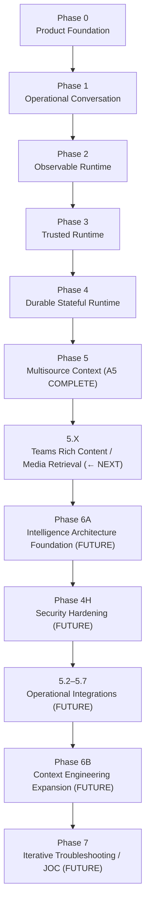
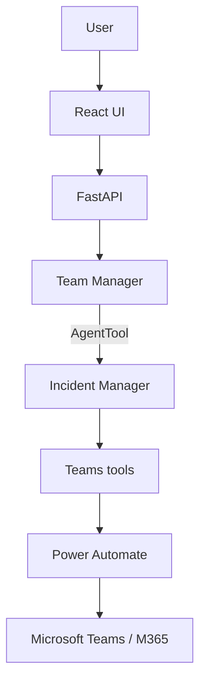
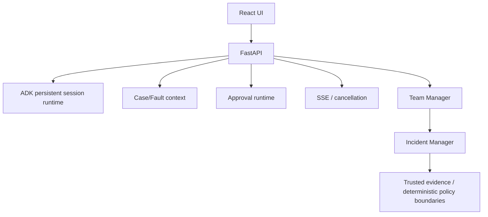
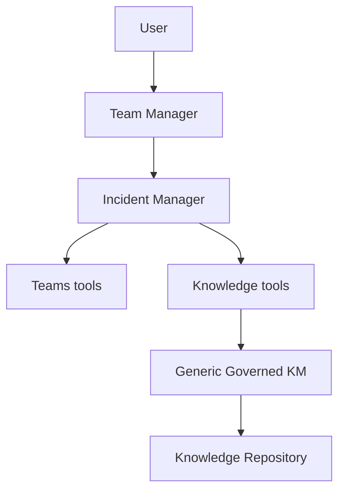
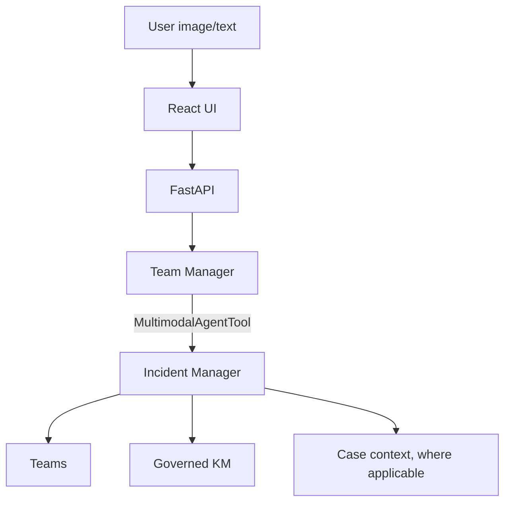
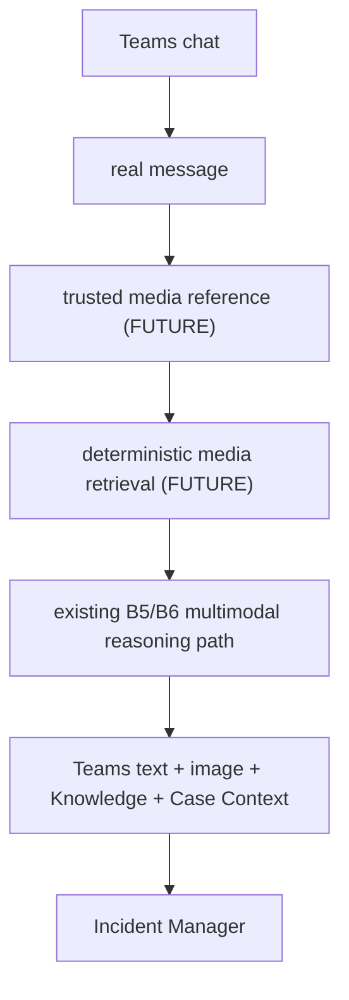
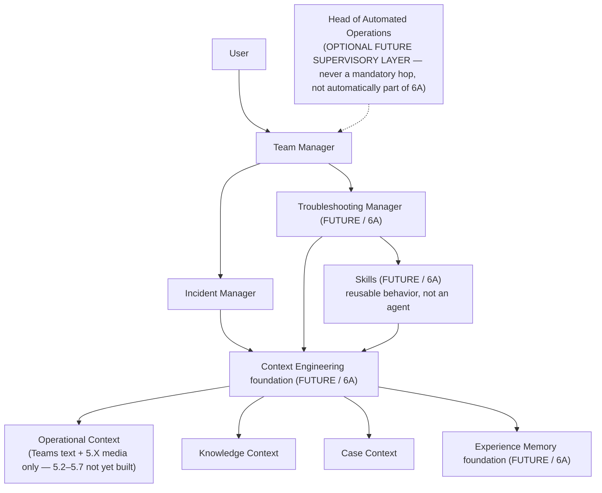
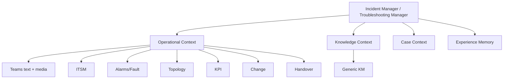
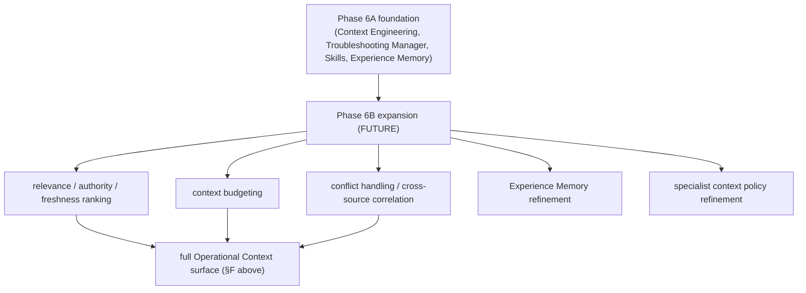
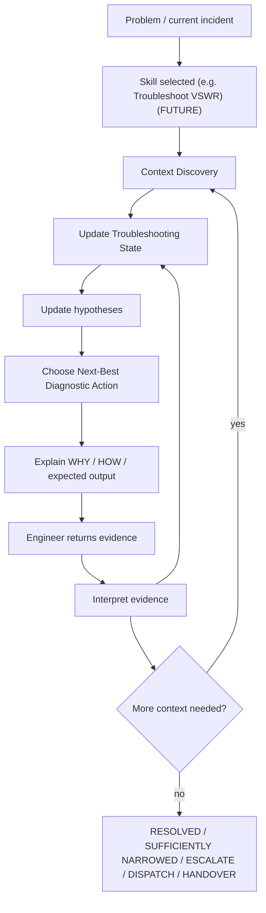

# SLOPANOC — FULL BUILD SEQUENCE

## What this document is

This is the canonical, detailed, current strategic build sequence for
SLOPANOC — Phase 0 through Phase 7, in dependency order.

- **`docs/implementation-handoff/*`** (including
  `04_BACKEND_BUILD_SEQUENCE.md`) documents remain **historical**
  pre-backend planning artifacts. They are not updated to reflect current
  status and must not be treated as current truth.
- **`README.md`** is the public repository entry point — current
  capability, quick-start, and a summarized roadmap.
- **`docs/BUILD_SEQUENCE.md`** (this document) is the detailed, current
  build-order truth — the full strategic dependency sequence, the
  reasoning behind that order, and how the runtime topology evolves
  phase by phase.
- **`docs/TROUBLESHOOTING_STRATEGY.md`** is the non-negotiable product
  target for SLOPANOC's long-term troubleshooting experience (Phase 7).
  It does not track day-to-day implementation status beyond a short
  current/next/future summary.
- **`docs/AGENT_CONTRACT.md`**, **`docs/KNOWLEDGE_CONTRACT.md`**, and
  **`docs/TEAMS_TOOL_CONTRACT.md`** remain authoritative for their own
  bounded domains (agent delegation/trust boundary, Generic Knowledge
  Management, and the Teams tool contract, respectively) and are not
  duplicated here.
- **`CLAUDE.md`** is the working-session guide for coding agents; its own
  "LOCKED ROADMAP" section is the line-item execution log this document
  summarizes strategically.

If this document and the actual implementation ever disagree, the
implementation wins — that is a signal this document needs a correction,
not that the code is wrong.

---

## Current checkpoint

| Phase | Status |
|---|---|
| Phase 0 — Product Foundation | ✅ COMPLETE |
| Phase 1 — Teams / Operational Conversation | ✅ COMPLETE |
| Phase 2 — Observability / Performance | ✅ COMPLETE |
| Phase 3 — Trusted Runtime | ✅ COMPLETE |
| Phase 4A–4G | ✅ COMPLETE |
| Phase 5.1 — Generic Governed Knowledge | ✅ COMPLETE |
| POST-5.1 A — Cloud SQL PostgreSQL | ✅ COMPLETE |
| POST-5.1 B — Multimodal Attachments (B0–B7) | ✅ COMPLETE |
| POST-B7 UI/UX Refinement Milestone | ✅ COMPLETE |
| A5 — Knowledge Island Ingestion Foundation + Real TELCO/RAN Compound Knowledge Validation | ✅ COMPLETE |
| 5.X — Teams Rich Content / Media Retrieval | **← NEXT** — not started |
| Phase 6A — Intelligence Architecture Foundation | FUTURE — after 5.X |
| Phase 4H — Security Hardening | FUTURE — after 6A |
| 5.2–5.7 — Operational Integrations | FUTURE — after 4H |
| Phase 6B — Context Engineering Expansion | FUTURE — after 5.2–5.7 |
| Phase 7 — Advanced Troubleshooting / JOC | FUTURE (product target) |

B6 checkpoint commit: `2b0e88f` — "feat: complete B6 multimodal specialist
runtime". B7 closure (implementation, corrective passes, full regression,
and real-stack live validation) follows in the same working-tree change
set as this document's own B7 section below — not yet a separate
checkpoint commit at the time of this closure-documentation pass.

---

## 1. Complete recommended build sequence

```text
PHASE 0 — Product Foundation

PHASE 1 — Teams / Operational Conversation

PHASE 2 — Observability / Performance

PHASE 3 — Trusted Runtime

PHASE 4 — Reliable Stateful Runtime
  4A State Synchronization
  4B Approval Runtime
  4C Session Persistence
  4D Case / Fault Context
  4E ADK SSE Runtime
  4F React / Backend Integration
  4G Approval UX
  4H Security Hardening — scheduled later (after 6A, see below) — not
    part of the 4A–4G build-order group; see §2's Phase 4 entry

PHASE 5 — Context + Operational Integrations

  5.1 Generic Governed Knowledge — COMPLETE

  POST-5.1 A Cloud SQL PostgreSQL — COMPLETE

  POST-5.1 B Multimodal Attachments:
    B0 Architecture + ADK persistence audit — COMPLETE
    B1 Persistent Attachment Foundation — COMPLETE
    B2 Attachment Upload / Retrieve API — COMPLETE
    B3 Complete Frontend Attachment UX — COMPLETE
    B4A Rehydration Architecture + ADK Event Audit — COMPLETE
    B4B Safe Session List / History — COMPLETE
    B4C Saved Chat + Lazy Transcript Hydration — COMPLETE
    B4D Persisted Attachment Hydration — COMPLETE
    B5 Gemini / ADK Multimodal Runtime — COMPLETE
    B6 Image + Teams + KM Operational Reasoning — COMPLETE
    B7 Lifecycle + Real UI + Full Regression — COMPLETE (implementation,
      corrective passes, full automated regression, and real-stack live
      validation all passed)

  POST-B7 UI/UX Refinement Milestone — COMPLETE (implementation, full
    regression, and real-stack live validation all passed; see §5a below;
    separate from B0–B7, no B7 architecture change)

  A5 Knowledge Island Ingestion Foundation + Real TELCO/RAN Compound
    Knowledge Validation — COMPLETE, including real live-runtime
    validation (see §8 below)

  5.X Teams Rich Content / Media Retrieval — ← NEXT, NOT STARTED (see §2a)

PHASE 6A — Intelligence Architecture Foundation — FUTURE, after 5.X
  (Context Engineering foundation, Troubleshooting Manager, Skills
  framework foundation, Experience Memory foundation — see §2a)

PHASE 4H — Security Hardening — FUTURE, after 6A (see §2a for why 4H now
  follows 6A instead of directly following A5)

PHASE 5 (continued) — remaining Operational Integrations, after 4H
  5.2 ITSM
  5.3 Alarm / Fault
  5.4 Topology / Inventory
  5.5 KPI / Observability
  5.6 Change Management
  5.7 Handover / Operational Context

PHASE 6B — Context Engineering Expansion — FUTURE, after 5.2–5.7
  (expands the 6A foundation against the full Operational Context surface)

PHASE 7 — Advanced Troubleshooting / JOC
```

**This sequence is locked** — do not reorder it. It replaces the
previous locked order (which ran A5 → Phase 4H → 5.2–5.7 → Phase 6
undivided); see §2a for the realignment rationale. `CLAUDE.md`'s own
"LOCKED ROADMAP" section is the authoritative line-item version of the
POST-5.1 B execution sequence specifically; this document summarizes the
same order at the strategic phase level and extends it backward
(Phase 0–4) and forward (5.X, 6A, 4H, 5.2–5.7, 6B, 7).

---

## 2. Updated strategic progression

Each phase is explained in terms of its objective, the capability it
introduces, why it depends on the phase before it, and what it
deliberately does **not** introduce yet.

### Phase 0 — Product Foundation

**Objective:** can the user understand and use the product immediately?

**Capability introduced:** the calm, minimal, always-usable chat shell —
composer, conversation view, sidebar — that every later phase's real
functionality is delivered through. Originally a UI/UX-only prototype on
local mock state.

**Depends on:** nothing — this is the starting point.

**Deliberately does not introduce:** any backend, any model call, any
real data. Purely the interaction shell and design language.

### Phase 1 — Teams / Operational Conversation

**Objective:** can SLOPANOC work with a real operational conversation?

**Capability introduced:** a real FastAPI backend and Gemini/ADK
orchestration (Team Manager → Incident Manager → Teams tools → Power
Automate → Microsoft Teams). Chat discovery, deterministic name
resolution, message retrieval, semantic extraction (decisions, actions,
proposals, open questions, risks), and Teams write proposals gated by
approval.

**Depends on:** Phase 0's shell — this phase wires it to something real
for the first time.

**Deliberately does not introduce:** persistence beyond a single process
run, observability/timing instrumentation, any trust-boundary hardening
beyond the basic approval gate, or any context source besides Teams.

### Phase 2 — Observability / Performance

**Objective:** can runtime cost, latency, and orchestration behavior be
measured?

**Capability introduced:** per-model-call performance/timing
instrumentation, a process-lifetime-shared model client, model warm-up,
and the diagnostic groundwork later latency-sensitive passes (P4B's
call-graph compression, the direct fast path) build on.

**Depends on:** Phase 1 — there is nothing to measure until a real
orchestration path exists.

**Deliberately does not introduce:** a production observability/alerting
stack — this is developer-diagnostic instrumentation only.

### Phase 3 — Trusted Runtime

**Objective:** can evidence and actions crossing the model boundary be
trusted?

**Capability introduced:** the trust-boundary discipline this entire
project is built around — deterministic Python (never model reasoning)
enforcing destination binding, evidence provenance (`SourceReference`
validated against actually-retrieved message IDs), and write-action
approval (`ActionProposal` → trusted API approve/reject → re-validated
execution). Selection (disambiguation) established as a separate
mechanism from approval.

**Depends on:** Phase 1's real Teams read/write surface — there is
nothing to make trustworthy until real evidence and real write actions
exist.

**Deliberately does not introduce:** persistent session/case state,
streaming, or any context source beyond Teams — this phase is about the
trust mechanism itself, generalized later (Phase 5) to Knowledge and
image evidence.

### Phase 4 — Reliable Stateful Runtime

**Objective:** can the system preserve session, case, approval,
conversation, and UI state correctly?

**Capability introduced (4A–4G):** cross-turn state synchronization
(`selected_teams_chat_id`, evidence continuity), the full approval
runtime, persistent ADK sessions (`DatabaseSessionService`), a separate
optional Case/Fault context store, real SSE streaming with a
background-task turn model and true mid-run cancellation, the React ↔
backend integration, and approval UX (ApprovalCard/SelectionCard as
first-class conversation elements). **4H (Security Hardening)** is
deliberately deferred — see below.

**Depends on:** Phase 3's trust primitives — state synchronization and
persistence are only meaningful once there is trustworthy state to
persist.

**Deliberately does not introduce:** any context source beyond Teams, and
— critically — **4H is NOT bundled into 4A–4G**. Security hardening is
scheduled deliberately late — after 5.X and Phase 6A (see §2a for the
current rationale), once the richer, more stable architecture it must
harden (including the Troubleshooting Manager/Skills/Context Engineering
foundation boundaries) already exists, rather than hardening a boundary
that keeps moving.

### Phase 5 — Context + Operational Integrations

**Objective:** can specialists reason from governed, multisource
operational context?

**Capability introduced:** Generic Governed Knowledge (5.1 — a
source-agnostic KM platform capability, independent of Incident Manager,
with Incident Manager as its first reference consumer), a Cloud SQL
PostgreSQL production-grade persistence option (POST-5.1 A), multimodal
image attachments culminating in trusted specialist-level image + Teams +
governed-KM combined reasoning (POST-5.1 B0–B6), real TELCO/RAN knowledge
content (A5, COMPLETE), and — NEXT within this same phase — Teams-
originated rich media retrieval (5.X, see §2a). The remaining Operational
Context sources (5.2–5.7: ITSM, Alarms, Topology, KPIs, Change, Handover)
are also part of Phase 5, but no longer immediately follow A5/5.X — they
now follow Phase 6A and Phase 4H (§2a).

**Depends on:** Phase 4's durable, trustworthy runtime — governed
knowledge and multimodal evidence are only safe to introduce once
session/case/approval state and the trust boundary are both solid.

**Deliberately does not introduce:** a Troubleshooting Manager, a
Context Engineering Layer, Skills, Experience Memory, or any persistent
troubleshooting state — Phase 5 builds the context *sources* multisource
reasoning needs; it does not build the intelligence/orchestration
foundation (that is Phase 6A) or the iterative troubleshooting *loop*
itself (that is Phase 7). It also deliberately does not build a
Knowledge Agent — Generic KM is a tool surface behind the existing
Incident Manager, never a new agent.

### Phase 6A — Intelligence Architecture Foundation

**Objective:** can a bounded intelligence/orchestration foundation be
built and validated against the context sources that already exist,
before every future Operational Context source exists?

**Capability introduced (target, not built):** a Context Engineering
foundation that assembles bounded context for a specialist from whatever
CURRENTLY exists by the time 6A starts — Knowledge Context/RAG, Case
Context, Teams text, Teams rich media (5.X), and conversation/session
context; a second specialist (Troubleshooting Manager) alongside Incident
Manager, attached via `AgentTool` the same way Incident Manager is (never
native `sub_agents` transfer); a reusable **Skills** behavioral
framework/registry/controlled-selection concept ("how should this kind of
work be performed?" — see `docs/AGENT_CONTRACT.md` §3a and
`docs/TROUBLESHOOTING_STRATEGY.md` §12a) the Troubleshooting Manager
selects and executes instead of one new agent per fault type; and an
**Experience Memory** foundation/boundary (prior operational experience/
pattern information — see `docs/KNOWLEDGE_CONTRACT.md` §22.3–22.4),
distinct from Approved Knowledge and never silently promoted to it
without the same human-gated `CANDIDATE → APPROVED` governance §22.4
already defines. An optional supervisory Head of Automated Operations
layer remains documented future architecture only — not automatically
pulled into 6A's scope.

**Depends on:** A5 (real Knowledge Island ingestion) and 5.X (Teams rich
media) having produced enough real context diversity — Teams text,
governed Knowledge/RAG, real compound TELCO/RAN content, Case Context,
session state, current-turn multimodal reasoning, and (after 5.X)
Teams-originated media — to build and validate a bounded architecture
against, without needing to wait for 5.2–5.7 first (§2a).

**Deliberately does not introduce:** Phase 6B's full Operational Context
surface (5.2–5.7 do not exist yet when 6A is built), Phase 4H's security
hardening scope (6A precedes 4H, not the reverse), and — critically —
Phase 7's mature troubleshooting loop: persistent Troubleshooting State,
hypothesis lifecycle, the iterative next-best-diagnostic-action loop, and
the RESOLVED/SUFFICIENTLY NARROWED/ESCALATE/DISPATCH/HANDOVER end states
all remain Phase 7's responsibility, not 6A's. 6A is a foundation, not
the finished troubleshooting experience.

### Phase 4H — Security Hardening

**Objective:** can the trust boundaries of the now-richer, more stable
architecture be evaluated and hardened, once that architecture actually
exists?

**Capability introduced (target, not started):** trust-boundary/threat
modeling, prompt-injection/untrusted-external-content isolation, tool
authorization + output validation, sensitive-data/secret-handling
hardening, security audit events + safe failure, and an adversarial
regression suite — evaluated against, as applicable: Team Manager,
Incident Manager, the Troubleshooting Manager boundary, the Skills
framework boundary, the Context Engineering foundation boundary, Teams
text, Teams rich media, Knowledge/RAG, Case/session state, attachments,
Cloud SQL, GCS, and the existing approval/trust boundaries.

**Depends on:** Phase 6A existing — hardening a boundary that is still
being architecturally established is less valuable than hardening the
richer, more stable surface 6A produces. This is a scheduling change
only: 4H is not cancelled, reduced in importance, or weakened — it is
sequenced after 6A instead of directly after A5/5.X (§2a).

**Deliberately does not introduce:** any new reasoning capability — this
phase hardens what already exists; it does not add Skills, Experience
Memory, or Context Engineering behavior of its own. This document does
not specify a detailed 4H implementation plan — that remains 4H's own
future scope.

### Phase 6B — Context Engineering Expansion

**Objective:** can the Phase 6A foundation be expanded and refined once
the full Operational Context surface (5.2–5.7) exists?

**Capability introduced (target, not built):** multisource context
assembly across the complete Operational Context surface (Teams text,
Teams media, Knowledge/RAG, Case Context, Experience Memory, ITSM,
Alarms, Topology, KPIs, Change, Handover); relevance/authority/freshness
ranking; context budgeting; conflict handling; cross-source correlation;
Experience Memory refinement; specialist context policy refinement. This
is 6A's foundation being expanded and refined, never a second, competing
Context Engineering architecture.

**Depends on:** Phase 6A's foundation and Phase 5.2–5.7's Operational
Context sources both existing — there is nothing to "expand" 6A's context
assembly against until the fuller source surface is in place.

**Deliberately does not introduce:** the troubleshooting loop itself
(Phase 7) — 6B remains about *architecture* (how the fuller context
surface is assembled/ranked/budgeted), not about the diagnostic reasoning
loop that consumes that architecture.

### Phase 7 — Advanced Troubleshooting / JOC

**Objective:** can SLOPANOC determine what to check next, interpret new
evidence, update hypotheses, and continue until resolution or escalation
— the product's non-negotiable long-term target, defined in full in
`docs/TROUBLESHOOTING_STRATEGY.md`?

**Capability introduced (target, not built):** persistent Troubleshooting
State (problem, symptoms, known facts, unknowns, hypotheses, eliminated
hypotheses, actions performed, evidence, relevant knowledge, current
MOP/SOP, current diagnostic step, expected/actual result, next action,
resolution state), a next-best-diagnostic-action loop, Skill
selection/execution (6A's Skills framework, matured and put to use),
Experience Memory informing (never overriding) reasoning, and defined end
states (RESOLVED / SUFFICIENTLY NARROWED / ESCALATE / DISPATCH /
HANDOVER).

**Depends on:** Phase 6A's intelligence-architecture foundation and Phase
6B's expanded, multisource-ready context-engineering architecture — an
iterative diagnostic loop is only useful once there is enough real,
governed, multisource context to iterate over.

**Deliberately does not introduce:** controlled autonomy (a possible
later phase beyond this document's current scope) — Phase 7 is
conversational and user-in-the-loop throughout; it does not execute
remediation on its own.

---

## 2a. Roadmap realignment — why 5.X and Phase 6A now precede Phase 4H and 5.2–5.7

**Locked, replaces the previous order.** The execution order after A5 is
now:

```text
A5 (COMPLETE)
  → 5.X Teams Rich Content / Media Retrieval (← NEXT, NOT STARTED)
  → Phase 6A Intelligence Architecture Foundation (FUTURE)
  → Phase 4H Security Hardening (FUTURE)
  → 5.2 ITSM
  → 5.3 Alarm / Fault
  → 5.4 Topology / Inventory
  → 5.5 KPI / Observability
  → 5.6 Change Management
  → 5.7 Handover / Operational Context
  → Phase 6B Context Engineering Expansion (FUTURE)
  → Phase 7 Advanced Troubleshooting / JOC (FUTURE, product target)
```

This replaces the previous locked order, which ran A5 → Phase 4H →
5.2–5.7 → Phase 6 (undivided). Do not read any other statement in this
document, `CLAUDE.md`, or `README.md` that still describes the old order
as current — this section and the "Current checkpoint" table above are
authoritative.

**Why it changed:** the previous order delayed all of Phase 6 until after
5.2–5.7 because Context Engineering originally lacked enough real context
diversity to be meaningful — there was nothing to "engineer" the
assembly of. That premise has changed. SLOPANOC now has CURRENT, real
foundations including Microsoft Teams text context, Generic Governed
Knowledge/RAG, real TELCO/RAN Knowledge Island ingestion (A5), Case/Fault
Context, persistent session/conversation state, current-turn multimodal
image reasoning, Cloud SQL persistence, and governed provenance/
applicability/trust boundaries. 5.X adds Teams-originated rich visual
evidence on top of that. That is enough context diversity to build and
validate a *bounded* Phase 6A architecture before every later Operational
Context integration exists.

**Phase 6 is therefore intentionally split — this is a split, not a wholesale
move-earlier:**

- **Phase 6A** builds the intelligence/orchestration foundation
  (Context Engineering foundation, Troubleshooting Manager, Skills
  framework, Experience Memory foundation) against the context sources
  that already exist after A5 and 5.X.
- **Phase 6B** — unchanged in dependency terms — expands and refines that
  foundation against the complete Operational Context surface once
  5.2–5.7 land.

**Phase 4H is not cancelled or reduced in importance.** It moves to occur
after 6A instead of directly after A5/5.X, so the security-hardening pass
evaluates the richer, more stable architecture 6A produces (Troubleshooting
Manager boundary, Skills framework boundary, Context Engineering
foundation boundary, Teams rich media) rather than a boundary that is
still being architecturally established. This document does not turn
this realignment into a detailed 4H implementation specification, and
does not claim security hardening is complete.

**5.2–5.7 keep their existing internal order** (ITSM → Alarm/Fault →
Topology → KPI → Change → Handover) — only their position relative to 6A
and 4H moved; nothing about their own sequence changed.

---

## 2b. 5.X — Teams Rich Content / Media Retrieval (target definition, roadmap only)

**Canonical name:** 5.X — Teams Rich Content / Media Retrieval
**Status:** ← NEXT — NOT STARTED

**Purpose:** allow SLOPANOC to reason from rich visual evidence that
exists inside a real Microsoft Teams conversation, rather than only from
Teams message text.

**Current distinction (must remain explicit — do not blur these):**

- **CURRENT:** the user uploads an image directly into a SLOPANOC chat;
  the existing B5/B6 multimodal runtime reasons over it.
- **NOT CURRENT:** retrieving the actual image posted inside a Teams
  chat, and passing that Teams-originated image into multimodal
  reasoning. This is exactly what 5.X adds.

**Target concept (roadmap only — not implemented):**

```text
Teams chat
    ↓
real message
    ↓
trusted media reference
    ↓
deterministic media retrieval
    ↓
existing multimodal reasoning path
    ↓
Teams text + image + Knowledge + Case Context
    ↓
grounded specialist reasoning
```

**Design constraints (roadmap invariants for 5.X, not implemented
behavior — an implementation audit still decides the concrete mechanism):**

1. Reuse the existing B5/B6 multimodal architecture (`MultimodalAgentTool`,
   `Part.from_uri`, the current-turn trusted-image propagation path)
   where appropriate. Do not document, or build, a second competing
   vision pipeline.
2. Media retrieval must remain bound to real, retrieved Teams evidence —
   `chat → message → media`, the same deterministic-binding discipline
   already governing Teams text (`docs/TEAMS_TOOL_CONTRACT.md`). The
   model must never receive an unrestricted, arbitrary-URL fetch ability.
3. Preserve provenance for the originating Teams chat/message and media —
   the same `SourceReference` discipline already enforced for Teams text
   evidence, never relaxed for media.
4. Images are the first required rich-content target.
5. Teams documents / SharePoint / OneDrive files are a related but
   distinct concern. 5.X may discover/identify document references where
   useful, but arbitrary Teams documents do NOT automatically become
   Approved Knowledge merely by being referenced in a Teams message.
6. Any future enterprise-document ingestion continues through the
   governed Knowledge Island lifecycle unchanged: source → ingestion →
   CANDIDATE → trusted/human governance → APPROVED
   (`docs/KNOWLEDGE_CONTRACT.md` §5/§14/§22.4). Ingestion ≠ approval
   remains unchanged.
7. The current Microsoft 365 architecture remains: typed Teams tools →
   Power Automate gateway → Teams/M365. Do not document direct Microsoft
   Graph as a current capability. Do not claim the 5.X implementation
   mechanism has already been decided before its own implementation
   audit — the design constraints above bound the solution space, they do
   not select a specific mechanism.

---

## 3. Strategic transition — Phase 0 → Phase 7



Phase 7 is the product strategy target defined in
`docs/TROUBLESHOOTING_STRATEGY.md`. **It is not implemented today.**
Phases 0–5 (through POST-5.1 B, B0–B7, and A5 — Knowledge Island
ingestion foundation + real TELCO/RAN compound knowledge validation) are
complete. **5.X (Teams Rich Content / Media Retrieval) is the next
implementation milestone — NOT STARTED.** Phase 6A, Phase 4H, 5.2–5.7,
Phase 6B, and Phase 7 all remain FUTURE, in that order — see §2a for the
realignment rationale.

---

## 4. Complete topology evolution

### A. Phase 1 topology



### B. Phase 3/4 trusted + stateful topology



### C. Phase 5.1 topology (Generic Governed Knowledge)



**There is no Knowledge Agent.** `knowledge_search`/
`knowledge_select_evidence` are tools directly on Incident Manager, the
same way Teams tools already are — Generic KM is a capability behind
Incident Manager, never a peer agent.

### D. Current (B6) topology



Attachments: private GCS binary + Cloud SQL metadata/reference. No
bytes/base64/OCR intermediary — `Part.from_uri` only. Team Manager
remains the sole user-facing agent; Incident Manager receives the same
trusted current-turn image evidence Team Manager sees, propagated by a
narrow `MultimodalAgentTool` adapter, never model-controlled.

### D2. 5.X target topology (Teams Rich Content / Media Retrieval — FUTURE, not built)



This reuses the CURRENT B5/B6 multimodal path (§D above) rather than a
second vision pipeline — see §2b for the full 5.X design constraints
(deterministic `chat → message → media` binding, no arbitrary-URL fetch,
provenance preservation, documents remaining a distinct governed-
ingestion concern). Nothing in this diagram is built yet.

### E. Phase 6A target topology (FUTURE, after 5.X, before Phase 4H)



Head of Automated Operations appears only as an optional future
supervisory layer — it must never be shown, or built, as a mandatory hop
in the user-facing runtime path, and is not automatically pulled into 6A
merely because 6A exists. Skills are drawn beneath Troubleshooting
Manager to show they are SELECTED/EXECUTED by it, not a peer reasoning
boundary of their own (`docs/AGENT_CONTRACT.md` §3a). Experience Memory
is drawn as a peer input to Context Engineering, distinct from Knowledge
Context, and never a source Context Engineering treats as Approved
Knowledge (`docs/KNOWLEDGE_CONTRACT.md` §22.3–22.4). Operational Context
in 6A is intentionally bounded to what already exists (Teams text + 5.X
media) — 6A does not pretend 5.2–5.7 exist yet.

### F. Operational Context full-surface topology (once 5.2–5.7 land, after Phase 6A + Phase 4H)



### G. Phase 6B target topology (FUTURE, after 5.2–5.7)



6B expands the SAME 6A foundation against the richer source surface §F
shows — it is not a second, competing Context Engineering architecture.

### H. Phase 7 troubleshooting loop topology (target, not built)



"Context Discovery" draws on Knowledge Context, Case Context, Operational
Context, and Experience Memory (§F above) — the Skill orchestrates which
of these to consult, it does not replace any of them
(`docs/TROUBLESHOOTING_STRATEGY.md` §12a).

---

## 5. POST-5.1 B7 — Lifecycle + Real UI + Full Regression (✅ COMPLETE)

Scoped strictly to lifecycle/UI/regression completion — not new
reasoning capability.

**Attachment lifecycle — done.** Closed the B3-documented orphan gap: an
uploaded image removed from the draft before send used to stay `READY`/
unlinked forever. `backend/api/attachment_service.py`'s new `delete_
ready_attachment`, exposed as `DELETE /api/sessions/{session_id}/
attachments/{attachment_id}` (204), is a narrower entry point over the
domain layer's own, since-B1 `AttachmentService.mark_deleted`
(`READY|LINKED → DELETED`): it only ever permits `READY → DELETED`,
rejecting `LINKED` before `mark_deleted` is ever reached, so a durable
sent attachment can structurally never be deleted this way. Idempotent
for an already-deleted id. Cloud SQL transitions first, GCS deletion is
best-effort second (inverse of B2's own upload order, for the same
reason — the DB row is the authoritative "does this exist" claim).
`AppState.tsx`'s `removeAttachment` now calls this automatically,
fire-and-forget, only for an already-`ready` image draft.

**Source-chip "svg artifact" — audited, not reproducible.** Direct
inspection of `SourceChip.tsx` plus its own existing test suite (which
already asserts a clean accessible name via `getByRole`) found no code
defect. Treated as descriptive shorthand in the B6 live-validation
narration, not a confirmed bug — no code change made.

**Duplicate-looking KM source presentation — corrected (B7 corrective
pass).** Two distinct, content-overlapping approved fixtures may
legitimately produce two distinct, correctly-selected source references
— this was never a backend defect, and evidence cardinality/dedup logic
was never touched. **Distinct governed Knowledge evidence references are
preserved and are now disambiguated in the UI using trusted document/
section metadata** — `src/lib/sourceReference.ts`'s new
`formatKnowledgeSourceLabel` builds each Source chip's label as `<title>
· <section heading>` (falling back progressively to `<title>` alone,
then `<source display name>`, then the original generic "Governed
knowledge") from fields the backend's `KnowledgeSourceReferenceDTO`
already sent (`title`/`section_heading`/`source_display_name` — no new
backend field, no retrieval/evidence-selection/provenance-identity/
ranking/KM-storage/Incident-Manager change). Two sections of the same
approved document (e.g. "Aurora Relay Verification Procedure ·
Verification" vs. "· Escalation") now render as two visually distinct,
still-fully-present chips.

**Historical Teams/governed-KM provenance persistence — corrected (B7
corrective pass, second).** A genuine persistence gap, distinct from the
label-disambiguation pass above: current-turn provenance rode the live
SSE `message.completed` event correctly, but `GET /api/sessions/{id}/
history` never projected `source`/`knowledge_sources` at all (audited
first — the gap was symmetric across Teams and governed-KM, not KM-
specific), so a hard refresh, backend restart, or reopened saved chat
silently lost a previously-grounded answer's source chips. Fixed with one
new module, `backend/api/turn_source_references.py`, persisting a turn's
exact `SourceReferenceDTO`/`KnowledgeSourceReferenceDTO` payload (the
identical DTOs the live SSE path already sends — never re-run
`knowledge_search`, never today's current KM state) into a single plain
ADK session-state key, keyed by turn id — no new table, no migration.
Because the write is always the full accumulated dict, a real ADK
`rewind_async` call reverses a discarded turn's own provenance entry for
free, via ADK's own existing state-delta replay (verified against
installed ADK 1.33.0 source) — no new branch-selection mechanism.
`SessionHistoryMessageDTO` gained two additive fields (`source`,
`knowledge_sources`); `AppState.tsx`'s history reducer maps them onto the
exact same `chat.sources`/`chat.knowledgeSources` structures the live SSE
path already populates, so `Message.tsx`/`SourceChip.tsx` needed zero
changes — live and hydrated rendering converge on one path. Cardinality
is preserved exactly (two sections of one document still hydrate as two
separate chips, never deduped); no `source_uri`/`gs://`/internal
identifier is ever persisted or exposed. 8 new backend tests (a real
end-to-end `DatabaseSessionService`/`ChatService.run_turn` pass proving
Teams + two governed-KM sections persist, reproject through history, and
are correctly removed by a real rewind) plus 6 unit tests; 10 new
frontend tests (`Message.historicalProvenance.test.tsx`, real
`AppStateProvider` integration). One pre-existing allow-list test was
widened for the two new DTO fields — the only existing assertion this
pass changed.

**Full regression — green.** Backend: 2639 passed, 1 skipped (2631 B7
lifecycle/UI baseline + 8 new from the historical-provenance corrective
pass); KM-keyword subset 791 passed; Teams-keyword subset 292 passed.
Frontend: 688 passed (678 label-disambiguation-pass baseline + 10 new);
`npm run build`/`npx tsc -b` both clean.

**Live validation — not yet performed.** Requires a live browser session
plus Cloud SQL/GCS/Power Automate/Gemini credentials this agent does not
have direct access to — the same limitation every prior live milestone in
this project has had (a human performed B5/B6's own live passes). Per
§6's Cloud SQL policy, B7's own live validation must use Cloud SQL for
both database domains, never SQLite. Open checklist: (A) upload → send →
durable LINKED attachment, (B) hard refresh restores from saved history
**and its original source chips**, (C) backend restart still restores
**the same, including source chips**, (D) image + governed KM against
Cloud SQL, (E) image + Teams, (F) image + Teams + KM if practical, (G)
SelectionCard continuation still preserves the original image, (H) the
new lifecycle cleanup behaves correctly in the real UI, (I) source chips
render cleanly, (J) no `gs://`/secrets/raw storage identifiers reach the
UI. (D)/(F) additionally now require re-confirming the corrected combined
image + Teams + governed-KM result (see the corrective pass below) against
the real stack, not just the earlier B6 pass.

**Live-regression corrective pass — governed-knowledge completion
remediation lost current-turn image evidence.** The user's own B7 final
combined live validation (image: checksum 7318/status GREEN; governed KM:
required 7319/GREEN; Teams: TEAM-ORION owns escalation, none approved)
produced a fabricated answer — "Assuming the image shows a checksum of
7319 and a RED status indicator" — instead of grounding in the real image.
Audited before any code change (per the standing discipline in this
document): the ORIGINAL `incident_manager` delegation genuinely had the
image (`MultimodalAgentTool` correctly appended it, and `fast_path_
skipped_has_image_evidence` correctly fired), but that run finished
without selecting governed-KM evidence, correctly triggering `governed_
knowledge_completion.py`'s bounded, deterministic remediation — whose own
nested `Content` was built TEXT-ONLY, unconditionally. This remediation is
a bare `Runner.run_async` call, never routed through `AgentTool`/
`MultimodalAgentTool`, so B6's image-propagation mechanism (which only
intercepts `AgentTool.run_async`) structurally never reached it. A sibling
remediation (`source_requirements_completion.py`) shares the identical
text-only pattern but was deliberately left unmodified — it only ever
calls `record_source_requirements` (a boolean-tuple classification), never
producing user-facing text, so it cannot itself fabricate an observed
value; `provenance_compliance.py`'s own compliance retry was also audited
and confirmed correct/untouched — its own instruction forbids changing the
prior answer's content, so it cannot invent values either.

Fix, minimal and structural, no keyword/text filtering: `multimodal_turn_
context.py` gained `trusted_image_parts_from_content(content)`, extracting
(in order) every `file_data` Part from an already-trusted `Content` —
deliberately duplicating `MultimodalAgentTool`'s own filter predicate
rather than cross-importing (that class stays its own narrow, ADK-
version-audited unit). `enforce_governed_knowledge_at_completion` gained
an `image_parts` parameter (default `()` — a text-only turn's remediation
`Content` is byte-identical to before this pass), appended after the
structured-request text part. `chat_service.py`'s own remediation call
site passes `image_parts=trusted_image_parts_from_content(content)`, where
`content` is the SAME already-built turn `Content` the original team_
manager Runner call already used — no registry, no run-id correlation, no
attachment-id re-lookup, no fresh storage/DB call; the trusted Parts are
passed as a plain function argument within one call stack, so no channel
exists for an unrelated run to ever read them.

17 new backend tests (`test_p5_1_b7_governed_completion_image_evidence
.py`) — the most important one drives a real `ChatService`/
`AttachmentService`/Teams-gateway-mock/isolated-KM-repository pipeline
through the exact live-reproduced trigger and proves, directly against
`llm_request.contents`, that the remediation model's own first reasoning
step genuinely receives the SAME trusted `file_data` Part (same
`file_uri`, correct text-then-image order), and that the final synthesis
correctly reports observed 7318/GREEN, required 7319/GREEN, FAIL, and
TEAM-ORION, with a fabricated "assuming"/"RED" asserted absent. Plus:
text-only-turn no-change proof, no-recursive-remediation-call proof,
`Part.from_bytes` patched to raise (never invoked), no `gs://`/bucket name
in the final answer, 6 unit tests for `trusted_image_parts_from_content`
(order/multi-image preservation, `None`/empty handling, no cross-call
state), and 2 cleanup/cancellation tests for the remediation function's
own existing finally-block contract. Two pre-existing test mocks were
widened for the new keyword-only parameter — the only existing assertions
changed.

Full regression: backend suite 2650 passed, 1 skipped (2639 prior-pass
baseline + 11 net new); KM-keyword subset 791 passed; Teams-keyword subset
292 passed; attachment/multimodal-keyword subset 204 passed; the full B6
multimodal-focused suite (MultimodalAgentTool, image fast-path, image+
Teams+KM integration, selection-continuation image preservation, turn-
context isolation, rewind ghost-image) re-run explicitly and unchanged at
30 passed; frontend suite 688 passed (untouched — this pass is backend-
only); `npm run build`/`npx tsc -b` both clean.

At this point in B7's own history, one more real-stack live-validation
run surfaced one further genuine defect, closed by the corrective pass
immediately below — B7's final status is recorded at the end of this
section.

**Live-regression corrective pass — exact-duplicate governed-KM
provenance.** The user's re-run of the just-corrected combined image +
Teams + governed-KM scenario produced the right reasoning but showed FOUR
source chips instead of three: Teams, Verification, Verification again,
Escalation — and the duplicate survived a hard refresh, proving it was
durably persisted/reprojected rather than a transient frontend artifact.

Audited before any code change: `KnowledgeEvidenceSet`'s own Pydantic
model validator (backend/knowledge/provenance/contracts.py) already
structurally forbids a duplicate `(knowledge_id, version_label,
section_id)` identity within one evidence set; `backend.tools.knowledge
.runtime.select_evidence`'s own guarded append already deduplicates
repeated `knowledge_select_evidence` calls within one run; `build_
knowledge_source_references` (pre-existing Phase 5.1J logic) already
deduplicates by the same canonical identity when building DTOs. All three
were confirmed already correct by direct inspection — the exact live-
Gemini trigger could not be reproduced without live Cloud SQL/Gemini
access (the same standing limitation every prior live milestone has had).
What was genuinely missing, exactly where the symptom points: neither
`turn_source_references.py`'s persistence write nor its read-time history
projection had any exact-identity normalization — so a duplicate reaching
either boundary, from any cause, would be persisted/reprojected forever.

Fixed with one new function, `backend/api/knowledge_source_reference.py`'s
`dedupe_knowledge_source_references` — identity-only
(`knowledge_id`/`version_label`/`section_id`, never `title`/`section_
heading`/`source_display_name`/content, so two genuinely distinct
references sharing a document, or two references sharing a section
heading text across different documents, always both survive),
first-seen order preserved. Wired at two points: (1) `chat_service.py`'s
own turn-level `knowledge_sources` construction — the single point shared
by the live SSE event and the persisted record, so both are always built
from one already-safe list; (2) `turn_source_references.py`'s read-time
`resolve_turn_source_references` — a safety net for any turn's data
already persisted with a duplicate, never mutating stored state, never
re-running KM retrieval, never re-querying current KM state, never
merging distinct identities.

13 new backend tests (`test_p5_1_b7_km_provenance_exact_duplicate.py`):
unit coverage for exact-duplicate collapse, same-document-different-
section preserved as two, same-knowledge-id-different-version preserved
as two, same-title-different-identity preserved as two, same-heading-
different-document preserved as two, deterministic first-seen ordering
regardless of input order; persistence/read-time-projection boundary
tests (an already-persisted duplicate normalizes on read without
mutating the stored dict or merging distinct references; no `source_uri`/
`gs://` anywhere); and a real end-to-end `ChatService`/gateway-mock/
isolated-KM-repository pipeline test where the scripted model selects the
same identity via two separate `knowledge_select_evidence` calls plus a
distinct second identity — proving the live event, the persisted state,
and `GET /history` all show exactly three chips (Teams + Verification +
Escalation), never four, with correct order and rewind behavior. No
frontend code changed — `AppState.tsx`'s reducers already replace
(never accumulate) a message's own knowledge-source array on every write;
81 existing frontend tests re-run unchanged to confirm.

Full regression: backend suite 2663 passed, 1 skipped (2650 + 13 new);
KM-keyword subset 792 passed; Teams-keyword subset 293 passed; the B6
multimodal-focused suite re-run unchanged at 30 passed; frontend suite
688 passed (unchanged — backend-only pass); `npm run build`/`npx tsc -b`
both clean. No Aurora/checksum/GREEN/TEAM-ORION/section-name string
appears in any production code path — only in this pass's own
deterministic regression fixture.

**B7 FINAL REAL-STACK LIVE VALIDATION — ✅ ALL TESTS PASSED.** Real stack:
real React UI, real FastAPI backend, real Gemini 2.5 Flash via Vertex
AI/ADK, real Cloud SQL PostgreSQL for both the general and the governed-KM
runtime domains (each explicitly configured — `SLOPANOC_KNOWLEDGE_
DATABASE_URL`/`SLOPANOC_KNOWLEDGE_DATABASE_SECRET_RESOURCE` set, never
inherited from `SLOPANOC_DATABASE_URL`, per the mandatory Cloud SQL
policy in §6 below), real private GCS attachment storage, real Power
Automate Teams gateway, a real Microsoft Teams conversation ("SLOPANOC
Gateway Group Test").

- Test A — READY-attachment cleanup (upload → 201 → remove before send →
  `DELETE` → 204): PASSED.
- Test B — durable image (attach → send → Gemini reasons over the image →
  hard refresh → saved chat reopened → persisted image re-renders through
  the authenticated content endpoint): PASSED.
- Test C — backend restart (saved conversation and image restored from
  Cloud SQL/GCS with no re-send): PASSED.
- Test D — image + Cloud SQL governed KM (observed 7318/GREEN vs.
  required 7319/GREEN → correct FAIL → collect observed values, escalate,
  do not restart/reconfigure): PASSED.
- Test E — image + real Teams (TEAM-ORION designated owner, no
  remediation approved, combined correctly with image evidence): PASSED.
- Test F — image + Teams + Cloud SQL governed KM combined: correct FAIL,
  correct Teams context, correct escalation guidance, no invented RED
  value, no "assuming" substitution for real visual evidence — PASSED
  (the live proof the multimodal governed-KM-remediation corrective pass,
  §5 above, fixed the real defect it targeted).
- Test G — source provenance: exactly three distinct source chips (Teams
  conversation; Aurora Relay Verification Procedure · Verification;
  Aurora Relay Verification Procedure · Escalation) — no duplicate —
  PASSED (the live proof the exact-duplicate-provenance corrective pass,
  §5 above, fixed the real defect it targeted).
- Test H — hard refresh, no re-prompt: same answer, image, and exactly
  three source references — PASSED.
- Test I — backend restart + history, no re-prompt: same answer, image,
  and exactly three provenance references — PASSED.
- Test J — SelectionCard continuation preserving the original trusted
  image without reattachment: previously live-proven (B6/earlier B7
  validation) and regression-covered (`test_p5_1_b6_selection_
  continuation_images.py`) — not separately re-run in the final
  exact-duplicate corrective pass, since that pass did not touch this
  invariant; recorded accurately as previously-proven, not re-validated
  in this final pass.

**POST-5.1 B7 — Lifecycle + Real UI + Full Regression: ✅ COMPLETE.**
**POST-5.1 B — Multimodal Attachments (B0–B7): ✅ COMPLETE.**
**The POST-B7 UI/UX Refinement Milestone** (see §5a immediately
below) is **✅ COMPLETE** — implementation, full regression, and
real-stack live validation all passed. **A5** (see §8 below) is
**✅ COMPLETE**, including real live-runtime validation.
**5.X — Teams Rich Content / Media Retrieval is NEXT** (← NEXT — NOT
STARTED), per the locked roadmap realignment (§2a); Phase 6A, Phase 4H,
5.2–5.7, and Phase 6B all follow in that order, before Phase 7.

Do not invent B7 implementation details beyond what this document and
`CLAUDE.md`'s own roadmap already establish.

---

## 5a. POST-B7 UI/UX Refinement Milestone (✅ COMPLETE)

A separate, bounded milestone after B7 — NOT part of B7, does not reopen
or redesign B7 architecture, trust boundaries, or persistence semantics.
Five bounded polish refinements only, no new integrations/agents/
databases, no architecture expansion.

1. **Teams message formatting.** Original implementation formatted
   outbound messages as minimal-safe HTML, on the assumption the Power
   Automate "Post message in a chat" action's Message field renders rich
   text. **CORRECTIVE PASS:** a real live test (Teams discovery →
   selection → approval → deterministic execution → Power Automate send,
   all `outcome=ok`/`200`) proved that assumption false — the send
   succeeded, but HTML presentation did not render as intended.
   `backend/tools/teams/message_formatting.py`'s `format_teams_message`
   was rewritten to produce DETERMINISTIC, PROFESSIONALLY STRUCTURED
   PLAIN TEXT instead — never HTML, Markdown, or Adaptive Cards.
   `message`/`payload["message"]` remain a plain `str` end to end, as
   they always were — bullet markers normalize to a single `•` per line,
   numbered markers renumber sequentially, blank-line paragraph
   separation is preserved/normalized, and NO escaping is applied (plain
   text is never parsed as markup, so literal `<script>`/`<b>` text
   passes through byte-for-byte). Still called EXACTLY ONCE, inside
   `teams_propose_send_message`, before normalization/hashing — never
   inside `write_validation.py`/`execute_write.py` (structurally
   verified: neither module references `format_teams_message` at all) —
   so the formatted text IS the approved, hashed, user-reviewed, and
   (via `execution_service.py`'s deterministic replay) actually-sent
   payload; no second, unapproved rewrite after approval.
   `ApprovalCard.tsx`'s Message row now renders `pendingAction.message`
   as ordinary auto-escaped React text with `white-space: pre-wrap` — no
   HTML parsing needed. `src/lib/safeHtmlFragment.tsx`/`.test.tsx` (the
   HTML-only allowlist renderer Item 1 no longer needs) were DELETED
   (confirmed unused elsewhere first).
2. **Delayed sidebar hover-scroll.** The marquee-on-hover mechanism
   (`ScrollingText.tsx`) already existed with correct per-row isolation —
   it just started immediately. Added a 1000ms activation delay
   (cancelled on mouse-leave, reset immediately if already animating).
   **CORRECTIVE PASS:** the live UI showed an unwanted tooltip/popup on
   hover — root cause, found by direct inspection: the component's outer
   `<span>` set a native HTML `title` attribute (defaulting to the full,
   untruncated text) whenever no explicit `title` prop was supplied,
   which was every real caller (confirmed via grep across all 11 usage
   sites). This attribute was removed entirely, with no replacement
   tooltip/popover of any kind — not an accessibility regression, since
   CSS truncation never removes the underlying DOM text node, so
   assistive technology and an interactive wrapper's own accessible name
   are unaffected. No changes to `SidebarChatRow.tsx`.
   `prefers-reduced-motion` was already handled globally. CLOSURE
   EVIDENCE: new `SidebarChatRow.test.tsx` (zero prior coverage existed)
   proves click/select, rename, and pin/unpin all remain unaffected.
3/4. **Compact image thumbnail + preview modal.** Live-send and
   historical images already shared one component
   (`PersistedImageAttachment.tsx`). It now renders a bounded
   (`max-h-32 max-w-48`, `object-contain`) thumbnail behind a real
   `<button>` that opens a `Dialog` (the existing Radix primitive)
   showing a larger view of the SAME already-fetched object URL — no
   re-fetch, re-upload, or state mutation on open/close. Unchanged by
   this corrective pass.
5. **Composer attachment/text separation.** Audited and found already
   structurally correct — `SourceChipRow`/`AttachmentChipRow`/`<textarea>`
   are independent DOM siblings, never `contenteditable`, no shared
   styling. No code change; 14 regression tests added to lock it in.
   Unchanged by this corrective pass.

**Tests (current, after the corrective pass):** 27 backend
(`test_teams_message_formatting.py`, rewritten in full for plain-text
semantics) + frontend: `ApprovalCard.test.tsx` (43, two rewritten for
plain-text rendering), `ScrollingText.test.tsx` (13 — one obsolete
native-tooltip test replaced by 4 new no-tooltip tests),
`PersistedImageAttachment.test.tsx` (23, unchanged by this pass),
`PromptComposer.attachmentSeparation.test.tsx` (14, unchanged by this
pass), `SidebarChatRow.test.tsx` (5, new — closure evidence).
`safeHtmlFragment.test.tsx` deleted along with the module it tested.

**Regression (after the corrective pass):** backend full suite 2690
passed, 1 skipped (2685 prior + 5 net new); Teams-keyword subset 320
passed; Teams write/approval/execution focused subset 194 passed; full
frontend suite 733 passed; `npm run build` clean; `npx tsc -b` clean;
`git diff --check` clean.

**Live validation — FINAL CLOSURE:** the user has completed the full live
validation pass this milestone required. All four refinements are LIVE
VALIDATED. TEAMS PATH: real Teams discovery, selection, approval,
deterministic execute, and Power Automate `teams.sendMessage
outcome=ok` all confirmed working end to end; plain-text delivery is
correct; the user confirmed the visual presentation is effectively
unchanged from the original plain-text output and explicitly accepts
this current plain-text presentation for this milestone. This is a
recorded PRODUCT DECISION, not an unresolved blocker: richer Teams
visual formatting was evaluated (HTML was attempted, then rejected after
a real live test proved it did not render as intended), and further
Teams presentation enhancement is intentionally deferred — do not
reattempt HTML, do not introduce Adaptive Cards, do not modify Power
Automate, do not redesign the Teams contract to chase richer formatting.
UI PATH: hover-scroll — user confirmed no tooltip/popup of any kind
appears and delayed scrolling works correctly; image thumbnail + preview
modal — user confirmed correct; composer attachment/text separation —
user confirmed correct. A separate observation ("I couldn't find a Teams
chat with the exact name ..." reappearing after the successful flow) was
audited and traced to `backend/agents/team_manager/prompts.py`, a
pre-existing prompt template this milestone never touched in any pass —
not a POST-B7 regression, left untouched.

**STATUS: ✅ DONE.** The POST-B7 UI/UX Refinement Milestone is COMPLETE —
implemented, automated-tested, and live-validated. A5 (see §8 below) is
**✅ COMPLETE**, including real live-runtime validation.

---

## 6. Mandatory Cloud SQL runtime policy (from B7 onward)

Adopted at B6 closure, binding for B7 and every milestone after it:

- All live UI validation, all manual validation, all end-to-end
  validation, all integration validation, all restart/persistence
  validation, and all other production-like validation — for governed
  Knowledge and every other persistent SLOPANOC domain — **must use Cloud
  SQL PostgreSQL**.
- SQLite/in-memory persistence remains permitted **only** for isolated
  automated tests, where storage isolation is a deliberate, correct
  choice.
- `SLOPANOC_DATABASE_URL` and `SLOPANOC_KNOWLEDGE_DATABASE_URL` (or their
  `*_SECRET_RESOURCE` Secret Manager equivalents) remain **logically
  separate** configuration domains, even when they currently resolve to
  the same Cloud SQL database. No implicit fallback from the Knowledge
  setting to the general database setting is permitted.
- An environment with neither `SLOPANOC_KNOWLEDGE_DATABASE_URL` nor
  `SLOPANOC_KNOWLEDGE_DATABASE_SECRET_RESOURCE` configured is **not** a
  valid production-like KM validation environment — no live KM validation
  result from it may be accepted as closing a milestone.
- Historical exception, preserved as an accurate record, never reopened:
  B6's own live Tests B/C correctly used the local SQLite governed-KM
  fallback because this policy did not yet exist at the time. B6 remains
  DONE; those tests are never rewritten as Cloud SQL tests.

See `CLAUDE.md`'s "CURRENT PERSISTENCE / RUNTIME" section for the full
policy text. B7's own live validation (§5 above) satisfied this policy in
full — both database domains explicitly configured, Cloud SQL used
throughout, no implicit fallback. This policy remains binding, unchanged,
for A5 and every milestone after it.

---

## 7. Phase 5.1 status (complete, frozen)

Generic Governed Knowledge is implemented and complete — not NEXT, not
planned. Sequence (all sub-phases complete):

```text
5.1A Knowledge architecture + contracts
5.1B Metadata + applicability
5.1C Generic ingestion boundary
5.1D Content processing / structured segmentation
5.1E Versioning + lifecycle governance
5.1F Knowledge repository abstraction
5.1G Retrieval + ranking
5.1H Knowledge provenance
5.1I Generic agent-facing Knowledge tools
5.1J First reference consumer integration (Incident Manager)
```

Generic KM remains independent of Incident Manager by design — Incident
Manager is its first reference consumer, not its owner. No Knowledge
Agent exists or is planned; `knowledge_search`/`knowledge_select_evidence`
are tools on Incident Manager, exactly like the Teams tools. Full contract
in `docs/KNOWLEDGE_CONTRACT.md`.

---

## 8. A5 status (✅ COMPLETE — real live-runtime validation performed)

A5 — **Knowledge Island Ingestion Foundation + Real TELCO/RAN Compound
Knowledge Validation** — proves the existing, unchanged Generic KM
pipeline can safely ingest real COMPOUND operational knowledge (not
just plain text):

```text
Knowledge Island source (local file, admin/dev adapter for this milestone)
  → compound extraction (DOCX/XLSX/PDF/TXT, recursive embedded artifacts)
  → hashing / deduplication / lineage
  → durable artifact storage (GCS, content-hash-addressed)
  → optional multimodal image interpretation
  → IngestedKnowledgeDocument (source + content + artifacts[])
  → structured processing (existing HeadingStructureProcessor, reused for
    root text AND each artifact's own extracted text)
  → governance (existing CANDIDATE/APPROVED/ARCHIVE, unchanged)
  → KnowledgeRepository (existing payload-JSON schema, no migration needed)
  → retrieval (existing, unchanged)
  → provenance (existing, extended additively with artifact/lineage)
  → Incident Manager (existing knowledge_search/knowledge_select_evidence,
    one new prompt paragraph: default one-command-at-a-time troubleshooting)
```

**New, additive-only domain model:** `KnowledgeArtifact`
(`backend/knowledge/domain/artifacts.py`) — open `kind` string (never a
closed enum, mirrors `KnowledgeSection.section_type`), a genuinely
bounded `ArtifactExtractionStatus` enum (COMPLETE/PARTIAL/FAILED/
SKIPPED). `IngestedKnowledgeDocument`/`KnowledgeSection`/
`StructuredKnowledgeSection`/`KnowledgeObject`/`KnowledgeEvidenceReference`/
`KnowledgeEvidenceItem` each gained one optional, additive field
(`artifacts`/`artifact_id`/`artifact`) — every pre-A5 plain-text
document/section is byte-for-byte unaffected. **No Alembic migration**
was added — empirically proven the existing `payload` JSON column
already round-trips artifact data (including a `storage_ref`) through
`SqlAlchemyKnowledgeRepository` unchanged, dialect-neutral for SQLite
and Cloud SQL PostgreSQL alike.

**Extraction** (`backend/knowledge/ingestion/{extraction.py,extractors/}`,
inside the existing, unmodified `backend/knowledge/` dependency
boundary — `python-docx`/`pypdf`/`openpyxl` are document-format
parsers, not cloud/vendor SDKs): real DOCX paragraph/heading/table/
hyperlink extraction in true document order with Word headings promoted
to Markdown so the EXISTING `HeadingStructureProcessor` segments them
with zero new processor; real XLSX Workbook→Sheet→header/row structure
(formulas read as literal data, never evaluated); real PDF page text/
provenance (no OCR, no embedded-action execution capability at all);
recursive embedded-artifact discovery (bounded depth/count/size,
defensive against zip/path traversal by construction — nothing is ever
written to a filesystem path); real container-structure format sniffing
(extension never trusted). **Durable artifact storage**
(`backend/knowledge_ingestion/artifact_storage.py`, deliberately OUTSIDE
`backend/knowledge/` — the same `google.cloud`-forbidden-in-`backend/
knowledge/` rule that already governs `backend/tools/knowledge/`)
content-hash-addressed (`knowledge-artifacts/<hash>`), a SEPARATE
bucket setting from chat attachments, NO chat-attachment READY/LINKED/
DELETED lifecycle. **Multimodal image interpretation** — a generic
Protocol (`backend/knowledge/ingestion/image_interpretation.py`) plus a
concrete Gemini implementation reusing the existing shared model client
(no second Gemini/Vertex client architecture). **Admin/dev ingestion
entry point** (`backend/knowledge_ingestion/local_file_adapter.py`,
instruction section 52) — explicit file paths only, read-only, graceful
degradation when storage/interpreter are unconfigured. **Incident
Manager** gained one prompt-only addition establishing default
one-diagnostic-action-at-a-time troubleshooting behavior with an
explicit full-procedure override, per docs/TROUBLESHOOTING_STRATEGY.md
— no new agent, no persistent Troubleshooting State.

**Real-corpus validation (PASSED, live, in this environment):** all
three real MOP files structurally validated directly from their real,
external paths (never copied/committed) — both real Rogers MOPs
correctly recognized as compound documents with real 2-level recursion,
real cross-document deduplication of a shared embedded attachment, and
`Document1.docx`'s critical VSWR-Over-Threshold "No restart" rule
surviving extraction verbatim, distinct from the document's other
restart-allowed cases.

**Real GCS storage validated live** against the real, already-
provisioned GCS project (Application Default Credentials): a real
upload, a real content-hash dedup skip, a real byte-identical download,
and a clean self-delete, using synthetic non-sensitive data. **Real
Gemini/Vertex image interpretation was attempted but not available** in
this implementation session (Google AI Studio mode, no API key
configured — not this backend's real deployed Vertex AI path); the
attempt failed closed correctly with no fabrication, which is itself
useful proof of the failure path. **Real Cloud SQL PostgreSQL
persistence was not attempted** (no Cloud SQL Auth Proxy running in
this session) — SQLite persistence of the identical, dialect-neutral
schema was proven instead.

No MOP-specific architecture is introduced anywhere — A5 is a generic
compound-content-ingestion capability against the same generic pipeline
Phase 5.1 already built, not a new one, and not a one-off MOP reader.

**A5 CORRECTIVE PASS (before real-runtime validation) — three targeted
gaps closed:**

1. **Real embedded OLE TXT/log support.** The original pass's "1
   unsupported legacy OLE object" finding was itself incomplete — both
   real Rogers MOPs' embedded OLE2 Compound-File-Binary object is a
   classic "Insert Object > Create from File" Package embed whose real
   payload is a genuine health-check log, `EnodeB_HC.txt` (byte-
   identical in both files). New module
   `backend/knowledge/ingestion/extractors/ole.py`, one new narrow
   dependency (`olefile==0.47`, read-only, pure-Python, zero code-
   execution capability — `oletools` was evaluated and rejected for
   pulling in a broader GUI/VBA-decompiler dependency tree), wired into
   the existing recursive dispatch so the payload flows through the
   SAME generic image/docx/xlsx/pdf/txt_log pipeline as any other
   embedded object. Now correctly discovered, typed, and lineage-linked
   in both real Rogers MOPs; zero unsupported OLE objects remain.
2. **Content dedup vs. artifact-occurrence lineage — audited and PROVEN
   CORRECT, no bug found.** `deterministic_artifact_id` already keys on
   `(parent, kind, position, content_hash)` together, never
   `content_hash` alone, so content-addressed storage dedup and
   distinct-occurrence lineage are structurally separate by
   construction — proven for all three conceptual duplicate-content
   cases (cross-root, same-root-different-parents, same-root-different-
   depths) with synthetic tests.
3. **Nesting-depth semantics — audited and confirmed valid.** Depth 0 =
   embedded directly in the root (the root itself is never an artifact);
   depth 1 = nested one level deeper. The invariant that matters — the
   full parent chain is deterministically recoverable — was proven
   directly against the real corpus (root MOP → embedded Word document
   → nested image).

**STATUS AT THAT POINT (superseded — see below): IMPLEMENTATION
COMPLETE — REAL LIVE-RUNTIME VALIDATION PENDING** (Gemini/Vertex + Cloud
SQL PostgreSQL, through the real React → FastAPI → Team Manager →
Incident Manager path — the same kind of live pass every prior
milestone in this project has required a human to perform in the real
deployed environment); unchanged by this corrective pass, which closed
implementation/evidence gaps only. Full regression (after the
corrective pass): backend **2846 passed/1 skipped** (2822 original-pass
baseline + 24 net new); KM-focused subset **829 passed**; `npm run
build`/`npx tsc -b` clean.

**A5 FIRST LIVE-RUNTIME VALIDATION PASS** (real Vertex Gemini, real
Cloud SQL PostgreSQL, real GCS, the real FastAPI app — never direct
Gemini calls for conversational acceptance tests): most gates passed,
including the two most safety-critical ones (VSWR restart prohibition;
mandatory conflict isolation, never blending two documents' differing
timing values). One gate failed reproducibly, including after a
legitimate prompt-strengthening attempt: the model did not reliably
default to one diagnostic action/command at a time — it gave 3-4 step
numbered procedures even for "what should I check?" Per this project's
own explicit stop condition, A5 was NOT marked complete at that point.

**A5 FINAL CORRECTIVE IMPLEMENTATION PASS** — closes the one-command
defect with a deterministic runtime mechanism (never a third,
stronger-worded prompt paragraph), plus three further live-testing
findings, in four bounded, explicitly-authorized areas:

- **Deterministic one-command-at-a-time enforcement.** A new typed
  `TroubleshootingGuidance` field (`NEXT_STEP`/`FULL_PROCEDURE` mode) on
  `IncidentManagerResponse`, populated via Gemini's own schema-guided
  structured output. A pure Python renderer
  (`render_troubleshooting_guidance`,
  `backend/api/troubleshooting_guidance_context.py`) structurally never
  reads `full_procedure_steps` in `NEXT_STEP` mode — a leaked later step
  is not a possible code path, not merely an unlikely one. Applied via a
  hard completion-boundary override in `chat_service.py`, mirroring the
  already-proven `enforce_governed_knowledge_at_completion` pattern.
  Default is `NEXT_STEP`; `FULL_PROCEDURE` requires the user to actually
  ask for it (model semantic judgment, deterministically rendered —
  never keyword/regex routing). Not Phase 7 — one typed field, one pure
  render function, no Troubleshooting State/hypothesis engine.
- **EMF/WMF image understanding.** 4 of 15 real embedded images had
  failed Gemini interpretation outright (`400 INVALID_ARGUMENT`)
  because they are EMF/WMF vector images. Pillow (already pinned, no
  new dependency) rasterizes them via its own Windows-GDI-backed
  `WmfImagePlugin`, confirmed against 3 real corpus files.
  `rasterize_vector_image` falls back safely to the original bytes on
  any failure — never a crash, never a regression versus prior
  behavior; honestly documented as a Windows-GDI-specific mechanism
  that may not carry over to a Linux/Cloud Run deployment.
- **Native-source-evidence precedence.** `KnowledgeRetrievalItem`
  gained `is_derived: bool`; ranking now buckets relevance score first
  (width `0.15`, generic — not query-tuned), then tie-breaks within a
  bucket by `is_derived` (native wins), then exact relevance — native
  content wins only among "sufficiently similar" candidates, never
  suppressing a genuinely more-relevant derived one.
- **Live applicability-context propagation.** `IncidentManagerRequest`
  gained `known_applicability_facts`, populated by team_manager's own
  model ONLY from facts explicitly, literally stated in the current
  message — never inferred. A new `before_agent_callback`
  (`capture_known_applicability_context`) threads it into
  `ApplicabilityContext` via a new run-scoped store, consumed by
  `get_or_init_run_state` on first `knowledge_search` call. No
  hardcoded vocabulary; missing facts leave `ApplicabilityContext` empty
  exactly as before this correction.

**Two genuine live defects found and fixed during this pass:**

1. A completion-boundary discard-ordering bug: `chat_service.py`'s
   turn-scoped cleanup `finally` block discarded the captured
   `troubleshooting_guidance` BEFORE the later completion-boundary
   override could pop it, silently falling back to team_manager's own
   unreliable free-text paraphrase — the exact behavior this correction
   exists to eliminate. Fixed by adopting the same snapshot-before-
   discard shape already used for `selected_knowledge_evidence` in the
   same `finally` block. Re-verified live: the rendered answer now
   matches the deterministic renderer's output byte-for-byte.
2. A Pydantic `default_factory=dict` field on `known_applicability_facts`
   broke ADK's own production LLM-call tracing
   (`PydanticSerializationError` inside `google.adk.telemetry.tracing`)
   on every real turn through Incident Manager — found via the full
   backend suite (24 failing tests), not live testing, but would have
   broken real production conversational turns. Fixed by switching to
   `Optional[dict[str, list[str]]] = Field(default=None, ...)`.

**Full regression (final corrective pass):** backend **2904 passed, 1
skipped** (2846 baseline + 58 net new); KM-focused subset **965
passed**; Incident Manager-focused subset **76 passed**; `npm run
build`/`npx tsc -b` both clean; `git diff --check` clean.

**A5 FINAL LIVE-RUNTIME RETEST** (real Vertex Gemini, real Cloud SQL
PostgreSQL, real GCS, the real FastAPI app): the real corpus was
re-ingested (read-back confirmed **15/15 images interpreted, 0
failed**, versus 11/15 before the EMF correction). All 8 mandatory
retests passed: one-command default on the first turn and a same-
session follow-up (deterministic rendering confirmed byte-for-byte);
`FULL_PROCEDURE` override on explicit request (7 grounded steps);
state-changing prerequisite correctly withheld until confirmed (a bare,
non-question first turn gave a safe description with no executable
command at all — a recorded wording-sensitivity, not a leaked command);
native XLSX header text cited verbatim over the image-derived
description; known-4G applicability context correctly captured and
participated (both genuinely-applicable documents retained per the
deterministic contract, with the differing timing values reported
transparently rather than fabricated into one blended number — a
recorded nuance for future refinement, not a contract violation);
ambiguous (no-technology-stated) context committed cleanly to one
source's value, never blending; and 3 previously-uninterpretable images
(a Citrix Gateway login page, an RRU status CLI, a Microsoft
verification-code prompt) now correctly described and cited.

**STATUS: A5 — COMPLETE.** Real live-runtime validation performed end
to end, including both safety-critical gates and all 8 retested gates.
**NEXT: 5.X — Teams Rich Content / Media Retrieval** (NOT STARTED),
followed by Phase 6A, Phase 4H, 5.2–5.7, and Phase 6B in that order —
see §2a for the locked roadmap realignment. (Phase 4H no longer
immediately follows A5 — that scheduling changed after this A5 closure;
this section's own A5 content above is otherwise unchanged.)

---

## 9. Phase 7 product principle (preserved, not reopened here)

SLOPANOC must deliver **iterative, evidence-driven, conversational
troubleshooting — one useful diagnostic step at a time.** Central
question: *"What should I check next, and why?"*

Future Troubleshooting State conceptually includes: Problem, Symptoms,
Known facts, Unknowns, Hypotheses, Eliminated hypotheses, Actions already
performed, Evidence, Relevant knowledge, Current MOP/SOP, Current
diagnostic step, Expected result, Actual result, Next action, Resolution
state.

End states: RESOLVED, SUFFICIENTLY NARROWED, ESCALATE, DISPATCH,
HANDOVER.

This loop is **not implemented today**. Phase 5 (through B6) built a
prerequisite — trusted, multisource, current-evidence reasoning for a
single request — not the loop itself. The full, non-negotiable strategy
lives in `docs/TROUBLESHOOTING_STRATEGY.md` and is not restated in
detail here.
