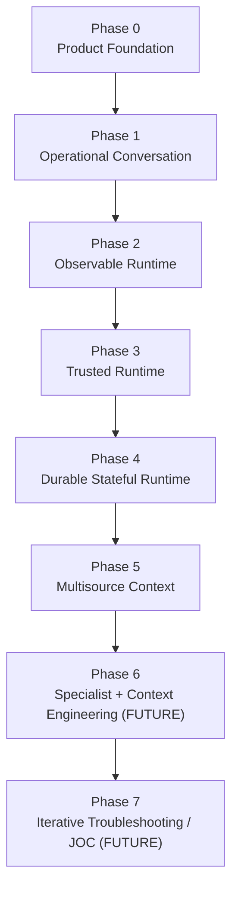
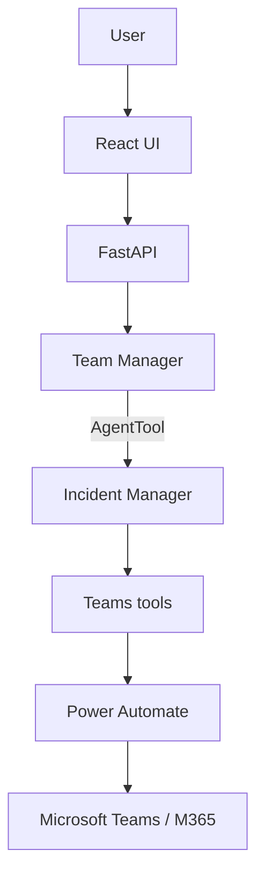
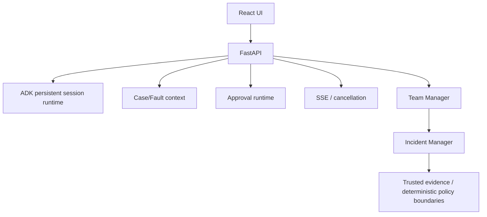
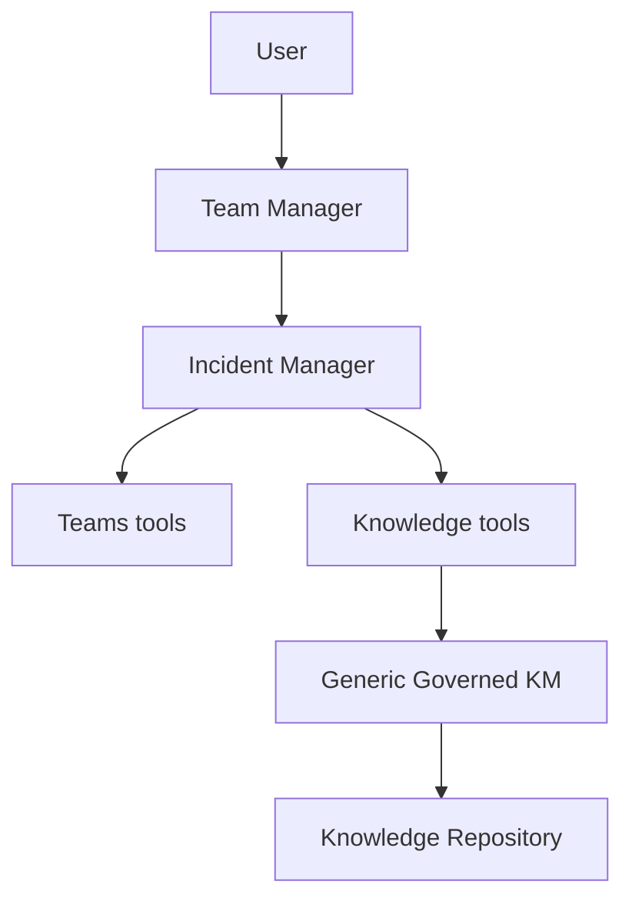
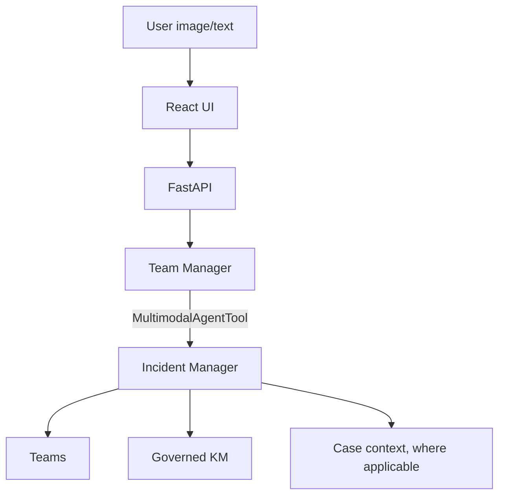
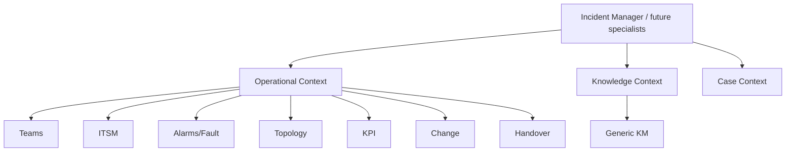
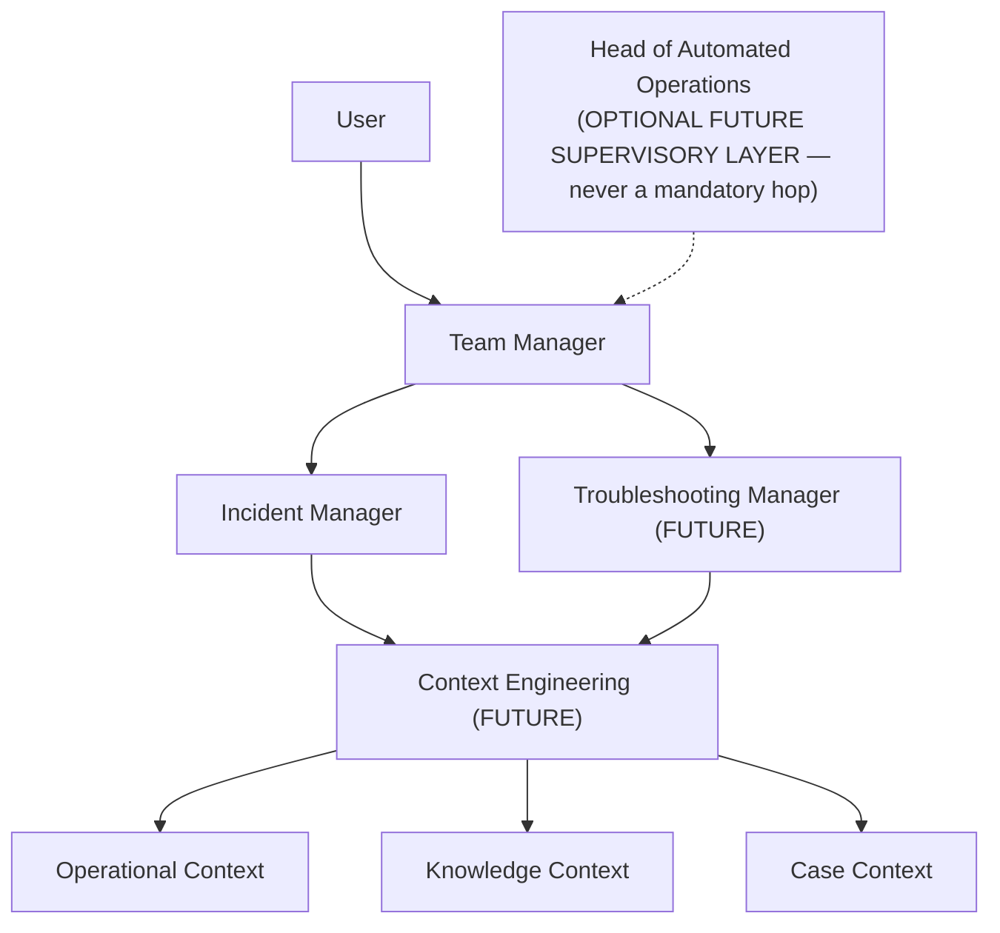
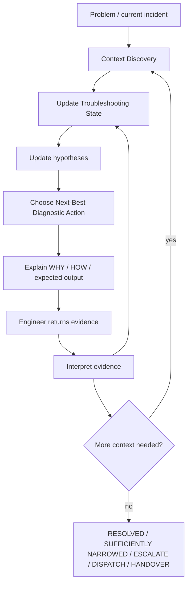

# SLOPANOC — FULL BUILD SEQUENCE

## What this document is

This is the canonical, detailed, current strategic build sequence for
SLOPANOC — Phase 0 through Phase 7, in dependency order.

- **`docs/implementation-handoff/*`** (including
  `04_BACKEND_BUILD_SEQUENCE.md`) documents remain **historical**
  pre-backend planning artifacts. They are not updated to reflect current
  status and must not be treated as current truth.
- **`README.md`** is the public repository entry point — current
  capability, quick-start, and a summarized roadmap.
- **`docs/BUILD_SEQUENCE.md`** (this document) is the detailed, current
  build-order truth — the full strategic dependency sequence, the
  reasoning behind that order, and how the runtime topology evolves
  phase by phase.
- **`docs/TROUBLESHOOTING_STRATEGY.md`** is the non-negotiable product
  target for SLOPANOC's long-term troubleshooting experience (Phase 7).
  It does not track day-to-day implementation status beyond a short
  current/next/future summary.
- **`docs/AGENT_CONTRACT.md`**, **`docs/KNOWLEDGE_CONTRACT.md`**, and
  **`docs/TEAMS_TOOL_CONTRACT.md`** remain authoritative for their own
  bounded domains (agent delegation/trust boundary, Generic Knowledge
  Management, and the Teams tool contract, respectively) and are not
  duplicated here.
- **`CLAUDE.md`** is the working-session guide for coding agents; its own
  "LOCKED ROADMAP" section is the line-item execution log this document
  summarizes strategically.

If this document and the actual implementation ever disagree, the
implementation wins — that is a signal this document needs a correction,
not that the code is wrong.

---

## Current checkpoint

| Phase | Status |
|---|---|
| Phase 0 — Product Foundation | ✅ COMPLETE |
| Phase 1 — Teams / Operational Conversation | ✅ COMPLETE |
| Phase 2 — Observability / Performance | ✅ COMPLETE |
| Phase 3 — Trusted Runtime | ✅ COMPLETE |
| Phase 4A–4G | ✅ COMPLETE |
| Phase 4H — Security Hardening | FUTURE (after A5) |
| Phase 5.1 — Generic Governed Knowledge | ✅ COMPLETE |
| POST-5.1 A — Cloud SQL PostgreSQL | ✅ COMPLETE |
| POST-5.1 B0–B6 — Multimodal Attachments | ✅ COMPLETE |
| POST-5.1 B7 — Lifecycle + Real UI + Full Regression | ← **NEXT** |
| A5 — Real TELCO/RAN MOP ingestion | FUTURE |
| Phase 4H — Security Hardening | FUTURE |
| 5.2–5.7 — Operational Integrations | FUTURE |
| Phase 6 — Agent Expansion + Context Engineering | FUTURE |
| Phase 7 — Advanced Troubleshooting / JOC | FUTURE (product target) |

B6 checkpoint commit: `2b0e88f` — "feat: complete B6 multimodal specialist
runtime".

---

## 1. Complete recommended build sequence

```text
PHASE 0 — Product Foundation

PHASE 1 — Teams / Operational Conversation

PHASE 2 — Observability / Performance

PHASE 3 — Trusted Runtime

PHASE 4 — Reliable Stateful Runtime
  4A State Synchronization
  4B Approval Runtime
  4C Session Persistence
  4D Case / Fault Context
  4E ADK SSE Runtime
  4F React / Backend Integration
  4G Approval UX
  4H Security Hardening — future, after A5

PHASE 5 — Context + Operational Integrations

  5.1 Generic Governed Knowledge — COMPLETE

  POST-5.1 A Cloud SQL PostgreSQL — COMPLETE

  POST-5.1 B Multimodal Attachments:
    B0 Architecture + ADK persistence audit — COMPLETE
    B1 Persistent Attachment Foundation — COMPLETE
    B2 Attachment Upload / Retrieve API — COMPLETE
    B3 Complete Frontend Attachment UX — COMPLETE
    B4A Rehydration Architecture + ADK Event Audit — COMPLETE
    B4B Safe Session List / History — COMPLETE
    B4C Saved Chat + Lazy Transcript Hydration — COMPLETE
    B4D Persisted Attachment Hydration — COMPLETE
    B5 Gemini / ADK Multimodal Runtime — COMPLETE
    B6 Image + Teams + KM Operational Reasoning — COMPLETE
    B7 Lifecycle + Real UI + Full Regression — NEXT

  A5 Real TELCO/RAN MOP Ingestion

  Phase 4H Security Hardening

  5.2 ITSM
  5.3 Alarm / Fault
  5.4 Topology / Inventory
  5.5 KPI / Observability
  5.6 Change Management
  5.7 Handover / Operational Context

PHASE 6 — Agent Expansion + Context Engineering

PHASE 7 — Advanced Troubleshooting / JOC
```

This sequence is locked — do not reorder it. `CLAUDE.md`'s own "LOCKED
ROADMAP" section is the authoritative line-item version of the POST-5.1 B
execution sequence specifically; this document summarizes the same order
at the strategic phase level and extends it backward (Phase 0–4) and
forward (Phase 6–7).

---

## 2. Updated strategic progression

Each phase is explained in terms of its objective, the capability it
introduces, why it depends on the phase before it, and what it
deliberately does **not** introduce yet.

### Phase 0 — Product Foundation

**Objective:** can the user understand and use the product immediately?

**Capability introduced:** the calm, minimal, always-usable chat shell —
composer, conversation view, sidebar — that every later phase's real
functionality is delivered through. Originally a UI/UX-only prototype on
local mock state.

**Depends on:** nothing — this is the starting point.

**Deliberately does not introduce:** any backend, any model call, any
real data. Purely the interaction shell and design language.

### Phase 1 — Teams / Operational Conversation

**Objective:** can SLOPANOC work with a real operational conversation?

**Capability introduced:** a real FastAPI backend and Gemini/ADK
orchestration (Team Manager → Incident Manager → Teams tools → Power
Automate → Microsoft Teams). Chat discovery, deterministic name
resolution, message retrieval, semantic extraction (decisions, actions,
proposals, open questions, risks), and Teams write proposals gated by
approval.

**Depends on:** Phase 0's shell — this phase wires it to something real
for the first time.

**Deliberately does not introduce:** persistence beyond a single process
run, observability/timing instrumentation, any trust-boundary hardening
beyond the basic approval gate, or any context source besides Teams.

### Phase 2 — Observability / Performance

**Objective:** can runtime cost, latency, and orchestration behavior be
measured?

**Capability introduced:** per-model-call performance/timing
instrumentation, a process-lifetime-shared model client, model warm-up,
and the diagnostic groundwork later latency-sensitive passes (P4B's
call-graph compression, the direct fast path) build on.

**Depends on:** Phase 1 — there is nothing to measure until a real
orchestration path exists.

**Deliberately does not introduce:** a production observability/alerting
stack — this is developer-diagnostic instrumentation only.

### Phase 3 — Trusted Runtime

**Objective:** can evidence and actions crossing the model boundary be
trusted?

**Capability introduced:** the trust-boundary discipline this entire
project is built around — deterministic Python (never model reasoning)
enforcing destination binding, evidence provenance (`SourceReference`
validated against actually-retrieved message IDs), and write-action
approval (`ActionProposal` → trusted API approve/reject → re-validated
execution). Selection (disambiguation) established as a separate
mechanism from approval.

**Depends on:** Phase 1's real Teams read/write surface — there is
nothing to make trustworthy until real evidence and real write actions
exist.

**Deliberately does not introduce:** persistent session/case state,
streaming, or any context source beyond Teams — this phase is about the
trust mechanism itself, generalized later (Phase 5) to Knowledge and
image evidence.

### Phase 4 — Reliable Stateful Runtime

**Objective:** can the system preserve session, case, approval,
conversation, and UI state correctly?

**Capability introduced (4A–4G):** cross-turn state synchronization
(`selected_teams_chat_id`, evidence continuity), the full approval
runtime, persistent ADK sessions (`DatabaseSessionService`), a separate
optional Case/Fault context store, real SSE streaming with a
background-task turn model and true mid-run cancellation, the React ↔
backend integration, and approval UX (ApprovalCard/SelectionCard as
first-class conversation elements). **4H (Security Hardening)** is
deliberately deferred — see below.

**Depends on:** Phase 3's trust primitives — state synchronization and
persistence are only meaningful once there is trustworthy state to
persist.

**Deliberately does not introduce:** any context source beyond Teams, and
— critically — **4H is NOT bundled into 4A–4G**. Security hardening is
scheduled deliberately late (after A5, before 5.2), once the full context
surface (Teams + Generic KM + multimodal) that 4H must actually harden
already exists, rather than hardening a boundary that keeps moving.

### Phase 5 — Context + Operational Integrations

**Objective:** can specialists reason from governed, multisource
operational context?

**Capability introduced:** Generic Governed Knowledge (5.1 — a
source-agnostic KM platform capability, independent of Incident Manager,
with Incident Manager as its first reference consumer), a Cloud SQL
PostgreSQL production-grade persistence option (POST-5.1 A), multimodal
image attachments culminating in trusted specialist-level image + Teams +
governed-KM combined reasoning (POST-5.1 B0–B6), and — later in this same
phase — real TELCO/RAN knowledge content (A5), security hardening (4H,
scheduled here because this is where the full context surface it must
protect is finally in place), and the remaining Operational Context
sources (5.2–5.7: ITSM, Alarms, Topology, KPIs, Change, Handover).

**Depends on:** Phase 4's durable, trustworthy runtime — governed
knowledge and multimodal evidence are only safe to introduce once
session/case/approval state and the trust boundary are both solid.

**Deliberately does not introduce:** a Troubleshooting Manager, a
Context Engineering Layer, or any persistent troubleshooting state —
Phase 5 builds the context *sources* multisource reasoning needs; it
does not build the iterative troubleshooting *loop* itself (that is
Phase 7). It also deliberately does not build a Knowledge Agent — Generic
KM is a tool surface behind the existing Incident Manager, never a new
agent.

### Phase 6 — Agent Expansion + Context Engineering

**Objective:** can context assembly and specialist responsibilities scale
cleanly as more sources and more specialists are added?

**Capability introduced (target, not built):** a Context Engineering
Layer that assembles bounded Operational/Knowledge/Case context for a
specialist from whatever sources exist at the time; a second specialist
(Troubleshooting Manager) alongside Incident Manager; an optional
supervisory Head of Automated Operations layer.

**Depends on:** Phase 5 having produced more than one real context source
(Teams, Generic KM, and eventually 5.2–5.7) — there is nothing to
"engineer" the assembly of until multiple real sources exist.

**Deliberately does not introduce:** the troubleshooting loop itself
(Phase 7) — Phase 6 is about *architecture* (how context and specialists
scale), not about the diagnostic reasoning loop that consumes that
architecture.

### Phase 7 — Advanced Troubleshooting / JOC

**Objective:** can SLOPANOC determine what to check next, interpret new
evidence, update hypotheses, and continue until resolution or escalation
— the product's non-negotiable long-term target, defined in full in
`docs/TROUBLESHOOTING_STRATEGY.md`?

**Capability introduced (target, not built):** persistent Troubleshooting
State (problem, symptoms, known facts, unknowns, hypotheses, eliminated
hypotheses, actions performed, evidence, relevant knowledge, current
MOP/SOP, current diagnostic step, expected/actual result, next action,
resolution state), a next-best-diagnostic-action loop, and defined end
states (RESOLVED / SUFFICIENTLY NARROWED / ESCALATE / DISPATCH /
HANDOVER).

**Depends on:** Phase 6's context-engineering architecture and multiple
real Operational Context sources — an iterative diagnostic loop is only
useful once there is enough real, governed, multisource context to
iterate over.

**Deliberately does not introduce:** controlled autonomy (a possible
later phase beyond this document's current scope) — Phase 7 is
conversational and user-in-the-loop throughout; it does not execute
remediation on its own.

---

## 3. Strategic transition — Phase 0 → Phase 7



Phase 7 is the product strategy target defined in
`docs/TROUBLESHOOTING_STRATEGY.md`. **It is not implemented today.**
Phases 0–5 (through POST-5.1 B0–B6) are complete; POST-5.1 B7 is the
current next step within Phase 5.

---

## 4. Complete topology evolution

### A. Phase 1 topology



### B. Phase 3/4 trusted + stateful topology



### C. Phase 5.1 topology (Generic Governed Knowledge)



**There is no Knowledge Agent.** `knowledge_search`/
`knowledge_select_evidence` are tools directly on Incident Manager, the
same way Teams tools already are — Generic KM is a capability behind
Incident Manager, never a peer agent.

### D. Current (B6) topology



Attachments: private GCS binary + Cloud SQL metadata/reference. No
bytes/base64/OCR intermediary — `Part.from_uri` only. Team Manager
remains the sole user-facing agent; Incident Manager receives the same
trusted current-turn image evidence Team Manager sees, propagated by a
narrow `MultimodalAgentTool` adapter, never model-controlled.

### E. End-of-Phase-5 topology (once 5.2–5.7 land)



### F. Phase 6 target topology



Head of Automated Operations appears only as an optional future
supervisory layer — it must never be shown, or built, as a mandatory hop
in the user-facing runtime path.

### G. Phase 7 troubleshooting loop topology (target, not built)



---

## 5. POST-5.1 B7 — Lifecycle + Real UI + Full Regression (next)

Scoped strictly to lifecycle/UI/regression completion — not new
reasoning capability. Known follow-up items carried from B6:

- Source-chip rendering/polish (a visible "svg" artifact observed during
  B6 live validation).
- Duplicate-looking KM source presentation — disambiguation, without
  weakening real provenance (two distinct, content-overlapping approved
  fixtures may legitimately produce two distinct, correctly-selected
  source references; this is not a backend defect to "fix" by deduping).
- Attachment lifecycle completion (deletion, retention).
- Real UI edge cases.
- Full backend regression.
- Full frontend regression/build.
- Cloud SQL-backed live validation (see the policy below — mandatory from
  B7 onward).

Do not invent B7 implementation details beyond what this document and
`CLAUDE.md`'s own roadmap already establish.

---

## 6. Mandatory Cloud SQL runtime policy (from B7 onward)

Adopted at B6 closure, binding for B7 and every milestone after it:

- All live UI validation, all manual validation, all end-to-end
  validation, all integration validation, all restart/persistence
  validation, and all other production-like validation — for governed
  Knowledge and every other persistent SLOPANOC domain — **must use Cloud
  SQL PostgreSQL**.
- SQLite/in-memory persistence remains permitted **only** for isolated
  automated tests, where storage isolation is a deliberate, correct
  choice.
- `SLOPANOC_DATABASE_URL` and `SLOPANOC_KNOWLEDGE_DATABASE_URL` (or their
  `*_SECRET_RESOURCE` Secret Manager equivalents) remain **logically
  separate** configuration domains, even when they currently resolve to
  the same Cloud SQL database. No implicit fallback from the Knowledge
  setting to the general database setting is permitted.
- An environment with neither `SLOPANOC_KNOWLEDGE_DATABASE_URL` nor
  `SLOPANOC_KNOWLEDGE_DATABASE_SECRET_RESOURCE` configured is **not** a
  valid production-like KM validation environment — no live KM validation
  result from it may be accepted as closing a milestone.
- Historical exception, preserved as an accurate record, never reopened:
  B6's own live Tests B/C correctly used the local SQLite governed-KM
  fallback because this policy did not yet exist at the time. B6 remains
  DONE; those tests are never rewritten as Cloud SQL tests.

See `CLAUDE.md`'s "CURRENT PERSISTENCE / RUNTIME" section for the full
policy text and the B7 precondition checklist (verify Cloud SQL
resolution for both domains, table reachability, and required controlled
validation knowledge before B7 live work begins).

---

## 7. Phase 5.1 status (complete, frozen)

Generic Governed Knowledge is implemented and complete — not NEXT, not
planned. Sequence (all sub-phases complete):

```text
5.1A Knowledge architecture + contracts
5.1B Metadata + applicability
5.1C Generic ingestion boundary
5.1D Content processing / structured segmentation
5.1E Versioning + lifecycle governance
5.1F Knowledge repository abstraction
5.1G Retrieval + ranking
5.1H Knowledge provenance
5.1I Generic agent-facing Knowledge tools
5.1J First reference consumer integration (Incident Manager)
```

Generic KM remains independent of Incident Manager by design — Incident
Manager is its first reference consumer, not its owner. No Knowledge
Agent exists or is planned; `knowledge_search`/`knowledge_select_evidence`
are tools on Incident Manager, exactly like the Teams tools. Full contract
in `docs/KNOWLEDGE_CONTRACT.md`.

---

## 8. A5 status (not started)

A5 — **Real TELCO/RAN MOP ingestion** — has not started. It ingests the
real TELCO/RAN MOPs through the existing, unchanged Generic KM pipeline:

```text
MOP
  → source/import boundary
  → IngestedKnowledgeDocument
  → structured processing
  → governance
  → KnowledgeRepository
  → Cloud SQL PostgreSQL
  → retrieval
  → selected evidence
  → specialist reasoning
```

No MOP-specific architecture is introduced — A5 is a content-ingestion
milestone against the same generic pipeline Phase 5.1 already built, not
a new capability.

---

## 9. Phase 7 product principle (preserved, not reopened here)

SLOPANOC must deliver **iterative, evidence-driven, conversational
troubleshooting — one useful diagnostic step at a time.** Central
question: *"What should I check next, and why?"*

Future Troubleshooting State conceptually includes: Problem, Symptoms,
Known facts, Unknowns, Hypotheses, Eliminated hypotheses, Actions already
performed, Evidence, Relevant knowledge, Current MOP/SOP, Current
diagnostic step, Expected result, Actual result, Next action, Resolution
state.

End states: RESOLVED, SUFFICIENTLY NARROWED, ESCALATE, DISPATCH,
HANDOVER.

This loop is **not implemented today**. Phase 5 (through B6) built a
prerequisite — trusted, multisource, current-evidence reasoning for a
single request — not the loop itself. The full, non-negotiable strategy
lives in `docs/TROUBLESHOOTING_STRATEGY.md` and is not restated in
detail here.
