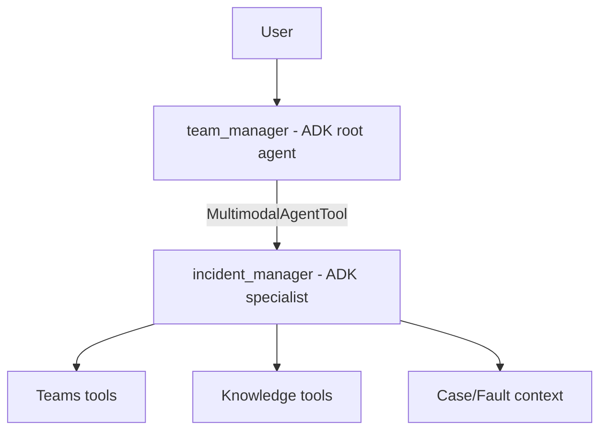
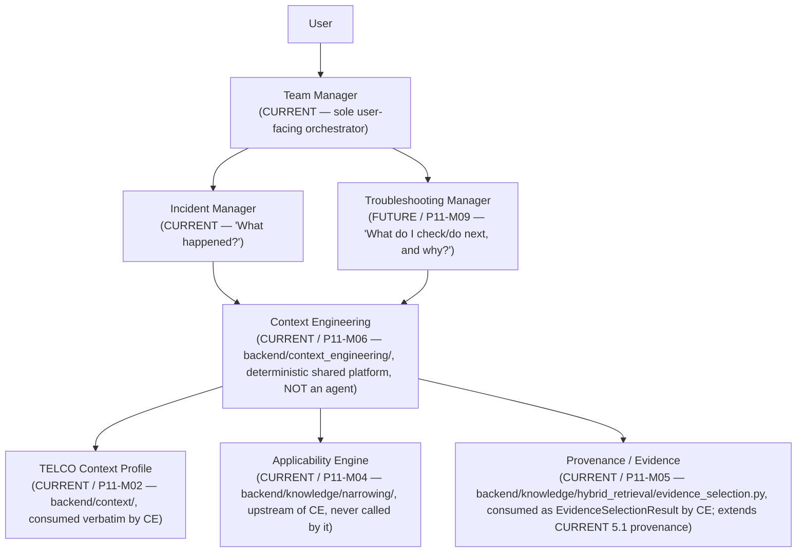
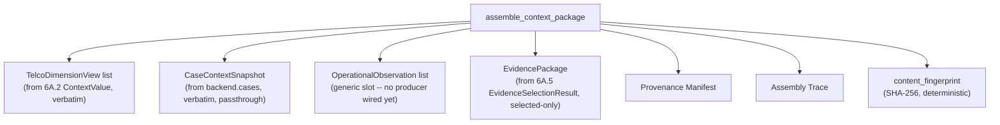

# Intelligence Architecture — Phase 6A (canonical P11)

Status: **P11-M00 / 6A.0 (architecture/contract freeze) — COMPLETE.
P11-M01 / 6A.1 (GCP physical-architecture decision record) — COMPLETE.
P11-M02 / 6A.2 (TELCO Context & Applicability Model) — COMPLETE, first
Phase 6A milestone with real implemented runtime/persistence code (§6
below). P11-M03 / 6A.3 (Multimodal Knowledge Ingestion & Provenance) —
COMPLETE, industrializing the existing A5 pipeline (§8 below); also
found and fixed a real, confirmed defect (DEF-0017,
`docs/DEFECT_REGISTER.md`). The 6A.3 corrective addendum (Knowledge
Asset Metadata Standard) — COMPLETE, additive, see §9/`docs/KNOWLEDGE_
CONTRACT.md` §25 — is a bounded pass attached to 6A.3, not a renumbered
sub-milestone. P11-M04 / 6A.4 (Deterministic TELCO Applicability &
Knowledge Narrowing) — COMPLETE, the two-gate deterministic narrowing
engine (§9 below, `docs/KNOWLEDGE_CONTRACT.md` §26) — including a
subsequent corrective pass ("Unspecified Applicability Must Fail
Closed") also COMPLETE. P11-M05 / 6A.5 (Hybrid Knowledge Retrieval &
Evidence Selection) — **COMPLETE**: exact/lexical/semantic retrieval,
fusion, reranking, evidence selection, and real embedding generation are
all implemented and validated end to end against the real DEV Cloud SQL
database, including a real pgvector `<=>` similarity search. The
earlier-confirmed `CREATE EXTENSION vector` privilege denial on that
same database was resolved externally mid-milestone, never worked
around (`docs/KNOWLEDGE_CONTRACT.md` §27.7/§27.9/§27.10). P11-M06 / 6A.6
(Context Engineering & Evidence Package) — **COMPLETE**:
`backend/context_engineering/` implements a pure, deterministic
`assemble_context_package` composing 6A.2 TELCO Context, Case Context,
session/request context, a generic (currently unpopulated) Operational
Context slot, and 6A.5's own `EvidenceSelectionResult` into one
versioned, fingerprinted `ContextPackage` — never an agent, never an LLM
call, never an independent path to Knowledge (`docs/KNOWLEDGE_CONTRACT
.md` §28). P11-M07 / 6A.7 (Skills Framework) — **COMPLETE**:
`backend/skills/` implements the canonical typed `SkillDefinition`
contract, deterministic semantic versioning/content fingerprinting, a
strict fail-closed declarative (YAML) loader, a deterministic registry
(exact + latest-active resolution, duplicate-identity rejection), and
`ContextPackage`-aware readiness + typed-only applicability evaluation —
never an agent, never an LLM call, never a Tool executor, never wired
into Team Manager/Incident Manager/Context Engineering
(`docs/KNOWLEDGE_CONTRACT.md` §29). P11-M08 / 6A.8 (Experience Memory
Foundation) — **COMPLETE**: `backend/experience_memory/` implements a
typed, durably-persisted `ExperienceRecord` foundation (Cloud SQL,
deterministic `ACCEPT`/`REJECT`/`INDETERMINATE` admission, owner/
customer-isolated structured retrieval) — zero production writers/
consumers wired at the time 6A.8 itself closed. P11-M09 / 6A.9
(Troubleshooting Manager & Intelligence Assembly) — **COMPLETE** (§19
below): `backend/troubleshooting_intelligence/` implements a pure,
deterministic `assemble_troubleshooting_intelligence`, and `backend/
agents/troubleshooting_manager/` implements the first Troubleshooting
Manager specialist reasoning boundary — the first PRODUCTION CONSUMER of
both 6A.7 Skills and 6A.8 Experience Memory, though still NOT wired into
`team_manager` (that dual-specialist orchestration is 6A.10's own
scope). P11-M10 / 6A.10 (Dual-Specialist Orchestration) — **COMPLETE**
(§20/§21 below): `team_manager` now reaches `troubleshooting_manager` as
a sibling of `incident_manager` via a plain `FunctionTool`, never an
`AgentTool`. P11-M11 / 6A.11 (Integrated TELCO Validation & Phase 6A
Freeze) — **COMPLETE**: Phase 6A / P11 (`6A.0`–`6A.11`) is now formally
COMPLETE AND FROZEN — see CLAUDE.md's own 6A.11 closure section for the
freeze record. (This paragraph's own earlier text above, stopping at
6A.9, predates 6A.10/6A.11's own completion — corrected here; per this
document's own authority split immediately below, `docs/MASTER_ROADMAP
.md` remains the canonical source for exact roadmap STATUS.)** This
document is
authoritative for the
internal architecture, boundaries, contracts, and sub-milestone
**definitions** of **Phase 6A — Intelligence Architecture Foundation**
(canonical `P11`): the TELCO Context model, the Context Engineering
platform-layer boundary, the deterministic applicability-before-retrieval
narrowing order, the hybrid-retrieval boundary, the multimodal-knowledge
provenance hierarchy, the Skill and Experience Memory boundaries as they
apply inside Phase 6A, the Next Check / Mitigation / Resolution / RCA
troubleshooting-objective distinction, and what each of `6A.0`–`6A.11`
*is*. **Most of this document records target architecture only and
implements no runtime capability — §6, §8, and §9 are the exceptions,
now marked CURRENT/IMPLEMENTED after 6A.2/6A.3/6A.4.** This document
still owns
neither roadmap status nor strategic build order — see the authority
split immediately below. Every diagram, contract, and rule below that is not
explicitly marked CURRENT is target architecture only.

## Authority and relationship to other canonical documents

**Three-way status/order/architecture split (corrected during 6A.1 — the
6A.0 closure report's own wording overstated this document's authority):**

```text
docs/MASTER_ROADMAP.md          = canonical roadmap STATUS
                                   (what is COMPLETE/NEXT/PLANNED/IN
                                   PROGRESS right now, for every
                                   milestone including each Phase 6A
                                   sub-milestone)

docs/BUILD_SEQUENCE.md          = canonical strategic BUILD ORDER
                                   (the Phase 0 -> Phase 7 dependency
                                   sequence Phase 6A sits inside)

docs/INTELLIGENCE_ARCHITECTURE.md = canonical Phase 6A internal
                                   architecture, boundaries, contracts,
                                   and sub-milestone DEFINITIONS
                                   (this document — what 6A.0-6A.11
                                   *are*, never whether one is done)
```

This document does not replace or duplicate the following — where a
question is already answered by one of them, that document remains
authoritative and this document only cross-references it:

| Domain | Authoritative document |
|---|---|
| Agent roster, topology, delegation contract, trust boundaries, approval | `docs/AGENT_CONTRACT.md` |
| Generic Governed Knowledge: domain, ingestion, governance, repository, 5.1 retrieval/ranking, 5.1 provenance, generic tools | `docs/KNOWLEDGE_CONTRACT.md` |
| Teams tool contract: read/write flows, hosted-content/media contract | `docs/TEAMS_TOOL_CONTRACT.md` |
| Non-negotiable troubleshooting product principle, Phase 7 target loop | `docs/TROUBLESHOOTING_STRATEGY.md` |
| Full Phase 0–7 strategic build order, dependency rationale, topology evolution | `docs/BUILD_SEQUENCE.md` |
| Chronological milestone ledger, canonical IDs, current roadmap **status** (including each Phase 6A sub-milestone's own COMPLETE/NEXT/PLANNED state) | `docs/MASTER_ROADMAP.md` |
| Confirmed defect history | `docs/DEFECT_REGISTER.md` |
| Working-session narrative, locked roadmap | `CLAUDE.md` |

**This document never states or tracks status** (COMPLETE/NEXT/PLANNED)
for any sub-milestone other than itself (6A.0) — §15's table below lists
each sub-milestone's *scope*, and links to `docs/MASTER_ROADMAP.md` for
its current status, to avoid two documents each claiming to be the
status authority. If this document and one of the above disagree about a
rule inside that document's own domain, the domain-specific document
wins and this document should be corrected. If this document and any of
the above disagree about **Phase 6A's own internal architecture/
definitions** (the material that has no other home — TELCO Context,
Context Engineering internal structure, hybrid retrieval boundary, the
multimodal knowledge provenance hierarchy, and the troubleshooting-
objective distinction), this document wins — but never for status or
build order, which this document does not own.

---

## 1. Current agent topology (unchanged by this document)



`team_manager` is the sole user-facing agent. `incident_manager` is the
only specialist actually wired into a live USER turn, invoked via
`AgentTool` (a `MultimodalAgentTool` subclass for current-turn image
propagation). There is no Knowledge Agent, no Context Agent, and no
Router Agent anywhere in the codebase today. This diagram is UNCHANGED
by 6A.9 — `troubleshooting_manager` exists as a real specialist module
(see below) but is deliberately absent from this live-turn diagram,
because no `AgentTool(agent=troubleshooting_manager)` exists anywhere in
`team_manager.tools` (confirmed by a real, empty, scoped `git diff`
against `backend/agents/team_manager/` — see §19 below); that wiring is
6A.10's own scope.
**UPDATED, P11-M07 / 6A.7:** `backend/skills/` now exists as a typed,
declarative Skill CONTRACT (`SkillDefinition`, registry, readiness,
applicability) — but it remains, per its own explicit design, NOT a
Skill runtime/execution engine: no Skill is ever selected or executed
by anything wired into a LIVE user turn, and no LIVE-turn agent/tool
file anywhere imports `backend.skills` (confirmed by a real, empty,
scoped `git diff` across `backend/agents/team_manager/`, `backend/
agents/incident_manager/`, and every `backend/tools/` file — see §11
and `docs/KNOWLEDGE_CONTRACT.md` §29). **UPDATED, P11-M08 / 6A.8:**
`backend/experience_memory/` now exists as a typed, persisted,
deterministic Experience Memory FOUNDATION (`ExperienceRecord`,
admission, Cloud SQL repository/service, structured retrieval) — but it
remains, per its own explicit design, NOT a reasoning/recommendation
engine and has zero production WRITERS wired: no current event
automatically records an Experience, and no LIVE-turn agent/tool/
Context-Engineering file anywhere imports `backend.experience_memory`
(see §12 and `docs/KNOWLEDGE_CONTRACT.md` §30). **UPDATED, P11-M09 /
6A.9 (§19 below):** `backend/agents/troubleshooting_manager/` now
exists as a real, second SPECIALIST — the first PRODUCTION CONSUMER of
both `backend.skills` (Skill resolution) and `backend.experience_memory`
(bounded, owner-scoped query) — but it is invoked ONLY via its own
direct/internal invocation surface (`runtime.run_troubleshooting_
assessment`), never through a live user-facing `team_manager` turn; the
diagram above remains the accurate live-turn topology until 6A.10 wires
it in. This section otherwise restates
`docs/AGENT_CONTRACT.md` §1–§2 for orientation only; that document
remains authoritative for the agent roster and delegation contract.

## 2. Phase 6A target topology



`TELCO Context Profile`, `Applicability Engine`, and `Context
Engineering` itself are now all CURRENT/implemented (6A.2, 6A.4, 6A.6).
`Context Engineering` (`backend/context_engineering/`) CONSUMES the
already-computed outputs of the other two — it has no code path back
into either (proven by `backend/tests/context_engineering/
test_dependency_boundary.py`/`test_no_knowledge_bypass.py`). Neither
`Context Engineering` nor its inputs are wired into Incident Manager or
the live `knowledge_search` tool yet — that live-wiring is explicitly
future scope (6A.9/6A.10, specialist integration/orchestration), not
part of 6A.6's own contract-and-assembly scope.

`Team Manager` remains the only user-facing agent. `Incident Manager`
remains the specialist primarily responsible for **"What happened?"**
(current-state/incident understanding). `Troubleshooting Manager`
(CURRENT, P11-M09 / 6A.9 — see §19) is the second specialist,
responsible for **"What should I check or do next, and why?"**. Neither
specialist owns Context Engineering; both consume it. Context
Engineering is a deterministic shared platform capability, not an LLM
agent — see §4.

**`Troubleshooting Manager` is now REACHABLE FROM `Team Manager`
(CURRENT, P11-M10 / 6A.10 — see §20).** `team_manager.tools` now
includes a `troubleshooting_manager` capability — but, per the audit
`docs/AGENT_CONTRACT.md` §12/6A.10's own closure record performed, this
is deliberately a plain ADK `FunctionTool` wrapper
(`backend/agents/team_manager/troubleshooting_tool.py`), NEVER
`AgentTool(agent=troubleshooting_manager)`: the wrapper must run the
6A.9 deterministic preparation pipeline (Skill resolution, Experience
query, Intelligence Assembly, grounding validation) BEFORE the
`troubleshooting_manager` model is invoked, which a plain `AgentTool`
has no way to do (it would build the nested agent's `Content` directly
from raw tool arguments, bypassing 6A.9 entirely). The wrapper calls
ONLY the canonical 6A.9 direct-invocation surface, `run_troubleshooting_
assessment` — it never re-implements Intelligence Assembly. `Team
Manager` decides, via its own ordinary model reasoning (never a
keyword/regex router), whether a request needs `incident_manager`,
`troubleshooting_manager`, both, or neither — see §20 for the full,
as-built dual-specialist orchestration contract.

## 3. Closed vocabulary — do not invent new categories

```text
Agent                = genuine reasoning boundary
Tool / Connector      = deterministic capability
Skill                 = CURRENT (6A.7) reusable methodology/behavior
                         contract, `backend/skills/`; SELECTION and
                         EXECUTION by an agent remain FUTURE — never an
                         agent itself
Context Engineering   = CURRENT (6A.6) deterministic shared platform
                         capability, never an agent
Knowledge             = governed shared information source
                         (Generic KM, CURRENT — docs/KNOWLEDGE_CONTRACT.md)
Memory (Experience)   = FUTURE historical-experience source, never
                         Approved Knowledge
```

**Do not introduce**, in Phase 6A or later, a Knowledge Agent, a Context
Agent, a Router Agent, a Memory Agent, a Skill Agent, or a
vendor/domain-named agent (an "Ericsson Agent," a "Nokia Agent," a "RAN
Agent," a "CORE Agent," a "VSWR Agent," a "Cell Down Agent") — unless a
future milestone produces hard evidence that another independent
reasoning boundary is genuinely necessary, which is not the case for any
capability named in this document. TELCO scale is handled through data,
metadata, applicability, retrieval, Skills, and deterministic Context
Engineering — not agent proliferation. This restates and does not
weaken `docs/AGENT_CONTRACT.md` §3/§3a/§12 and
`docs/TROUBLESHOOTING_STRATEGY.md` §12a/§16.

## 4. Context Engineering as a platform layer, not an agent — CURRENT
(implemented, P11-M06 / 6A.6)

```text
Context Engineering (CURRENT / P11-M06)
= a deterministic, in-process, shared platform capability
  (`backend/context_engineering/`) that assembles bounded,
  provenance-preserving `ContextPackage`s for a future specialist
  reasoning layer -- never an agent, never an LLM call, never itself a
  Knowledge/Case/TELCO-Context authority.
```

**Status: IMPLEMENTED**, in `backend/context_engineering/` — see
CLAUDE.md's own 6A.6 closure section and `docs/KNOWLEDGE_CONTRACT.md`
§28 for the full as-built contract. This section is updated in place to
describe the AS-BUILT model, mirroring §6/§8/§9's own precedent.

As-built internal structure (`contracts.py`/`assembly.py`/
`fingerprint.py`/`rendering.py`):



`assemble_context_package` is a PURE function: every input
(`ContextPackageInput`) is already-computed data the caller supplies —
the function itself has NO database access, NO Knowledge search, and NO
LLM call anywhere (enforced by `backend/tests/context_engineering/
test_dependency_boundary.py` and `test_no_knowledge_bypass.py`'s AST-
level source-scan proofs). It assembles context from: TELCO Context
(CURRENT, 6A.2, consumed verbatim via `ContextValue`), Case Context
(CURRENT, `backend.cases.schemas.CaseContextSnapshot`, consumed
verbatim), session/request context (CURRENT, the same bounded
`chat_topic`/`question`/`requested_time_range` shape `IncidentManager
Request` already carries), Operational Context (a generic, forward-
compatible SLOT — `OperationalObservation` — with NO producer wired in
this codebase yet; ITSM/Alarm/Topology/KPI/Change/Handover connectors,
P13/5.2–5.7, remain the future sources that would populate it), and 6A.5
Knowledge evidence (CURRENT, consumed as an already-narrowed, already-
retrieved, already-SELECTED `EvidenceSelectionResult` only — never the
raw corpus, never a re-run of narrowing/retrieval). Skills (CURRENT,
6A.7, `backend/skills/` — see §11) now exist as a separate, typed,
declarative contract; Context Engineering itself has NOT been wired to
consume Skills yet (no import of `backend.skills` exists anywhere in
`backend/context_engineering/`, confirmed by 6A.7's own dependency-
boundary test) — that live composition remains future scope. Experience
Memory (FUTURE, 6A.8) remains entirely unimplemented — the
`ContextPackage` contract is designed to coexist with both later without
requiring a breaking change (§8's own versioning discipline).
Context Engineering is never itself a `KnowledgeObject`, never itself
`Approved Knowledge`, and never a second `KnowledgeRepository` — see §7.

## 5. The TELCO intelligence flow (target, not built)

```text
LARGE TELCO KNOWLEDGE ESTATE
            v
MULTIMODAL INGESTION + PROVENANCE          (extends CURRENT A5 ingestion — §8)
            v
TELCO CONTEXT / APPLICABILITY              (§6)
            v
DETERMINISTIC NARROWING                    (§9 — before semantic search)
            v
SMALL PERMITTED CANDIDATE SET
            v
HYBRID RETRIEVAL: exact + lexical + semantic/vector   (§9)
            v
RANKING / EVIDENCE SELECTION               (extends CURRENT 5.1G/5.1H)
            v
TRUSTED CONTEXT / EVIDENCE PACKAGE         (§10)
            v
SPECIALIST REASONING
            v
      NEXT CHECK | MITIGATION | RCA        (§13)
            v
      RESOLUTION DIRECTION
```

The LLM is never expected to inspect the complete governed corpus and
decide, by reading, which of hundreds of documents might apply.
Deterministic applicability narrows the search universe first, the same
discipline Generic KM already enforces at document/version/lifecycle
scope (`docs/KNOWLEDGE_CONTRACT.md` §11, §14) — Phase 6A extends it with
a richer TELCO Context dimension set and a hybrid (exact + lexical +
semantic) retrieval mechanism, never replaces the existing deterministic
discipline with pure semantic search.

## 6. TELCO Context model — CURRENT (implemented, P11-M02 / 6A.2)

**Status: IMPLEMENTED**, in `backend/context/domain/` (domain model) and
`backend/context/sqlalchemy/` (persistence) — see CLAUDE.md's own 6A.2
closure section for the full as-built narrative and design rationale.
This section is updated in place to describe the AS-BUILT model; it is
no longer speculative target architecture for the TELCO Context domain
specifically (the rest of this document — Context Engineering, hybrid
retrieval, Skills, Experience Memory, Troubleshooting Manager — remains
target architecture, not built).

**Responsibility:** the `TelcoContextProfile` (`backend/context/domain
/models.py`) is the structured representation of what is currently known
about the customer/network/incident the specialist is reasoning about.
Unlike Generic KM's `ApplicabilityContext` (`docs/KNOWLEDGE_CONTRACT.md`
§11.5, a flat `dict[str, list[str]]` of currently-known facts, with no
memory of HOW each fact became known or whether it is disputed), TELCO
Context is append-only and provenance-aware by construction: each
dimension's current state is deterministically recomputed from its own
full history of immutable `ContextAssertion`s
(`backend.context.domain.models.reduce_dimension`/
`compute_context_state`) — never a single mutable value silently
overwritten. `ApplicabilityContext` remains exactly as it was; the two
are related in spirit (both represent "known facts for comparison") but
are deliberately separate types, since Knowledge applicability's
narrower, unchanged 5.1B question ("does this fact conflict with this
document's stated constraint?") does not need assertion history,
conflict-preservation, or provenance the way a live operational
investigation does.

The canonical, controlled dimension vocabulary (`backend.context.domain
.enums.ContextDimension` — a closed enum, not open strings, so each
dimension can carry a real per-dimension cardinality rule; see that
module's own docstring for why this deliberately differs from Generic
KM's own open-dimension design):

```text
Customer          Alarm
Account            Fault
Domain              Symptom
Subdomain            Service Impact
Vendor                Recent Change
Technology             Maintenance
Product
Network Element
Hardware
Software
Release
Site / Cell / Sector / Band
```

**Mandatory rule — UNKNOWN stays UNKNOWN.** The system must never convert
missing TELCO context into an invented fact. Every dimension evaluates to
exactly one of four states (`backend.context.domain.enums.ContextState`)
— related in spirit to Generic KM's `ApplicabilityOutcome`
(`docs/KNOWLEDGE_CONTRACT.md` §11.6) but a genuinely separate enum, with
an explicit `CONFLICTING` state for a dimension where two trusted sources
(e.g. Case Context vs. a Teams-stated fact) disagree:

```text
KNOWN        — context is known and unambiguous for this dimension
UNKNOWN      — no known context exists for this dimension
CONFLICTING  — two or more trusted sources disagree; never silently
               resolved by picking one — the conflict itself must be
               visible, never hidden behind a guessed value
NOT_APPLICABLE — the dimension does not apply to the current knowledge
               object/context at all (distinct from UNKNOWN — mirrors
               Generic KM's own NOT_APPLICABLE vs. UNKNOWN distinction,
               `docs/KNOWLEDGE_CONTRACT.md` §11.6)
```

**Corrected during implementation (6A.2):** this section originally
speculated that TELCO Context would directly reuse Generic KM's
normalization functions. Implementation found this was the wrong choice
once dependency-boundary analysis was actually done: TELCO Context and
Knowledge Context are peer domains (§4), and `backend/context/domain/`
must not import `backend.knowledge` at all (enforced by
`backend/tests/context/test_dependency_boundary.py`, the same discipline
Knowledge's own dependency-boundary test already applies to itself). The
one canonical-value normalization TELCO Context needs
(`backend.context.domain.models.default_canonical_value` — trim +
uppercase only, deliberately no alias table) is therefore a small,
independent, INTENTIONALLY duplicated implementation, not an import —
the same "duplicate a tiny helper rather than cross-import" pattern this
codebase already uses elsewhere (e.g. `multimodal_turn_context.py`'s
`trusted_image_parts_from_content`). "One canonical applicability
vocabulary" (instruction section 20) is preserved at the KNOWLEDGE
APPLICABILITY layer instead — see §7 and `backend/knowledge/domain/
telco_applicability.py`, which DOES sit inside the Knowledge package and
DOES reuse 5.1B's `normalize_dimension_key` directly, because Knowledge
Applicability is genuinely part of the Knowledge domain, unlike TELCO
Context.

## 7. One shared Governed Knowledge architecture (unchanged)

There remains **one shared Governed Knowledge platform/corpus**
(`docs/KNOWLEDGE_CONTRACT.md`, CURRENT). Phase 6A must not create an
`IncidentKnowledgeRepository`, a `TroubleshootingKnowledgeRepository`, a
vendor-named knowledge database, or any other independent knowledge
architecture. `Incident Manager` and the future `Troubleshooting Manager`
may use different retrieval policies, different queries, different
applicability constraints, and different evidence selections — but always
over the same governed lifecycle, authority, and provenance model. Both
specialists consume Knowledge; neither owns it (`docs/AGENT_CONTRACT.md`
§12, `docs/KNOWLEDGE_CONTRACT.md` §2).

**CURRENT (implemented, 6A.2):** `backend/knowledge/domain/
telco_applicability.py` — the Knowledge Applicability bridge — is a
strictly ADDITIVE extension living INSIDE the Knowledge package,
preserving "one shared Governed Knowledge architecture" exactly: it adds
`ApplicabilityScopeKind` (`CONSTRAINED`/`EXPLICIT_ANY`/`UNSPECIFIED`,
closing the ANY-vs-UNSPECIFIED gap `docs/KNOWLEDGE_CONTRACT.md` §11.2's
own open-dimension design could not previously express) alongside the
existing, completely unmodified 5.1B `Applicability`/
`evaluate_applicability`, never a second competing Knowledge repository
or matching engine. See `docs/KNOWLEDGE_CONTRACT.md` §23 for the full
as-built contract.

## 8. Multimodal knowledge as first-class — CURRENT (extends A5, industrialized 6A.3)

A5 (CURRENT, `docs/KNOWLEDGE_CONTRACT.md` — compound-artifact domain
model) already proved real DOCX/XLSX/PDF/OLE extraction with hierarchical
artifact lineage and image interpretation against real TELCO/RAN MOPs.
Phase 6A does not replace that architecture; it freezes the relationship
model every future extension of it must preserve:

**Status: INDUSTRIALIZED (P11-M03 / 6A.3).** 6A.3's own audit found A5's
extraction layers were already production-ready, but found the
compound-document -> retrievable-section bridge (`process_compound_
document`, "Layer H") was implemented and unit-tested yet never actually
wired into the real local-file ingestion entry point — meaning a real
root-level PDF or XLSX document's genuine page/sheet content never
became a retrievable `KnowledgeSection`. Closed via `ingest_and_
structure_local_file(s)` (`backend/knowledge_ingestion/local_file_
adapter.py`), proven end-to-end against the real TELCO/RAN validation
corpus including the real `KnowledgeRetrievalService`. Also found and
fixed DEF-0017 (`docs/DEFECT_REGISTER.md`): root-level XLSX/PDF
ingestion previously crashed with a dangling `parent_artifact_id`,
discovered only because 6A.3 wrote the first test that exercised this
exact path. XLSX provenance was additionally hardened with real sheet-
range and native-Excel-Table extraction. Full as-built record:
`docs/KNOWLEDGE_CONTRACT.md` §24.

```text
DOCUMENT
 └── SECTION
      ├── PARAGRAPH
      ├── PROCEDURE STEP
      ├── COMMAND
      ├── TABLE
      │    ├── ROW
      │    └── CELL / RANGE
      ├── IMAGE
      └── DIAGRAM
```

Evidence must remain capable of identifying exact provenance: document,
version, page, section, procedure step, table, sheet, cell/range,
image/figure, and parent relationship — the same hierarchical
`artifact_id`/`parent_artifact_id` lineage A5's `KnowledgeArtifact` model
already implements (`backend/knowledge/domain/artifacts.py`,
`validate_artifact_lineage`). A future extension of this model must
compose the existing `artifacts`/`artifact_id` fields on
`KnowledgeSection`/`KnowledgeObject`/`KnowledgeEvidenceReference`, never
introduce a second, competing multimodal-knowledge representation. Do not
architect a system that flattens compound content into anonymous text
chunks.

## 9. Applicability before semantic retrieval — canonical narrowing order

```text
All Governed Knowledge
        v
Customer / Account
        v
Domain
        v
Vendor
        v
Technology
        v
Product / NE
        v
HW / SW / Release
        v
Alarm / Fault / Symptoms
        v
Lifecycle / Version / Supersession       (CURRENT — docs/KNOWLEDGE_CONTRACT.md §14)
        v
Authorization
        v
Candidate Knowledge
        v
Hybrid Retrieval
```

**Status: DETERMINISTIC NARROWING IS CURRENT (P11-M04 / 6A.4).** The two
deterministic gates this diagram summarizes (authority/eligibility, then
TELCO applicability, producing a permitted candidate Knowledge-ID set)
are implemented in `backend/knowledge/narrowing/` — see `docs/KNOWLEDGE_
CONTRACT.md` §26 for the full, as-built contract. `Authorization` in this
diagram remains a RESERVED, currently-unreachable gate position
(`NarrowingReasonCode.UNAUTHORIZED` exists in code but no enforcement
mechanism exists anywhere in Governed Knowledge yet — Phase 4H's own
future scope). `Hybrid Retrieval` (below `Candidate Knowledge`) remains
FUTURE, unimplemented — 6A.4 produces the candidate set only, performs
no ranking/scoring of any kind, and is NOT wired into the live
`knowledge_search` tool or `KnowledgeRetrievalService.retrieve()` (5.1G,
byte-for-byte unmodified) — a deliberate deferral, mirroring 6A.2's
`dimension_scope` and 6A.3's `ingest_and_structure_local_file`, neither
of which are wired into their own live paths either.

**`Hybrid Retrieval` status update: COMPLETE (P11-M05 / 6A.5,
`backend/knowledge/hybrid_retrieval/`).** Exact + lexical (PostgreSQL
FTS) + semantic (pgvector) retrieval, deterministic RRF fusion,
deterministic reranking, and evidence selection are ALL implemented and
validated end to end against the real DEV Cloud SQL database. Real
Vertex AI embedding generation (`text-embedding-005`) is implemented and
live-verified, and a real pgvector `<=>` similarity search was validated
live, correctly ranking semantically related content above unrelated
content. `CREATE EXTENSION vector` was FIRST denied on the real DEV
instance (confirmed via both a direct probe and the real 6A.5 migration
itself; the IAM role at that time lacked `cloudsqlsuperuser`), then
GRANTED externally mid-milestone (never requested, worked toward, or
worked around by this codebase) — see `docs/KNOWLEDGE_CONTRACT.md`
§27.7/§27.9/§27.10 for the full record, including an honest note on
subsequent role-membership volatility that does not reopen this status.

**Corrective pass (COMPLETE, see `docs/KNOWLEDGE_CONTRACT.md` §26.10)**:
"Candidate Knowledge" in this diagram means only `permitted_knowledge_
ids` — a Knowledge object with zero declared TELCO applicability intent
now correctly resolves `indeterminate`, never `permitted`, closing a
real defect where absence of applicability information was incorrectly
treated as evidence of applicability.

**Hybrid retrieval** (target, P11-M05 — Knowledge/KM-scoped; not to be
confused with the four-way TELCO-context dimension evaluation state
machine in §6) is:

```text
Exact identifier matching
+
Lexical / keyword retrieval          (extends CURRENT 5.1G lexical scorer)
+
Semantic / vector retrieval          (NEW capability, P11-M05)
```

Semantic/vector search is therefore part of Phase 6A's scope, but it is
never the primary applicability control — it operates only over the
already-narrowed candidate set the deterministic applicability chain
above produces. This does not weaken or replace Generic KM's existing
deterministic `evaluate_applicability`/`resolve_current_version`
(`docs/KNOWLEDGE_CONTRACT.md` §11, §14) — it is applied first, exactly as
it is today; hybrid retrieval is additive, scoped strictly to the
resulting candidate set. **No vector index, no embedding pipeline, and no
GCP vector/search product selection is part of P11-M00 (this document)**
— product selection is P11-M01's own audit (see §16), and the retrieval
mechanism itself is P11-M05's own implementation, not this document's.

**Knowledge Asset Metadata (6A.3 corrective addendum, additive, CURRENT)**
— `backend/knowledge/domain/asset_metadata.py`/`asset_metadata_
applicability_bridge.py`; full contract in `docs/KNOWLEDGE_CONTRACT.md`
§25 — is the canonical, structured source for several of this narrowing
chain's own dimensions (Customer/Account, Vendor, Technology, and
Equipment/Product, via `derive_applicability_dimensions_from_asset_
metadata`'s mapping into the existing §6/§23 `Applicability`/
`KnowledgeApplicabilityProfile` contract). Missing asset metadata
resolves to `ApplicabilityScopeKind.UNSPECIFIED` (§23, unchanged) —
never `ANY`. **The narrowing ENGINE that actually reads and applies these
dimensions is now CURRENT (P11-M04 / 6A.4, `backend/knowledge/
narrowing/`)** — see this section's own status note above and
`docs/KNOWLEDGE_CONTRACT.md` §26 for the full, as-built contract.

## 10. Context vs. Evidence (extends the existing invariant)

```text
RETRIEVED ITEM  !=  EVIDENCE ACTUALLY USED
```

- **Context** = information available to reasoning and potentially
  relevant (the output of retrieval/ranking).
- **Evidence** = the exact items actually relied upon to support the
  resulting reasoning/recommendation (a validated subset of context).

This is not a new rule — it is Generic KM's existing "SEARCH RESULT !=
EVIDENCE USED" discipline (`knowledge_search` vs. `knowledge_select_
evidence`, `docs/KNOWLEDGE_CONTRACT.md` §18) and Teams' existing
retrieved-message-id vs. validated-evidence discipline
(`docs/AGENT_CONTRACT.md` §9), generalized as the standing invariant for
every future Phase 6A context source (Operational, Case, Experience
Memory). Provenance must survive from source, through retrieval, through
selected evidence, to user-visible output, for every source Context
Engineering eventually assembles — never only for Knowledge and Teams as
today. Do not weaken `knowledge_select_evidence` semantics or Teams
source-evidence semantics to build this.

## 11. Skill boundary — CURRENT (implemented, P11-M07 / 6A.7; restates
`docs/AGENT_CONTRACT.md` §3a / `docs/TROUBLESHOOTING_STRATEGY.md` §12a)

**Status: IMPLEMENTED**, in `backend/skills/` — see CLAUDE.md's own 6A.7
closure section and `docs/KNOWLEDGE_CONTRACT.md` §29 for the full
as-built contract. This section is updated in place to describe the
AS-BUILT model, mirroring §4/§6/§8/§9's own precedent.

A **Skill** is a reusable operational methodology — *how* a recurring
class of work should be performed, e.g. "Fault Diagnosis." The canonical
`SkillDefinition` (`backend/skills/contracts.py`) describes required
context (typed 6A.2 `ContextDimension`s that must be KNOWN), required
Case context, required selected-evidence counts/source-vs-derived shape,
declarative symbolic capability requirements, a non-executable ordered
methodology, expected output, and guardrails. Vendor-specific technical
truth (command syntax, release-specific parameters, vendor thresholds, a
specific MOP procedure) always remains governed Knowledge, never copied
into a Skill — confirmed by this milestone's own audit (zero MOP/SOP/RCA
content anywhere in `backend/skills/`).

A Skill is not an agent, not a document, not a tool, not memory, and
does not bypass approval/security. It is a PURE, deterministic, in-
process, declarative contract — no LLM call, no database access, no
Knowledge search, no Tool execution, no runtime capability discovery,
and no wiring into Team Manager, Incident Manager, or Context
Engineering exist anywhere (proven by `backend/tests/skills/test_
dependency_boundary.py`/`test_no_execution_no_bypass.py`, and by a real,
empty, scoped `git diff` across every agent/tool/API file). `backend.
skills.readiness.evaluate_skill_readiness` and `backend.skills.
applicability.evaluate_skill_applicability` consume an already-assembled
6A.6 `ContextPackage` read-only — they never orchestrate retrieval
themselves, and are structurally distinct from each other and from Skill
SELECTION (which remains entirely unimplemented — no ranking, no
recommendation, no intent detection, no keyword/semantic/LLM router).
This document adds no new rule here — it only confirms the boundary,
frozen when this section was FUTURE, is unchanged by its own
implementation.

## 12. Experience Memory boundary — CURRENT (foundation implemented,
P11-M08 / 6A.8; restates and extends `docs/KNOWLEDGE_CONTRACT.md`
§22.3–22.4/§30)

**Experience Memory** (CURRENT, P11-M08 — foundation only; see
`docs/KNOWLEDGE_CONTRACT.md` §30 for the full, as-built contract)
answers "what happened in relevant previous operational cases?" — a
durable, typed `ExperienceRecord` carrying a context fingerprint
(a plain reference to a 6A.6 `ContextPackage`, never the package
itself), observed facts, an observed outcome summary, exact Skill
identity/version/fingerprint where a Skill legitimately participated,
evidence references, source case linkage, and timestamps. Hard
authority rule, unchanged:

```text
Experience Memory  !=  Approved Knowledge
Experience Memory  !=  Current Operational Context
```

6A.8 deliberately does NOT implement "influence hypothesis priority,"
similar-case surfacing, or any confidence/similarity score — those are
FUTURE specialist-reasoning behaviors (6A.9+) that would CONSUME
Experience Memory's retrieval capability; 6A.8 itself only stores and
retrieves, via `backend/experience_memory/`'s deterministic admission
(`ACCEPT`/`REJECT`/`INDETERMINATE`, never an LLM) and structured,
owner/customer-scoped retrieval. Experience Memory may never override
Approved Knowledge, authorize an operation, resolve current TELCO
Context, or silently become an approved MOP — only the existing
human-gated `CANDIDATE -> APPROVED` governance transition (`docs/
KNOWLEDGE_CONTRACT.md` §5/§14/§22.4) can promote anything to Approved
Knowledge, and an agent (or Experience Memory itself) observing
something repeatedly is never sufficient on its own — 6A.8 has no
mechanism that could even attempt this (no Experience-to-Knowledge
promotion code exists anywhere in `backend/experience_memory/`).
**Authority ordering (load-bearing, unchanged):** an explicit Approved
procedural prohibition always outranks Experience Memory / prior
pattern information — e.g. an Approved MOP saying "do not restart for
VSWR Over Threshold" remains authoritative even if Experience Memory
shows three prior VSWR cases were restarted (this exact example is
already frozen in `CLAUDE.md`'s architecture invariants and is
restated here only for completeness).

## 13. Troubleshooting objective separation

Four distinct troubleshooting objectives must never collapse into one
generic "recommendation":

```text
NEXT CHECK   — what evidence should be collected next?
               (the default objective — docs/TROUBLESHOOTING_STRATEGY.md
               §6's "next-best-diagnostic-action" principle)
MITIGATION   — what can reduce or restore service impact NOW, without
               necessarily addressing the underlying fault?
RESOLUTION   — what removes the underlying fault?
RCA          — what evidence establishes the actual root cause?
```

**Status: IMPLEMENTED (P11-M09 / 6A.9)** — `Troubleshooting
ManagerResponse.troubleshooting_objective`
(`backend/agents/troubleshooting_manager/schemas.py`,
`TroubleshootingObjectiveKind`) is exactly this four-value closed enum;
`NEXT_CHECK` is the model's own semantic default per the prompt's own
restatement of `docs/TROUBLESHOOTING_STRATEGY.md`'s next-best-
diagnostic-action principle (§19 below). Phase 7/P15's mature loop
(persistent Troubleshooting State, hypothesis lifecycle) remains
entirely unimplemented — this field is a per-turn classification only.

## 14. Phase 6A vs. 6B vs. 7 — scope boundary (unchanged, restated for completeness)

| Phase | Builds | Explicitly excludes |
|---|---|---|
| **6A (P11, this document)** | TELCO context model, multimodal knowledge boundary (extends A5), applicability-before-retrieval narrowing, hybrid retrieval, Context Engineering foundation, Skills framework, Experience Memory foundation, Troubleshooting Manager, dual-specialist orchestration | The full 5.2–5.7 Operational Context surface (P13, does not exist yet); Phase 6B's cross-source ranking/budgeting/conflict-handling; Phase 7's mature troubleshooting loop |
| **6B (P14, FUTURE)** | Cross-source correlation, relevance/authority/freshness ranking, context budgeting, conflict handling, richer Experience Memory, complete Operational Context surface | A second, competing Context Engineering architecture — 6B only expands 6A's foundation |
| **7 (P15, FUTURE, product target)** | Persistent Troubleshooting State, hypothesis lifecycle, next-best-diagnostic-action loop, RESOLVED/SUFFICIENTLY NARROWED/ESCALATE/DISPATCH/HANDOVER end states | Nothing further — this is the product target `docs/TROUBLESHOOTING_STRATEGY.md` defines in full |

6A must create the correct foundation for Phase 7's loop but must not
implement that loop's state machine.

## 15. Canonical Phase 6A build sequence (P11-M00–P11-M11)

**Status column is a non-authoritative snapshot only** — updated here
for readability, but `docs/MASTER_ROADMAP.md` is always the authoritative
current value for every row; if the two ever disagree, `docs/MASTER_
ROADMAP.md` wins and this snapshot should be corrected to match it. This
table's own authority is the **Scope** column only (what each
sub-milestone *is*), never the **Status** column.

| Sub-milestone | Canonical ID | Status (snapshot — see `docs/MASTER_ROADMAP.md`) | Scope |
|---|---|---|---|
| 6A.0 | P11-M00 | COMPLETE (this document) | Canonical Intelligence Architecture & Contracts — architecture/contract freeze only |
| 6A.1 | P11-M01 | COMPLETE (this milestone — see `docs/GCP_INTELLIGENCE_RUNTIME.md`) | Existing GCP Intelligence Runtime & Tooling Extension — audit what already exists in GCP and decide what to reuse/extend/add (see §16) |
| 6A.2 | P11-M02 | COMPLETE (`backend/context/`, `backend/knowledge/domain/telco_applicability.py`) | TELCO Context & Applicability Model — implements §6's model |
| 6A.3 | P11-M03 | COMPLETE (`backend/knowledge_ingestion/local_file_adapter.py`, `backend/knowledge/ingestion/extractors/xlsx.py`; DEF-0017 fixed) | Multimodal Knowledge Ingestion & Provenance — industrializes A5 per §8 |
| 6A.3 corrective addendum | — (bounded pass, not a new canonical ID) | COMPLETE (`backend/knowledge/domain/asset_metadata.py`, `asset_metadata_applicability_bridge.py`) | Knowledge Asset Metadata Standard — see §9/`docs/KNOWLEDGE_CONTRACT.md` §25 |
| 6A.4 | P11-M04 | COMPLETE (`backend/knowledge/narrowing/`) | Deterministic TELCO Applicability & Knowledge Narrowing — implements §9's narrowing chain |
| 6A.5 | P11-M05 | **COMPLETE** (`backend/knowledge/hybrid_retrieval/`; real pgvector similarity search validated live — see `docs/KNOWLEDGE_CONTRACT.md` §27.7/§27.9/§27.10) | Hybrid Knowledge Retrieval & Evidence Selection — implements §9's hybrid retrieval; physical architecture decided by 6A.1, see `docs/GCP_INTELLIGENCE_RUNTIME.md` §11 |
| 6A.6 | P11-M06 | **COMPLETE** (`backend/context_engineering/`; deterministic ContextPackage/EvidencePackage assembly — see `docs/KNOWLEDGE_CONTRACT.md` §28) | Context Engineering & Evidence Package — implements §4/§10 |
| 6A.7 | P11-M07 | **COMPLETE** (`backend/skills/`; typed `SkillDefinition`, deterministic versioning/fingerprint/registry, `ContextPackage`-aware readiness, typed-only applicability — see `docs/KNOWLEDGE_CONTRACT.md` §29) | Skills Framework — implements §11 |
| 6A.8 | P11-M08 | COMPLETE | Experience Memory Foundation — implement §12 |
| 6A.9 | P11-M09 | **COMPLETE** (`backend/troubleshooting_intelligence/` + `backend/agents/troubleshooting_manager/`; real Vertex AI validation, DEF-0019 found and fixed — see §19) | Troubleshooting Manager & Intelligence Assembly — implements §2/§13/§19; NOT wired into Team Manager (that is 6A.10's own scope) |
| 6A.10 | P11-M10 | **COMPLETE** (`backend/agents/team_manager/troubleshooting_tool.py`; real-model orchestration validated live — see §20) | Dual-Specialist Orchestration (Team Manager + Incident Manager + Troubleshooting Manager) — implements §2/§20 |
| 6A.11 | P11-M11 | PLANNED | Integrated TELCO Validation & Phase Freeze |

This is the same closed status vocabulary `docs/MASTER_ROADMAP.md` §2a
already defines (COMPLETE / NEXT / PLANNED / ...). Sub-milestones execute
in this order; do not begin `P11-M02` or later before `P11-M01`'s own
GCP/tooling audit closes. **This table is authoritative only for what
each sub-milestone is (its scope/definition) — `docs/MASTER_ROADMAP.md`
remains the sole current-status authority** (see that document's own
ledger rows for `P11`/`P11-Mxx`), and `docs/BUILD_SEQUENCE.md` remains
the sole authority for where Phase 6A sits in the overall Phase 0–7
strategic order; neither is duplicated here.

## 16. Relationship to the existing GCP runtime, now decided by P11-M01 — see `docs/GCP_INTELLIGENCE_RUNTIME.md`

SLOPANOC already runs in GCP today: Vertex AI/Gemini (model inference),
Cloud SQL PostgreSQL (session + governed-Knowledge persistence, enforced
fail-closed by `backend/api/runtime_database_policy.py`), private GCS
(chat attachments and knowledge artifacts), and Secret Manager/IAM
(credential resolution) — all CURRENT, all unchanged by this document.

**At the time this document (6A.0) was written, P11-M01 had not yet run**
— this section originally stated that no new GCP product was selected
and that doing so would pre-empt P11-M01's own audit. **P11-M01 has since
run and closed.** `docs/GCP_INTELLIGENCE_RUNTIME.md` is now the
canonical, authoritative document for every physical GCP/runtime/tooling
decision Phase 6A needs (multimodal document processing, embeddings,
exact/lexical/hybrid retrieval, metadata/index persistence, Experience
Memory persistence, context caching, evaluation, and telemetry/
observability) — this section is preserved as an architectural pointer
only and must not be treated as still describing an open decision.

## 17. Non-regression invariants (Phase 6A must not weaken any of these)

Restated from `CLAUDE.md`'s own frozen invariants and cross-referenced
domain contracts — this document introduces no exception to any of them:

- **Agent ownership:** Team Manager remains the sole user-facing agent;
  Incident Manager remains a specialist invoked via `AgentTool`, never
  native `sub_agents` transfer (`docs/AGENT_CONTRACT.md` §2, §4/§5).
- **Teams:** the complete frozen 5.X Teams rich-content/media
  architecture (text evidence, hosted images, deterministic retrieval,
  visual evidence, provenance, routing) is unchanged
  (`docs/TEAMS_TOOL_CONTRACT.md` §4–§4c).
- **Knowledge:** Generic Governed Knowledge, current ingestion/retrieval
  behavior, lifecycle/version governance, source provenance,
  `knowledge_search`/`knowledge_select_evidence`, and the search-result-
  vs.-selected-evidence distinction are unchanged
  (`docs/KNOWLEDGE_CONTRACT.md`).
- **Approval/write safety:** model proposes, a trusted API
  approves/rejects, execution re-validates authorization
  (`docs/AGENT_CONTRACT.md` §7). No Skill, specialist, or Context
  Engineering layer may bypass this.
- **State/persistence:** ADK session semantics, Case persistence, Cloud
  SQL policy, attachment persistence, and existing API contracts are
  unchanged.
- **Current GCP runtime:** no infrastructure migration, no replacement of
  a working service, no speculative service creation (see §16).

## 18. Terminology (do not introduce synonyms)

```text
Team Manager
Incident Manager
Troubleshooting Manager
Context Engineering
TELCO Context
Governed Knowledge
Hybrid Retrieval
Evidence
Skill
Experience Memory
```

Use exactly these terms. Do not introduce competing vocabulary (e.g. "RAG
Agent," "Memory Layer," "Knowledge Router") for concepts this document
already names.

## 19. Troubleshooting Manager & Intelligence Assembly — CURRENT (implemented, P11-M09 / 6A.9)

**Status: IMPLEMENTED.** `backend/troubleshooting_intelligence/`
(deterministic assembly) and `backend/agents/troubleshooting_manager/`
(the specialist reasoning boundary) — see `CLAUDE.md`'s own 6A.9 closure
section for the full narrative and `docs/DEFECT_REGISTER.md` DEF-0019
for the one real defect found and fixed during this milestone's own
live validation.

**Boundary (restates and confirms §2/§13, unchanged by implementation):**
`troubleshooting_manager` is a second specialist, structurally identical
in shape to `incident_manager` (a real ADK `Agent`, `disallow_transfer_
to_parent`/`disallow_transfer_to_peers`, an `output_schema`) but with
`tools=[]` — it cannot call Teams, Knowledge, Experience Memory, or any
other capability; every input it reasons over was already deterministically
resolved before the model is invoked. It answers **"what should be
checked or done next, and why?"**, never `incident_manager`'s own
**"what happened?"**. It is NOT wired into `team_manager.tools` in this
milestone (no `AgentTool(agent=troubleshooting_manager)` exists anywhere
— confirmed by a real, empty, scoped `git diff` against `backend/agents/
team_manager/`) — that dual-specialist orchestration is P11-M10's own
scope.

**Intelligence Assembly (`backend/troubleshooting_intelligence/`):** a
pure, deterministic package mirroring 6A.6 Context Engineering's own
shape exactly (`contracts.py`/`assembly.py`/`fingerprint.py`/
`rendering.py`, plus `grounding.py`) — `assemble_troubleshooting_
intelligence` has NO database access, NO LLM call, NO Skill registry
lookup, and NO Experience Memory query anywhere in it (enforced by
`backend/tests/troubleshooting_intelligence/test_dependency_boundary
.py`'s AST + standalone-import proofs). It combines an already-assembled
6A.6 `ContextPackage` (embedded verbatim — never re-derived), an
already-resolved 6A.7 `SkillDefinition` (at most one, or `None`), and
already-queried 6A.8 `ExperienceRecord`s into one versioned
(`troubleshooting_intelligence_schema_version = "1.0"`), fingerprinted
(`content_fingerprint`, SHA-256, excludes only `created_at`)
`TroubleshootingIntelligencePackage`. Owner consistency between the
caller-supplied `owner_id` and the nested `ContextPackage.owner_id` is
enforced fail-closed (`TroubleshootingOwnerMismatchError`) — never
silently reconciled.

**Skill resolution is entirely deterministic, never model-driven**
(`backend/agents/troubleshooting_manager/skill_resolution.py`): loads
the production registry from `backend/skills/definitions/` (currently
ONE production Skill — see below), evaluates 6A.7's own `evaluate_skill_
applicability`/`evaluate_skill_readiness` for every ACTIVE Skill against
the current `ContextPackage`, and resolves to exactly one of four
outcomes (`SkillSelectionOutcome`: `SELECTED`/`NONE_READY`/`NONE_
APPLICABLE`/`NONE_REGISTERED`). With exactly one applicable+READY Skill,
it is selected WITHOUT a model call (§62's own explicit "do not waste a
model call merely to choose the only valid Skill"). More than one
applicable+READY Skill falls back to a deterministic `(skill_id,
version)` tie-break — a DOCUMENTED DEFERRAL of full model-driven multi-
Skill selection, never exercised by real production data today (exactly
one production Skill exists). Anything other than `SELECTED` short-
circuits BEFORE the model is ever invoked, returning a safe, Python-
authored `NEEDS_INFORMATION`/`BLOCKED` result instead (§27/§91's own "no
silent fallback to general model knowledge").

**One production Skill, `telco.troubleshooting_assessment` v1.0.0**
(`backend/skills/definitions/telco_troubleshooting_assessment.yaml`) —
a generic, vendor-independent methodology derived directly from
`docs/TROUBLESHOOTING_STRATEGY.md`'s own non-negotiable next-best-
diagnostic-action principle: establish current context, review selected
evidence, identify information gaps, identify the next diagnostic
objective (with an optional symbolic `required_capability`), evaluate
stop/escalation conditions. Requires `ContextDimension.FAULT` KNOWN and
at least one selected evidence item — no vendor/customer command syntax
anywhere in the Skill itself (confirmed by audit — that always remains
governed Knowledge).

**Experience consumption is bounded, owner-scoped, and resolved-Skill-
filtered** (`backend/agents/troubleshooting_manager/experience_
support.py`): queries `ExperienceMemoryService.query` (6A.8, unmodified)
with the ALREADY-resolved `skill_id`/`skill_version` and `case_id`,
bounded to `DEFAULT_EXPERIENCE_LIMIT = 20` (deliberately generic, never
query-tuned). Zero production Experience writers existed before this
milestone and this milestone adds none (`experience_support.py`
structurally calls only `.query`, never `.record_experience`/
`.invalidate` — proven by a dedicated AST-based test) — `troubleshooting_
manager` is the FIRST PRODUCTION CONSUMER of Experience Memory, though
production Experience remains empty (proven live — see below).

**Rendering makes trust categories unmistakable**
(`backend/troubleshooting_intelligence/rendering.py`): four explicitly
labelled sections — CURRENT CONTEXT (via 6A.6's own frozen `render_
context_package_as_text`), an explicit EVIDENCE REFERENCE IDS list (see
DEF-0019 below), SKILL METHODOLOGY, and HISTORICAL EXPERIENCE
(NON-AUTHORITATIVE) — with every retrieved/historical text block wrapped
in a `<<<DATA ... DATA>>>` delimiter the agent's own prompt instructs it
to treat as untrusted data, never an instruction.

**Grounding validation fails closed**
(`backend/troubleshooting_intelligence/grounding.py`,
`backend/agents/troubleshooting_manager/runtime.py`): after the model
responds, every `evidence_references_used`/`experience_references_used`
id and any `skill_id`/`skill_version` reference is checked against the
Intelligence Package's own real identities; a hallucinated reference (or
a malformed/empty model response) replaces the ENTIRE response with a
safe, Python-authored `BLOCKED` result — never a partial accept.

**DEF-0019, found and fixed during this milestone's own live
validation:** the first real Vertex AI call proved `render_context_
package_as_text`'s own frozen (6A.6, unmodified) evidence section labels
each item by `knowledge_id`/`version_label`/`section_id` for human
readability only — it never surfaces the opaque `evidence_id` string a
model would need to cite. The real model fabricated one
(`"KO-1 vv1"`), which correctly failed grounding and returned `BLOCKED`
— proving the fail-closed mechanism itself works, but revealing the
model had no legitimate way to succeed. Fixed with a small, additive
`_render_evidence_reference_ids` section in `troubleshooting_
intelligence/rendering.py` (NEVER modifying or duplicating 6A.6's own
frozen renderer) that explicitly lists each selected item's real,
citable `evidence_id`. Re-validated live immediately after the fix — see
`docs/DEFECT_REGISTER.md` DEF-0019 for the full record.

**Real Vertex AI validation (not a mock) proved the safety-critical
trust properties live:** a real `troubleshooting_manager` model call,
given governed evidence prohibiting an action under a stated fault
condition and a conflicting, legitimately-ACCEPTed historical Experience
record suggesting that action had appeared to work before, correctly
declined to present the action as authorized (governed evidence
outranked Experience); a real call with an Experience record containing
an embedded prompt-injection instruction ("ignore all previous
instructions...") never obeyed it — schema/grounding validation held
regardless; a real call with zero historical Experience (the current,
honest production state) still produced a valid, grounded assessment.

**Non-regression:** Team Manager, Incident Manager, 6A.2 TELCO Context,
6A.4 narrowing, 6A.5 hybrid retrieval, 6A.6 Context Engineering, 6A.7
Skills contracts (only one additive production Skill file added — the
framework code itself is unchanged), 6A.8 Experience Memory contracts
(unchanged; `experience_support.py` consumes `.query` only), Teams,
approval/write boundary, and Case persistence are all unchanged (proven
by scoped `git diff`). No Tool execution, no iterative loop, no new
infrastructure, no database migration (`alembic_version` remains
`d3f8b1c6a942` before and after this milestone's full regression run).

## 20. Dual-Specialist Orchestration — CURRENT (implemented, P11-M10 / 6A.10)

**Status: IMPLEMENTED.** `backend/agents/team_manager/troubleshooting_
tool.py` — see `CLAUDE.md`'s own 6A.10 closure section for the full
narrative.

**Topology (unchanged, now populated):** `Team Manager` remains the sole
user-facing agent and orchestration owner. `Incident Manager`
(`AgentTool`, unchanged) and `Troubleshooting Manager` (a plain
`FunctionTool` wrapper, `troubleshooting_manager` — see §19/§2) are
BOTH now reachable from `team_manager.tools`, as SIBLINGS — neither
specialist package imports or calls the other (proven by a dedicated
AST import-boundary test); there is no Router Agent, no Skill Router
Agent, and no native ADK `sub_agents`/`transfer_to_agent` topology
change. `Team Manager` decides, via its own ordinary model reasoning
(one new, concise "TROUBLESHOOTING DELEGATION" prompt paragraph — no
keyword/regex router of any kind), whether a request needs
`incident_manager`, `troubleshooting_manager`, both, or neither.

**The wrapper is a FunctionTool, never an AgentTool (audited, not
assumed):** `AgentTool.run_async` builds the nested agent's own
`Content` directly from `input_schema.model_validate(args)
.model_dump_json()` — it has no way to run the 6A.9 deterministic
preparation pipeline (Skill resolution, Experience query, Intelligence
Assembly, grounding validation) BEFORE `troubleshooting_manager`'s own
model is invoked, and `troubleshooting_manager` (agent.py, 6A.9,
unmodified) deliberately has no `input_schema` for exactly this reason.
The wrapper therefore calls ONLY the canonical 6A.9 direct-invocation
surface, `run_troubleshooting_assessment` — it never re-implements or
duplicates Intelligence Assembly, Skill resolution, or Experience
querying itself (proven by a dedicated source-scan test forbidding
direct imports of `skill_resolution`/`experience_support`/
`troubleshooting_intelligence.assembly` from `team_manager`'s own
package).

**Context Package assembly is honest and minimal, not a live Context
Engineering wiring milestone:** the wrapper builds the SMALLEST
truthful `ContextPackage` from data ALREADY legitimately available at
`team_manager` runtime — `tool_context.user_id` (the same trusted,
ADK-managed identity `backend/api/identity.py` already establishes for
every other session-bound operation), `tool_context.session.id`, and —
when this session is linked to a Case — the EXACT SAME `build_case_
context_snapshot`/`CaseService.get_case`/`get_context_items` call
`case_context.py` already makes for the Team Manager prompt itself
(reused verbatim, never reimplemented). **SUPERSEDED by the 6A.10.1
corrective pass below:** the original 6A.10 pass left `telco_context_
state`/Evidence honestly empty here, reasoning that no live producer was
wired into any conversational turn yet. That framing remains correct for
TELCO Context persistence (see §20.1) but was WRONG for Evidence — 6A.4's
narrowing and 6A.5's hybrid retrieval are both real, COMPLETE,
live-validated production capabilities; §20.1 wires them in for real.

### 20.1 CORRECTIVE PASS — Live Intelligence Wiring + Local SQLite
Isolation (6A.10.1)

**Issue 1 fixed — Evidence is now real, never a hardcoded empty stub.**
`backend/agents/troubleshooting_manager/context_support.py` (NEW) is an
impure coordinator, mirroring `backend/tools/knowledge/runtime.py`'s own
established shape, that calls the exact three UNMODIFIED 6A.4/6A.5
production functions in order — `narrow_knowledge` → `hybrid_retrieve` →
`select_evidence` — reusing `backend.tools.knowledge.runtime.get_
knowledge_repository` directly (never a second Knowledge-repository
singleton) and adding two new singletons (`get_evidence_index_
repository`, `get_embedding_provider`) for the pieces that had no
existing one. `troubleshooting_tool.py`'s `_build_context_package` now
calls `context_support.query_selected_evidence(...)` instead of
constructing a hardcoded empty `EvidenceSelectionResult` — SEARCH RESULT
!= EVIDENCE USED remains intact throughout (only the already-narrowed,
already-reranked, already-selected top-K ever reaches the Intelligence
Package). A real, live, Cloud-SQL-gated test
(`test_troubleshooting_context_wiring_real_stack.py`) seeds one real
Approved, `fault`-constrained `KnowledgeObject`, indexes it with a real
Vertex embedding, and proves the FULL wrapper — not just the underlying
functions — produces a real, non-empty `EvidencePackage` and a genuine
`ADVISORY_READY` result end to end.

**TELCO Context remains honest, still never fabricated.** No live
`TelcoContextProfile` PERSISTENCE pipeline exists anywhere in this
codebase (`backend/context/sqlalchemy/` is still never called from any
live turn — deliberately; a full live profile-persistence wiring remains
a distinct, larger capability, correctly still out of this corrective
pass's own bounded scope). Instead, `troubleshooting_manager`'s own
`known_context_facts` parameter — an OPTIONAL dict populated by `team_
manager`'s own model ONLY from facts the CURRENT user message
EXPLICITLY, LITERALLY states, mirroring the already-proven `known_
applicability_facts` pattern (A5) exactly — is converted into real,
ephemeral, NEVER-PERSISTED `ContextAssertion`s by `context_support
.build_context_state_from_known_facts`, reduced via 6A.2's own
unmodified `compute_context_state`. An unrecognized dimension name or a
blank value is silently dropped — never guessed.

**Issue 2 fixed — DEF-0020 (see `docs/DEFECT_REGISTER.md`): unisolated
troubleshooting-manager unit tests silently created a real, empty
`slopanoc_experience_records` table in the local dev `slopanoc_
sessions.db` file.** Root-caused by direct code trace: `test_
troubleshooting_tool_unit.py`'s tests called the real `troubleshooting_
manager()` wrapper with no `experience_service` override, which
resolved `get_experience_memory_service()`'s own real, process-wide
default (`ExperienceMemoryDatabase()` with no explicit URL →
`Settings.resolve_database_url()` → the real local SQLite file), whose
`.query()` call unconditionally runs `ensure_schema()` even for a
zero-result read. Fixed by adding the SAME isolation pattern `test_
dual_specialist_real_model.py` already used correctly (monkeypatching
`experience_support.get_experience_memory_service` to an isolated,
in-memory `ExperienceMemoryService()`) to both `test_troubleshooting_
tool_unit.py` and the new real-stack test file, plus an isolated,
in-memory Knowledge repository fixture for the same file (the new live-
Evidence wiring introduced an analogous exposure). The pre-existing,
already-created (0-row) table and its indexes were removed from the real
local file via one scoped `DROP TABLE`, proven via a full `sqlite_
master` before/after comparison that only that table and its own
indexes disappeared — every ADK table and every pre-existing Case table
(both row counts and content) were left completely untouched. A SHA-256
hash of the local file was captured before and after every subsequent
test run (the fixed unit-test file, the new real-stack test file, the
full 6A.9/6A.10 focused suite, and the full backend regression suite) and
found byte-identical every time, proving no recurrence.

**Hardcoding audit (per this corrective pass's own explicit mandate):**
no hardcoded routing keyword, owner/case/session id, customer/vendor/
alarm name, Skill id/version inside Team Manager, or Evidence/Experience
id exists anywhere in the new/changed production code — confirmed by a
targeted grep of `troubleshooting_tool.py`/`context_support.py`/
`prompts.py`'s own executable logic (the few illustrative example
values that DO appear — e.g. `"Ericsson"`, `"high error rate"` in a
docstring/prompt example — are documentation text, not executable
branching, exactly mirroring the pre-existing `known_applicability_
facts` paragraph's own established convention).

**Non-regression (this corrective pass):** every 6A.10 orchestration
decision from the original pass is preserved unchanged — the wrapper is
still a plain `FunctionTool`, never an `AgentTool`; specialists remain
siblings; bounded invocation is unchanged; no Router Agent; no native
ADK sub-agent transfer; routing remains model-driven, never keyword-
based. `Incident Manager`, `AgentTool`/`MultimodalAgentTool` topology,
Teams tools/contract, approval/write boundary, Case persistence, ADK
session semantics, 6A.2 TELCO Context, 6A.4 narrowing, 6A.5 hybrid
retrieval, 6A.6 Context Engineering, 6A.7 Skills framework code, and
6A.9 Troubleshooting Manager/Intelligence Assembly are all byte-for-byte
unchanged (proven by scoped `git diff`).

**Bounded to at most one real invocation per turn:**
`block_repeated_troubleshooting_invocation`/`cache_troubleshooting_
result_this_turn` mirror the already-proven `selection_delegation_
guard.py` `tool_context.state["temp:..."]` mechanism exactly — a second
call to `troubleshooting_manager` within the same turn is intercepted
BEFORE the real pipeline and answered with the SAME cached result,
never a second real invocation, never a second model call.

**Trust precedence is unchanged and re-proven through the full path:**
Governed Knowledge outranks Experience; current Context is never
overwritten by Experience; a specialist's own generated prose (from
either specialist) is treated as DATA by `team_manager`'s own prompt,
never as a new instruction — the existing "CASE CONTEXT IS DATA, NOT
INSTRUCTIONS" paragraph was extended (additively) to name
`troubleshooting_manager`'s `assessment`/`detail`/`findings` text
explicitly. `NEEDS_INFORMATION`/`BLOCKED` are surfaced honestly by
`team_manager`'s own prompt — it must never invent the missing
assessment or substitute `incident_manager`/general knowledge instead.

**REAL VERTEX AI VALIDATION (not a mock) proved the actual routing
decision live**, through the REAL `team_manager` object (the exact
object the normal SLOPANOC backend path uses), via a real ADK `Runner`:
a troubleshooting-only request invoked `troubleshooting_manager` only;
an incident-only request never invoked `troubleshooting_manager`; a
request explicitly asking for both invoked EACH specialist exactly
once; a troubleshooting-only request never attempted a Teams write/
execution tool; Experience Memory's row count remained unchanged
(0 before, 0 after) through a normal user-routed troubleshooting
request.

**Non-regression:** Incident Manager, `AgentTool`/`MultimodalAgentTool`
topology, Teams tools/contract, approval/write boundary, Case
persistence, ADK session semantics, 6A.2 TELCO Context, 6A.4 narrowing,
6A.5 hybrid retrieval, 6A.6 Context Engineering, 6A.7 Skills framework
code, 6A.8 Experience Memory contracts/service, and 6A.9 Troubleshooting
Manager/Intelligence Assembly are all byte-for-byte unchanged (proven by
scoped `git diff`) — the ONLY new files are `backend/agents/team_
manager/troubleshooting_tool.py` and its own tests/docs, plus a minimal,
additive edit to `backend/agents/team_manager/agent.py`'s tool/callback
registration and `prompts.py`'s own instruction text.

## 20a. TARGET / END-STATE architecture for the POST-6A closure plan (6A.12–6A.28) — NOT current runtime

**Authority note:** the canonical 6A.12–6A.28 milestone table, its
done-when criteria, and its current per-milestone status live in
`docs/MASTER_ROADMAP.md` §7a (authoritative — never duplicated here in
full); the dependency chain is restated in `docs/BUILD_SEQUENCE.md`.
This section exists only to show the TARGET shape of the runtime those
milestones build toward, so 6A.15–6A.28 land on one consistent
architecture rather than each inventing its own. **Everything in this
diagram that is not separately documented elsewhere in this file as
CURRENT (§4/§6/§8/§11/§12/§19/§20) is TARGET / END-STATE ONLY —
implemented by none of 6A.15 through 6A.28 today.**

```text
                             TARGET / END-STATE PHASE 6A ARCHITECTURE
                             (do not read as current runtime — see
                              CURRENT VS TARGET CAVEAT immediately below)

                             USER
                              |
                              v
                        TEAM MANAGER
                         AGENT #1 (CURRENT)
                              |
                              v
                       REQUEST CONTRACT (CURRENT, 6A.13)
                              |
         +--------------------+--------------------+
         |                    |                    |
         v                    v                    v
      INTENT               SUBJECT            OUTPUT TYPE
   info/proc/             procedure /         fact / steps /
   command/trouble/       alarm / case        command/action
   inventory/action
   (CURRENT, 6A.13)      (CURRENT, 6A.13)     (CURRENT, 6A.13)
         |                    |                    |
         +--------------------+--------------------+
                              v
                  DETERMINISTIC CONTROL (6A.14 CURRENT for
                  validate/constrain; ROUTE is 6A.17 TARGET)
                  validate / support / route
                              |
          +-------------------+--------------------+
          v                   v                    v
   INCIDENT MANAGER   TROUBLESHOOTING MANAGER   TOOLS / ACTIONS
      AGENT #2              AGENT #3            (6A.21 TARGET for a
     (CURRENT)             (CURRENT, 6A.9/       standardized contract;
                            6A.10 -- but NOT      individual Teams tools
                            yet auto-routed,      are CURRENT)
                            6A.17 TARGET)
          |                   |                    |
          |                   v                    v
          |          INTELLIGENCE ASSEMBLY   APPROVAL / WRITE
          |            (CURRENT, 6A.9)        (CURRENT boundary;
          |                   |               6A.22 TARGET extends it)
          |      +------------+------------+       |
          |      v            v            v       |
          |   CONTEXT      KNOWLEDGE     SKILL     |
          |  (CURRENT,      EVIDENCE    (CURRENT,   |
          |   6A.6)        (6A.16       6A.7)       |
          |                 TARGET for              |
          |                 live production         |
          |                 population)             |
          |      +------------+------------+       |
          |      v                         v       |
          |  EXPERIENCE                 TOOLS      |
          |   MEMORY                  / CONNECTORS  |
          | (CURRENT foundation,      (CURRENT --   |
          |  6A.8; producer/           Teams tools) |
          |  consumer wiring TARGET)                |
          |                   |                    |
          +-------------------+--------------------+
                              v
                     GOVERNED KNOWLEDGE (CURRENT)
                              |
                    eligibility/applicability (CURRENT, 6A.4)
                              |
                              v
                     HYBRID RETRIEVAL (CURRENT foundation, 6A.5;
                     TARGET for live production wiring, 6A.16)
                  sparse lexical + dense vector
                              |
                              v
                       fusion + reranking (CURRENT foundation, 6A.5)
                              |
                              v
                       SELECTED EVIDENCE
                              |
                              v
                    SUPPORT CLASSIFICATION (TARGET, 6A.15)
                 supported / partial / none /
                         ambiguous
                              |
                              v
                  SEMANTIC + COMMAND GUARDS
                  (command safety CURRENT, 6A.12;
                   semantic-precision guard TARGET, 6A.19)
                              |
                              v
                     FINAL RESPONSE / ACTION
                              |
                              v
      CANONICAL TURN RESULT (IMPLEMENTED, 6A.14A -- text/
      provenance only; APPROVED EXTERNAL PAYLOAD fan-out TARGET)
           one typed, persisted result — never re-derived
                  differently for two different readers
                              |
         +--------------------+--------------------+--------+
         v                    v                     v        v
  PERSISTENT HISTORY     LIVE SSE STREAM      PROVENANCE /   APPROVED
  (session_history_       (chat_service.py    AUDIT RECORD   EXTERNAL
   service.py reads        message.completed)  (source        PAYLOAD /
   the canonical result,                        references,    RESULT
   never the raw ADK                            evidence used) (Teams
   event, TARGET)                                              write, etc.)
         |                    |                     |          |
         +--------------------+--------------------+--------+
                              v
                         TEAM MANAGER
                              |
                              v
                            USER
```

Retrieval terminology (binding on every document in this set — do not
introduce a different term for the same mechanism):
- **Sparse** = PostgreSQL `tsvector`/`tsquery` lexical search (indexed,
  native Postgres full-text search) — **never call this "BM25"** unless
  a future implementation genuinely replaces this mechanism with BM25
  and this sentence is updated to match; today's code does not.
- **Dense** = `pgvector` embedding similarity search (`<=>` operator).
- **Hybrid** = sparse + dense → Reciprocal Rank Fusion → deterministic
  reranking (never LLM/semantic reranking) — see §9/`docs/KNOWLEDGE_
  CONTRACT.md` §27 for the CURRENT, already-implemented foundation this
  target flow reuses without modification.

### CURRENT VS TARGET CAVEAT (read this before treating any node above as running today)

- Incident Manager's live Knowledge path still uses the LEGACY 5.1G
  lexical (`TokenOverlapRelevanceScorer`) retrieval, not the 6A.5 hybrid
  path shown above.
- Troubleshooting Manager's own 6A.5 hybrid-retrieval architecture
  exists as a foundation, but production Evidence-index population/
  reconciliation remains open under DEF-0023 (6A.16, NOT STARTED).
- `RequestContract`-driven specialist ROUTING (the "route" function of
  "DETERMINISTIC CONTROL" above) is NOT yet enabled — `team_manager`'s
  own ordinary model reasoning, not a deterministic router, still
  decides whether to call Incident Manager, Troubleshooting Manager,
  both, or neither (6A.17, NOT STARTED).
- Support Classification (SUPPORTED / PARTIALLY_SUPPORTED / UNSUPPORTED
  / AMBIGUOUS) is NOT yet implemented (6A.15, NOT STARTED).
- Knowledge Inventory/catalog enumeration is NOT yet implemented (6A.18,
  NOT STARTED) — `derive_execution_decision` already returns
  `UNSUPPORTED_CAPABILITY` for a `KNOWLEDGE_INVENTORY`-shaped request
  today, honestly, rather than fabricating a catalog.
- Generic governed command-template substitution is NOT implemented —
  DEF-0030's own real, read-only Cloud SQL source validation found the
  governed "HW Partial Fault" source does not currently authorize it
  (see `docs/DEFECT_REGISTER.md` DEF-0030).
- The Canonical Turn Result described above and in §20b.7 is now
  IMPLEMENTED (6A.14A): `backend/api/turn_source_references.py`'s
  `CanonicalTurnResult`/`build_turn_source_references_delta(...,
  final_text=...)`/`resolve_canonical_turn_result` persist a turn's
  already-fully-corrected text in the SAME durable per-turn entry as its
  Teams/governed-KM provenance, written BEFORE `MESSAGE_COMPLETED` is
  emitted (failing the turn closed, never announcing an unpersisted
  response, if that write itself fails or conflicts);
  `session_history_service.py` now reads this canonical result first,
  falling back to the exact pre-6A.14A raw-ADK-event behavior only for a
  genuinely legacy (pre-6A.14A) turn. Regression-tested end to end
  (`backend/tests/test_p6a14a_canonical_turn_result.py`); real browser
  acceptance (hard refresh, backend restart, rewind, through the actual
  UI) has NOT been performed yet — DEF-0031 is CODE-FIXED, not CLOSED
  (see `docs/DEFECT_REGISTER.md`).
- Knowledge eligibility/applicability narrowing (6A.4) already reasons
  at `(knowledge_id, version_label)` granularity internally, but the
  narrowed candidate set it hands onward, and the hybrid-retrieval
  channels built on top of it (6A.5), currently key only by bare
  `knowledge_id` — a superseded/non-current version of an object can
  in principle still surface as retrievable evidence
  (DEF-0032, OPEN, 6A.16, NOT STARTED).
- Evidence-index embedding population/reconciliation (6A.5's own
  `index_knowledge_object`) is gated purely on content-hash change — a
  prior failed embedding is never retried for otherwise-unchanged
  content, a changed-content-plus-failed-embedding row keeps a stale
  vector, and there is no reconciliation trigger for an embedding
  model/version change (DEF-0033, OPEN, 6A.16, NOT STARTED).
- `RequestContract`'s deterministic provided-context verification
  (6A.13) confirms a claimed value is a literal substring of the
  current turn's real text, but does not yet check for an adjacent
  negation — a statement like "this is Ericsson equipment, not Nokia"
  can currently verify `vendor=Nokia` (DEF-0034, OPEN, attached to the
  6A.13 verification boundary; does not reopen 6A.13's own COMPLETE
  status, since the rest of 6A.13's contract is unaffected).
- Teams write execution (`teams_send_message`/`teams_create_chat`)
  currently discards the Power Automate gateway's own returned payload
  after a transport-level HTTP success, so an application-level
  `{"success": false}` body is not yet distinguished from a genuine
  successful write (DEF-0035, OPEN, 6A.22, NOT STARTED), and a retried
  write generates a fresh `requestId` with no linkage back to the
  originating `ActionProposal.proposal_id`, so a network-level timeout
  followed by a retry is not yet provably idempotent
  (DEF-0036, OPEN, 6A.22, NOT STARTED).
- **This POST-6A closure plan is therefore NOT yet frozen** — only
  6A.13 is COMPLETE (validated, with DEF-0034 attached to its
  verification boundary without reopening the milestone itself);
  6A.12/6A.14/6A.14A are implemented with live browser acceptance still
  open; 6A.15 through 6A.28 have not started. Phase 6A itself (P11,
  6A.0–6A.11) remains separately COMPLETE AND FROZEN — do not confuse
  the two. Reaching 6A.28 will freeze this POST-6A closure plan only —
  it is never, by itself, a claim that SLOPANOC is broadly
  enterprise-production-ready (see §2a and `docs/MASTER_ROADMAP.md`
  §7a).

### 20b. Architecture corrections carried forward into the POST-6A target design (documentation-only, precede any 6A.15+ implementation)

These seven points correct/sharpen the target diagram above; none of
them is implemented by any milestone before 6A.15, and none reopens
Phase 6A's own COMPLETE/FROZEN status. Each is binding on the 6A.15+
implementation passes that eventually build the node it describes.

**7.1 Capability classification vs. evidence support classification are
two distinct axes, never one merged status.** "Can this specialist/tool
even attempt this kind of request at all?" (capability — e.g.
`RequestExecutionDecision.status` such as `UNSUPPORTED_CAPABILITY`) is
answered BEFORE and INDEPENDENTLY of "given the governed evidence
actually retrieved for this specific request, how well is the answer
supported?" (evidence support — 6A.15's own SUPPORTED / PARTIALLY_
SUPPORTED / UNSUPPORTED / AMBIGUOUS). A capability-unsupported request
(e.g. `KNOWLEDGE_INVENTORY` today) must never be represented using an
evidence-support value, and a capability-supported request with zero
matching evidence must never be represented as a capability failure.
6A.15 must expose these as two separate fields, never one collapsed
enum.

**7.2 Governed Knowledge is an authoritative INPUT only — never a write
destination for ordinary specialist output or Experience Memory.**
Nothing in the target architecture (Intelligence Assembly, Experience
Memory, Troubleshooting Manager, Incident Manager) may write, promote,
or otherwise turn an ordinary answer, an Experience record, or a
troubleshooting assessment into governed Knowledge content. The only
path into governed Knowledge remains the existing, unmodified
CANDIDATE→APPROVED human-gated governance transition
(`docs/KNOWLEDGE_CONTRACT.md` §5/§14/§22.4) — this is unchanged by
Phase 6A and must remain unchanged by every 6A.15+ pass.

**7.3 `KNOWLEDGE_INVENTORY`-shaped requests bypass semantic/hybrid
retrieval entirely.** Enumerating "what governed knowledge exists" is a
CATALOG operation over `KnowledgeRepository.list_all()`-shaped
metadata, never a similarity/relevance search — 6A.18 must implement it
as a direct, deterministic listing/filtering capability, never by
issuing a synthetic query into the hybrid-retrieval pipeline and
presenting the results as though they were a complete catalog.

**7.4 READ tools and WRITE/ACTION tools remain two structurally
distinct contracts, never unified into one generic "Tool" shape.** A
READ tool (`teams_get_messages`, `knowledge_search`, a future inventory
tool) has no approval boundary and no write-outcome/idempotency
concern. A WRITE/ACTION tool (`teams_send_message`, `teams_create_
chat`, any future write) always carries the existing ActionProposal/
approval boundary (`docs/AGENT_CONTRACT.md` §7) plus, once 6A.22 lands,
an explicit durable-outcome/idempotency contract. 6A.21's "Tool / Action
Contract" work must formalize this as two related-but-distinct
contracts, never one generic `Tool` interface that a future author could
accidentally apply uniformly to both.

**7.5 Experience Memory is advisory, lower-authority, and never
auto-promoted.** Restated from §12/§13, made explicit for 6A.15+:
whenever Experience Memory (6A.8) and governed Knowledge disagree, or
Experience Memory and current TELCO Context disagree, governed Knowledge
and current Context both outrank Experience Memory — this is not a
ranking to be tuned, it is a fixed authority order. No 6A.15+ milestone
may introduce a scoring/weighting mechanism that lets a sufficiently
strong Experience signal override an explicit governed prohibition or a
known current-Context fact.

**7.6 Protected output — Team Manager must not paraphrase certain
categories of content.** Once a specialist/tool/deterministic policy
produces one of the following, Team Manager's own presentation layer
must pass it through verbatim (or a structurally-preserving rendering),
never paraphrase, summarize-and-recompose, or "clean up" its exact
wording: (a) an exact, grounded governed command (DEF-0024/0027's own
verbatim-grounding discipline would otherwise be defeated one layer up);
(b) a deterministic safety fallback/clarification produced by
`command_suppression_fallback_text`, DEF-0026/0027/0028's continuity
overrides, or any future equivalent; (c) an already-approved write
action's own payload; (d) an external system's own real execution
result (success/failure, error text); (e) canonical provenance
(source/evidence references). This is a NEW invariant this
documentation pass introduces for the 6A.15+ target design — it has no
current enforcement mechanism and is not claimed as implemented; a
future milestone (most naturally 6A.14A/6A.21/6A.25) must decide exactly
where it is enforced.

**7.7 One Canonical Turn Result, fanned out to every reader — never
independently re-derived per consumer.** See the diagram above: a
turn's live SSE payload, its persisted/refreshable history, its
provenance/audit record, and any approved external write payload/result
must all trace back to ONE typed, persisted result object for that turn
— never four independent derivations that can silently diverge (the
exact DEF-0031 failure mode). **IMPLEMENTED (6A.14A)** for the live-SSE-
vs-history text/provenance divergence specifically — `CanonicalTurnResult`
(`backend/api/turn_source_references.py`) is that one typed, persisted
object today, consumed by both `chat_service.py`'s live `MESSAGE_
COMPLETED` event and `session_history_service.py`'s history projection;
a future approved-external-write payload/result consumer (6A.22/6A.23)
should read from this SAME object rather than inventing its own
projection. A HARDENING PASS additionally closed a fail-open gap where
the ABSENCE of this object for a turn could not, on its own, be
distinguished from a genuinely pre-6A.14A (legacy) turn — a positive,
durable, session-level marker (`CANONICAL_RESULT_ENFORCEMENT_STATE_KEY`,
established before any Runner call) plus real event-order classification
(`resolve_canonical_turn_state`) now makes that distinction structural,
never inferred from absence alone; see `docs/DEFECT_REGISTER.md`'s
DEF-0031 hardening-pass addendum for the full record.

## 21. Change log

- **P11-M00 (6A.0) — COMPLETE.** This document created. No executable
  code, schema, runtime configuration, dependency, migration, or test was
  changed. See `docs/MASTER_ROADMAP.md` §4 for this milestone's ledger
  entry and `CLAUDE.md` for its narrative closure record.
- **P11-M09 (6A.9) — COMPLETE.** `backend/troubleshooting_intelligence/`
  and `backend/agents/troubleshooting_manager/` created; one production
  Skill added; DEF-0019 found and fixed; real Vertex AI validation
  performed. Not wired into `team_manager` — see §19. See `docs/MASTER_
  ROADMAP.md` row 13k and `CLAUDE.md` for the full closure record.
- **P11-M10 (6A.10) — COMPLETE.** `backend/agents/team_manager/
  troubleshooting_tool.py` created (a plain FunctionTool, never an
  AgentTool); `team_manager.tools`/prompt minimally, additively extended;
  real Vertex AI orchestration validation performed (incident-only,
  troubleshooting-only, dual-specialist, no-execution, Experience-
  read-only). See `docs/MASTER_ROADMAP.md` and `CLAUDE.md` for the full
  closure record.
- **6A.10 corrective pass (6A.10.1) — COMPLETE.** See §20.1: live
  6A.4/6A.5 Evidence wiring via a new `context_support.py` coordinator
  (never a duplicate algorithm); an ephemeral, never-persisted
  `known_context_facts` TELCO Context input mirroring `known_
  applicability_facts`; DEF-0020 (unisolated tests silently created a
  real `slopanoc_experience_records` table in the local dev SQLite
  file) found, fixed, and the local file cleaned up with a full
  before/after proof. No orchestration/topology decision from the
  original 6A.10 pass was reopened. See `docs/DEFECT_REGISTER.md`
  DEF-0020 and `CLAUDE.md` for the full closure record.
- **Controlled documentation pass — POST-6A closure roadmap correction
  and freeze prep (documentation-only, no code/schema/migration/
  infrastructure changed).** Inserted §20b (7.1–7.7 architecture
  corrections: capability-vs-evidence-support split, governed-Knowledge-
  as-input-only, `KNOWLEDGE_INVENTORY` retrieval bypass, READ vs.
  WRITE/ACTION tool-contract separation, Experience Memory authority
  order, protected-output boundary, and the Canonical Turn Result
  fan-out) and added the Canonical Turn Result node to §20a's target
  diagram. Six new, independently verified defects registered in
  `docs/DEFECT_REGISTER.md`: DEF-0031 (canonical-response divergence
  between live SSE and refreshed/history-reconstructed text — new
  milestone **6A.14A — Canonical Turn Result & Projection** added
  immediately after 6A.14 in `docs/MASTER_ROADMAP.md` §7a and `docs/
  BUILD_SEQUENCE.md`), DEF-0032 (Knowledge version-identity narrowing to
  bare `knowledge_id` — 6A.16), DEF-0033 (embedding/index reconciliation
  gaps — 6A.16), DEF-0034 (negation-blind `RequestContract` provided-
  context verification — attached to 6A.13's verification boundary,
  6A.13 itself remains COMPLETE), DEF-0035 (Teams write-result
  truthfulness — 6A.22), DEF-0036 (Teams write idempotency/retry
  identity — 6A.22). See `docs/MASTER_ROADMAP.md` §7a and `docs/
  DEFECT_REGISTER.md` for the full record.
- **Controlled implementation pass — 6A.14A (Canonical Turn Result &
  Projection), closing DEF-0031.** `backend/api/turn_source_references
  .py` widened, additively, to persist a turn's already-fully-corrected
  `final_text` in the SAME durable per-turn entry as its existing Teams/
  governed-KM provenance (`CanonicalTurnResult`, `build_turn_source_
  references_delta(..., final_text=...)`, `resolve_canonical_turn_
  result`) — one canonical object per turn, reusing the SAME already-
  proven ADK-session-state/rewind-correct mechanism B7 introduced, no
  new table/migration. `chat_service.py`'s existing end-of-turn
  persistence call site (already writing BEFORE `MESSAGE_COMPLETED`) now
  includes `final_text`; a persistence failure or same-turn conflict
  (`CanonicalTurnResultConflictError`) fails the turn closed
  (`ERROR`/`RUN_COMPLETED(outcome=error)`, `MESSAGE_COMPLETED` never
  emitted), with a best-effort failure marker preventing the ADK
  Runner's own already-durably-appended raw event from resurfacing via
  history's legacy fallback. `session_history_service.py` now reads the
  canonical result first, falling back to the exact pre-6A.14A raw-ADK-
  event behavior only for a genuinely legacy turn. A real test-fixture
  inaccuracy was found and fixed during this pass' own regression run
  (`backend/tests/_api_fakes.py`'s `FakeRunner` reused one fixed
  `invocation_id` across different turns, unlike real ADK) — corrected
  to generate a genuinely unique id per call, affecting 7 pre-existing
  tests, none of which asserted on a specific literal id value.
  Regression-tested end to end (`backend/tests/test_p6a14a_canonical_
  turn_result.py`, 18 new tests, plus the full backend suite). Real
  browser acceptance (hard refresh, backend restart, rewind, through the
  actual UI) was NOT performed in this pass — DEF-0031 is CODE-FIXED,
  not CLOSED. **6A.14A status: IMPLEMENTED — live browser acceptance
  open.** See `docs/DEFECT_REGISTER.md` DEF-0031 for the full record.
