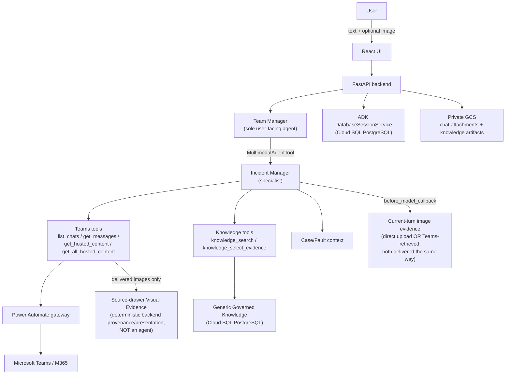
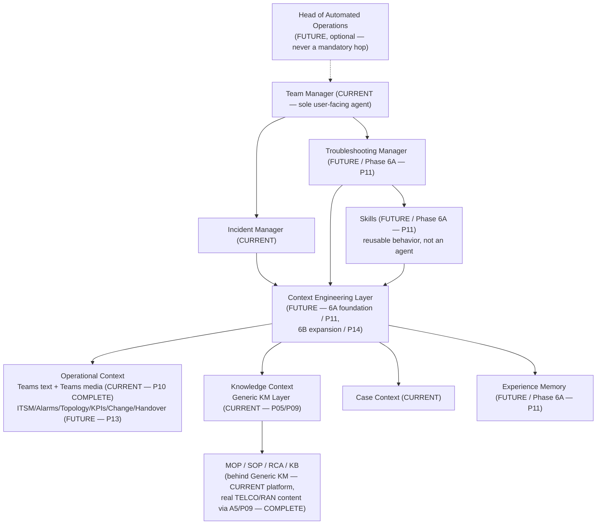

MASTER_ROADMAP.md

SLOPANOC — Canonical Chronological Roadmap

===================================================================
1. PURPOSE AND AUTHORITY
===================================================================

This is the single, canonical, chronologically-ordered record of every
implementation milestone in the SLOPANOC codebase, and the single source
of truth for **current roadmap status** (what is COMPLETE, what is NEXT,
what is FUTURE). It was built by reconstructing the real Git history
(`git log --reverse`, `git show --stat`/`--summary` on every ambiguous
commit) and cross-referencing it against `CLAUDE.md`'s own much more
granular prose narrative — never by inferring capability from
documentation prose alone, and never by trusting a commit title in
isolation.

**If this document and `CLAUDE.md`'s own status language ever disagree
about current status, this document and the real Git history win** —
`CLAUDE.md`'s per-milestone narrative sections are a detailed,
historically-accurate record of *what happened and why*, but this
document is the one place a reader should look for "what is true right
now." Where `CLAUDE.md` still shows a status statement that was correct
*at the time it was written* but is now stale, that statement has been
annotated in place (search `CLAUDE.md` for "HISTORICAL, as of") rather
than deleted — history is not erased, only correctly labeled.

This document does not replace `README.md`, `CLAUDE.md`,
`docs/BUILD_SEQUENCE.md`, `docs/AGENT_CONTRACT.md`,
`docs/KNOWLEDGE_CONTRACT.md`, `docs/TEAMS_TOOL_CONTRACT.md`, or
`docs/TROUBLESHOOTING_STRATEGY.md` — each remains authoritative for its
own domain (see the Authority Map, §8). This document's job is narrower
and specific: give every milestone a stable ID, put them in one
chronological table, and state current status unambiguously in one
place.

`docs/implementation-handoff/*` is historical pre-implementation planning
content, superseded by the documents above — it is not updated or
referenced further by this document, per this milestone's own explicit
scope.

===================================================================
2. CANONICAL NAMING CONVENTION (REVISED — see §2c for why)
===================================================================

## 2a. Two tiers, not one flat list

- **`Pxx`** — a **major strategic phase**. There are a small, stable
  number of these (currently 16: `P00`–`P15`), matching this
  repository's own pre-existing phase vocabulary — the exact table
  already published in `docs/BUILD_SEQUENCE.md`'s "Current checkpoint"
  section (Phase 0 through Phase 7, plus the out-of-band POST-5.1 A/B,
  POST-B7, and A5 insertions that document already treats as
  phase-equivalent). A `Pxx` is assigned only to something that is
  genuinely a strategic phase boundary in this repository's own
  established vocabulary — never merely "the next commit."
- **`Pxx-Myy`** — a **sub-milestone** within a major phase (e.g. one of
  B0–B7 within `P07`, or one of the four A5 corrective passes within
  `P09`). Sub-milestones can be appended indefinitely under their owning
  phase without ever renumbering the phase itself or any sibling phase.
- **`OOB-xxxx`** — an **out-of-band cross-cutting pass**: a reliability/
  hardening/quality fix that is not owned by exactly one major phase
  (it may touch code introduced across several phases, or introduce a
  capability — like a truthful-activity display — that isn't itself a
  strategic roadmap phase). Sequenced globally, like `DEF-xxxx`, never
  forced into a false `Pxx-Myy` parent it doesn't actually belong to.
- **`DEF-xxxx`** — a confirmed defect, globally sequenced, never
  renumbered once committed. Full detail lives in
  `docs/DEFECT_REGISTER.md`; this document only links to it.
- **`SEC-xxxx` / `OPS-xxxx` / `UX-xxxx` / `DOC-xxxx`** — reserved
  prefixes in the same defect register for security, operational/infra,
  presentation-only, and documentation-accuracy findings respectively.
  None exist yet.

**Closed status vocabulary** (used consistently across this document,
`docs/DEFECT_REGISTER.md`, and the corrected sections of `README.md`/
`CLAUDE.md`/`docs/BUILD_SEQUENCE.md`/`docs/AGENT_CONTRACT.md`/
`docs/TROUBLESHOOTING_STRATEGY.md`):

| Status | Meaning |
|---|---|
| **COMPLETE** | Implemented, tested, and (where the milestone required it) live-validated against the real stack. |
| **FROZEN** | COMPLETE, and additionally: should not be casually reworked without a real, observed defect or a new, explicitly approved milestone. |
| **NEXT** | The single next milestone on the locked roadmap — not started. |
| **PLANNED** | On the locked roadmap, after NEXT — not started, order fixed. |
| **DEFERRED** | Considered and explicitly not built now, with a recorded reason — may become PLANNED later via an explicit roadmap decision, never silently. |
| **BLOCKED** | Cannot proceed until a named precondition is met. |
| **SUPERSEDED** | Replaced by a later milestone's own design — kept in the ledger for history, not current. |

**Legacy names are never erased.** Every table row below shows both the
canonical ID and the legacy name(s) used in `CLAUDE.md`/`README.md`/
`docs/BUILD_SEQUENCE.md`. Do not rename historical section headers in
those files to canonical-only form.

## 2b. Why revised

The first version of this document (superseded by the revision you are
reading) assigned one `Pxx` to every historically-named checkpoint —
`P01` through `P17`, one per commit cluster, regardless of whether that
cluster was genuinely a major strategic phase (e.g. "Phase 5.1 Generic
KM," "5.X Teams Rich Content") or a small corrective/hardening pass
(e.g. a single commit hardening `provenance_compliance.py`, or the D1/D2
reliability fixes). A follow-up audit pass (documented in this
milestone's own closure report) challenged this directly and found it
violated two of its own stated goals: "major strategic phases are not
confused with individual commits," and "OPS-type work is not
unnecessarily promoted to a Pxx major phase." §2a above is the
correction: 16 stable major phases, with corrective/hardening passes
demoted to `Pxx-Myy` sub-milestones of the phase they causally belong
to, or to `OOB-xxxx` where they don't belong to exactly one phase.

## 2c. Old → new ID map (this document's own prior numbering, for anyone
who saw the first version)

| Old ID (superseded) | New ID |
|---|---|
| P01 | P00 |
| P02, P03, P04 (bundled — see §4 note) | P01–P04 |
| P03 | P05 |
| P04 | P06 |
| P05 | P07 |
| P06 | P08 |
| P07 | P09 |
| P08 (governed-knowledge hardening) | P05-M02 |
| P09 (POST-A5 refinement) | P09-M03 |
| P10 (Runtime Activity Truthfulness) | OOB-01 |
| P11 (D1/D2/D3/UX-1) | OOB-02 |
| P12 (5.X) | P10 |
| P13 (Phase 6A) | P11 |
| P14 (Phase 4H) | P12 |
| P15 (5.2–5.7) | P13 |
| P16 (Phase 6B) | P14 |
| P17 (Phase 7) | P15 |

This map exists solely so a reader who saw the first version of this
document (or a cross-reference written against it before this revision)
can translate. Every other document in this repository was corrected in
the same pass that produced this revision, so no other file should still
reference the old numbering — if one is found, it is stale and should be
corrected to match this table.

===================================================================
3. LEGACY → CANONICAL NAME MAPPING (MAJOR PHASES)
===================================================================

| Canonical | Legacy name(s) | Also referenced as |
|---|---|---|
| P00 | (unnamed — initial UI/UX prototype) | "Phase 0 — Product Foundation" (`docs/BUILD_SEQUENCE.md`) |
| P01–P04 | "Phase 1 — Teams / Operational Conversation," "Phase 2 — Observability / Performance," "Phase 3 — Trusted Runtime," "Phase 4A–4G" | see §4's note — these four repo-documented phases are not separately attributable to distinct commits in the real Git history; all land inside the same pre-5.1 commit range |
| P05 | "Phase 5.1 — Generic Knowledge Management Layer" | 5.1A–5.1J |
| P06 | "POST-5.1 A — Cloud SQL PostgreSQL (A1–A4)" | — |
| P07 | "POST-5.1 B — Multimodal Attachments" | B0, B1, B2, B3, B4A, B4B, B4C, B4D, B5, B6, B7 |
| P08 | "POST-B7 UI/UX Refinement Milestone" | — |
| P09 | "A5 — Knowledge Island Ingestion Foundation + Real TELCO/RAN Compound Knowledge Validation" | A5, A5 corrective pass, A5 final corrective pass, POST-A5 REFINEMENT |
| P10 | "5.X — Teams Rich Content / Media Retrieval" | 5.X-A (audit), 5.X first slice, Teams Rich Content Routing corrective milestone, "TEAMS IMAGE VISION + FULL PROVENANCE BINDING", "MULTIPLE TEAMS HOSTED IMAGES", "TEAMS VISUAL EVIDENCE IN SOURCE DRAWER", "DETERMINISTIC RETRIEVAL OF ALL TEAMS IMAGES" |
| P11 (NEXT) | "Phase 6A — Intelligence Architecture Foundation" | — |
| P12 (FUTURE) | "Phase 4H — Security Hardening" | 4H.1–4H.7 |
| P13 (FUTURE) | "5.2–5.7 — Operational Integrations" | 5.2 ITSM, 5.3 Alarm/Fault, 5.4 Topology/Inventory, 5.5 KPI/Observability, 5.6 Change Management, 5.7 Handover |
| P14 (FUTURE) | "Phase 6B — Context Engineering Expansion" | — |
| P15 (FUTURE, product target) | "Phase 7 — JOC / Advanced Troubleshooting" | — |
| (unscheduled) | "Phase 8 — Controlled Autonomy" | explicitly beyond the locked roadmap, no assigned position |

## 3a. Out-of-band cross-cutting passes (not owned by one major phase)

| Canonical | Legacy name(s) | Owning-by-proximity phase |
|---|---|---|
| OOB-01 | "add truthful runtime activity and polish chat UI," Phase 2 Runtime Activity Truthfulness | Landed 2026-09-09, same day as P09's own commits, but is not a P09 dependency and does not depend on P09 — a genuinely cross-cutting runtime-observability capability spanning Teams tools, Knowledge tools, and general chat UI. Not filed under any single `Pxx`. |
| OOB-02 | "harden runtime state and historical action presentation" — D1, D2, D3, UX-1 | Depends on OOB-01 (D2 fixes a defect OOB-01 introduced; D1 is an independent Teams-tools reliability fix found in the same pass). Not filed under any single `Pxx`. |

===================================================================
4. CHRONOLOGICAL IMPLEMENTATION LEDGER
===================================================================

Reconstructed from `git log --reverse --date=short` (26 real commits,
2026-08-31 → 2026-09-11) plus `git show --stat`/`--summary` on every
commit whose title alone did not unambiguously identify its content.

**Note on P01–P04 (evidence limitation, stated honestly rather than
inventing false precision):** `docs/BUILD_SEQUENCE.md`'s own phase
table names four distinct phases before Phase 5.1 (Teams/Operational
Conversation, Observability/Performance, Trusted Runtime, 4A–4G) but
does not cite separate commit SHAs for them, and the real Git history
contains only one candidate feature commit in that range —
`03fa07a` ("feat: complete Teams read flow, provenance and Markdown
rendering") — between the initial UI prototype (`P00`) and Phase 5.1
(`P05`, `59e391e`). This ledger records that `03fa07a` (plus its
immediately following docs-alignment commits) is the only
independently-verifiable commit boundary for all four of those phases
combined — it does not claim, and this repository's Git history does
not support, a finer-grained attribution of exactly which lines
implemented which of the four.

| Order | Canonical ID | Legacy label | Type | Capability | Status | Date | Commit(s) | Depends on | Defects linked | Validation | Authoritative doc |
|---|---|---|---|---|---|---|---|---|---|---|---|
| 1 | P00 | Initial UI/UX prototype | Feature | Frontend shell, mock state | COMPLETE (superseded areas noted in README.md) | 2026-08-31 | `e331f21`, `2029750`, `ea44fd9` | — | — | Manual/UI review (pre-backend) | README.md |
| 2 | P01–P04 | Teams read flow, provenance, Markdown rendering (bundled Phases 1–4A-4G) + docs alignment | Feature + Docs | Teams read integration, SourceReference provenance, Markdown rendering, trusted runtime, durable stateful runtime | COMPLETE | 2026-09-03 – 2026-09-04 | `03fa07a`, `d1764bc`, `ea833e8`, `fe0009a` | P00 | — | Backend test suite | docs/TEAMS_TOOL_CONTRACT.md |
| 3 | P05-M01 | Phase 5.1 — Generic Knowledge Management Layer | Feature | Generic KM domain/ingestion/processing/governance/repository/retrieval/provenance/tools, 5.1A–5.1J | COMPLETE | 2026-09-07 | `59e391e` | P01–P04 | — | Backend test suite | docs/KNOWLEDGE_CONTRACT.md |
| 4 | P06 | POST-5.1 A — Cloud SQL PostgreSQL (A1–A4) | Feature | Cloud SQL PostgreSQL migration, IAM DB auth, Alembic schema | COMPLETE | 2026-09-07 | `e3e959c`, `482bc34` (docs) | P05-M01 | — | Real Cloud SQL validation (documented in CLAUDE.md) | CLAUDE.md |
| 5 | P07 | POST-5.1 B — Multimodal Attachments (B0–B7) | Feature | Chat image attachments: durable storage, upload/retrieve API, frontend UX, saved-chat hydration, Gemini multimodal runtime, B6 specialist multimodal reasoning, lifecycle + full regression | COMPLETE | 2026-09-07 – 2026-09-08 | `8529f4a`,`a2ce631`,`1ab4c26`,`71ed8ea`,`c4a67f3`,`d26395c`,`06da862`,`2b0e88f`,`a0c57a6`(docs),`c154f71` | P06 | DEF-0004, DEF-0005, DEF-0013 (B4B), DEF-0014 (B5) — all closed within this phase's own commit range | Real-stack live validation (B7 Tests A–J) | docs/TEAMS_TOOL_CONTRACT.md, docs/AGENT_CONTRACT.md |
| 6 | P08 | POST-B7 UI/UX Refinement Milestone | Feature (UI polish) | Teams outbound message plain-text formatting, sidebar hover-scroll, sent-image thumbnail/preview modal, composer attachment/text separation | COMPLETE | 2026-09-09 | `20826c5` | P07 | — | Real-stack live validation (user-confirmed) | CLAUDE.md |
| 7 | P09-M01 | A5 — Knowledge Island Ingestion Foundation + Real TELCO/RAN Compound Knowledge Validation | Feature | Compound-artifact domain model, DOCX/XLSX/PDF/OLE extraction, image interpretation, one-command troubleshooting guidance, applicability context, real TELCO/RAN MOP ingestion | COMPLETE | 2026-09-09 | `6ce4097` (+ roadmap realignment docs in `deb1db7`) | P05-M01, P07 | DEF-0006, DEF-0007, DEF-0008 (all closed by `6ce4097`) | Real Vertex Gemini + Cloud SQL live-runtime retest, 8/8 gates | docs/KNOWLEDGE_CONTRACT.md |
| 8 | P05-M02 | Governed Knowledge Completion Hardening (provenance-compliance retry + completion gate) | Fix/Hardening, filed under P05 (Phase 5.1) by content, though it lands chronologically after P09 (see note below) | `backend/agents/incident_manager/provenance_compliance.py` retry mechanism, `backend/tools/knowledge/tools.py` completion gate | COMPLETE | 2026-09-09 | `da58a43` | P05-M01 | — | Backend test suite (`test_p5_1j_governed_completion_gate.py`, `test_p5_1j_provenance_compliance.py`) | docs/KNOWLEDGE_CONTRACT.md |
| 9 | P09-M03 | POST-A5 REFINEMENT — Cloud SQL-only runtime hardening + Source Drawer source+version consolidation | Hardening + UI | `runtime_database_policy.py` (fail-closed Postgres-only startup), Source-drawer grouped knowledge chips | COMPLETE | 2026-09-09 | `49a6f8b` | P06, P09-M01 | — | Real Cloud SQL + real Vertex live validation | CLAUDE.md |
| 10 | OOB-01 | Runtime Activity Truthfulness (Phase 2) + chat UI polish | Feature + UI polish | `activity_queue.py`/`activity_translator.py` (truthful mid-turn activity), Sidebar/ScrollingText polish | COMPLETE | 2026-09-09 | `351b65e` | P01–P04 | — | Backend + frontend test suites | CLAUDE.md |
| 11 | OOB-02 | D1/D2/D3/UX-1 Corrective Passes | Fix | D1: `known_message_ids` rewind-null normalization. D2: OpenTelemetry cross-task context-detach fix (+ deadlock sub-fix). D3: historical action-card audit (no defect). UX-1: "Earlier action completed" presentation refinement | COMPLETE | 2026-09-10 | `f92eb6e` | OOB-01 | DEF-0001, DEF-0002, DEF-0003 (all closed by `f92eb6e`) | Backend + frontend test suites | docs/DEFECT_REGISTER.md |
| 12 | P10 | 5.X — Teams Rich Content / Media Retrieval | Feature | Inline Teams image discovery/retrieval (first slice), rich-content fast-path routing correction, real Gemini multimodal delivery with full `(chat, message, hosted_content)` provenance binding, multi-image support, Source-drawer visual evidence, deterministic all-image retrieval | **COMPLETE / FROZEN** | 2026-09-11 | `0407808` | P07, P09-M01, P09-M03, OOB-02 | DEF-0009, DEF-0010, DEF-0011, DEF-0012, DEF-0015, DEF-0016 (all closed by `0407808`) | Real-stack live validation (real Power Automate/Teams, real Gemini/Vertex, real browser) | docs/TEAMS_TOOL_CONTRACT.md §4b–§4c |
| 13 | P11 | Phase 6A — Intelligence Architecture Foundation | Feature (planned) | Context Engineering foundation, Troubleshooting Manager specialist, Skills framework, Experience Memory foundation | **NEXT — NOT STARTED** | — | — | P10 | — | — | docs/BUILD_SEQUENCE.md §2a |
| 14 | P12 | Phase 4H — Security Hardening | Feature (planned) | Trust boundaries, prompt-injection isolation, tool authorization/output validation, secret handling, Model Armor, audit events, adversarial regression | PLANNED | — | — | P11 | — | — | docs/BUILD_SEQUENCE.md §2a |
| 15 | P13 | 5.2–5.7 — Operational Integrations | Feature (planned) | ITSM, Alarm/Fault, Topology/Inventory, KPI/Observability, Change Management, Handover | PLANNED | — | — | P12 | — | — | docs/BUILD_SEQUENCE.md §2a |
| 16 | P14 | Phase 6B — Context Engineering Expansion | Feature (planned) | Full Operational Context surface, multisource assembly/ranking/budgeting/conflict handling | PLANNED | — | — | P13 | — | — | docs/BUILD_SEQUENCE.md §2a |
| 17 | P15 | Phase 7 — JOC / Advanced Troubleshooting | Product target (planned) | Persistent Troubleshooting State, hypothesis lifecycle, next-best-diagnostic-action loop | PLANNED | — | — | P14 | — | — | docs/TROUBLESHOOTING_STRATEGY.md |
| — | (unscheduled) | Phase 8 — Controlled Autonomy | Concept only | — | DEFERRED (no roadmap position assigned) | — | — | — | — | — | CLAUDE.md |

**Note on P05-M02's ordering (an example of the exact "execution order
≠ canonical phase number" case this document's own audit was asked to
check for — reported, not silently resolved):** commit `da58a43` lands
chronologically *after* `P09-M01` (A5, `6ce4097`) and its own
roadmap-realignment docs commit (`deb1db7`), yet its content
(`provenance_compliance.py`'s retry mechanism, `test_p5_1j_*` test
files) is named after Phase 5.1J — the final Phase 5.1 sub-phase, closed
by `59e391e` (P05-M01) — and `CLAUDE.md`'s own B6/B7/A5 sections describe
this exact mechanism (`governed_knowledge_completion.py`'s deterministic
remediation, `provenance_compliance.py`'s retry) as already existing
well before those later milestones. The most likely explanation is that
this work was implemented earlier in real development time but
committed later (a squashed/reordered local commit history, consistent
with this repository having only 26 total commits across a much larger
amount of documented work) — but this ledger does not silently assert
that as fact. What is independently verifiable and stated here as fact:
the diff exists at `da58a43`, it depends only on `P05-M01`, and it does
not depend on `P09-M01` (A5) or vice versa. This ledger therefore files
it under `P05-M02` by content-ownership (correct architectural home)
while recording its literal commit position (after P09) by date in the
table above — exactly the "a historically named phase may execute after
a later one without corrupting chronology" pattern this audit was asked
to verify support for.

===================================================================
5. CURRENT CHECKPOINT
===================================================================

As of `HEAD` = `0407808805d8388d81602d2f66cdfa5b0164805f` (tag
`slopanoc-teams-vision-freeze-v1`), the following must be stated as
CURRENT reality by any document in this repository:

- Team Manager is the only user-facing agent. Incident Manager is the
  only specialist actually wired into a live turn, invoked via
  `AgentTool` (a `MultimodalAgentTool` subclass for the current-turn
  image-propagation path).
- Power Automate remains the sole Microsoft Teams/M365 gateway. No
  direct Microsoft Graph integration exists anywhere in this stack —
  confirmed by grep: no `msgraph`/`graph.microsoft.com` client import
  exists under `backend/`.
- Real SSE streaming, mid-run cancellation, edit/rewind, deterministic
  conversation targeting, persistent chat sessions (ADK
  `DatabaseSessionService`), and persistent Case/Fault context are all
  implemented and CURRENT.
- Teams read flows (chat discovery, name resolution, ambiguity
  handling via `SelectionCard`, message retrieval, decision/action/
  risk extraction) are CURRENT.
- Teams write proposal/approval/execution (never model-authorized) is
  CURRENT.
- Generic Governed Knowledge (Phase 5.1 / P05) is CURRENT, including
  real compound TELCO/RAN MOP content ingested via A5 / P09.
- Direct SLOPANOC image upload with real Gemini multimodal reasoning,
  combined with Teams and/or governed-Knowledge context in the same
  specialist turn, is CURRENT (P07, POST-5.1 B / B0–B7).
- **Teams-originated rich media (images posted inside a real Teams
  chat) is now ALSO CURRENT** (P10 / 5.X): deterministic discovery,
  retrieval, full `(chat_id, message_id, hosted_content_id)` provenance
  binding, real Gemini multimodal delivery via a `before_model_
  callback` (`backend/api/hosted_content_vision_context.py
  .inject_pending_hosted_content_image`, confirmed present at HEAD),
  multiple images per message in true document order (bounded by
  `MAX_HOSTED_IMAGES_PER_MESSAGE = 5` /
  `MAX_TOTAL_HOSTED_IMAGE_BYTES = 20_000_000`, both confirmed present in
  `backend/api/hosted_content_vision_context.py`), Source-drawer visual
  evidence for genuinely-delivered images, and a deterministic
  backend-owned all-image retrieval tool
  (`teams_get_all_hosted_content`, confirmed registered on
  `incident_manager.tools` in `backend/agents/incident_manager/
  agent.py`) that removes model nondeterminism from multi-image
  requests — **the model never enumerates individual
  `hosted_content_id`s in all-images mode; it only ever decides which
  of the two retrieval tools to call.** This is the single most
  important status correction this documentation pass makes.
- Cloud SQL PostgreSQL is the enforced runtime database for both the
  general session domain and the governed-Knowledge domain in any
  live/manual/E2E/integration validation environment — enforced by
  `backend/api/runtime_database_policy.py` (confirmed present at HEAD),
  wired into `backend/api/app.py`'s `_lifespan`, fail-closed, no
  environment-variable escape hatch (P09-M03).
- Runtime activity shown to the user reflects genuine backend
  execution state, not a simulated/generic progress indicator (OOB-01).
- Ordinary Teams file attachments (non-image), SharePoint/OneDrive
  retrieval, and Adaptive Cards remain explicitly OUT OF SCOPE of P10 —
  not built, not claimed as built anywhere in this repository's
  corrected documentation.
- **Phase 6A — Intelligence Architecture Foundation (P11) is NEXT — not
  started.** Nothing in Phase 6A (Context Engineering Layer,
  Troubleshooting Manager, Skills framework, Experience Memory,
  Head of Automated Operations) exists in the codebase today — confirmed
  by the absence of any `troubleshooting_manager`, `skills`, or
  `experience_memory` module anywhere under `backend/`.
- Phase 4H (Security Hardening, P12), 5.2–5.7 (Operational
  Integrations, P13), Phase 6B (Context Engineering Expansion, P14), and
  Phase 7 (JOC / Advanced Troubleshooting, P15) are all still FUTURE, in
  that locked order.
- The application shell, Projects, Settings (Usage/Connectors/Skills),
  and Scheduled Tasks remain local, mock state — not backend-wired.
  The real, backend-driven experience is the chat conversation itself.
- None of Phase 4H's security hardening, enterprise authentication,
  per-user Microsoft identity/delegated Graph, distributed runtime
  coordination, production observability/alerting, or load/concurrency
  validation exist yet.

| Statement | Evidence path | Result |
|---|---|---|
| Teams inline images = CURRENT | `backend/tools/teams/get_hosted_content.py` (exists), `backend/tests/test_teams_visual_evidence.py` (exists, passes per commit) | PASS |
| Multiple hosted images = CURRENT | `MAX_HOSTED_IMAGES_PER_MESSAGE`/`MAX_TOTAL_HOSTED_IMAGE_BYTES` confirmed in `backend/api/hosted_content_vision_context.py` | PASS |
| ALL-images expansion = deterministic backend behavior | `teams_get_all_hosted_content` confirmed registered on `incident_manager.tools`, takes no id-list parameter (verified by direct source read) | PASS |
| Gemini does NOT enumerate `hosted_content_id`s in ALL-images mode | Same tool signature confirmed (no such parameter exists) | PASS |
| Visual Evidence = images actually delivered to Gemini (not merely discovered/retrieved/queued) | `pop_delivered_visual_evidence`/`DeliveredVisualEvidence` confirmed in `backend/api/hosted_content_vision_context.py` — a distinct state from "pending"/"stashed" | PASS |
| Source lazy image retrieval = CURRENT | `GET /api/sessions/{session_id}/sources/{source_id}/images/{image_id}` confirmed wired in `backend/api/app.py`, backed by `backend/api/source_images.py` | PASS |
| Power Automate remains Microsoft boundary; no direct Graph client | grep for `msgraph`/`graph.microsoft.com` under `backend/` returns nothing | PASS |
| Ordinary Teams file attachments remain out of scope | No file-attachment (non-image) retrieval tool exists under `backend/tools/teams/` | PASS |
| Cloud SQL/PostgreSQL mandatory for normal runtime | `backend/api/runtime_database_policy.py` confirmed present, wired into `_lifespan` | PASS |
| 5.X = COMPLETE + FROZEN | This document §4/§7, `CLAUDE.md`'s corrected LOCKED ROADMAP header, `README.md`'s corrected Roadmap section, all agree | PASS |
| Phase 6A = NEXT | Same set of documents agree; no `troubleshooting_manager`/`skills`/`experience_memory` module exists under `backend/` | PASS |

===================================================================
6. TOPOLOGY DIAGRAMS
===================================================================

## 6a. CURRENT topology (everything below is real and running today)



Every node above is CURRENT. There is no "FUTURE" node in this diagram —
see §6b for target architecture. `teams_get_all_hosted_content` is drawn
as one of the deterministic Teams tools, not as a separate reasoning
step — the model's only decision is which tool to call, never which
images to enumerate.

## 6b. FINAL-TARGET topology (current vs. future clearly marked)



Read this diagram exactly as its labels state: CURRENT nodes are real
and running today (identical to §6a); FUTURE nodes (Head of Automated
Operations — explicitly OPTIONAL, never a mandatory hop — Troubleshooting
Manager, Skills — never an agent — the Context Engineering Layer itself,
Experience Memory, and the not-yet-built Operational Context sources)
are target architecture only, with their owning canonical phase ID shown
so their build order is traceable to §4/§7. No Knowledge Agent is drawn
or implied anywhere in this diagram, matching the standing invariant
that Generic Governed Knowledge is a Knowledge Context provider, never
its own specialist agent (`docs/AGENT_CONTRACT.md` §12).

===================================================================
7. ORDERED FORWARD ROADMAP
===================================================================

```text
P10 — 5.X Teams Rich Content / Media Retrieval        COMPLETE / FROZEN
  → P11 — Phase 6A Intelligence Architecture Foundation   ← NEXT, NOT STARTED
  → P12 — Phase 4H Security Hardening                     PLANNED
  → P13 — 5.2–5.7 Operational Integrations                PLANNED
  → P14 — Phase 6B Context Engineering Expansion           PLANNED
  → P15 — Phase 7 Advanced Troubleshooting / JOC           PLANNED (product target)
```

**This status was verified against repository evidence, not assumed:**
`git log --reverse` shows `0407808` (P10's commit) as the current `HEAD`,
with no later commit implementing any part of Phase 6A (no
`troubleshooting_manager` agent module, no `Skills` registry module, and
no `Experience Memory` module exist anywhere under `backend/` — confirmed
by the absence of any such path in the repository at `HEAD`). No conflict
was found between this conclusion and `CLAUDE.md`'s own corrected
sections — both now state 5.X COMPLETE / Phase 6A NEXT consistently with
this document.

**P11 — Phase 6A** builds a BOUNDED intelligence/orchestration
foundation against the context sources that exist now that P09 (A5) and
P10 (5.X) are both complete (Knowledge Context, Case Context, Teams text
+ media, session state) — not the full future Operational Context
surface (P13 does not exist yet). Contains: a Context Engineering
foundation; a second specialist, Troubleshooting Manager, attached via
`AgentTool` alongside Incident Manager (Team Manager remains sole
user-facing agent); a Skills behavioral framework/registry; an
Experience Memory foundation. Does NOT implement Phase 7/P15's mature
troubleshooting loop.

**P12 — Phase 4H** is not cancelled or reduced in importance — it is
scheduled after P11 instead of directly after P09/P10, so it evaluates
the richer, more stable architecture P11 produces.

**P13 — 5.2–5.7**, **P14 — Phase 6B**, and **P15 — Phase 7** are
unchanged in internal order and dependency shape from their description
in `docs/BUILD_SEQUENCE.md` §2a — this document does not re-derive that
rationale, it only restates current status against canonical IDs.

## Future-milestone record template

When a future milestone (starting with P11) closes, add a row to §4's
ledger using this same schema, and use this template for any new
detailed per-milestone note added to this section:

```text
### Pxx[-Myy] — <canonical name> (<legacy name(s) if any>)

Status: <COMPLETE | FROZEN | ...>
Commit(s): <sha(s)>
Depends on: <Pxx, Pxx-Myy, OOB-xx, ...>
Defects linked: <DEF-xxxx, ... | none>
Live validation: <what was actually proven against the real stack, or
  "not performed — <reason>">
Authoritative doc: <the doc that owns this capability's detailed
  contract>

<2-6 sentences: what changed, why, and what it unblocks next.>
```

If the new milestone is a corrective/hardening pass rather than a new
strategic phase, prefer a `Pxx-Myy` sub-milestone under its
content-owning phase, or an `OOB-xxxx` entry if it does not belong to
exactly one phase — do not mint a new top-level `Pxx` for it merely
because it is the next commit. Only mint a new top-level `Pxx` when the
repository's own established phase vocabulary (`docs/BUILD_SEQUENCE.md`)
already names it as a phase, or a genuinely new strategic phase is
explicitly approved.

===================================================================
8. AUTHORITY MAP
===================================================================

| Domain | Authoritative document |
|---|---|
| Current backend/agent architecture, frozen invariants, locked roadmap status | `CLAUDE.md` |
| Product capability summary, current capabilities, roadmap narrative | `README.md` |
| Full phase-by-phase build sequence and topology evolution (all phases) | `docs/BUILD_SEQUENCE.md` |
| Agent contract: topology, tool boundaries, Skill/Memory/Agent/Tool/MCP mental model | `docs/AGENT_CONTRACT.md` |
| Teams tool contract: read flows, write/approval flow, hosted-content/media contract | `docs/TEAMS_TOOL_CONTRACT.md` |
| Generic Governed Knowledge contract: domain, ingestion, governance, retrieval, provenance | `docs/KNOWLEDGE_CONTRACT.md` |
| Troubleshooting product strategy (non-negotiable principles, Phase 7 target) | `docs/TROUBLESHOOTING_STRATEGY.md` |
| Chronological milestone ledger, canonical naming, current-status single source of truth | **this document** |
| Confirmed defect history, root causes, fixes, regression coverage | `docs/DEFECT_REGISTER.md` |
| Original product/UX intent (Projects, global Knowledge, Connectors, Skills UI) — NOT current backend capability | `docs/PRODUCT.md`, `docs/UX_SPEC.md` (see their own status banners) |
| Historical pre-implementation planning — superseded, historical context only | `docs/implementation-handoff/*` |

When two documents appear to disagree about **current status**, this
document and the real Git history are authoritative; when they disagree
about a **domain contract's detailed rules** (e.g. exactly what
`knowledge_select_evidence` guarantees), the domain-specific document in
the table above is authoritative, and this document should be corrected
to match it, not the other way around.

**Duplication check performed for this revision:** the detailed
per-milestone narrative (what changed, file by file, why) lives in
`CLAUDE.md`'s own chronological sections and is not reproduced here —
this document's ledger rows link to it (`docs/TEAMS_TOOL_CONTRACT.md`
§4b–§4c, `docs/KNOWLEDGE_CONTRACT.md`, etc. in the "Authoritative doc"
column) rather than duplicating its content. `docs/BUILD_SEQUENCE.md`
§2a/§2b's own roadmap-realignment rationale is cross-linked, not
restated. `docs/DEFECT_REGISTER.md`'s defect detail is linked by ID
only. No section of this document restates content that has exactly one
other owning document, except where a short restatement is needed for
this document's own internal readability (e.g. the status table in §5,
which is evidence-checked against source directly, not copied from
`CLAUDE.md`).
