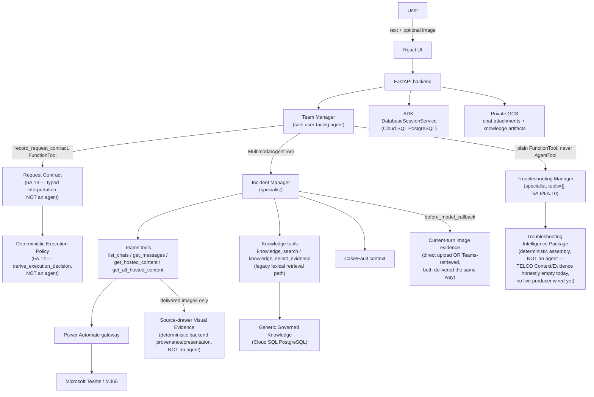
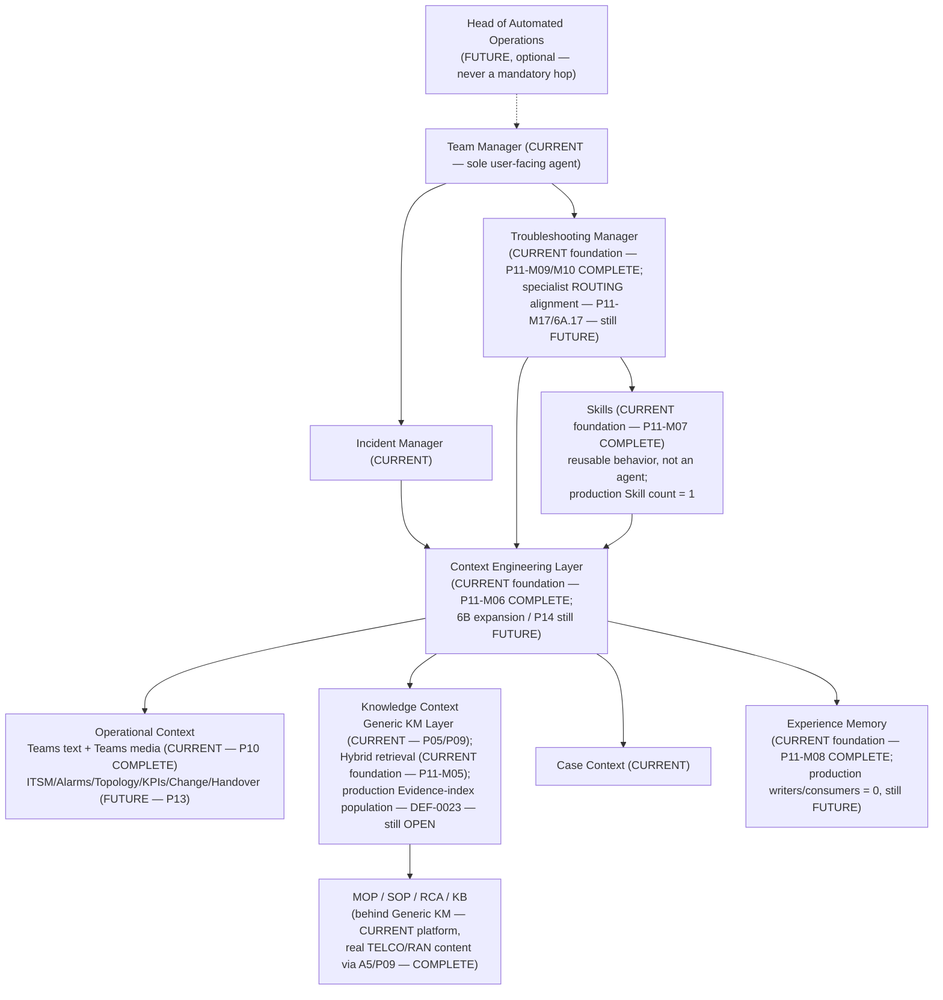

MASTER_ROADMAP.md

SLOPANOC — Canonical Chronological Roadmap

===================================================================
1. PURPOSE AND AUTHORITY
===================================================================

This is the single, canonical, chronologically-ordered record of every
implementation milestone in the SLOPANOC codebase, and the single source
of truth for **current roadmap status** (what is COMPLETE, what is NEXT,
what is FUTURE). It was built by reconstructing the real Git history
(`git log --reverse`, `git show --stat`/`--summary` on every ambiguous
commit) and cross-referencing it against `CLAUDE.md`'s own much more
granular prose narrative — never by inferring capability from
documentation prose alone, and never by trusting a commit title in
isolation.

**If this document and `CLAUDE.md`'s own status language ever disagree
about current status, this document and the real Git history win** —
`CLAUDE.md`'s per-milestone narrative sections are a detailed,
historically-accurate record of *what happened and why*, but this
document is the one place a reader should look for "what is true right
now." Where `CLAUDE.md` still shows a status statement that was correct
*at the time it was written* but is now stale, that statement has been
annotated in place (search `CLAUDE.md` for "HISTORICAL, as of") rather
than deleted — history is not erased, only correctly labeled.

This document does not replace `README.md`, `CLAUDE.md`,
`docs/BUILD_SEQUENCE.md`, `docs/AGENT_CONTRACT.md`,
`docs/KNOWLEDGE_CONTRACT.md`, `docs/TEAMS_TOOL_CONTRACT.md`, or
`docs/TROUBLESHOOTING_STRATEGY.md` — each remains authoritative for its
own domain (see the Authority Map, §8). This document's job is narrower
and specific: give every milestone a stable ID, put them in one
chronological table, and state current status unambiguously in one
place.

`docs/implementation-handoff/*` is historical pre-implementation planning
content, superseded by the documents above — it is not updated or
referenced further by this document, per this milestone's own explicit
scope.

===================================================================
2. CANONICAL NAMING CONVENTION (REVISED — see §2c for why)
===================================================================

## 2a. Two tiers, not one flat list

- **`Pxx`** — a **major strategic phase**. There are a small, stable
  number of these (currently 16: `P00`–`P15`), matching this
  repository's own pre-existing phase vocabulary — the exact table
  already published in `docs/BUILD_SEQUENCE.md`'s "Current checkpoint"
  section (Phase 0 through Phase 7, plus the out-of-band POST-5.1 A/B,
  POST-B7, and A5 insertions that document already treats as
  phase-equivalent). A `Pxx` is assigned only to something that is
  genuinely a strategic phase boundary in this repository's own
  established vocabulary — never merely "the next commit."
- **`Pxx-Myy`** — a **sub-milestone** within a major phase (e.g. one of
  B0–B7 within `P07`, or one of the four A5 corrective passes within
  `P09`). Sub-milestones can be appended indefinitely under their owning
  phase without ever renumbering the phase itself or any sibling phase.
- **`OOB-xxxx`** — an **out-of-band cross-cutting pass**: a reliability/
  hardening/quality fix that is not owned by exactly one major phase
  (it may touch code introduced across several phases, or introduce a
  capability — like a truthful-activity display — that isn't itself a
  strategic roadmap phase). Sequenced globally, like `DEF-xxxx`, never
  forced into a false `Pxx-Myy` parent it doesn't actually belong to.
- **`DEF-xxxx`** — a confirmed defect, globally sequenced, never
  renumbered once committed. Full detail lives in
  `docs/DEFECT_REGISTER.md`; this document only links to it.
- **`SEC-xxxx` / `OPS-xxxx` / `UX-xxxx` / `DOC-xxxx`** — reserved
  prefixes in the same defect register for security, operational/infra,
  presentation-only, and documentation-accuracy findings respectively.
  None exist yet.

**Closed status vocabulary** (used consistently across this document,
`docs/DEFECT_REGISTER.md`, and the corrected sections of `README.md`/
`CLAUDE.md`/`docs/BUILD_SEQUENCE.md`/`docs/AGENT_CONTRACT.md`/
`docs/TROUBLESHOOTING_STRATEGY.md`):

| Status | Meaning |
|---|---|
| **COMPLETE** | Implemented, tested, and (where the milestone required it) live-validated against the real stack. |
| **FROZEN** | COMPLETE, and additionally: should not be casually reworked without a real, observed defect or a new, explicitly approved milestone. |
| **NEXT** | The single next milestone on the locked roadmap — not started. |
| **PLANNED** | On the locked roadmap, after NEXT — not started, order fixed. |
| **DEFERRED** | Considered and explicitly not built now, with a recorded reason — may become PLANNED later via an explicit roadmap decision, never silently. |
| **BLOCKED** | Cannot proceed until a named precondition is met. |
| **SUPERSEDED** | Replaced by a later milestone's own design — kept in the ledger for history, not current. |

**Legacy names are never erased.** Every table row below shows both the
canonical ID and the legacy name(s) used in `CLAUDE.md`/`README.md`/
`docs/BUILD_SEQUENCE.md`. Do not rename historical section headers in
those files to canonical-only form.

## 2b. Why revised

The first version of this document (superseded by the revision you are
reading) assigned one `Pxx` to every historically-named checkpoint —
`P01` through `P17`, one per commit cluster, regardless of whether that
cluster was genuinely a major strategic phase (e.g. "Phase 5.1 Generic
KM," "5.X Teams Rich Content") or a small corrective/hardening pass
(e.g. a single commit hardening `provenance_compliance.py`, or the D1/D2
reliability fixes). A follow-up audit pass (documented in this
milestone's own closure report) challenged this directly and found it
violated two of its own stated goals: "major strategic phases are not
confused with individual commits," and "OPS-type work is not
unnecessarily promoted to a Pxx major phase." §2a above is the
correction: 16 stable major phases, with corrective/hardening passes
demoted to `Pxx-Myy` sub-milestones of the phase they causally belong
to, or to `OOB-xxxx` where they don't belong to exactly one phase.

## 2c. Old → new ID map (this document's own prior numbering, for anyone
who saw the first version)

| Old ID (superseded) | New ID |
|---|---|
| P01 | P00 |
| P02, P03, P04 (bundled — see §4 note) | P01–P04 |
| P03 | P05 |
| P04 | P06 |
| P05 | P07 |
| P06 | P08 |
| P07 | P09 |
| P08 (governed-knowledge hardening) | P05-M02 |
| P09 (POST-A5 refinement) | P09-M03 |
| P10 (Runtime Activity Truthfulness) | OOB-01 |
| P11 (D1/D2/D3/UX-1) | OOB-02 |
| P12 (5.X) | P10 |
| P13 (Phase 6A) | P11 |
| P14 (Phase 4H) | P12 |
| P15 (5.2–5.7) | P13 |
| P16 (Phase 6B) | P14 |
| P17 (Phase 7) | P15 |

This map exists solely so a reader who saw the first version of this
document (or a cross-reference written against it before this revision)
can translate. Every other document in this repository was corrected in
the same pass that produced this revision, so no other file should still
reference the old numbering — if one is found, it is stale and should be
corrected to match this table.

===================================================================
3. LEGACY → CANONICAL NAME MAPPING (MAJOR PHASES)
===================================================================

| Canonical | Legacy name(s) | Also referenced as |
|---|---|---|
| P00 | (unnamed — initial UI/UX prototype) | "Phase 0 — Product Foundation" (`docs/BUILD_SEQUENCE.md`) |
| P01–P04 | "Phase 1 — Teams / Operational Conversation," "Phase 2 — Observability / Performance," "Phase 3 — Trusted Runtime," "Phase 4A–4G" | see §4's note — these four repo-documented phases are not separately attributable to distinct commits in the real Git history; all land inside the same pre-5.1 commit range |
| P05 | "Phase 5.1 — Generic Knowledge Management Layer" | 5.1A–5.1J |
| P06 | "POST-5.1 A — Cloud SQL PostgreSQL (A1–A4)" | — |
| P07 | "POST-5.1 B — Multimodal Attachments" | B0, B1, B2, B3, B4A, B4B, B4C, B4D, B5, B6, B7 |
| P08 | "POST-B7 UI/UX Refinement Milestone" | — |
| P09 | "A5 — Knowledge Island Ingestion Foundation + Real TELCO/RAN Compound Knowledge Validation" | A5, A5 corrective pass, A5 final corrective pass, POST-A5 REFINEMENT |
| P10 | "5.X — Teams Rich Content / Media Retrieval" | 5.X-A (audit), 5.X first slice, Teams Rich Content Routing corrective milestone, "TEAMS IMAGE VISION + FULL PROVENANCE BINDING", "MULTIPLE TEAMS HOSTED IMAGES", "TEAMS VISUAL EVIDENCE IN SOURCE DRAWER", "DETERMINISTIC RETRIEVAL OF ALL TEAMS IMAGES" |
| P11 (NEXT) | "Phase 6A — Intelligence Architecture Foundation" | — |
| P12 (FUTURE) | "Phase 4H — Security Hardening" | 4H.1–4H.7 |
| P13 (FUTURE) | "5.2–5.7 — Operational Integrations" | 5.2 ITSM, 5.3 Alarm/Fault, 5.4 Topology/Inventory, 5.5 KPI/Observability, 5.6 Change Management, 5.7 Handover |
| P14 (FUTURE) | "Phase 6B — Context Engineering Expansion" | — |
| P15 (FUTURE, product target) | "Phase 7 — JOC / Advanced Troubleshooting" | — |
| (unscheduled) | "Phase 8 — Controlled Autonomy" | explicitly beyond the locked roadmap, no assigned position |

## 3a. Out-of-band cross-cutting passes (not owned by one major phase)

| Canonical | Legacy name(s) | Owning-by-proximity phase |
|---|---|---|
| OOB-01 | "add truthful runtime activity and polish chat UI," Phase 2 Runtime Activity Truthfulness | Landed 2026-09-09, same day as P09's own commits, but is not a P09 dependency and does not depend on P09 — a genuinely cross-cutting runtime-observability capability spanning Teams tools, Knowledge tools, and general chat UI. Not filed under any single `Pxx`. |
| OOB-02 | "harden runtime state and historical action presentation" — D1, D2, D3, UX-1 | Depends on OOB-01 (D2 fixes a defect OOB-01 introduced; D1 is an independent Teams-tools reliability fix found in the same pass). Not filed under any single `Pxx`. |

===================================================================
4. CHRONOLOGICAL IMPLEMENTATION LEDGER
===================================================================

Reconstructed from `git log --reverse --date=short` (26 real commits,
2026-08-31 → 2026-09-11) plus `git show --stat`/`--summary` on every
commit whose title alone did not unambiguously identify its content.

**Note on P01–P04 (evidence limitation, stated honestly rather than
inventing false precision):** `docs/BUILD_SEQUENCE.md`'s own phase
table names four distinct phases before Phase 5.1 (Teams/Operational
Conversation, Observability/Performance, Trusted Runtime, 4A–4G) but
does not cite separate commit SHAs for them, and the real Git history
contains only one candidate feature commit in that range —
`03fa07a` ("feat: complete Teams read flow, provenance and Markdown
rendering") — between the initial UI prototype (`P00`) and Phase 5.1
(`P05`, `59e391e`). This ledger records that `03fa07a` (plus its
immediately following docs-alignment commits) is the only
independently-verifiable commit boundary for all four of those phases
combined — it does not claim, and this repository's Git history does
not support, a finer-grained attribution of exactly which lines
implemented which of the four.

| Order | Canonical ID | Legacy label | Type | Capability | Status | Date | Commit(s) | Depends on | Defects linked | Validation | Authoritative doc |
|---|---|---|---|---|---|---|---|---|---|---|---|
| 1 | P00 | Initial UI/UX prototype | Feature | Frontend shell, mock state | COMPLETE (superseded areas noted in README.md) | 2026-08-31 | `e331f21`, `2029750`, `ea44fd9` | — | — | Manual/UI review (pre-backend) | README.md |
| 2 | P01–P04 | Teams read flow, provenance, Markdown rendering (bundled Phases 1–4A-4G) + docs alignment | Feature + Docs | Teams read integration, SourceReference provenance, Markdown rendering, trusted runtime, durable stateful runtime | COMPLETE | 2026-09-03 – 2026-09-04 | `03fa07a`, `d1764bc`, `ea833e8`, `fe0009a` | P00 | — | Backend test suite | docs/TEAMS_TOOL_CONTRACT.md |
| 3 | P05-M01 | Phase 5.1 — Generic Knowledge Management Layer | Feature | Generic KM domain/ingestion/processing/governance/repository/retrieval/provenance/tools, 5.1A–5.1J | COMPLETE | 2026-09-07 | `59e391e` | P01–P04 | — | Backend test suite | docs/KNOWLEDGE_CONTRACT.md |
| 4 | P06 | POST-5.1 A — Cloud SQL PostgreSQL (A1–A4) | Feature | Cloud SQL PostgreSQL migration, IAM DB auth, Alembic schema | COMPLETE | 2026-09-07 | `e3e959c`, `482bc34` (docs) | P05-M01 | — | Real Cloud SQL validation (documented in CLAUDE.md) | CLAUDE.md |
| 5 | P07 | POST-5.1 B — Multimodal Attachments (B0–B7) | Feature | Chat image attachments: durable storage, upload/retrieve API, frontend UX, saved-chat hydration, Gemini multimodal runtime, B6 specialist multimodal reasoning, lifecycle + full regression | COMPLETE | 2026-09-07 – 2026-09-08 | `8529f4a`,`a2ce631`,`1ab4c26`,`71ed8ea`,`c4a67f3`,`d26395c`,`06da862`,`2b0e88f`,`a0c57a6`(docs),`c154f71` | P06 | DEF-0004, DEF-0005, DEF-0013 (B4B), DEF-0014 (B5) — all closed within this phase's own commit range | Real-stack live validation (B7 Tests A–J) | docs/TEAMS_TOOL_CONTRACT.md, docs/AGENT_CONTRACT.md |
| 6 | P08 | POST-B7 UI/UX Refinement Milestone | Feature (UI polish) | Teams outbound message plain-text formatting, sidebar hover-scroll, sent-image thumbnail/preview modal, composer attachment/text separation | COMPLETE | 2026-09-09 | `20826c5` | P07 | — | Real-stack live validation (user-confirmed) | CLAUDE.md |
| 7 | P09-M01 | A5 — Knowledge Island Ingestion Foundation + Real TELCO/RAN Compound Knowledge Validation | Feature | Compound-artifact domain model, DOCX/XLSX/PDF/OLE extraction, image interpretation, one-command troubleshooting guidance, applicability context, real TELCO/RAN MOP ingestion | COMPLETE | 2026-09-09 | `6ce4097` (+ roadmap realignment docs in `deb1db7`) | P05-M01, P07 | DEF-0006, DEF-0007, DEF-0008 (all closed by `6ce4097`) | Real Vertex Gemini + Cloud SQL live-runtime retest, 8/8 gates | docs/KNOWLEDGE_CONTRACT.md |
| 8 | P05-M02 | Governed Knowledge Completion Hardening (provenance-compliance retry + completion gate) | Fix/Hardening, filed under P05 (Phase 5.1) by content, though it lands chronologically after P09 (see note below) | `backend/agents/incident_manager/provenance_compliance.py` retry mechanism, `backend/tools/knowledge/tools.py` completion gate | COMPLETE | 2026-09-09 | `da58a43` | P05-M01 | — | Backend test suite (`test_p5_1j_governed_completion_gate.py`, `test_p5_1j_provenance_compliance.py`) | docs/KNOWLEDGE_CONTRACT.md |
| 9 | P09-M03 | POST-A5 REFINEMENT — Cloud SQL-only runtime hardening + Source Drawer source+version consolidation | Hardening + UI | `runtime_database_policy.py` (fail-closed Postgres-only startup), Source-drawer grouped knowledge chips | COMPLETE | 2026-09-09 | `49a6f8b` | P06, P09-M01 | — | Real Cloud SQL + real Vertex live validation | CLAUDE.md |
| 10 | OOB-01 | Runtime Activity Truthfulness (Phase 2) + chat UI polish | Feature + UI polish | `activity_queue.py`/`activity_translator.py` (truthful mid-turn activity), Sidebar/ScrollingText polish | COMPLETE | 2026-09-09 | `351b65e` | P01–P04 | — | Backend + frontend test suites | CLAUDE.md |
| 11 | OOB-02 | D1/D2/D3/UX-1 Corrective Passes | Fix | D1: `known_message_ids` rewind-null normalization. D2: OpenTelemetry cross-task context-detach fix (+ deadlock sub-fix). D3: historical action-card audit (no defect). UX-1: "Earlier action completed" presentation refinement | COMPLETE | 2026-09-10 | `f92eb6e` | OOB-01 | DEF-0001, DEF-0002, DEF-0003 (all closed by `f92eb6e`) | Backend + frontend test suites | docs/DEFECT_REGISTER.md |
| 12 | P10 | 5.X — Teams Rich Content / Media Retrieval | Feature | Inline Teams image discovery/retrieval (first slice), rich-content fast-path routing correction, real Gemini multimodal delivery with full `(chat, message, hosted_content)` provenance binding, multi-image support, Source-drawer visual evidence, deterministic all-image retrieval | **COMPLETE / FROZEN** | 2026-09-11 | `0407808` | P07, P09-M01, P09-M03, OOB-02 | DEF-0009, DEF-0010, DEF-0011, DEF-0012, DEF-0015, DEF-0016 (all closed by `0407808`) | Real-stack live validation (real Power Automate/Teams, real Gemini/Vertex, real browser) | docs/TEAMS_TOOL_CONTRACT.md §4b–§4c |
| 13 | P11-M00 | Phase 6A — Intelligence Architecture Foundation — 6A.0 Canonical Intelligence Architecture & Contracts | Docs/Architecture freeze | TELCO Context model, Context Engineering platform-layer boundary, applicability-before-retrieval narrowing order, hybrid-retrieval boundary, multimodal-knowledge provenance hierarchy (extends A5), Skill/Experience Memory boundaries, Next Check/Mitigation/Resolution/RCA distinction, canonical 6A.0–6A.11 sequence (P11-M00–P11-M11) | **COMPLETE** | 2026-09-11 | (uncommitted at authoring time — see closure report) | P10 | — | Documentation/consistency review only — no executable code changed | docs/INTELLIGENCE_ARCHITECTURE.md |
| 13b | P11-M01 | Phase 6A — Intelligence Architecture Foundation — 6A.1 Existing GCP Intelligence Runtime & Tooling Extension | Docs/Architecture decision record | As-built GCP inventory, REUSE/EXTEND/ADD/DEFER/REJECT decision matrix, retrieval architecture decision (Cloud SQL + pgvector, pending live confirmation), A5 multimodal-capability audit, scale/latency/cost model, security implications — no runtime capability, no infrastructure change | **COMPLETE** | 2026-09-11 | (uncommitted at authoring time — see closure report) | P11-M00 | — | Documentation/decision-record review only — no executable code changed; live GCP resource enumeration partially blocked by expired non-interactive credentials (see doc §2.1) | docs/GCP_INTELLIGENCE_RUNTIME.md |
| 13c | P11-M02 | Phase 6A — Intelligence Architecture Foundation — 6A.2 TELCO Context & Applicability Model | Feature (domain + persistence) | `backend/context/domain/` (TELCO Context: `ContextDimension`/`ContextState`/`ContextAssertion`/`ContextValue`/`TelcoContextProfile`, deterministic `reduce_dimension`/`compute_context_state`), `backend/context/sqlalchemy/` (Cloud SQL persistence, session/Case database domain), `backend/knowledge/domain/telco_applicability.py` (Knowledge Applicability bridge — `ApplicabilityScopeKind` CONSTRAINED/EXPLICIT_ANY/UNSPECIFIED, additive, backward-compatible with A5) | **COMPLETE** | 2026-09-11 | (uncommitted at authoring time — see closure report) | P11-M01 | — | Full backend regression (3221 passed, 1 skipped) + real Alembic upgrade/downgrade against an isolated SQLite scratch DB seeded to the prior migration head; live Cloud SQL validation not performed (Cloud SQL Auth Proxy binary unavailable in this environment) | docs/INTELLIGENCE_ARCHITECTURE.md §6, docs/KNOWLEDGE_CONTRACT.md §23 |
| 13d | P11-M03 | Phase 6A — Intelligence Architecture Foundation — 6A.3 Multimodal Knowledge Ingestion & Provenance | Feature (ingestion industrialization) | `ingest_and_structure_local_file(s)` (`backend/knowledge_ingestion/local_file_adapter.py`) wires the existing, previously-orphaned `process_compound_document` (Layer H) into the real ingestion path; XLSX range/native-table provenance hardening (`backend/knowledge/ingestion/extractors/xlsx.py`); DEF-0017 found and fixed (root-level XLSX/PDF ingestion crashed with a dangling `parent_artifact_id`) | **COMPLETE** | 2026-09-11 | (uncommitted at authoring time — see closure report) | P11-M02 | DEF-0017 (found and fixed within this milestone) | Full backend regression (3240 passed, 1 skipped, verified delta of exactly 19 new tests against a measured baseline); real end-to-end validation against the real TELCO/RAN corpus (3 DOCX + 1 standalone XLSX with 7 real native Excel Tables) through extraction → structuring → governance → the real `KnowledgeRetrievalService` | docs/KNOWLEDGE_CONTRACT.md §24, docs/INTELLIGENCE_ARCHITECTURE.md §8 |
| 13e | — (bounded corrective addendum, not a new P11-Mxx sub-milestone) | Phase 6A.3 corrective addendum — Knowledge Asset Metadata Standard | Feature (domain schema, additive) | `backend/knowledge/domain/asset_metadata.py` (canonical `KnowledgeAssetMetadata` — 9 categories, raw+normalized typed fields, deterministic date/lifecycle-stage normalization), `backend/knowledge/domain/asset_metadata_applicability_bridge.py` (deterministic mapping into the existing 6A.2 `Applicability`/`KnowledgeApplicabilityProfile` contract — missing metadata proven to never become ANY), `backend/knowledge/ingestion/asset_metadata_from_file_properties.py` (optional, read-only DOCX/XLSX OOXML core-property extractor, not wired into the default ingestion path), `KnowledgeDocumentType` extended with 5 new members | **COMPLETE** | 2026-09-11 | (uncommitted at authoring time — see closure report) | P11-M03 | — | Full backend regression (3307 passed, 1 skipped, verified delta of exactly 67 new tests via two independent counting methods); real-corpus structural metadata coverage audit against 3 real assets (plain DOCX, compound MOP DOCX, XLSX-heavy); zero diff in 6A.3's own frozen ingestion files (byte-for-byte identical scoped diff-stat before/after) | docs/KNOWLEDGE_CONTRACT.md §25, docs/INTELLIGENCE_ARCHITECTURE.md §9 |
| 13f | P11-M04 | Phase 6A — Intelligence Architecture Foundation — 6A.4 Deterministic TELCO Applicability & Knowledge Narrowing | Feature (deterministic filtering engine) | `backend/knowledge/narrowing/` (new package: `contracts.py`, `eligibility.py` [Gate 1 — authority/eligibility, reuses `resolve_current_version`], `context_adapter.py` [pure TELCO-Context adapter], `applicability_gate.py` [Gate 2 — TELCO applicability, reuses `dimension_scope`, canonical-source reconciliation, fail-closed on metadata-source conflict], `service.py` [`narrow_corpus`/`narrow_knowledge` composition]); one new additive field `KnowledgeAssetMetadata.applicability_scope.explicit_any_dimensions` closing a real persisted-EXPLICIT_ANY gap found during this milestone's own audit | **COMPLETE** | 2026-09-11 | (uncommitted at authoring time — see closure report) | P11-M03 | — | Full backend regression (collects 3380 tests; three full-suite runs each showed exactly one pre-existing, order-dependent flaky failure inside `test_api_persistence.py` — a different specific test each run, confirmed via standalone re-run 14/14 passed, `backend/api/` diff empty); 72 new tests verified by two independent counting methods; real-corpus narrowing validation against 3 real governed TELCO/RAN objects (honest finding: no applicability dimensions declared in the real corpus yet, so all 3 permit via APPLICABILITY_UNSPECIFIED); KM-focused subset 1050 passed; dependency-boundary subset 9 passed | docs/KNOWLEDGE_CONTRACT.md §26, docs/INTELLIGENCE_ARCHITECTURE.md §9 |
| 13g | P11-M05 | Phase 6A — Intelligence Architecture Foundation — 6A.5 Hybrid Knowledge Retrieval & Evidence Selection | Feature (retrieval runtime) | `backend/knowledge/hybrid_retrieval/` (generic: contracts, indexable-text construction, `EmbeddingProvider` Protocol, raw-SQL evidence-index repository with a degraded-mode TEXT-column fallback, RRF fusion, deterministic reranking, evidence selection, orchestrating `hybrid_retrieve` service), `backend/knowledge_hybrid_retrieval/` (concrete Vertex AI `text-embedding-005` provider, outside `backend/knowledge/`), `alembic/versions/a1f3c9e07b21_...py` (new evidence-index migration, applied for real) | **COMPLETE** — real exact-match + lexical/FTS + SEMANTIC retrieval, real embedding generation (live Vertex AI `text-embedding-005`), real deterministic fusion/reranking/evidence-selection, and the full 6A.4-chained candidate-boundary proof all validated for real against the live DEV Cloud SQL database. `CREATE EXTENSION vector` was FIRST confirmed denied (current IAM role lacked `cloudsqlsuperuser`), never worked around, then EXTERNALLY GRANTED mid-milestone — the extension was installed, the migration applied for real, and a real pgvector `<=>` similarity search correctly ranked semantically related content above unrelated content using real Vertex embeddings. The developer identity's `slopanoc_migrator`/`slopanoc_runtime` role membership was subsequently, externally reverted (an ordinary migration precondition, not a reappearance of the pgvector blocker — the extension itself remains permanently installed); real-DB-gated tests were made environment-adaptive (skip cleanly on DDL denial, assert full real-mode behavior otherwise) in direct response | 2026-09-12 | (uncommitted at authoring time — see closure report) | P11-M04 | — | Full backend regression; hybrid-retrieval tests including a live-DB-gated Postgres integration subset and a live-API-gated embedding subset, both exercised for real against BOTH the elevated and reverted privilege states within this session; pre-existing order-dependent flakiness unrelated to this milestone confirmed via standalone re-run | docs/KNOWLEDGE_CONTRACT.md §27, docs/GCP_INTELLIGENCE_RUNTIME.md §8 |
| 13h | P11-M06 | Phase 6A — Intelligence Architecture Foundation — 6A.6 Context Engineering & Evidence Package | Feature (deterministic platform capability) | `backend/context_engineering/` (`contracts.py` — `ContextPackage`/`EvidencePackage`/`TelcoDimensionView`/`OperationalObservation` etc.; `assembly.py` — pure `assemble_context_package`, zero I/O, zero Knowledge/DB access; `fingerprint.py` — deterministic SHA-256 content fingerprint; `rendering.py` — faithful, non-reasoning text renderer) | **COMPLETE** — deterministic ContextPackage/EvidencePackage assembly over already-computed 6A.2 TELCO Context, Case Context, session/request context, a generic (currently-unpopulated) Operational Context slot, and 6A.5's own `EvidenceSelectionResult`; never an agent, never an LLM call, never an independent path to Knowledge (proven by dedicated dependency-boundary + no-Knowledge-bypass tests) | 2026-09-12 | (uncommitted at authoring time — see closure report) | P11-M05 | — | 47 new tests across 9 files (dependency boundary, TELCO/Case/Evidence integration, owner isolation, determinism/fingerprint, empty states, rendering, no-Knowledge-bypass, controlled end-to-end 6A.2→6A.6 proof incl. conflict + no-evidence scenarios); full backend regression assessed in this milestone's own closure report | docs/KNOWLEDGE_CONTRACT.md §28, docs/INTELLIGENCE_ARCHITECTURE.md §4 |
| 13i | P11-M07 | Phase 6A — Intelligence Architecture Foundation — 6A.7 Skills Framework | Feature (deterministic declarative contract) | `backend/skills/` (`contracts.py` — `SkillDefinition`/`SkillLifecycle`/`ContextRequirement`/`EvidenceRequirement`/`MethodologyStep`/`SkillApplicability`/readiness+applicability result types; `versioning.py` — correct semver parsing/ordering via `packaging.version.Version`; `fingerprint.py` — deterministic SHA-256 content fingerprint; `loader.py` — strict fail-closed `yaml.safe_load`-only declarative loader; `registry.py` — deterministic duplicate-safe registry with exact/latest-active resolution; `readiness.py` — `ContextPackage`-aware readiness evaluation; `applicability.py` — typed-only applicability evaluation; `rendering.py` — faithful, non-reasoning text renderer) | **COMPLETE** — a typed, declarative, deterministic Skill contract; never an agent, never Knowledge, never a Tool, never memory, never executed, never selected, never wired into Team Manager/Incident Manager/Context Engineering (proven by dedicated dependency-boundary + no-execution/no-bypass tests, and a real, empty grep across every agent/tool/API file); production Skill count = 0 (deliberate, documented decision — zero is valid) | 2026-09-12 | (uncommitted at authoring time — see closure report) | P11-M06 | — | 94 new tests across 10 files (dependency boundary, schema validation, versioning, fingerprint, registry, readiness, capability readiness, applicability, rendering, no-execution/no-bypass, controlled examples); full backend regression assessed in this milestone's own closure report | docs/KNOWLEDGE_CONTRACT.md §29, docs/INTELLIGENCE_ARCHITECTURE.md §11 |
| 13a | P11 | Phase 6A — Intelligence Architecture Foundation (overall) | Feature (planned) | Context Engineering foundation, Troubleshooting Manager specialist, Skills framework, Experience Memory foundation | **COMPLETE / FROZEN** — P11-M00 through P11-M11 (rows 13/13b/13c/13d/13f/13g/13h/13i/13j/13k/13l/13m) all COMPLETE (P11-M02 is the first with real runtime/persistence code; P11-M03 industrialized ingestion and fixed DEF-0017; the 6A.3 corrective addendum — Knowledge Asset Metadata Standard, row 13e — is also COMPLETE, a bounded pass, not a new sub-milestone; P11-M04 — row 13f — is the deterministic narrowing engine, with a corrective pass fixing an unspecified-applicability fail-open gap; P11-M05 — row 13g — is hybrid retrieval, including real pgvector semantic search, with a schema-drift corrective pass (DEF-0018); P11-M06 — row 13h — is Context Engineering & Evidence Package; P11-M07 — row 13i — is the Skills Framework contract; P11-M08 — row 13j — is the Experience Memory Foundation; P11-M09 — row 13k — is the Troubleshooting Manager specialist + Intelligence Assembly (DEF-0019 found/fixed); P11-M10 — row 13l — is Dual-Specialist Orchestration, Team Manager now reaches Troubleshooting Manager via a plain FunctionTool, with two corrective passes (6A.10.1: live Evidence wiring + DEF-0020; 6A.10.2: known_context_facts trust-boundary verification + DEF-0021); P11-M11 — row 13m — is the final two-pass Integrated TELCO Validation & Phase 6A Freeze, real Cloud SQL/pgvector/Vertex/Gemini end to end, DEF-0022 found/fixed/reclassified, a 10/10 skill-version reliability re-test, a full prompt-injection/provider-failure/isolation stress matrix, and the formal freeze decision) — **Phase 6A is now formally frozen; see CLAUDE.md's own 6A.11 closure section and docs/DEFECT_REGISTER.md for the complete defect history** | 2026-09-13 | (uncommitted at authoring time — see closure report) | P10 | DEF-0017, DEF-0018, DEF-0019, DEF-0020, DEF-0021, DEF-0022 (all FIXED; DEF-0022 reclassified as validation/test-fixture-only, never a production defect) | Full backend regression (3900 passed, 1 skipped, 2 pre-existing unrelated flaky tests standalone-confirmed); full frontend regression (830 passed); real Cloud SQL/pgvector/Vertex/Gemini validated end to end across two 6A.11 passes; no migration, no IAM drift, no infrastructure drift | docs/INTELLIGENCE_ARCHITECTURE.md §15/§20, docs/GCP_INTELLIGENCE_RUNTIME.md, docs/BUILD_SEQUENCE.md §2a, docs/DEFECT_REGISTER.md |
| 13m | P11-M11 | Phase 6A — Intelligence Architecture Foundation — 6A.11 Integrated TELCO Validation & Phase 6A Freeze | Validation milestone (two-pass, no new capability) | No new production code — this milestone integration-tests and stress-tests the already-built 6A.0–6A.10 foundation. Pass 1: 28-question integrated architecture audit, real two-fixture (Ericsson-LTE vs. Nokia-5G) Cloud SQL narrowing/retrieval proof, insufficient/conflicting-context integrated proofs, DEF-0022 found+fixed. Pass 2: DEF-0022 reclassified (validation/test-fixture, not production), 10-run skill-version reliability re-test (0/10 recurrence), full prompt-injection stress matrix (Knowledge/specialist-output/user, all real Gemini), provider/embedding-failure fail-closed proofs, cross-owner/cross-case Experience isolation, real-model session continuity, documentation synchronization (CLAUDE.md) | **COMPLETE** — Phase 6A / P11 formally frozen | 2026-09-13 | (uncommitted at authoring time — see closure report) | P11-M10 | DEF-0022 (found, fixed, and reclassified within this milestone as a validation/test-fixture defect, never a production Context-engine defect) | 3 new test files (`test_6a11_second_scenario_real_stack.py`, `test_6a11_conflicting_context_integrated.py`, `test_6a11_pass2_stress_matrix.py`) totaling 19 new tests, all passing against real Cloud SQL/Vertex/Gemini where required; full backend regression (3900 passed, 1 skipped, 2 pre-existing unrelated flaky standalone-confirmed); full frontend regression (830 passed); live Cloud SQL DEV state confirmed unchanged (alembic=d3f8b1c6a942, pgvector=0.8.5, roles unchanged, no cloudsqlsuperuser); zero local SQLite interaction in Pass 2 per this milestone's own explicit constraint | CLAUDE.md's own 6A.11 closure section, docs/DEFECT_REGISTER.md DEF-0022 |
| 13j | P11-M08 | Phase 6A — Intelligence Architecture Foundation — 6A.8 Experience Memory Foundation | Feature (deterministic persisted contract) | `backend/experience_memory/` (`domain/{enums,models,admission,fingerprint}.py` — pure, zero-I/O `ExperienceRecord`/`ExperienceCandidate`/`ExperienceQuery` contracts, deterministic `ACCEPT`/`REJECT`/`INDETERMINATE` admission, deterministic identity/content fingerprinting; `sqlalchemy/{models,db,service}.py` — one Cloud SQL table `slopanoc_experience_records`, `ExperienceMemoryService` as the sole write/read boundary); Alembic revision `c7e2a4f9b83d` (revises `a1f3c9e07b21`) | **COMPLETE** — a typed, durable, owner/customer-isolated Experience record store; never Knowledge, never current Context, never a Skill, never an agent, never a recommendation engine, never a learning loop; query-time SQL owner scoping (never Python post-filter); semantic/vector retrieval explicitly deferred (no pgvector use in this table); production writers = 0, production consumers = 0 (both deliberate, documented decisions); a migration-test target-isolation incident (OPS-0001) occurred and was fully, safely, verifiably recovered with zero data loss (backup+checksum proof, bounded cleanup, before/after `sqlite_master` delta proof) | 2026-09-12 | (uncommitted at authoring time — see closure report) | P11-M07 | — | 82 new tests across 6 files (contracts, admission, fingerprint, dependency boundary, no-execution/no-bypass, service-SQLite — 73 tests; real PostgreSQL integration — 9 tests, run against the live Cloud SQL DEV instance); full backend regression assessed in this milestone's own closure report | docs/KNOWLEDGE_CONTRACT.md §30, docs/INTELLIGENCE_ARCHITECTURE.md §12, docs/DEFECT_REGISTER.md OPS-0001 |
| 13k | P11-M09 | Phase 6A — Intelligence Architecture Foundation — 6A.9 Troubleshooting Manager & Intelligence Assembly | Feature (specialist reasoning boundary + deterministic assembly) | `backend/troubleshooting_intelligence/` (`contracts.py` — `TroubleshootingIntelligencePackage`/`ExperienceSupportView`/`ExperienceQueryMetadata`; `assembly.py` — pure `assemble_troubleshooting_intelligence`, zero I/O; `fingerprint.py`; `rendering.py` — trust-labelled, DATA-delimited text renderer; `grounding.py` — deterministic evidence/experience/Skill reference validation); `backend/agents/troubleshooting_manager/` (`schemas.py`, `prompts.py`, `agent.py` — ADK `Agent`, `tools=[]`, `output_schema` only; `skill_resolution.py` — deterministic Skill resolution over `backend/skills/definitions/`; `experience_support.py` — bounded owner-scoped Experience query; `runtime.py` — `run_troubleshooting_assessment`, the direct/internal invocation surface); one production Skill, `backend/skills/definitions/telco_troubleshooting_assessment.yaml` (`telco.troubleshooting_assessment` v1.0.0) | **COMPLETE** — a second specialist reasoning boundary (never user-facing, never wired to Team Manager — that is P11-M10's own scope), consuming an already-assembled 6A.6 `ContextPackage`, an already-resolved 6A.7 Skill (deterministic, 0 or 1, never a model call to choose it), and already-queried 6A.8 Experience (bounded, owner-scoped, non-authoritative) into one versioned, fingerprinted `TroubleshootingIntelligencePackage`; grounding validation fails closed on any hallucinated evidence/experience/Skill reference; a real, confirmed defect (DEF-0019 — the rendered evidence section never surfaced the citable `evidence_id`, causing a real live model call to fabricate one, correctly rejected by grounding) was found and fixed during this milestone's own real-model validation; no Tool execution, no iterative loop, no Experience writer, no new infrastructure, no DB migration | 2026-09-13 | (uncommitted at authoring time — see closure report) | P11-M08 | DEF-0019 (found and fixed within this milestone) | 68 new tests across 11 files (Intelligence Assembly dependency boundary/assembly/fingerprint/rendering/grounding — 29 tests; Skill resolution/Experience support/runtime orchestration/agent topology/execution boundary — 35 tests; real-model validation — 4 tests, run against the live Vertex AI stack, including the mandatory Knowledge-vs-Experience trust-precedence and prompt-injection proofs); full backend regression assessed in this milestone's own closure report | docs/INTELLIGENCE_ARCHITECTURE.md §19, docs/AGENT_CONTRACT.md §2/§12, docs/DEFECT_REGISTER.md DEF-0019 |
| 13l | P11-M10 | Phase 6A — Intelligence Architecture Foundation — 6A.10 Dual-Specialist Orchestration | Feature (orchestration wiring) | `backend/agents/team_manager/troubleshooting_tool.py` (a plain ADK `FunctionTool` — never `AgentTool` — wrapping the canonical 6A.9 `run_troubleshooting_assessment`; builds an honest, minimal `ContextPackage` from trusted runtime identity + reused Case Context, with TELCO Context/hybrid-retrieval Evidence intentionally empty since neither has a live producer wired yet; `block_repeated_troubleshooting_invocation`/`cache_troubleshooting_result_this_turn` bound it to one real call per turn); additive `team_manager.tools`/`before_tool_callback`/`after_tool_callback` registration (`agent.py`) and one new "TROUBLESHOOTING DELEGATION" prompt paragraph (`prompts.py`) | **COMPLETE** — Team Manager now reaches Troubleshooting Manager as a sibling specialist alongside Incident Manager; neither specialist calls the other; real Vertex AI validation through the actual `team_manager` object proved incident-only/troubleshooting-only/dual-specialist routing, no-execution, and Experience-read-only behavior live; production troubleshooting requests today deterministically resolve to `NEEDS_INFORMATION` (no live TELCO/Evidence source wired — an honestly documented limitation, not a defect); no Tool execution, no iterative loop, no Experience writer, no new infrastructure, no DB migration | 2026-09-13 | (uncommitted at authoring time — see closure report) | P11-M09 | — | 36 new tests across 4 files (team_manager wiring/topology — 9; wrapper unit tests incl. owner/case/session propagation and bounded invocation — 13; prompt contract — 9; real-model orchestration — 5) plus 5 pre-existing exhaustive tool-allow-list tests updated for the additive tool; full backend regression assessed in this milestone's own closure report | docs/INTELLIGENCE_ARCHITECTURE.md §20, docs/AGENT_CONTRACT.md §1/§2/§12 |
| 14 | P12 | Phase 4H — Security Hardening | Feature (planned) | Trust boundaries, prompt-injection isolation, tool authorization/output validation, secret handling, Model Armor, audit events, adversarial regression | PLANNED | — | — | P11 | — | — | docs/BUILD_SEQUENCE.md §2a |
| 15 | P13 | 5.2–5.7 — Operational Integrations | Feature (planned) | ITSM, Alarm/Fault, Topology/Inventory, KPI/Observability, Change Management, Handover | PLANNED | — | — | P12 | — | — | docs/BUILD_SEQUENCE.md §2a |
| 16 | P14 | Phase 6B — Context Engineering Expansion | Feature (planned) | Full Operational Context surface, multisource assembly/ranking/budgeting/conflict handling | PLANNED | — | — | P13 | — | — | docs/BUILD_SEQUENCE.md §2a |
| 17 | P15 | Phase 7 — JOC / Advanced Troubleshooting | Product target (planned) | Persistent Troubleshooting State, hypothesis lifecycle, next-best-diagnostic-action loop | PLANNED | — | — | P14 | — | — | docs/TROUBLESHOOTING_STRATEGY.md |
| — | (unscheduled) | Phase 8 — Controlled Autonomy | Concept only | — | DEFERRED (no roadmap position assigned) | — | — | — | — | — | CLAUDE.md |

**Note on P05-M02's ordering (an example of the exact "execution order
≠ canonical phase number" case this document's own audit was asked to
check for — reported, not silently resolved):** commit `da58a43` lands
chronologically *after* `P09-M01` (A5, `6ce4097`) and its own
roadmap-realignment docs commit (`deb1db7`), yet its content
(`provenance_compliance.py`'s retry mechanism, `test_p5_1j_*` test
files) is named after Phase 5.1J — the final Phase 5.1 sub-phase, closed
by `59e391e` (P05-M01) — and `CLAUDE.md`'s own B6/B7/A5 sections describe
this exact mechanism (`governed_knowledge_completion.py`'s deterministic
remediation, `provenance_compliance.py`'s retry) as already existing
well before those later milestones. The most likely explanation is that
this work was implemented earlier in real development time but
committed later (a squashed/reordered local commit history, consistent
with this repository having only 26 total commits across a much larger
amount of documented work) — but this ledger does not silently assert
that as fact. What is independently verifiable and stated here as fact:
the diff exists at `da58a43`, it depends only on `P05-M01`, and it does
not depend on `P09-M01` (A5) or vice versa. This ledger therefore files
it under `P05-M02` by content-ownership (correct architectural home)
while recording its literal commit position (after P09) by date in the
table above — exactly the "a historically named phase may execute after
a later one without corrupting chronology" pattern this audit was asked
to verify support for.

===================================================================
5. CURRENT CHECKPOINT
===================================================================

As of `HEAD` = `0407808805d8388d81602d2f66cdfa5b0164805f` (tag
`slopanoc-teams-vision-freeze-v1`), the following must be stated as
CURRENT reality by any document in this repository:

- Team Manager is the only user-facing agent. Incident Manager is the
  only specialist actually wired into a live turn, invoked via
  `AgentTool` (a `MultimodalAgentTool` subclass for the current-turn
  image-propagation path).
- Power Automate remains the sole Microsoft Teams/M365 gateway. No
  direct Microsoft Graph integration exists anywhere in this stack —
  confirmed by grep: no `msgraph`/`graph.microsoft.com` client import
  exists under `backend/`.
- Real SSE streaming, mid-run cancellation, edit/rewind, deterministic
  conversation targeting, persistent chat sessions (ADK
  `DatabaseSessionService`), and persistent Case/Fault context are all
  implemented and CURRENT.
- Teams read flows (chat discovery, name resolution, ambiguity
  handling via `SelectionCard`, message retrieval, decision/action/
  risk extraction) are CURRENT.
- Teams write proposal/approval/execution (never model-authorized) is
  CURRENT.
- Generic Governed Knowledge (Phase 5.1 / P05) is CURRENT, including
  real compound TELCO/RAN MOP content ingested via A5 / P09.
- Direct SLOPANOC image upload with real Gemini multimodal reasoning,
  combined with Teams and/or governed-Knowledge context in the same
  specialist turn, is CURRENT (P07, POST-5.1 B / B0–B7).
- **Teams-originated rich media (images posted inside a real Teams
  chat) is now ALSO CURRENT** (P10 / 5.X): deterministic discovery,
  retrieval, full `(chat_id, message_id, hosted_content_id)` provenance
  binding, real Gemini multimodal delivery via a `before_model_
  callback` (`backend/api/hosted_content_vision_context.py
  .inject_pending_hosted_content_image`, confirmed present at HEAD),
  multiple images per message in true document order (bounded by
  `MAX_HOSTED_IMAGES_PER_MESSAGE = 5` /
  `MAX_TOTAL_HOSTED_IMAGE_BYTES = 20_000_000`, both confirmed present in
  `backend/api/hosted_content_vision_context.py`), Source-drawer visual
  evidence for genuinely-delivered images, and a deterministic
  backend-owned all-image retrieval tool
  (`teams_get_all_hosted_content`, confirmed registered on
  `incident_manager.tools` in `backend/agents/incident_manager/
  agent.py`) that removes model nondeterminism from multi-image
  requests — **the model never enumerates individual
  `hosted_content_id`s in all-images mode; it only ever decides which
  of the two retrieval tools to call.** This is the single most
  important status correction this documentation pass makes.
- Cloud SQL PostgreSQL is the enforced runtime database for both the
  general session domain and the governed-Knowledge domain in any
  live/manual/E2E/integration validation environment — enforced by
  `backend/api/runtime_database_policy.py` (confirmed present at HEAD),
  wired into `backend/api/app.py`'s `_lifespan`, fail-closed, no
  environment-variable escape hatch (P09-M03).
- Runtime activity shown to the user reflects genuine backend
  execution state, not a simulated/generic progress indicator (OOB-01).
- Ordinary Teams file attachments (non-image), SharePoint/OneDrive
  retrieval, and Adaptive Cards remain explicitly OUT OF SCOPE of P10 —
  not built, not claimed as built anywhere in this repository's
  corrected documentation.
- **Phase 6A — Intelligence Architecture Foundation (P11) is COMPLETE
  AND FROZEN: P11-M00 through P11-M11 (6A.0 through 6A.11) are ALL
  COMPLETE** — see §5's own ledger rows above for the full per-
  sub-milestone detail, `docs/INTELLIGENCE_ARCHITECTURE.md` §15/§20, and
  `CLAUDE.md`'s own 6A.11 closure section for the formal freeze record.
  Every Phase 6A runtime capability now genuinely EXISTS in the
  codebase, confirmed present: `backend/context/` (6A.2, TELCO Context),
  `backend/knowledge/narrowing/` (6A.4), `backend/knowledge/
  hybrid_retrieval/` + `backend/knowledge_hybrid_retrieval/` (6A.5, real
  pgvector semantic search validated live), `backend/context_
  engineering/` (6A.6), `backend/skills/` (6A.7), `backend/experience_
  memory/` (6A.8), `backend/troubleshooting_intelligence/` +
  `backend/agents/troubleshooting_manager/` (6A.9 — a real second ADK
  specialist, `tools=[]`), and `backend/agents/team_manager/
  troubleshooting_tool.py` (6A.10 — Team Manager now reaches
  Troubleshooting Manager as a sibling of Incident Manager via a plain
  `FunctionTool`, never an `AgentTool`). This document's own EARLIER
  narrative claiming Phase 6A was still "IN PROGRESS" through only
  P11-M05, and that `troubleshooting_manager`/`skills`/`experience_
  memory` did not exist, is STALE and corrected here — the codebase and
  §5's own ledger rows are authoritative, and this paragraph previously
  contradicted them.
- **POST-6A CORRECTIVE & FOUNDATIONAL WORK (bounded passes attached to
  Phase 6A's own frozen foundation — deliberately NOT new P11-Mxx
  sub-milestones, and do NOT reopen the Phase 6A freeze):** a real live-
  acceptance defect chain (DEF-0024 through DEF-0030, see `docs/
  DEFECT_REGISTER.md` for the full, canonical record of each) drove three
  further bounded corrective/foundational passes on top of the frozen
  6A.0–6A.11 foundation:
    - **6A.12 — Conditional Command Safety** (DEF-0024/DEF-0026/DEF-0027):
      active-procedure command grounding, governed-evidence follow-up
      identity continuity, and conditional-command/cross-procedure/
      confirmation-token safety in `backend/agents/incident_manager/
      evidence.py` + `backend/api/governed_evidence_continuity.py`.
      Implemented; **final live browser acceptance not yet fully
      closed.**
    - **6A.13 — Request Contract Foundation** (`backend/agents/
      team_manager/request_contract.py`): a typed, deterministically
      provenance-verified `RequestContract` team_manager populates once
      per turn via `record_request_contract` — model decides, deterministic
      code validates. **COMPLETE.**
    - **6A.14 — Deterministic Request Execution** (`backend/agents/
      team_manager/request_execution_policy.py`): `derive_execution_
      decision` constrains what a turn may emit/do based on the
      validated `RequestContract`, with active-procedure continuity
      (DEF-0029), free-form-output/intent-scope safety (DEF-0028), and
      request-parameter consistency + identifier normalization
      (DEF-0030) all layered on top. **Implemented; live acceptance
      still open** — do NOT claim 6A.14 is fully live-accepted.
  A real, read-only Cloud SQL validation (performed during the DEF-0030
  pass) confirmed the governed "HW Partial Fault" source does not
  authorize generic command-identifier substitution — command-template
  parameterization remains explicitly unimplemented.
- **PLANNED, NOT STARTED:** 6A.15 through 6A.28 — see the canonical
  6A.12–6A.28 closure table, dependency chain, and DEF-0028 non-collision
  note in **§7a immediately below §7**, the authoritative source for this
  entire POST-6A closure plan (never duplicated in full elsewhere in this
  document set).
- Phase 4H (Security Hardening, P12), 5.2–5.7 (Operational
  Integrations, P13), Phase 6B (Context Engineering Expansion, P14), and
  Phase 7 (JOC / Advanced Troubleshooting, P15) remain the larger,
  unchanged FUTURE roadmap order AFTER this POST-6A corrective/
  foundational work and its own later closure milestones conclude —
  this bounded work does not reorder or collapse that sequence.
- The application shell, Projects, Settings (Usage/Connectors/Skills),
  and Scheduled Tasks remain local, mock state — not backend-wired.
  The real, backend-driven experience is the chat conversation itself.
- None of Phase 4H's security hardening, enterprise authentication,
  per-user Microsoft identity/delegated Graph, distributed runtime
  coordination, production observability/alerting, or load/concurrency
  validation exist yet.

| Statement | Evidence path | Result |
|---|---|---|
| Teams inline images = CURRENT | `backend/tools/teams/get_hosted_content.py` (exists), `backend/tests/test_teams_visual_evidence.py` (exists, passes per commit) | PASS |
| Multiple hosted images = CURRENT | `MAX_HOSTED_IMAGES_PER_MESSAGE`/`MAX_TOTAL_HOSTED_IMAGE_BYTES` confirmed in `backend/api/hosted_content_vision_context.py` | PASS |
| ALL-images expansion = deterministic backend behavior | `teams_get_all_hosted_content` confirmed registered on `incident_manager.tools`, takes no id-list parameter (verified by direct source read) | PASS |
| Gemini does NOT enumerate `hosted_content_id`s in ALL-images mode | Same tool signature confirmed (no such parameter exists) | PASS |
| Visual Evidence = images actually delivered to Gemini (not merely discovered/retrieved/queued) | `pop_delivered_visual_evidence`/`DeliveredVisualEvidence` confirmed in `backend/api/hosted_content_vision_context.py` — a distinct state from "pending"/"stashed" | PASS |
| Source lazy image retrieval = CURRENT | `GET /api/sessions/{session_id}/sources/{source_id}/images/{image_id}` confirmed wired in `backend/api/app.py`, backed by `backend/api/source_images.py` | PASS |
| Power Automate remains Microsoft boundary; no direct Graph client | grep for `msgraph`/`graph.microsoft.com` under `backend/` returns nothing | PASS |
| Ordinary Teams file attachments remain out of scope | No file-attachment (non-image) retrieval tool exists under `backend/tools/teams/` | PASS |
| Cloud SQL/PostgreSQL mandatory for normal runtime | `backend/api/runtime_database_policy.py` confirmed present, wired into `_lifespan` | PASS |
| 5.X = COMPLETE + FROZEN | This document §4/§7, `CLAUDE.md`'s corrected LOCKED ROADMAP header, `README.md`'s corrected Roadmap section, all agree | PASS |
| Phase 6A (P11-M00 through P11-M11) = COMPLETE AND FROZEN | `docs/INTELLIGENCE_ARCHITECTURE.md`, `docs/GCP_INTELLIGENCE_RUNTIME.md`, `backend/context/`, `backend/knowledge/domain/telco_applicability.py`, `backend/knowledge_ingestion/local_file_adapter.py`'s `ingest_and_structure_local_file(s)`, `backend/knowledge/narrowing/`, `backend/knowledge/hybrid_retrieval/`/`backend/knowledge_hybrid_retrieval/`, `backend/context_engineering/`, `backend/skills/`, `backend/experience_memory/`, `backend/troubleshooting_intelligence/`, and `backend/agents/troubleshooting_manager/` all exist; DEF-0017/DEF-0018/DEF-0019/DEF-0020/DEF-0021/DEF-0022 confirmed fixed; `CREATE EXTENSION vector` confirmed denied on the real DEV Cloud SQL instance then externally resolved mid-milestone (never worked around), real pgvector similarity search validated live; Context Engineering (`backend/context_engineering/`) and Skills (`backend/skills/`) both exist as deterministic, declarative capabilities only — no agent, no LLM call, no independent Knowledge access, no execution/selection mechanism, no wiring into any OTHER agent; Troubleshooting Manager is a real second ADK specialist (`tools=[]`) reached from Team Manager via a plain `FunctionTool` (`backend/agents/team_manager/troubleshooting_tool.py`), never an `AgentTool`; no new GCS bucket introduced; no new Cloud SQL table beyond what 6A.2/6A.5/6A.8 themselves added; no privilege self-escalation | PASS |
| POST-6A: Request Contract + Deterministic Execution Policy exist and are wired into `chat_service.py` (6A.13/6A.14) | `backend/agents/team_manager/request_contract.py`, `backend/agents/team_manager/request_execution_policy.py`, `backend/api/governed_evidence_continuity.py` all exist; `VALIDATED_REQUEST_CONTRACT_STATE_KEY`/`ACTIVE_GOVERNED_PROCEDURE_STATE_KEY` confirmed read/written in `backend/api/chat_service.py`; DEF-0024/DEF-0026/DEF-0027/DEF-0028/DEF-0029/DEF-0030 all confirmed FIXED in `docs/DEFECT_REGISTER.md`, each pending only final live browser acceptance, never claimed fully live-accepted here | PASS |
| Specialist routing alignment (6A.17) NOT yet implemented | No code path routes a `TROUBLESHOOTING`-intent `RequestContract` to `troubleshooting_manager` automatically — `troubleshooting_tool.py`'s own module docstring records this as still-open; DEF-0023 (hybrid Evidence-index population for Troubleshooting Manager) remains OPEN in `docs/DEFECT_REGISTER.md` | PASS |

===================================================================
6. TOPOLOGY DIAGRAMS
===================================================================

## 6a. CURRENT topology (everything below is real and running today)


```mermaid
flowchart TD
    User -->|text + optional image| UI[React UI]
    UI --> API[FastAPI backend]
    API --> TM["Team Manager<br/>(sole user-facing agent)"]
    TM -->|record_request_contract, FunctionTool| RC["Request Contract<br/>(6A.13 — typed interpretation,<br/>NOT an agent)"]
    RC --> EP["Deterministic Execution Policy<br/>(6A.14 — derive_execution_decision,<br/>NOT an agent)"]
    TM -->|MultimodalAgentTool| IM["Incident Manager<br/>(specialist)"]
    TM -->|plain FunctionTool, never AgentTool| TSM["Troubleshooting Manager<br/>(specialist, tools=[], 6A.9/6A.10)"]
    IM --> TTOOLS["Teams tools<br/>list_chats / get_messages /<br/>get_hosted_content / get_all_hosted_content"]
    IM --> KTOOLS["Knowledge tools<br/>knowledge_search / knowledge_select_evidence<br/>(legacy lexical retrieval path)"]
    IM --> CASE["Case/Fault context"]
    TSM --> TIP["Troubleshooting Intelligence Package<br/>(deterministic assembly, NOT an agent —<br/>TELCO Context/Evidence honestly empty today,<br/>no live producer wired yet)"]
    TTOOLS --> PA["Power Automate gateway"]
    PA --> TEAMS["Microsoft Teams / M365"]
    KTOOLS --> KM["Generic Governed Knowledge<br/>(Cloud SQL PostgreSQL)"]
    API --> SESS["ADK DatabaseSessionService<br/>(Cloud SQL PostgreSQL)"]
    API --> GCS["Private GCS<br/>chat attachments + knowledge artifacts"]
    IM -->|before_model_callback| VISION["Current-turn image evidence<br/>(direct upload OR Teams-retrieved,<br/>both delivered the same way)"]
    TTOOLS -->|delivered images only| VE["Source-drawer Visual Evidence<br/>(deterministic backend provenance/presentation,<br/>NOT an agent)"]
```

Every node above is CURRENT. There is no "FUTURE" node in this diagram —
see §6b for target architecture. `teams_get_all_hosted_content` is drawn
as one of the deterministic Teams tools, not as a separate reasoning
step — the model's only decision is which tool to call, never which
images to enumerate. Troubleshooting Manager is CURRENT as a sibling
specialist (6A.9/6A.10, POST-6A `Request Contract`/`Execution Policy`
wiring) — but specialist ROUTING alignment (does a `TROUBLESHOOTING`-
intent request actually REACH it automatically?) and hybrid-retrieval
Evidence-index production (DEF-0023) remain OPEN; today's live
Incident Manager Knowledge path still uses the legacy 5.1G lexical
(`TokenOverlapRelevanceScorer`) retrieval, not the 6A.5 hybrid path.

## 6b. FINAL-TARGET topology (current vs. future clearly marked)


```mermaid
flowchart TD
    HOO["Head of Automated Operations<br/>(FUTURE, optional — never a mandatory hop)"] -.-> TM
    TM["Team Manager (CURRENT — sole user-facing agent)"] --> IM["Incident Manager (CURRENT)"]
    TM --> TSM["Troubleshooting Manager<br/>(CURRENT foundation — P11-M09/M10 COMPLETE;<br/>specialist ROUTING alignment — P11-M17/6A.17 — still FUTURE)"]
    TSM --> SK["Skills (CURRENT foundation — P11-M07 COMPLETE)<br/>reusable behavior, not an agent;<br/>production Skill count = 1"]
    IM --> CEL["Context Engineering Layer<br/>(CURRENT foundation — P11-M06 COMPLETE;<br/>6B expansion / P14 still FUTURE)"]
    TSM --> CEL
    SK --> CEL
    CEL --> OC["Operational Context<br/>Teams text + Teams media (CURRENT — P10 COMPLETE)<br/>ITSM/Alarms/Topology/KPIs/Change/Handover (FUTURE — P13)"]
    CEL --> KC["Knowledge Context<br/>Generic KM Layer (CURRENT — P05/P09);<br/>Hybrid retrieval (CURRENT foundation — P11-M05);<br/>production Evidence-index population — DEF-0023 — still OPEN"]
    CEL --> CC["Case Context (CURRENT)"]
    CEL --> EM["Experience Memory<br/>(CURRENT foundation — P11-M08 COMPLETE;<br/>production writers/consumers = 0, still FUTURE)"]
    KC --> KM["MOP / SOP / RCA / KB<br/>(behind Generic KM — CURRENT platform,<br/>real TELCO/RAN content via A5/P09 — COMPLETE)"]
```

Read this diagram exactly as its labels state: CURRENT nodes are real
and running today (identical to §6a). Troubleshooting Manager, Skills,
the Context Engineering Layer, and Experience Memory are now CURRENT
FOUNDATIONS (Phase 6A, P11-M06 through P11-M10 — COMPLETE AND FROZEN),
not merely target architecture — but each carries its own honestly-
labelled residual gap (specialist routing alignment, production Skill
scarcity, live Operational-Context wiring, zero production Experience
writers/consumers respectively) that is still genuinely FUTURE work,
shown inline on each node. Only Head of Automated Operations (explicitly
OPTIONAL, never a mandatory hop) and the not-yet-built Operational
Context sources (ITSM/Alarms/Topology/KPIs/Change/Handover, P13) remain
target architecture only, with their owning canonical phase ID shown so
their build order is traceable to §4/§7. No Knowledge Agent is drawn or
implied anywhere in this diagram, matching the standing invariant that
Generic Governed Knowledge is a Knowledge Context provider, never its
own specialist agent (`docs/AGENT_CONTRACT.md` §12).

===================================================================
7. ORDERED FORWARD ROADMAP
===================================================================

```text
P10 — 5.X Teams Rich Content / Media Retrieval        COMPLETE / FROZEN
  → P11 — Phase 6A Intelligence Architecture Foundation   COMPLETE / FROZEN
       (P11-M00 / 6A.0 architecture freeze COMPLETE ← docs/INTELLIGENCE_ARCHITECTURE.md;
        P11-M01 / 6A.1 GCP runtime/tooling decision record COMPLETE ← docs/GCP_INTELLIGENCE_RUNTIME.md;
        P11-M02 / 6A.2 TELCO Context & Applicability Model COMPLETE ← backend/context/, backend/knowledge/domain/telco_applicability.py;
        P11-M03 / 6A.3 Multimodal Knowledge Ingestion & Provenance COMPLETE ← backend/knowledge_ingestion/local_file_adapter.py, DEF-0017 fixed;
        P11-M04 / 6A.4 Deterministic TELCO Applicability & Knowledge Narrowing COMPLETE ← backend/knowledge/narrowing/;
        P11-M05 / 6A.5 Hybrid Knowledge Retrieval & Evidence Selection COMPLETE ←
          backend/knowledge/hybrid_retrieval/, backend/knowledge_hybrid_retrieval/ —
          real pgvector similarity search validated live, pgvector privilege denial
          resolved externally mid-milestone, never worked around;
        P11-M06 / 6A.6 Context Engineering & Evidence Package COMPLETE ←
          backend/context_engineering/ — deterministic ContextPackage/EvidencePackage
          assembly, never an agent, never an LLM call;
        P11-M07 / 6A.7 Skills Framework COMPLETE ←
          backend/skills/ — typed, declarative SkillDefinition contract, never an
          agent, never Knowledge, never a Tool, never memory, never executed/selected;
        P11-M08 / 6A.8 Experience Memory Foundation COMPLETE ←
          backend/experience_memory/ — typed ExperienceRecord, Cloud SQL persistence
          (Alembic c7e2a4f9b83d), deterministic ACCEPT/REJECT/INDETERMINATE
          admission, owner/customer-isolated structured retrieval, never an agent,
          never an LLM call, zero production writers/consumers wired;
        P11-M09 / 6A.9 Troubleshooting Manager & Intelligence Assembly COMPLETE ←
          backend/troubleshooting_intelligence/ (deterministic assembly) +
          backend/agents/troubleshooting_manager/ (specialist reasoning boundary,
          tools=[]); one production Skill (telco.troubleshooting_assessment
          v1.0.0); real Vertex AI validation proved Governed Knowledge outranks
          conflicting Experience and prompt-injected Experience content is
          never followed;
        P11-M10 / 6A.10 Dual-Specialist Orchestration COMPLETE/FROZEN ←
          backend/agents/team_manager/troubleshooting_tool.py (a plain
          FunctionTool, never an AgentTool, wrapping the canonical 6A.9
          run_troubleshooting_assessment); team_manager now reaches
          troubleshooting_manager as a sibling of incident_manager -- neither
          calls the other; real Vertex AI validation through the actual
          team_manager object proved incident-only/troubleshooting-only/
          dual-specialist routing, no-execution, and Experience-read-only
          behavior live; 6A.10.1 corrective pass COMPLETE -- live 6A.4/6A.5
          Evidence wiring via context_support.py, ephemeral known_context_
          facts TELCO input, DEF-0020 (test-isolation SQLite pollution)
          found/fixed/cleaned up with a full before/after proof; 6A.10.2
          corrective pass COMPLETE -- DEF-0021 (a second, different-domain
          instance of the same test-isolation bug class) found/fixed, and
          known_context_facts now requires deterministic verification
          against the real current-turn user text before being trusted,
          never prompt-following alone;
        P11-M11 / 6A.11 Integrated TELCO Validation & Phase 6A Freeze
          COMPLETE ← two-pass validation milestone, no new production
          capability -- real Cloud SQL/pgvector/Vertex/Gemini end-to-end
          proof across a materially different second TELCO scenario
          (Ericsson-LTE vs. Nokia-5G, real wrong-vendor Knowledge
          exclusion), insufficient/conflicting-context integrated proofs,
          a full real-Gemini prompt-injection stress matrix (Knowledge/
          specialist-output/user, all contained), provider/embedding-
          failure fail-closed proofs, cross-owner/cross-case Experience
          isolation, real-model session continuity; DEF-0022 found, fixed,
          and explicitly reclassified as a validation/test-fixture defect
          (never a production Context-engine defect); a 10-run skill-
          version formatting reliability re-test showed 0/10 recurrence,
          documented as correctly-handled stochastic model variance,
          grounding never weakened)
  → P12 — Phase 4H Security Hardening                     NEXT (not started)
  → P13 — 5.2–5.7 Operational Integrations                PLANNED
  → P14 — Phase 6B Context Engineering Expansion           PLANNED
  → P15 — Phase 7 Advanced Troubleshooting / JOC           PLANNED (product target)
```

**This status was verified against repository evidence, not assumed:**
every one of `backend/context/`, `backend/knowledge/narrowing/`,
`backend/knowledge/hybrid_retrieval/`, `backend/knowledge_hybrid_
retrieval/`, `backend/context_engineering/`, `backend/skills/`,
`backend/experience_memory/`, `backend/troubleshooting_intelligence/`,
and `backend/agents/troubleshooting_manager/` is confirmed PRESENT in
the current working tree — Phase 6A (P11-M00 through P11-M11) is
genuinely COMPLETE AND FROZEN, not merely planned. (An earlier revision
of this paragraph incorrectly asserted the opposite — that none of these
modules existed and Phase 6A was still "NEXT" — based on a stale `HEAD`
snapshot taken before Phase 6A began; that assertion is corrected here.
Always re-verify module presence directly rather than trusting a
previously-recorded `git log` snapshot, which goes stale the moment new
work lands.)

**P11 — Phase 6A** built a BOUNDED intelligence/orchestration foundation
against the context sources that existed once P09 (A5) and P10 (5.X)
were both complete (Knowledge Context, Case Context, Teams text + media,
session state) — not the full future Operational Context surface (P13
still does not exist). It contains: a Context Engineering foundation; a
second specialist, Troubleshooting Manager, attached to Team Manager via
a plain `FunctionTool` (NOT an `AgentTool` — an early design intent to
use `AgentTool` was superseded once the real 6A.10 implementation found
`AgentTool` could not run the required deterministic pre-model-call
assembly; Team Manager remains the sole user-facing agent); a Skills
behavioral framework/registry (production Skill count = 1); an
Experience Memory foundation (production writers/consumers = 0). It does
NOT implement Phase 7/P15's mature troubleshooting loop. **`docs/
INTELLIGENCE_ARCHITECTURE.md` is the canonical document for P11's own
internal architecture/contracts** (TELCO Context model, hybrid retrieval
boundary, multimodal knowledge provenance, Skill/Experience Memory
boundaries) **and its canonical `P11-M00`–`P11-M11` sub-milestone
sequence; `docs/GCP_INTELLIGENCE_RUNTIME.md` is the canonical document
for P11's physical GCP/runtime/tooling architecture decisions** — neither
is duplicated here; see §4/§5's own ledger rows above for full per-
sub-milestone detail and evidence. All eleven sub-milestones (`P11-M00`
through `P11-M11`, i.e. 6A.0 through 6A.11) are COMPLETE; Phase 6A / P11
is formally FROZEN — see `CLAUDE.md`'s own 6A.11 closure section for the
final freeze record.

**POST-6A corrective/foundational work (bounded passes, NOT new P11-Mxx
sub-milestones, do NOT reopen the freeze):** 6A.12 (Conditional Command
Safety — DEF-0024/0026/0027, implemented, final live acceptance still
open), 6A.13 (Request Contract Foundation — COMPLETE), and 6A.14
(Deterministic Request Execution — implemented, live acceptance still
open; DEF-0028/0029/0030 all fixed and regression-tested) all followed
the Phase 6A freeze. Planned next (naming/scope only, none started):
6A.15 (Support Classification Contract), 6A.16 (Hybrid Evidence
Production — closes DEF-0023, still OPEN), 6A.17 (Specialist Routing
Alignment), 6A.18 (Knowledge Inventory — closes DEF-0025, still OPEN),
6A.19 (Semantic Precision). See §3's own POST-6A paragraph above and
`docs/DEFECT_REGISTER.md` for the full defect-by-defect record.

**P12 — Phase 4H** is not cancelled or reduced in importance — it is
scheduled after P11 instead of directly after P09/P10, so it evaluates
the richer, more stable architecture P11 produces.

**P13 — 5.2–5.7**, **P14 — Phase 6B**, and **P15 — Phase 7** are
unchanged in internal order and dependency shape from their description
in `docs/BUILD_SEQUENCE.md` §2a — this document does not re-derive that
rationale, it only restates current status against canonical IDs.

## Future-milestone record template

When a future milestone (starting with P11) closes, add a row to §4's
ledger using this same schema, and use this template for any new
detailed per-milestone note added to this section:

```text
### Pxx[-Myy] — <canonical name> (<legacy name(s) if any>)

Status: <COMPLETE | FROZEN | ...>
Commit(s): <sha(s)>
Depends on: <Pxx, Pxx-Myy, OOB-xx, ...>
Defects linked: <DEF-xxxx, ... | none>
Live validation: <what was actually proven against the real stack, or
  "not performed — <reason>">
Authoritative doc: <the doc that owns this capability's detailed
  contract>

<2-6 sentences: what changed, why, and what it unblocks next.>
```

If the new milestone is a corrective/hardening pass rather than a new
strategic phase, prefer a `Pxx-Myy` sub-milestone under its
content-owning phase, or an `OOB-xxxx` entry if it does not belong to
exactly one phase — do not mint a new top-level `Pxx` for it merely
because it is the next commit. Only mint a new top-level `Pxx` when the
repository's own established phase vocabulary (`docs/BUILD_SEQUENCE.md`)
already names it as a phase, or a genuinely new strategic phase is
explicitly approved.

===================================================================
7a. PHASE 6A CANONICAL CLOSURE PLAN (6A.12–6A.28) — this document is
    AUTHORITATIVE for this table; docs/BUILD_SEQUENCE.md restates only
    the dependency chain, docs/INTELLIGENCE_ARCHITECTURE.md and
    docs/AGENT_CONTRACT.md restate only the TARGET architecture these
    milestones build toward, and README.md/CLAUDE.md link back here
    rather than duplicating this table
===================================================================

**Phase 6A itself (P11-M00 through P11-M11, i.e. 6A.0 through 6A.11) is
COMPLETE AND FROZEN** — see §4/§5 above. The milestones below are a
SEPARATE, bounded POST-6A closure plan (6A.12 through 6A.28), triggered
by the DEF-0024–DEF-0030 live-acceptance defect chain (see
`docs/DEFECT_REGISTER.md`). They do NOT reopen the Phase 6A freeze —
each is either a bounded corrective pass on top of the frozen foundation
or a genuinely new, sequential closure milestone building toward the
point where THIS POST-6A body of work can itself be declared frozen
(6A.28). **Do not read any milestone below 6A.28 as claiming Phase 6A
(or this POST-6A plan) is finished — only 6A.13 is currently COMPLETE.**

| Milestone | Scope | Done when | Status |
| --- | --- | --- | --- |
| **6A.12 — Conditional Command Safety** | Active-procedure command grounding, conditional commands, truthful fallbacks; DEF-0024/DEF-0026/DEF-0027 corrective work | Exact commands only, condition-aware, no wrong-procedure leakage | **IMPLEMENTED — final live closure still open** |
| **6A.13 — Request Contract Foundation** | Typed `RequestContract`: intent, subject/procedure, requested output, knowledge/context needs, continuation, action/approval, ambiguity | Every request gets one validated structured interpretation | **COMPLETE** |
| **6A.14 — Deterministic Request Execution** | Validate Request Contract and constrain INFORMATION / PROCEDURE / COMMAND / TROUBLESHOOTING / INVENTORY / ACTION behavior; DEF-0028/DEF-0029/DEF-0030 corrective work | Downstream execution cannot override validated request meaning or safety constraints | **IMPLEMENTED — live acceptance still open** |
| **6A.15 — Support Classification Contract** | Deterministic SUPPORTED / PARTIALLY_SUPPORTED / UNSUPPORTED / AMBIGUOUS handling | System clearly states what is supported, partial, unsupported, or requires clarification | **NOT STARTED** |
| **6A.16 — Hybrid Evidence Production Path** | Close DEF-0023: production population/reconciliation of Troubleshooting Manager's Evidence index | Approved Knowledge → sparse lexical + dense vector → fusion → deterministic reranking → live evidence | **NOT STARTED — DEF-0023 OPEN** |
| **6A.17 — Specialist Routing Alignment** | Route from Request Contract: Incident Manager vs. Troubleshooting Manager vs. Action path | "how do I troubleshoot X?" reliably reaches Troubleshooting Manager when its evidence path is production-ready | **NOT STARTED** |
| **6A.18 — Knowledge Inventory / Catalog** | Close DEF-0025 with deterministic governed Knowledge enumeration | "what MOPs do you have?" returns catalog/inventory rather than semantic-search results | **NOT STARTED — DEF-0025 OPEN** |
| **6A.19 — Semantic Grounding Precision** | Prevent unsupported semantic qualification or meaning upgrades | Source meaning preserved exactly; no "expected," "threshold," etc. unless the governed evidence supports it | **NOT STARTED** (a distinct, not-yet-defect-numbered future concern — see the explicit DEF-0028 non-collision note below) |
| **6A.20 — Multimodal Evidence Contract** | Images/screenshots/artifacts become first-class evidence with provenance separation | System distinguishes observed image facts from governed Knowledge assertions | **NOT STARTED** |
| **6A.21 — Tool / Action Contract** | Standardize READ vs. WRITE vs. ACTION requests, parameters, preconditions, results | Tools execute only when Request Contract + evidence + context permit | **NOT STARTED** |
| **6A.22 — Approval & Write Safety** | Validate Teams sends, ticket changes, and future state-changing operations | No write/action without correct approval and validated target/payload | **NOT STARTED** |
| **6A.23 — Teams / External Handoff Fidelity** | Ensure selected findings/summaries become the actual outbound payload | What the user approves is what is sent; no dropped or altered findings | **NOT STARTED** |
| **6A.24 — Session Continuity & Isolation** | Follow-ups, rehydration, refresh, new chats, topic changes, multi-tab/concurrency | Context continues correctly within a session and never leaks across sessions | **NOT STARTED** |
| **6A.25 — Observability & Audit** | Trace Request Contract → route → retrieval → evidence → model → tool/action → result | Every important runtime decision is explainable and auditable | **NOT STARTED** |
| **6A.26 — Failure / Degradation Contract** | Standardize safe failures for no evidence, missing context, tool/model failures, ambiguity | No vague generic failure when a useful deterministic explanation is possible | **NOT STARTED** |
| **6A.27 — 6A Security & Non-Regression Gate** | Validate trust boundaries, provenance, secrets, auth, action safety, regression | No new HIGH trust/security regressions; explicitly NOT a replacement for the later Phase 4H (P12) security-hardening phase | **NOT STARTED** |
| **6A.28 — Full End-to-End Live Stress & Freeze** | Real UI campaign across all paths | No HIGH defects, all contracts proven live, docs current, this POST-6A plan committed/frozen | **NOT STARTED** |

**DEF-0028 non-collision note (explicit, per repeated audit request):**
DEF-0028 is already assigned, in `docs/DEFECT_REGISTER.md`, to a real,
CLOSED, unrelated defect (free-form specialist prose bypassing
`TroubleshootingGuidance`-based command safety). **6A.19 — Semantic
Grounding Precision is NOT associated with DEF-0028** and receives its
own `DEF-*` identifier only if/when a concrete defect is formally
registered against it — never implied, never reused from an unrelated
entry. (An earlier documentation draft, since corrected in `CLAUDE.md`
and this document, once carried a stale forward-reference to "DEF-0028
semantic-precision work" written before DEF-0028 was actually assigned
to its real, current meaning — that reference no longer exists anywhere
in this document set.)

### Dependency order (canonical; also restated, never re-derived, in `docs/BUILD_SEQUENCE.md`)

```text
6A.12  Conditional Command Safety
   ↓
6A.13  Request Contract Foundation
   ↓
6A.14  Deterministic Request Execution
   ↓
6A.15  Support Classification Contract
   ↓
6A.16  Hybrid Evidence Production Path
   ↓
6A.17  Specialist Routing Alignment
   ↓
6A.18  Knowledge Inventory / Catalog
   ↓
6A.19  Semantic Grounding Precision
   ↓
6A.20  Multimodal Evidence Contract
   ↓
6A.21  Tool / Action Contract
   ↓
6A.22  Approval & Write Safety
   ↓
6A.23  Teams / External Handoff Fidelity
   ↓
6A.24  Session Continuity & Isolation
   ↓
6A.25  Observability & Audit
   ↓
6A.26  Failure / Degradation Contract
   ↓
6A.27  6A Security & Non-Regression Gate
   ↓
6A.28  Full End-to-End Live Stress & Freeze
```

### Larger roadmap order (unchanged, preserved exactly)

```text
Phase 6A (P11 — COMPLETE/FROZEN)
   ↓
POST-6A Closure Plan (6A.12 – 6A.28, this section — IN PROGRESS)
   ↓
Phase 4H — Security Hardening (P12)
   ↓
5.2–5.7 — Operational Integrations (P13)
   ↓
Phase 6B — Context Engineering Expansion (P14)
   ↓
Phase 7 — JOC / Advanced Troubleshooting (P15)
   ↓
Phase 8 — Controlled Autonomy (beyond the current locked roadmap —
  see CLAUDE.md's own explicit "not scheduled" note; not reordered or
  implied by its presence in this list)
```

===================================================================
8. AUTHORITY MAP
===================================================================

| Domain | Authoritative document |
|---|---|
| Current backend/agent architecture, frozen invariants, locked roadmap status | `CLAUDE.md` |
| Product capability summary, current capabilities, roadmap narrative | `README.md` |
| Full phase-by-phase build sequence and topology evolution (all phases) | `docs/BUILD_SEQUENCE.md` |
| Agent contract: topology, tool boundaries, Skill/Memory/Agent/Tool/MCP mental model | `docs/AGENT_CONTRACT.md` |
| Teams tool contract: read flows, write/approval flow, hosted-content/media contract | `docs/TEAMS_TOOL_CONTRACT.md` |
| Generic Governed Knowledge contract: domain, ingestion, governance, retrieval, provenance | `docs/KNOWLEDGE_CONTRACT.md` |
| Troubleshooting product strategy (non-negotiable principles, Phase 7 target) | `docs/TROUBLESHOOTING_STRATEGY.md` |
| Phase 6A (P11) internal architecture/contracts: TELCO Context model, Context Engineering platform-layer boundary, hybrid-retrieval boundary, multimodal-knowledge provenance hierarchy, Skill/Experience Memory boundaries, Next Check/Mitigation/Resolution/RCA distinction, canonical 6A.0–6A.11 sequence | `docs/INTELLIGENCE_ARCHITECTURE.md` |
| Phase 6A (P11) physical GCP/runtime/tooling architecture: as-built GCP inventory, REUSE/EXTEND/ADD/DEFER/REJECT decision matrix, retrieval-architecture decision | `docs/GCP_INTELLIGENCE_RUNTIME.md` |
| Chronological milestone ledger, canonical naming, current-status single source of truth | **this document** |
| Confirmed defect history, root causes, fixes, regression coverage | `docs/DEFECT_REGISTER.md` |
| Original product/UX intent (Projects, global Knowledge, Connectors, Skills UI) — NOT current backend capability | `docs/PRODUCT.md`, `docs/UX_SPEC.md` (see their own status banners) |
| Historical pre-implementation planning — superseded, historical context only | `docs/implementation-handoff/*` |

When two documents appear to disagree about **current status**, this
document and the real Git history are authoritative; when they disagree
about a **domain contract's detailed rules** (e.g. exactly what
`knowledge_select_evidence` guarantees), the domain-specific document in
the table above is authoritative, and this document should be corrected
to match it, not the other way around.

**Duplication check performed for this revision:** the detailed
per-milestone narrative (what changed, file by file, why) lives in
`CLAUDE.md`'s own chronological sections and is not reproduced here —
this document's ledger rows link to it (`docs/TEAMS_TOOL_CONTRACT.md`
§4b–§4c, `docs/KNOWLEDGE_CONTRACT.md`, etc. in the "Authoritative doc"
column) rather than duplicating its content. `docs/BUILD_SEQUENCE.md`
§2a/§2b's own roadmap-realignment rationale is cross-linked, not
restated. `docs/DEFECT_REGISTER.md`'s defect detail is linked by ID
only. No section of this document restates content that has exactly one
other owning document, except where a short restatement is needed for
this document's own internal readability (e.g. the status table in §5,
which is evidence-checked against source directly, not copied from
`CLAUDE.md`).
