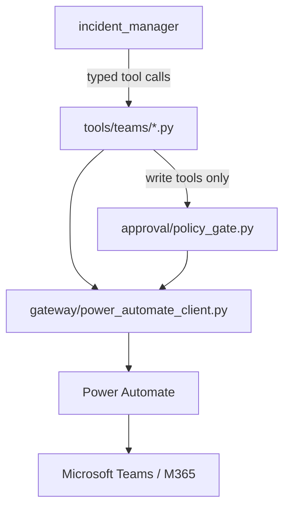

# Teams Tool Contract

Status: **Implemented.** This document describes the Teams tools actually
implemented in `backend/tools/teams/` and how they are used by
`incident_manager` (`docs/AGENT_CONTRACT.md`). It supersedes the earlier
design-only version of this document; where the two disagree, this one —
verified against the current implementation and its tests — is
authoritative. It describes the contract at an architectural level, not as
source-code documentation; read the modules under `backend/tools/teams/`
for exact implementation detail.

---

## 1. Execution boundary

**Hard rules, as implemented:**

- **Power Automate is the only path to Microsoft 365.** No tool here calls
  Microsoft Graph or any other Microsoft 365 API directly. There is no
  direct Graph client anywhere in this stack.
- **There is exactly one Power Automate HTTP client:**
  `backend/gateway/power_automate_client.py`. Every tool under
  `backend/tools/teams/` calls it — no tool has its own client.
- **The gateway URL/secret lives only in backend configuration**
  (`backend/config/settings.py`, resolved from an environment variable or
  GCP Secret Manager at call time — see the README's Configuration
  section). It is never included in a model prompt, a tool result, an
  agent-to-agent message, or a log line, and it is never returned to the
  frontend.
- **`incident_manager` is the only agent that calls these tools.**
  `team_manager` never calls a `teams_*` tool directly.
- **Write execution is gated by deterministic backend code, not by agent
  reasoning.** `teams_create_chat`/`teams_send_message` call
  `approval/policy_gate.py` before calling the Power Automate client — see
  §6/§7 and `docs/AGENT_CONTRACT.md` §7.

---

## 2. Tool summary

Seven tool functions exist in `backend/tools/teams/`. Six are directly
callable by `incident_manager`; `teams_get_members` is deterministic
backend-only (see §5).

| Tool | Class | Callable by the model? | Confirmation required? |
|---|---|---|---|
| `teams_list_chats` | Read | Yes | No |
| `teams_get_messages` | Read | Yes | No |
| `teams_get_members` | Read | **No — backend-only** | No |
| `teams_propose_create_chat` | Write (prepare) | Yes | Creates a pending proposal; nothing sent to Teams |
| `teams_propose_send_message` | Write (prepare) | Yes | Creates a pending proposal; nothing sent to Teams |
| `teams_create_chat` | Write (execute) | Yes | **Yes** — enforced by `approval/policy_gate.py` |
| `teams_send_message` | Write (execute) | Yes | **Yes** — enforced by `approval/policy_gate.py` |

Read tools require no confirmation and are called freely, subject to
standard connector-availability/authorization checks. A write is always a
two-step propose → execute sequence; a "prepare" tool never itself sends
anything to Teams, and an "execute" tool only proceeds if a matching,
approved, unexpired, unconsumed proposal exists.

---

## 3. `teams_list_chats` (read)

**Purpose:** resolve which Teams chat a request refers to, deterministically.

- Input: an optional `topic` hint (the chat name as stated), plus
  session-state-derived context for a pending read/write operation.
- Output includes the full chat list Power Automate returned for the call,
  plus a deterministic match classification against `topic`:
  `matched` (exactly one chat matches), `ambiguous` (more than one chat
  shares the exact same normalized title), or `not_found`.
- On `not_found`, deterministic similarity scoring
  (`backend/tools/teams/chat_resolution.py`) may find near-matches. When it
  does, a `PendingSelection` is created in session state and the model is
  told only that a selection is pending (a boolean) — never given the
  candidate titles themselves, so it cannot fabricate or repeat them. The
  interactive SelectionCard the user sees is rendered from that
  deterministic `PendingSelection`, not from model output.
- **`matched_chat.chat_id` is the only legitimate source of a chat id for
  the rest of the turn.** `incident_manager` never invents or reuses a
  chat id from outside a real `teams_list_chats` result.

---

## 4. `teams_get_messages` (read)

**Purpose:** retrieve messages from one already-resolved chat.

- Input: the resolved `chat_id` (never a free-text name), an optional
  message ceiling (`max_messages`, default 200, always clamped to a hard
  cap of 1000), and an optional UTC time range
  (`from_datetime`/`to_datetime`, ISO-8601 with explicit offset — this tool
  never interprets a relative expression like "today" itself; that
  conversion is `incident_manager`'s own reasoning, before the call).
- Pagination is entirely deterministic, walking Power Automate's own
  50-message pages backward in time until a natural stopping condition is
  reached (end of history, the requested lower time boundary satisfied, or
  the message ceiling hit) — `incident_manager` never drives individual
  pages itself.
- Output messages are de-duplicated by id, chronologically ordered, with
  Teams system/event entries and (when a time range was requested)
  out-of-range entries removed. Message text is HTML-normalized to
  readable plain text; the original raw content and content type are
  preserved alongside it.
- **This is always a bounded retrieval, never a claim of complete
  history.** The result carries an explicit, deterministically-classified
  coverage status (full range / partial range / complete / most-recent
  window only) that `incident_manager`'s prompt is required to reason from
  for any caveat it gives — never re-derived ad hoc from raw counts.
- This is the sole source of truth for any summarization, Q&A, or
  decision/action/risk extraction for the chat in the current turn —
  `incident_manager` must not answer from content it recalls from an
  earlier, separate call.

---

## 5. `teams_get_members` (read, backend-only)

**Purpose:** resolve chat contributors for the `SourceReference` shown to
the user.

Unlike the other tools in this contract, `teams_get_members` is **not**
registered as one of `incident_manager`'s callable tools — the model never
calls it directly. It is invoked directly by deterministic backend code
(`backend/api/source_reference.py`'s contributor resolution) when building
the provenance shown alongside a grounded answer. This keeps "who
contributed to this evidence" authoritative and independent of model
reasoning, exactly like evidence validation (§9). A future need for
model-driven member lookup (e.g. resolving a named participant) would be a
deliberate, separate change to `incident_manager`'s tool list, not an
implicit consequence of this function's existence.

---

## 6. `teams_propose_create_chat` / `teams_propose_send_message` (write, prepare)

**Purpose:** validate a drafted write action and record it as a pending
`ActionProposal` — nothing is sent to Teams by these tools.

- `teams_propose_create_chat` requires a non-empty title and at least the
  participants' complete email addresses (not names — Power Automate
  resolves identities against the M365 directory as part of the eventual
  execution call; there is no separate identity-lookup tool or agent).
- `teams_propose_send_message` requires an existing chat and the exact
  message text.
- Both normalize the payload, then call
  `backend/approval/service.py::create_action_proposal`, which
  deterministically generates the proposal id, a content-addressed payload
  hash, and an expiry (`SLOPANOC_ACTION_PROPOSAL_EXPIRY_SECONDS`) — never
  negotiated with or generated by the model.
- The returned proposal info is exactly what `team_manager` presents to
  the user via an ApprovalCard — deliberately excludes any expiry
  countdown/timestamp and any internal payload-hash detail.

---

## 7. `teams_create_chat` / `teams_send_message` (write, execute)

**Purpose:** actually perform a previously proposed write, once approved.

Every call follows a fixed order enforced by the function body itself, not
by prompt wording:

1. Re-normalize the exact execution payload (the same normalization the
   propose tools used, so a legitimately unchanged request always matches
   the approved payload).
2. Call `approval/policy_gate.py::authorize_write` — looks up the pending
   `ActionProposal`, confirms its status is approved (not pending,
   rejected, expired, or already consumed), and re-derives the payload
   hash to confirm it matches exactly what was approved.
3. If not authorized: stop. No Power Automate call is made; a safe denial
   (mapped from `ApprovalDenialReason`) is returned instead.
4. Only on a full pass, call the Power Automate client with the exact
   normalized payload.
5. Only after Power Automate reports success, mark the proposal consumed
   (`consume_proposal`) — never before, and never merely because step 2
   passed. This is the replay/idempotency protection: a second execution
   attempt for the same already-consumed proposal is denied.
6. Return a safe, structured result (never a raw Power Automate/Graph
   response).

**No agent — `team_manager`, `incident_manager`, or any future agent — can
cause a write to execute by "believing" it was approved.** This sequence is
the only way either tool reaches Power Automate.

---

## 8. Destination binding

A chat id used anywhere in a turn — for retrieval or for a write — must
trace back to a real `teams_list_chats` (or an already-selected chat in
session state) result for that turn. Nothing in this tool layer accepts or
trusts a chat id the model asserts without a corresponding real lookup.
This is what makes the optimized read paths described in
`docs/AGENT_CONTRACT.md` §10 safe: once a destination is resolved
deterministically, a later model turn cannot substitute a different one.

---

## 9. Evidence / provenance semantics

- `teams_get_messages`'s returned messages are the only legitimate source
  of any `evidence[].message_id` `incident_manager` includes in its
  structured response for that turn.
- `incident_manager`'s own post-processing strips any `evidence` entry
  whose `message_id` does not match a message actually retrieved this turn
  — a defense against a fabricated or stale id, independent of what the
  model's own output claims.
- The text shown to the user for a piece of supporting evidence is the
  original retrieved message text, never something the model re-generates
  for display.
- `SourceReference` (contributors, message count, reviewed period, a small
  evidence sample) is built deterministically by backend code from this
  same validated evidence — never authored by the model as prose.

---

## 10. Error handling

Every tool failure — at the Power Automate layer, the underlying M365
call, the approval/policy gate, or an authorization re-check — surfaces as
a `SafeError` (`backend/gateway/safe_error.py`), never a raw exception
message, HTTP body, or stack trace (which could contain the gateway URL or
other sensitive detail).

| Situation | `error_code` | Retryable |
|---|---|---|
| Chat/message/member not found | `not_found` | No |
| Teams connector not configured (missing gateway URL) | `internal_error` (raised as `ConfigurationError` before any call) | Yes |
| Power Automate flow errors or times out | `run_failure` | Yes |
| Power Automate/Teams rate limiting | `rate_limited` | Yes |
| Malformed tool input | `validation_error` | No |
| `policy_gate.py` denial (missing/unapproved/expired/rejected/consumed proposal, or payload mismatch) | `authorization_error` | No |
| Anything else unexpected from the gateway | `internal_error` | Yes |

`incident_manager` relays these through `IncidentManagerResponse.detail`
(for a general failure) or through the specific denial message for a write
(`docs/AGENT_CONTRACT.md` §7); `team_manager` presents them calmly, never
surfacing the raw code or any URL/secret-looking value.

---

## 11. Known limitations

- **Pagination cursor is a timestamp, not an opaque token.** If multiple
  messages share the exact same `createdDateTime` at a page boundary, the
  strict comparison used to walk pages could in principle skip a
  same-timestamp message beyond what a single page returned at that
  instant — a tradeoff of timestamp-based paging, not a defect in the
  stopping logic.
- **`teams_create_chat`'s parsing of the Power Automate response is
  best-effort**, tolerant of a few observed response shapes, and does not
  fabricate a field (`chatId`/`title`/`webUrl`) it did not actually
  receive.
- **No attachment/hosted-content support.** Teams `<attachment>` content in
  a message is normalized to a literal placeholder (`"[Attachment]"`), not
  fetched or represented further.
- **`teams_get_members` is not currently agent-callable** (§5) — a request
  that genuinely requires the model to reason about chat membership beyond
  what `SourceReference` contributors already show is not supported today.

---

## 12. Microsoft identity model

Power Automate executes every Teams operation as its own configured
connection identity — this is **not** a per-user delegated Microsoft
identity. Every chat/message operation SLOPANOC performs runs as whatever
account the Power Automate flow itself is connected as, regardless of
which SLOPANOC user is driving the conversation. A per-user delegated Graph
identity model, if required, is unimplemented design work (see the
README's production-readiness limitations) — not a mode this contract
supports today.

---

## 13. Anti-hallucination rule

None of these tools may be "simulated" by the model. `incident_manager`
must never produce a plausible-looking chats/messages/members/execution
result without an actual, current-turn call to the corresponding tool
having returned it — the *only* way any Teams fact appears in an
`IncidentManagerResponse` is by being copied from a real tool result.
