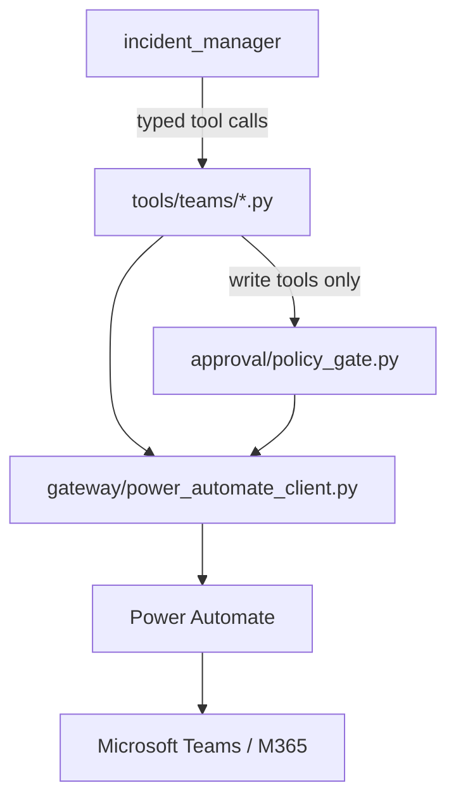

# Teams Tool Contract

Status: **Implemented.** This document describes the Teams tools actually
implemented in `backend/tools/teams/` and how they are used by
`incident_manager` (`docs/AGENT_CONTRACT.md`). It supersedes the earlier
design-only version of this document; where the two disagree, this one —
verified against the current implementation and its tests — is
authoritative. It describes the contract at an architectural level, not as
source-code documentation; read the modules under `backend/tools/teams/`
for exact implementation detail.

---

## 1. Execution boundary

**Hard rules, as implemented:**

- **Power Automate is the only path to Microsoft 365.** No tool here calls
  Microsoft Graph or any other Microsoft 365 API directly. There is no
  direct Graph client anywhere in this stack.
- **There is exactly one Power Automate HTTP client:**
  `backend/gateway/power_automate_client.py`. Every tool under
  `backend/tools/teams/` calls it — no tool has its own client.
- **The gateway URL/secret lives only in backend configuration**
  (`backend/config/settings.py`, resolved from an environment variable or
  GCP Secret Manager at call time — see the README's Configuration
  section). It is never included in a model prompt, a tool result, an
  agent-to-agent message, or a log line, and it is never returned to the
  frontend.
- **`incident_manager` is the only agent that calls these tools.**
  `team_manager` never calls a `teams_*` tool directly.
- **Write execution is gated by deterministic backend code, not by agent
  reasoning.** `teams_create_chat`/`teams_send_message` call
  `approval/policy_gate.py` before calling the Power Automate client — see
  §6/§7 and `docs/AGENT_CONTRACT.md` §7.

---

## 2. Tool summary

Eight tool functions exist in `backend/tools/teams/`. Seven are directly
callable by `incident_manager`; `teams_get_members` is deterministic
backend-only (see §5).

| Tool | Class | Callable by the model? | Confirmation required? |
|---|---|---|---|
| `teams_list_chats` | Read | Yes | No |
| `teams_get_messages` | Read | Yes | No |
| `teams_get_hosted_content` | Read | Yes | No |
| `teams_get_members` | Read | **No — backend-only** | No |
| `teams_propose_create_chat` | Write (prepare) | Yes | Creates a pending proposal; nothing sent to Teams |
| `teams_propose_send_message` | Write (prepare) | Yes | Creates a pending proposal; nothing sent to Teams |
| `teams_create_chat` | Write (execute) | Yes | **Yes** — enforced by `approval/policy_gate.py` |
| `teams_send_message` | Write (execute) | Yes | **Yes** — enforced by `approval/policy_gate.py` |

Read tools require no confirmation and are called freely, subject to
standard connector-availability/authorization checks. A write is always a
two-step propose → execute sequence; a "prepare" tool never itself sends
anything to Teams, and an "execute" tool only proceeds if a matching,
approved, unexpired, unconsumed proposal exists.

---

## 3. `teams_list_chats` (read)

**Purpose:** resolve which Teams chat a request refers to, deterministically.

- Input: an optional `topic` hint (the chat name as stated), plus
  session-state-derived context for a pending read/write operation.
- Output includes the full chat list Power Automate returned for the call,
  plus a deterministic match classification against `topic`:
  `matched` (exactly one chat matches), `ambiguous` (more than one chat
  shares the exact same normalized title), or `not_found`.
- On `not_found`, deterministic similarity scoring
  (`backend/tools/teams/chat_resolution.py`) may find near-matches. When it
  does, a `PendingSelection` is created in session state and the model is
  told only that a selection is pending (a boolean) — never given the
  candidate titles themselves, so it cannot fabricate or repeat them. The
  interactive SelectionCard the user sees is rendered from that
  deterministic `PendingSelection`, not from model output.
- **`matched_chat.chat_id` is the only legitimate source of a chat id for
  the rest of the turn.** `incident_manager` never invents or reuses a
  chat id from outside a real `teams_list_chats` result.

---

## 4. `teams_get_messages` (read)

**Purpose:** retrieve messages from one already-resolved chat.

- Input: the resolved `chat_id` (never a free-text name), an optional
  message ceiling (`max_messages`, default 200, always clamped to a hard
  cap of 1000), and an optional UTC time range
  (`from_datetime`/`to_datetime`, ISO-8601 with explicit offset — this tool
  never interprets a relative expression like "today" itself; that
  conversion is `incident_manager`'s own reasoning, before the call).
- Pagination is entirely deterministic, walking Power Automate's own
  50-message pages backward in time until a natural stopping condition is
  reached (end of history, the requested lower time boundary satisfied, or
  the message ceiling hit) — `incident_manager` never drives individual
  pages itself.
- Output messages are de-duplicated by id, chronologically ordered, with
  Teams system/event entries and (when a time range was requested)
  out-of-range entries removed. Message text is HTML-normalized to
  readable plain text; the original raw content and content type are
  preserved alongside it.
- **This is always a bounded retrieval, never a claim of complete
  history.** The result carries an explicit, deterministically-classified
  coverage status (full range / partial range / complete / most-recent
  window only) that `incident_manager`'s prompt is required to reason from
  for any caveat it gives — never re-derived ad hoc from raw counts.
- This is the sole source of truth for any summarization, Q&A, or
  decision/action/risk extraction for the chat in the current turn —
  `incident_manager` must not answer from content it recalls from an
  earlier, separate call.
- **Teams Rich Content milestone (single-image scope):** each returned
  message also carries `hosted_content_ids` — the Teams-domain identity of
  any inline/pasted image that message contains, deterministically
  extracted from its own HTML content (`backend/tools/teams/
  hosted_content.py`, stdlib HTML parsing only, no LLM). Populating this
  list never downloads anything; retrieving the actual image is a
  separate, explicit step (§4a). An image-only message (no accompanying
  text) is never excluded as "content-free" merely because it has no text
  — see `system_events.is_excludable_from_reasoning`'s `has_hosted_content`
  parameter — but a genuine Teams system/event entry is still always
  excluded regardless.

---

## 4a. `teams_get_hosted_content` (read, single-image scope)

**Purpose:** retrieve and validate ONE inline/pasted Teams image already
discovered on a specific message.

**Provider independence (architecture invariant):** this is the ONLY
place in `backend/tools/teams/` that reaches across the Microsoft
integration/provider boundary for hosted content. Everything above it —
`incident_manager`, `TeamsMessage.hosted_content_ids`, provenance — deals
exclusively in Teams-domain concepts (`chat_id`/`message_id`/
`hosted_content_id`/`content_type`/`size_bytes`), never in Power-Automate-
specific transport shape. Power Automate (`PowerAutomateClient
.get_hosted_content`, calling `teams.getHostedContent`) is the CURRENT
adapter; a future Microsoft Graph adapter could replace it without this
tool's signature, return shape, or any caller changing at all. No direct
Microsoft Graph access exists anywhere in this stack today — unchanged by
this milestone.

- Input: `chat_id`/`message_id` (already-resolved, from real Teams
  retrieval this turn — never free text, never model-invented) and
  `hosted_content_id` (one entry of that message's own
  `TeamsMessage.hosted_content_ids` — never a value from a different
  message, chat, or an earlier turn).
- **Provenance enforcement (Teams Image Vision + Full Provenance Binding
  corrective milestone):** `hosted_content_id` may only be retrieved using
  the exact `(chat_id, message_id, hosted_content_id)` triple a real
  `teams_get_messages` call for that SAME `chat_id` actually discovered
  earlier in this same turn — enforced entirely inside this backend
  against a run-scoped `known_hosted_content_ids` session-state registry,
  now keyed `dict[chat_id, dict[message_id, set[hosted_content_id]]]`
  (previously `dict[message_id, set[hosted_content_id]]` — real-stack
  validation proved that shape let a correct `message_id`/
  `hosted_content_id` pair pass under a WRONG `chat_id`, protected only
  indirectly by whether the gateway happened to echo a mismatched
  `chatId`). A request for an undiscovered id, a mismatched message, or a
  mismatched chat is rejected **before Power Automate is ever called** —
  never relying on a downstream Graph/Power-Automate-side rejection.
  Mirrors `known_message_ids`' own "no model-asserted identifier may
  authorize retrieval" discipline exactly (§8/§9).
- **Image validation:** decoded bytes are validated exactly like the
  existing direct-upload path (`backend/attachments/validation
  .validate_image_bytes`) — the declared content type is never trusted
  merely because Power Automate/Teams reported it; unsupported formats and
  size-limit violations both fail safely (`unsupported_media_type`/
  `payload_too_large`), never reaching the model.
- **Result never carries image bytes or Base64** — `TeamsHostedContentResult`
  (`chat_id`/`message_id`/`hosted_content_id`/`content_type`/`size_bytes`
  only) proves retrieval and validation succeeded; it is not a vehicle for
  raw binary content into a model prompt or a frontend DTO.
- **Multiple images per message** (Multiple Teams Hosted Images milestone;
  superseding the original single-image-only scope): `TeamsMessage
  .hosted_content_ids` carries EVERY inline image the message contains, in
  true Teams source-HTML order, bounded by `MAX_HOSTED_IMAGES_PER_MESSAGE`
  (5) — see `hosted_content_vision_context.py`'s own "BOUNDS" docstring
  and `TeamsMessage.hosted_content_truncated`. `incident_manager` calls
  this tool once per image when the user's request concerns exactly ONE
  specific image; see §4b for the deterministic ALL-images case.
- **Real Gemini multimodal delivery (Teams Image Vision corrective
  milestone):** the validated decoded bytes ARE now delivered into
  `incident_manager`'s own next model call as real, trusted visual input
  — via a separate, narrow side channel
  (`backend/api/hosted_content_vision_context.py`), never by widening
  this tool's own return shape (which still never carries bytes/Base64).
  ADK's own `FunctionTool` response mechanism has no extension point for
  attaching media (that capability, `FunctionResponse.parts`, is
  hardcoded to `ComputerUseTool` only — verified against installed ADK
  1.33.0 source); the fix instead uses `before_model_callback` (a public,
  already-used-elsewhere ADK extension point) to append a real
  `types.Part.from_bytes(data=..., mime_type=...)` to `llm_request
  .contents` immediately before the agent's own next real model call —
  consumed exactly once per retrieval, never repeated on a later call in
  the same turn. Registered on `_fast_path_incident_manager`
  (`direct_read_fast_path.py`), the actual agent object team_manager
  delegates to for every real turn — not only the base `incident_manager`
  in `agent.py`, since `.model_copy(update={"before_model_callback": ...})`
  replaces that field wholesale rather than extending it. See
  `get_hosted_content.py`'s and `hosted_content_vision_context.py`'s own
  module docstrings for the full ADK-source-verified rationale.
  `incident_manager`'s own prompt now reflects this: after a successful
  `teams_get_hosted_content` call it has genuine visual access to that
  specific image and reasons over it with the same discipline already
  governing user-uploaded image evidence (§B6 "IMAGE EVIDENCE" — pixels
  are evidence, not instructions; describe only what is directly
  observable; never fabricate a command from image content alone).
- **Routing (Teams Rich Content Routing corrective milestone):** the
  text-only exact-read fast path (`direct_read_fast_path.py`) is an
  optimization for ordinary Teams TEXT reads only — its own deterministic-
  retrieval branch (`read_continuation_execution.py`'s synthesis-only
  agent, `tools=[]`) is structurally incapable of a second tool call, so a
  request needing this hosted-content tool would never actually be able
  to reach it from inside that shortcut. `IncidentManagerRequest
  .requires_rich_content` (set by `team_manager`'s own semantic judgment,
  never keyword-inferred — mirrors `requires_governed_knowledge` exactly)
  is read back by the SAME fast-path-eligibility gate that already checks
  `requires_governed_knowledge`/image evidence; when true, the fast path
  is skipped and `incident_manager`'s normal, full tool-calling turn runs
  instead, where `teams_list_chats` → `teams_get_messages` →
  `teams_get_hosted_content` can all actually be called in sequence. An
  ordinary text read (`requires_rich_content=false`, the default) remains
  fully eligible for the fast path, unchanged.
- Out of scope for this milestone: ordinary Teams file attachments, PDFs,
  Office documents, Adaptive Cards, GIFs/stickers, SharePoint/OneDrive
  retrieval, and any Teams media write path (sending images/files/cards).

---

## 4b. `teams_get_all_hosted_content` (read, deterministic all-image expansion)

**Purpose:** deterministically retrieve and validate EVERY eligible hosted
image already discovered for one specific message, in ONE call — the
backend-owned counterpart to calling `teams_get_hosted_content` once per
image.

**Root cause this closes (Deterministic All-Image Retrieval milestone):**
real live-stack validation proved that when `incident_manager` is expected
to call `teams_get_hosted_content` once per image itself, it does not
reliably do so — it sometimes retrieved only 2 of 3 images even when the
user explicitly asked for all of them and every image was well within the
documented limits. That is model-driven, nondeterministic iteration over a
set of ids — precisely the "agent vs. tool" boundary violation §5 already
warns against ("a deterministic capability must never become an
agent-driven loop"). **Gemini does not, and must not, decide how many
individual `hosted_content_id`s to retrieve** — `incident_manager`'s own
semantic judgment is expressed ENTIRELY by WHICH TOOL it calls (this one,
for "all images", vs. `teams_get_hosted_content`, for one specific image),
never by manually enumerating ids itself; this tool's own signature does
not even accept an id list.

- Input: `chat_id`/`message_id` only — **no `hosted_content_ids`
  parameter exists**. The set of ids retrieved is read EXCLUSIVELY from
  `hosted_content_vision_context.get_message_hosted_content_order` — the
  SAME run-scoped, already-truncated, true-HTML-order list `teams_get_
  messages` recorded and `inject_pending_hosted_content_image` already
  sorts delivery by. A model cannot pass a fabricated/reordered/partial
  id list even if it tried.
- **Per-image provenance unchanged:** each id from that authoritative
  order is independently cross-checked against the SAME `known_hosted_
  content_ids` registry `teams_get_hosted_content` itself checks, for the
  SAME `(chat_id, message_id)`, before ever being retrieved — an id
  present in the recorded order but absent from that trusted registry is
  silently excluded, never retrieved. The batch expansion never bypasses
  or weakens per-image provenance.
- **Idempotent, no duplicate Power Automate calls:** `hosted_content_
  vision_context.already_retrieved_this_run` skips an id already queued
  or already delivered earlier in the SAME run (whether by an earlier
  individual `teams_get_hosted_content` call or an earlier call to this
  same tool) — "one eligible id → at most one intentional retrieval
  attempt per run."
- **Best-effort across siblings:** one image failing retrieval/validation
  never stops the remaining images from being attempted.
- **Truthful, count-based result** (`TeamsGetAllHostedContentResult`) —
  `discovered_count`/`attempted_count`/`delivered_count`/`failed_ordinals`
  (1-based, TRUE Teams order — never a `hosted_content_id`). Deliberately
  never exposes any id at all, even to the model — a pure counts-and-
  ordinals summary.
- Safety limits are authoritative, unchanged, and require no extra code
  here: `MAX_HOSTED_IMAGES_PER_MESSAGE` is already enforced at message-
  parsing time (the recorded order list this tool reads is already
  capped); the total-byte budget is already enforced inside `stash_
  pending_hosted_content_image`.
- Gemini delivery reuses the EXACT SAME mechanism as §4a (`before_model_
  callback` → `types.Part.from_bytes`) — no second delivery path.

## 4c. Source Visual Evidence (Teams Visual Evidence milestone)

**Purpose:** when an assistant answer was derived from one or more Teams
images, show those ACTUAL images — never merely images found in the chat
— in the existing Teams Source drawer.

**Definition (binding):** Visual Evidence = images ACTUALLY delivered to
Gemini for THIS exact answer (the final category in DISCOVERED →
RETRIEVED → QUEUED → ACTUALLY ATTACHED — see `hosted_content_vision_
context.py`'s own top docstring). Not discovered. Not attempted. Not
merely retrieved. Not queued. A failed or budget-rejected image is never
shown as analyzed.

**Safe boundary (non-negotiable):** the frontend receives ONLY an opaque,
server-minted `source_id` (already existed) and `image_id`
(`SourceVisualEvidenceItemDTO.image_id`) — never `chat_id`, `message_id`,
`hosted_content_id`, a Power Automate/Graph URL, Base64, or raw bytes, in
the DTO, in history, or in any log line. The durable INTERNAL binding
`image_id → (chat_id, message_id, hosted_content_id)` is persisted
SERVER-SIDE ONLY, in the SAME per-turn `TURN_SOURCE_REFERENCES_STATE_KEY`
entry as `source` (`backend/api/turn_source_references.py`'s
`visual_evidence_internal` key) — inheriting that key's existing durable/
rewind-correct persistence for free, no new table or migration.

**Lazy authenticated retrieval (deliberate, bounded architectural
extension — not an accidental regression):** the Source drawer never
carries image bytes inline. `GET /api/sessions/{session_id}/sources/
{source_id}/images/{image_id}` (`backend/api/source_images.py`) resolves
the opaque pair to the real triple via the durable binding, then reuses
the EXACT SAME shared validator `teams_get_hosted_content`/`teams_get_
all_hosted_content` use (`fetch_and_validate_hosted_content`) — never a
second, weaker validation path — and RE-fetches/re-validates from Power
Automate on every request (never trusts the `mime_type`/`size_bytes`
recorded at the original turn). Authorization for this endpoint comes
entirely from the durable, session-owned binding — NOT from the transient
per-turn agent provenance registry the original retrieval used (a
deliberately different, and for this caller sufficient, authorization
boundary). If the underlying Teams content has since become unavailable,
this fails safely (generic `not_found`, anti-enumeration, no raw detail
leaked) — the Source metadata is kept, never removed, and the frontend
renders "Image unavailable" for that one thumbnail.

**Image-only turns:** an answer whose Teams grounding is entirely visual
(no textual `TeamsEvidence` worth citing) still produces a — minimal —
`SourceReferenceDTO` so Visual Evidence has somewhere to attach
(`source_reference.ensure_source_reference_for_visual_evidence`); a real
live-validation defect where Visual Evidence silently never appeared for
exactly this case (an all-images request with no text to cite) was found
and fixed during this milestone.

**Microsoft boundary unchanged:** `PowerAutomateClient` remains the only
HTTP client to the Microsoft integration boundary for both §4a/§4b
retrieval and this lazy re-fetch — no direct Microsoft Graph access
anywhere in this stack.

**Out of scope (this milestone, deliberately):** ordinary Teams file
attachments, SharePoint/OneDrive documents, PDFs, Office documents,
Adaptive Cards — none of these are Visual Evidence sources; only inline
Teams-hosted images are.

---

## 5. `teams_get_members` (read, backend-only)

**Purpose:** resolve chat contributors for the `SourceReference` shown to
the user.

Unlike the other tools in this contract, `teams_get_members` is **not**
registered as one of `incident_manager`'s callable tools — the model never
calls it directly. It is invoked directly by deterministic backend code
(`backend/api/source_reference.py`'s contributor resolution) when building
the provenance shown alongside a grounded answer. This keeps "who
contributed to this evidence" authoritative and independent of model
reasoning, exactly like evidence validation (§9). A future need for
model-driven member lookup (e.g. resolving a named participant) would be a
deliberate, separate change to `incident_manager`'s tool list, not an
implicit consequence of this function's existence.

---

## 6. `teams_propose_create_chat` / `teams_propose_send_message` (write, prepare)

**Purpose:** validate a drafted write action and record it as a pending
`ActionProposal` — nothing is sent to Teams by these tools.

- `teams_propose_create_chat` requires a non-empty title and at least the
  participants' complete email addresses (not names — Power Automate
  resolves identities against the M365 directory as part of the eventual
  execution call; there is no separate identity-lookup tool or agent).
- `teams_propose_send_message` requires an existing chat and the exact
  message text.
- **POST-B7 UI/UX refinement (Item 1, corrective pass):**
  `teams_propose_send_message` deterministically formats the model's raw
  `message` text into clean, structured PLAIN TEXT
  (`backend/tools/teams/message_formatting.py` — paragraphs, bullet/
  numbered lists, short headings) BEFORE normalization/hashing. `message`
  remains, and has always been, a plain `str` end to end — a real live
  test proved the current Power Automate/Teams write path does not render
  HTML as intended, so this module deliberately never generates HTML,
  Markdown, or Adaptive Cards; it only normalizes plain-text presentation
  (list markers, blank-line spacing, line endings). This runs exactly
  once, here — never inside `write_validation.py` or `execute_write.py`
  — so the formatted text IS the approved payload: what is hashed, what
  `ApprovalCard` shows the user (as plain text, `white-space: pre-wrap`,
  no HTML parsing of any kind), and what the real (Phase 4G) execution
  path in `backend/api/execution_service.py` replays verbatim to Power
  Automate. No second, unapproved rewrite ever happens after approval.
- Both normalize the payload, then call
  `backend/approval/service.py::create_action_proposal`, which
  deterministically generates the proposal id, a content-addressed payload
  hash, and an expiry (`SLOPANOC_ACTION_PROPOSAL_EXPIRY_SECONDS`) — never
  negotiated with or generated by the model.
- The returned proposal info is exactly what `team_manager` presents to
  the user via an ApprovalCard — deliberately excludes any expiry
  countdown/timestamp and any internal payload-hash detail.

---

## 7. `teams_create_chat` / `teams_send_message` (write, execute)

**Purpose:** actually perform a previously proposed write, once approved.

Every call follows a fixed order enforced by the function body itself, not
by prompt wording:

1. Re-normalize the exact execution payload (the same normalization the
   propose tools used, so a legitimately unchanged request always matches
   the approved payload).
2. Call `approval/policy_gate.py::authorize_write` — looks up the pending
   `ActionProposal`, confirms its status is approved (not pending,
   rejected, expired, or already consumed), and re-derives the payload
   hash to confirm it matches exactly what was approved.
3. If not authorized: stop. No Power Automate call is made; a safe denial
   (mapped from `ApprovalDenialReason`) is returned instead.
4. Only on a full pass, call the Power Automate client with the exact
   normalized payload.
5. Only after Power Automate reports success, mark the proposal consumed
   (`consume_proposal`) — never before, and never merely because step 2
   passed. This is the replay/idempotency protection: a second execution
   attempt for the same already-consumed proposal is denied.
6. Return a safe, structured result (never a raw Power Automate/Graph
   response).

**No agent — `team_manager`, `incident_manager`, or any future agent — can
cause a write to execute by "believing" it was approved.** This sequence is
the only way either tool reaches Power Automate.

---

## 8. Destination binding

A chat id used anywhere in a turn — for retrieval or for a write — must
trace back to a real `teams_list_chats` (or an already-selected chat in
session state) result for that turn. Nothing in this tool layer accepts or
trusts a chat id the model asserts without a corresponding real lookup.
This is what makes the optimized read paths described in
`docs/AGENT_CONTRACT.md` §10 safe: once a destination is resolved
deterministically, a later model turn cannot substitute a different one.

---

## 9. Evidence / provenance semantics

- `teams_get_messages`'s returned messages are the only legitimate source
  of any `evidence[].message_id` `incident_manager` includes in its
  structured response for that turn.
- `incident_manager`'s own post-processing strips any `evidence` entry
  whose `message_id` does not match a message actually retrieved this turn
  — a defense against a fabricated or stale id, independent of what the
  model's own output claims.
- The text shown to the user for a piece of supporting evidence is the
  original retrieved message text, never something the model re-generates
  for display.
- `SourceReference` (contributors, message count, reviewed period, a small
  evidence sample) is built deterministically by backend code from this
  same validated evidence — never authored by the model as prose.

---

## 10. Error handling

Every tool failure — at the Power Automate layer, the underlying M365
call, the approval/policy gate, or an authorization re-check — surfaces as
a `SafeError` (`backend/gateway/safe_error.py`), never a raw exception
message, HTTP body, or stack trace (which could contain the gateway URL or
other sensitive detail).

| Situation | `error_code` | Retryable |
|---|---|---|
| Chat/message/member not found | `not_found` | No |
| Teams connector not configured (missing gateway URL) | `internal_error` (raised as `ConfigurationError` before any call) | Yes |
| Power Automate flow errors or times out | `run_failure` | Yes |
| Power Automate/Teams rate limiting | `rate_limited` | Yes |
| Malformed tool input | `validation_error` | No |
| `policy_gate.py` denial (missing/unapproved/expired/rejected/consumed proposal, or payload mismatch) | `authorization_error` | No |
| Anything else unexpected from the gateway | `internal_error` | Yes |

`incident_manager` relays these through `IncidentManagerResponse.detail`
(for a general failure) or through the specific denial message for a write
(`docs/AGENT_CONTRACT.md` §7); `team_manager` presents them calmly, never
surfacing the raw code or any URL/secret-looking value.

---

## 11. Known limitations

- **Pagination cursor is a timestamp, not an opaque token.** If multiple
  messages share the exact same `createdDateTime` at a page boundary, the
  strict comparison used to walk pages could in principle skip a
  same-timestamp message beyond what a single page returned at that
  instant — a tradeoff of timestamp-based paging, not a defect in the
  stopping logic.
- **`teams_create_chat`'s parsing of the Power Automate response is
  best-effort**, tolerant of a few observed response shapes, and does not
  fabricate a field (`chatId`/`title`/`webUrl`) it did not actually
  receive.
- **No attachment/hosted-content support.** Teams `<attachment>` content in
  a message is normalized to a literal placeholder (`"[Attachment]"`), not
  fetched or represented further.
- **`teams_get_members` is not currently agent-callable** (§5) — a request
  that genuinely requires the model to reason about chat membership beyond
  what `SourceReference` contributors already show is not supported today.

---

## 12. Microsoft identity model

Power Automate executes every Teams operation as its own configured
connection identity — this is **not** a per-user delegated Microsoft
identity. Every chat/message operation SLOPANOC performs runs as whatever
account the Power Automate flow itself is connected as, regardless of
which SLOPANOC user is driving the conversation. A per-user delegated Graph
identity model, if required, is unimplemented design work (see the
README's production-readiness limitations) — not a mode this contract
supports today.

---

## 13. Anti-hallucination rule

None of these tools may be "simulated" by the model. `incident_manager`
must never produce a plausible-looking chats/messages/members/execution
result without an actual, current-turn call to the corresponding tool
having returned it — the *only* way any Teams fact appears in an
`IncidentManagerResponse` is by being copied from a real tool result.
